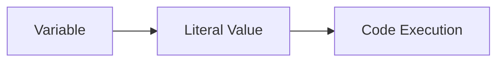
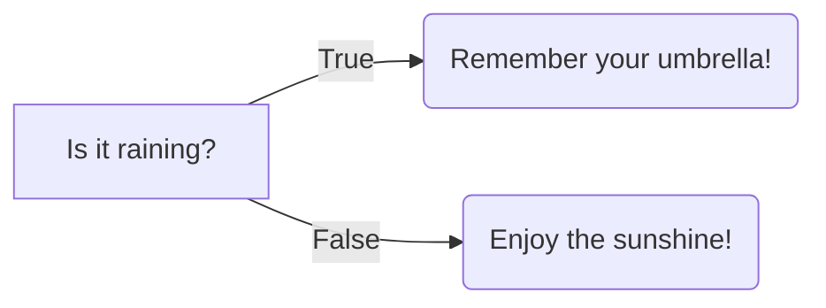

# <span style="color:#e67e22; font-size: 24px;">What we will learn in this post?</span>
<ul style='list-style-type: none; padding-left: 0;'>
<li style='margin: 6px 0;'><span style='color: #2980b9; font-size: 20px; font-weight: bold;'>👉</span> <span style='color: #2ecc71; font-size: 18px; font-weight: bold;'>Data Types in C</span></li>
<li style='margin: 6px 0;'><span style='color: #2980b9; font-size: 20px; font-weight: bold;'>👉</span> <span style='color: #2ecc71; font-size: 18px; font-weight: bold;'>Data Type Modifiers in C</span></li>
<li style='margin: 6px 0;'><span style='color: #2980b9; font-size: 20px; font-weight: bold;'>👉</span> <span style='color: #2ecc71; font-size: 18px; font-weight: bold;'>Literals in C</span></li>
<li style='margin: 6px 0;'><span style='color: #2980b9; font-size: 20px; font-weight: bold;'>👉</span> <span style='color: #2ecc71; font-size: 18px; font-weight: bold;'>Escape Sequence in C</span></li>
<li style='margin: 6px 0;'><span style='color: #2980b9; font-size: 20px; font-weight: bold;'>👉</span> <span style='color: #2ecc71; font-size: 18px; font-weight: bold;'>bool in C</span></li>
<li style='margin: 6px 0;'><span style='color: #2980b9; font-size: 20px; font-weight: bold;'>👉</span> <span style='color: #2ecc71; font-size: 18px; font-weight: bold;'>Integer Promotions in C</span></li>
<li style='margin: 6px 0;'><span style='color: #2980b9; font-size: 20px; font-weight: bold;'>👉</span> <span style='color: #2ecc71; font-size: 18px; font-weight: bold;'>Character Arithmetic in C</span></li>
<li style='margin: 6px 0;'><span style='color: #2980b9; font-size: 20px; font-weight: bold;'>👉</span> <span style='color: #2ecc71; font-size: 18px; font-weight: bold;'>Type Conversion in C</span></li>
<li style='margin: 6px 0;'><span style='color: #2980b9; font-size: 20px; font-weight: bold;'>👉</span> <span style='color: #2ecc71; font-size: 18px; font-weight: bold;'>Conclusion!</span></li>
</ul>

# <span style="color:#e67e22">Data Types in C: A Beginner's Guide 📚</span>

In the world of programming, data types are like building blocks. They tell the compiler what kind of information you want to store and how to work with it.  C, a powerful and versatile language, offers a variety of data types to suit different needs. Let's explore some of the most common ones!

## <span style="color:#2980b9">Basic Data Types: The Foundation 💪</span>

### <span style="color:#8e44ad">Integer (int)</span> 

* **What it is:**  Integers are whole numbers without decimal points. Think of them as counting numbers (1, 2, 3...) or their negatives (-1, -2, -3...).
* **Example:**
   ```c
   int age = 25; 
   int score = 100;
   ```
* **Size in Memory:** The size of an `int` varies depending on the system. It's usually 4 bytes (32 bits), but it could be 2 bytes (16 bits) or 8 bytes (64 bits) on some architectures.

### <span style="color:#8e44ad">Floating-Point (float & double)</span> 

* **What it is:** Floating-point numbers are used to represent numbers with decimal points. 
* **Example:** 
   ```c
   float price = 12.99; // Single precision
   double balance = 3456.789; // Double precision
   ```
* **Size in Memory:** 
    * `float` usually occupies 4 bytes (32 bits)
    * `double` usually occupies 8 bytes (64 bits) 

### <span style="color:#8e44ad">Character (char)</span> 

* **What it is:**  A `char` is used to store a single character like a letter, a number, or a symbol.  
* **Example:** 
   ```c
   char initial = 'A'; 
   char symbol = '$';
   ```
* **Size in Memory:**  A `char` typically occupies 1 byte (8 bits).

## <span style="color:#2980b9">Beyond the Basics: More Specialized Types 🚀</span>

### <span style="color:#8e44ad">Boolean (bool)</span> 

* **What it is:**  A boolean variable can hold either `true` or `false`. It's used to represent conditions or logical states.
* **Example:**
    ```c
    bool isLoggedIn = true;
    bool hasError = false;
    ```
* **Size in Memory:**  The size of a `bool` is usually 1 byte, but it can vary across systems.


### <span style="color:#8e44ad">Void (void)</span>

* **What it is:**  `void` is a special data type that represents the absence of a value. It is often used with functions that don't return anything.
* **Example:**
    ```c
    void printHello() {
        printf("Hello, World!\n");
    }
    ```


## <span style="color:#2980b9">Choosing the Right Data Type 🎯</span>

Selecting the correct data type is crucial for efficient and reliable programming. Here's a simple guide:

* **Integers:** For whole numbers, use `int`.
* **Floating-point:** For numbers with decimal points, use `float` for smaller ranges, or `double` for larger ranges or higher precision.
* **Characters:** For storing a single character, use `char`.
* **Booleans:**  For representing true/false conditions, use `bool`.
* **Void:** For functions that don't return any value, use `void` as the return type.

## <span style="color:#2980b9">Understanding Data Type Size 🤔</span>

The size of a data type determines how much memory it takes up.  

**Think of it like this:**  A **byte** is like a tiny box that can store a single piece of information.  

* **Integers (int):** Typically need a box 4 bytes (32 bits) big.
* **Floating-point (float):**  Also need a box 4 bytes (32 bits) big. 
* **Characters (char):** Only need a tiny box 1 byte (8 bits) big. 
* **Booleans (bool):**  Also often use a tiny box 1 byte (8 bits) big.


Understanding data types is a fundamental step in mastering any programming language. Now that you have a solid foundation, explore the world of C with confidence! 😄


# <span style="color:#e67e22">Data Type Modifiers in C</span> 💻 

C provides **modifiers** to fine-tune the behavior and size of your base data types.  These modifiers help you control how your data is stored and interpreted, giving you more flexibility in your code. Think of them like **special instructions** for your computer to handle data in different ways.

## <span style="color:#2980b9">Size Modifiers: `short`, `long`</span> 📏

These modifiers affect the **number of bits** used to store a variable, ultimately controlling the **range of values** it can hold.

### <span style="color:#8e44ad">`short`</span>

* **Shorter Size:** This keyword instructs the compiler to use a **smaller storage space** for the data. It's like having a **smaller box** to fit your data in!
* **Example:** 
    ```c
    short int age = 25; // `short int` typically uses 2 bytes
    ```

### <span style="color:#8e44ad">`long`</span>

* **Larger Size:** This keyword indicates a **larger storage space**, providing a wider range of values. It's like having a **bigger box** for your data!
* **Example:**
    ```c
    long int population = 8000000000; // `long int` typically uses 4 bytes
    ```

## <span style="color:#2980b9">Sign Modifiers: `signed`, `unsigned`</span> ➕➖

These modifiers specify whether a variable can store **positive**, **negative**, or **only positive** values.

### <span style="color:#8e44ad">`signed`</span>

* **Positive and Negative:** The default for integer types, this modifier allows the variable to hold both positive and negative values. It's like having a **number line** with both positive and negative numbers.
* **Example:**
    ```c
    signed int temperature = -10; // `signed int` can store both positive and negative values
    ```

### <span style="color:#8e44ad">`unsigned`</span>

* **Only Positive:** This modifier restricts the variable to only store positive values. It's like having a **number line** with only positive numbers. This is useful for representing things like memory addresses or counting items.
* **Example:**
    ```c
    unsigned int count = 100; // `unsigned int` can only store positive values
    ```

## <span style="color:#2980b9">How Modifiers Work Together</span> 🤝

You can combine these modifiers to fine-tune the size and sign of your data types. 

**For example:**

* `short int` - A short integer, typically using 2 bytes.
* `long int` - A long integer, typically using 4 bytes.
* `unsigned short int` - A short integer that can only hold positive values.
* `signed long int` - A long integer that can hold both positive and negative values (this is the default).

## <span style="color:#2980b9">Visual Representation</span> 📊

```mermaid
graph LR
A[Data Type] --> B{Modifiers}
B --> C[Size (short, long)]
B --> D[Sign (signed, unsigned)]
```

This diagram shows how data type modifiers work. You start with a base data type (like `int`) and then apply modifiers to adjust its size or sign. 

## <span style="color:#2980b9">Example Scenarios</span> 💡

* **Age:** You could use a `short int` to store a person's age, since it's unlikely to be a very large number.
* **Population:** To store a country's population, you'd likely use a `long int` to accommodate the larger number.
* **Memory Address:** When working with memory, you'd use an `unsigned int` since addresses are always positive numbers.

## <span style="color:#2980b9">Key Takeaways</span> 🔑

* Data type modifiers are powerful tools for controlling the behavior of your data.
* Use `short` and `long` to adjust the size of your data.
* Use `signed` and `unsigned` to specify whether your data can hold negative values.
* Combining these modifiers gives you even greater flexibility in your code.

By understanding and using these modifiers, you can write more efficient and accurate C programs! 


# <span style="color:#e67e22">C Literals: Your Direct Input to the Code</span> 

## <span style="color:#2980b9">What are C Literals?</span>

Think of C literals as the building blocks of your code. They represent **fixed values** that you directly insert into your programs. These values are **not calculated or changed during runtime**. Imagine them as **static ingredients** in your code's recipe. 

## <span style="color:#2980b9">Types of C Literals</span>

C literals come in various flavors, just like different ingredients in a recipe. Let's break them down!

### <span style="color:#8e44ad">Integer Literals</span>

*   **Whole numbers** are represented by integer literals. They can be **positive, negative, or zero**.
*   **Examples:**
    *   `10`  : A positive integer
    *   `-20` : A negative integer
    *   `0`   : The number zero
*   **Code Example:**
    ```c
    int age = 25; // Assigning an integer literal to a variable
    ```

### <span style="color:#8e44ad">Floating-Point Literals</span>

*   **Numbers with decimal points** are handled by floating-point literals. They represent **real numbers**.
*   **Examples:**
    *   `3.14159` : The value of pi
    *   `-2.5`   : A negative decimal number
*   **Code Example:**
    ```c
    float price = 19.99; // Assigning a floating-point literal to a variable
    ```

### <span style="color:#8e44ad">Character Literals</span>

*   **Single characters** enclosed within single quotes are represented by character literals.
*   **Examples:**
    *   `'A'` : The uppercase letter A
    *   `'#'` : The hash symbol
    *   `'\n'` : The newline character (special characters like this can be represented with escape sequences)
*   **Code Example:**
    ```c
    char initial = 'J'; // Assigning a character literal to a variable
    ```

### <span style="color:#8e44ad">String Literals</span>

*   **Sequences of characters** enclosed within double quotes are represented by string literals.
*   **Examples:**
    *   `"Hello, world!"` : A simple greeting message
    *   `"C programming"`  : A descriptive string
*   **Code Example:**
    ```c
    char greeting[] = "Welcome!"; // Assigning a string literal to a character array
    ```

### <span style="color:#8e44ad">Boolean Literals</span>

*   **Represent truth values (true or false)**. 
*   **Examples:**
    *   `true`
    *   `false`
*   **Code Example:**
    ```c
    bool isCompleted = true; // Assigning a boolean literal to a boolean variable
    ```

## <span style="color:#2980b9">How C Literals Work in Practice</span>

Let's visualize how these literals work in code:



*   **A:** A variable is declared (e.g., `int age;`).
*   **B:** A literal value (e.g., `25`) is assigned to the variable.
*   **C:** The code executes, using the fixed value provided by the literal.

## <span style="color:#2980b9">Key Takeaways</span>

*   C literals are your **direct input** into the code.
*   They represent **fixed values** that don't change.
*   Different types of literals cater to different data types.
*   **Understanding literals is crucial** for writing clear and functional C code.

Let's get coding! 💻

# <span style="color:#e67e22">Escape Sequences in C:  Unlocking the Power of Special Characters 💻</span>

## <span style="color:#2980b9">What are Escape Sequences? 🤔</span>

Escape sequences are special combinations of characters that represent characters that are difficult or impossible to type directly in C. These characters include control characters like **newline** (`\n`), **tab** (`\t`), **backspace** (`\b`), and **special symbols** like **backslash** (`\\`) itself. 

**Think of them as codewords for characters that have special meaning.**

## <span style="color:#2980b9">Why Use Escape Sequences? ✨</span>

* **Representing Special Characters:**  Escape sequences allow you to include special characters like **newline** or **tab** within your strings.
* **Avoiding Ambiguity:** Certain characters like `"` (double quote) or `\` (backslash) are used for special purposes in C. Escape sequences prevent confusion and ensure proper interpretation.

## <span style="color:#2980b9">Common Escape Sequences 🎯</span>

| Escape Sequence | Description                                    | Example                      | Output                                      |
|-----------------|------------------------------------------------|-------------------------------|----------------------------------------------|
| `\n`            | Newline (moves cursor to the next line)        | `"Hello\nWorld"`             | `"Hello\nWorld"`  (prints on two lines)     |
| `\t`            | Horizontal Tab (adds space equivalent to a tab) | `"Name:\tJohn"`            | `"Name:\tJohn"`  (tab space between "Name:" and "John") |
| `\b`            | Backspace (moves cursor one character back)     | `"Hello\bWorld"`            | `"Hello World"` (backspace removes "l" from "Hello")  |
| `\\`            | Backslash (represents a backslash character) | `"C:\myfolder\file.txt"`      | `"C:\myfolder\file.txt"`               |
| `\?`            | Question mark (represents a question mark)      | `"What is your name?\n"`   | `"What is your name?\n"`                  |
| `\a`            | Alert (makes a beep sound)                     | `printf("\a");`              |  **[Beep sound]**                             |
| `\r`            | Carriage Return (moves cursor to the beginning of the line)  | `"Hello\rWorld"`          | `"World"`  (overwrites "Hello" with "World") |
| `\0`            | Null character (marks the end of a string)     | `"Hello\0World"`            | `"Hello"`                                  |

## <span style="color:#2980b9">Escape Sequences in Action 🎬</span>

Here are some examples of how escape sequences are used in C strings:

```c
#include <stdio.h>

int main() {
  printf("This is a simple string.\n");  // \n for newline
  printf("This string has a tab:\tHello\n"); // \t for tab
  printf("Backspace example: Hello\bWorld!\n"); // \b for backspace
  printf("This string contains a backslash: \\n"); // \\ for backslash
  printf("This string contains a question mark: \?\n"); // \? for question mark
  printf("\a"); // \a for alert (beep sound)
  printf("This string has a carriage return: \rWorld!\n"); // \r for carriage return
  printf("This string has a null character: \0"); // \0 for null character

  return 0;
}
```

**Output:**

```
This is a simple string.
This string has a tab:	Hello
Backspace example: Hello World!
This string contains a backslash: \n
This string contains a question mark: ?
[Beep sound]
World!
This string has a null character:
```

## <span style="color:#2980b9">Important Note:  Using Escape Sequences in Character Literals 📝</span>

Escape sequences can also be used within character literals enclosed in single quotes (`'...'`). For example, `'\n'` represents the newline character.

```c
char newline = '\n';
```

## <span style="color:#2980b9">A Glimpse into the Future:  Other Escape Sequences 🔭</span>

There are also escape sequences for representing special characters like octal and hexadecimal values, but they are less commonly used. 

### <span style="color:#8e44ad">Octal Escape Sequences</span>

* **`\ooo`**:  Represents a character with the octal value `ooo`.
* **Example:** `\040`  represents a space character. 

### <span style="color:#8e44ad">Hexadecimal Escape Sequences</span>

* **`\xhh`**:  Represents a character with the hexadecimal value `hh`.
* **Example:** `\x20` represents a space character. 


## <span style="color:#2980b9">Mastering Escape Sequences:  The Key to Creating Powerful C Programs 🚀</span>

Escape sequences are essential tools for C developers. By understanding and utilizing them effectively, you can create expressive and versatile C programs that handle all kinds of characters and special situations. 


# <span style="color:#e67e22">The `bool` Data Type in C: A Simple Guide</span> 

## <span style="color:#2980b9">Introducing `bool`</span> 

In the world of programming, we often need to represent *truth* or *falsehood*.  This is where the `bool` data type comes in! 

### <span style="color:#8e44ad">What is `bool`?</span> 

The `bool` data type, introduced in the C99 standard,  is a fundamental data type that can hold only two values: 
* `true`  
* `false`

Think of it like a light switch: it's either ON or OFF! 💡

### <span style="color:#8e44ad">Why use `bool`?</span> 

Using `bool` offers several advantages:

* **Clearer Code:**  It makes your code easier to understand and maintain, especially when working with logical conditions. 
* **Improved Readability:**  Instead of using numbers like `0` and `1` for `false` and `true`,  using `bool` with `true` and `false` makes your code much more readable.
* **Improved Logic:**  `bool` variables help you express logical conditions in a more concise and natural way.

## <span style="color:#2980b9">How to Use `bool`</span> 

Here's a simple example: 

```c
#include <stdbool.h> // Include the header for bool

int main() {
    bool isRaining = true; 

    if (isRaining) {
        printf("Remember your umbrella! ☔️\n");
    } else {
        printf("Enjoy the sunshine! ☀️\n");
    }

    return 0;
}
```

In this example:

* We declare a `bool` variable `isRaining` and set it to `true`.
* We use an `if` statement to check the value of `isRaining`.
* Based on the value, we print a relevant message.

## <span style="color:#2980b9">Important Notes:</span> 

* **Include `stdbool.h`:** You need to include the `stdbool.h` header file to use the `bool` data type. 
* **Conversions:** Remember that in C, `0` is generally considered `false` and any non-zero value is considered `true`.  You can convert between `int` and `bool` as needed.

## <span style="color:#2980b9">Flowchart Example</span>



## <span style="color:#2980b9">Key Points to Remember</span>

* The `bool` data type is a powerful addition to C, introduced in C99.
* It simplifies working with logical conditions, making your code clearer and easier to maintain.
* Remember to include the `stdbool.h` header file when using `bool`.

By incorporating `bool` into your C code, you can make your programs more readable, understandable, and logically sound.  So, embrace the `bool` data type and let your code shine! ✨


# <span style="color:#e67e22">Integer Promotions in C: A Simple Guide</span> 

## <span style="color:#2980b9">Understanding Integer Promotions</span> 

Imagine you have a small container holding a tiny amount of water. You want to pour it into a larger container.  That's essentially what integer promotions do in C! 

Integer promotions are a fundamental concept in C that ensure calculations are performed consistently, regardless of the original data types involved.  Smaller integer types, like `char` or `short`, are automatically converted to larger types, like `int`, before operations. This helps prevent unexpected results and ensures that the operations are performed with enough precision.

## <span style="color:#2980b9">Why Do We Need Integer Promotions?</span>

*   **Consistency:** Imagine adding a `char` value (which is 1 byte) and a `short` value (which is 2 bytes). The result should be a `short`.  Integer promotions ensure the operation happens consistently, even if one of the operands is smaller.

*   **Precision:** Operations involving smaller integer types can sometimes lead to overflow issues.  Promotions ensure that the result can fit in the larger type, avoiding unexpected data loss.

## <span style="color:#2980b9">How Integer Promotions Work</span>

### <span style="color:#8e44ad">The Promotion Rules</span>

1.  **Smaller Types:**  Types like `char`, `short`, and `unsigned char`, `unsigned short`  are promoted to `int` if the `int` can hold their full range of values.
2.  **Larger Types:** If `int` cannot hold the full range of values, they are promoted to `unsigned int`.

### <span style="color:#8e44ad">Example Scenario: Combining Smaller Types</span>

Imagine adding a `char` value (`c`) and a `short` value (`s`). 

```c
char c = 'A';  // ASCII value 65
short s = 256; 
int result = c + s; 
```

*   Before the addition, the `char` value `c` is promoted to `int` (because `int` can hold the full range of `char`).
*   The addition then takes place between two `int` values, resulting in an `int` value.

## <span style="color:#2980b9">Visualizing Integer Promotions</span>

```mermaid
graph LR
    A[char (1 byte)] --> B[int (4 bytes)]
    C[short (2 bytes)] --> B[int (4 bytes)]
```

## <span style="color:#2980b9">Key Points to Remember</span>

*   **Implicit Promotion:** Integer promotions happen automatically during calculations.
*   **No Explicit Casting Needed:** The compiler handles the promotion behind the scenes.
*   **Avoid Unexpected Results:** Understanding integer promotions helps prevent unexpected behavior and ensures predictable results.

## <span style="color:#2980b9">Conclusion</span>

Integer promotions are a vital part of C, ensuring consistent and predictable operations.  By understanding this concept, you can write more robust and reliable code that avoids unintended data loss or overflow issues.  Remember that C implicitly takes care of this promotion, so you can focus on writing your logic! 


# <span style="color:#e67e22">Character Arithmetic in C: A Glimpse into the ASCII World 🌎</span>

## <span style="color:#2980b9">Characters as Integers: The Secret Code 🤫</span>

In the realm of C programming, characters aren't just letters, numbers, and symbols. They're secretly represented as **integer values**! This might sound strange, but it's the key to understanding how characters are manipulated in C. 

Think of it like this: each character is assigned a unique number, like a secret code. This code is defined by the **ASCII (American Standard Code for Information Interchange)** standard. 

### <span style="color:#8e44ad">ASCII: The Character Codebook 📚</span>

ASCII is a table that maps characters to their corresponding integer values. For instance:

* `'A'` is represented by the integer `65`
* `'B'` is represented by the integer `66`
* `'a'` is represented by the integer `97`
* `'0'` is represented by the integer `48`

This integer representation allows C to perform arithmetic operations on characters. 

## <span style="color:#2980b9">Character Arithmetic: Adding, Subtracting, and More 🧮</span>

Now that we know characters are secretly integers, we can do math with them! Here's how:

* **Adding:** You can add a number to a character to shift it within the ASCII table. 
* **Subtracting:** You can subtract characters to find the difference between their integer values.
* **Comparing:** You can compare characters using relational operators like `>`, `<`, `==`, etc., to determine their order in the ASCII table.

### <span style="color:#8e44ad">Examples: Putting Character Arithmetic to the Test 🧪</span>

Let's see some code examples to illustrate these concepts:

```c
#include <stdio.h>

int main() {
  char ch1 = 'a';
  char ch2 = 'b';

  // Adding to shift characters
  ch1 = ch1 + 1; // ch1 now becomes 'b' 
  printf("ch1: %c\n", ch1); 

  // Subtracting to find the difference
  int difference = ch2 - ch1; 
  printf("Difference: %d\n", difference); // Difference: 0

  // Comparing characters
  if (ch1 == ch2) {
    printf("ch1 and ch2 are equal\n");
  } else {
    printf("ch1 and ch2 are not equal\n");
  }

  return 0;
}
```

**Output:**

```
ch1: b
Difference: 0
ch1 and ch2 are equal
```

### <span style="color:#8e44ad">A Visual Representation: Character Arithmetic Flowchart  flowchart.io/ 📈</span>

```mermaid
graph LR
  A[Character Variable (e.g., 'a')] --> B{ASCII Value (97)}
  B --> C[Add 1]
  C --> D[New Character (98)]
  D --> E[New ASCII Value]
  E --> F[Character 'b']
```

## <span style="color:#2980b9">Key Takeaways: Character Arithmetic in a Nutshell 🥜</span>

* Characters in C are internally represented as integer values.
* ASCII provides a standard mapping between characters and their integer values.
* This allows us to perform arithmetic operations on characters, like shifting them in the ASCII table or comparing their values. 

Now you have a better understanding of how character arithmetic works in C. 
Remember: it's all about the secret code! 🚀 


# <span style="color:#e67e22">Type Conversion in C 🪄</span>

In C, type conversion, also known as **type casting**, is the process of changing a value from one data type to another. This is important because different data types have different sizes and interpretations in memory, and sometimes we need to work with values of different types.  

Let's dive into the world of type conversion, exploring its two main forms: **implicit** and **explicit** conversions.

## <span style="color:#2980b9">Implicit Conversion: The Automatic Type Changer 🤖</span>

Implicit conversion happens automatically by the compiler when it deems it necessary. This is often done to ensure consistent data types in expressions, preventing unexpected behavior. 

### <span style="color:#8e44ad">When Implicit Conversion Happens:</span>

* **Arithmetic Operations:** When different data types are involved in arithmetic operations like addition, subtraction, multiplication, etc., the compiler usually converts the smaller data type to the larger one. 

* **Function Calls:** If the argument passed to a function has a different data type than the parameter expected, implicit conversion might occur.

### <span style="color:#8e44ad">Example: Implicit Conversion in Arithmetic Operations</span>

```c
#include <stdio.h>

int main() {
    int num1 = 10;
    float num2 = 2.5;
    float result = num1 + num2; // Implicit conversion of num1 to float

    printf("Result: %f\n", result); // Output: Result: 12.500000
    return 0;
}
```

In this example, `num1` (an integer) is implicitly converted to a float before being added to `num2`. This is because the result of the addition must be a float to accommodate the decimal part.

## <span style="color:#2980b9">Explicit Conversion: The Manual Type Changer 💪</span>

Explicit conversion, also called **casting**, is when we explicitly tell the compiler to convert a value from one data type to another. This is useful when we need to override the compiler's implicit behavior or when we need to convert a value to a specific data type for specific operations.

### <span style="color:#8e44ad">How to Perform Explicit Conversion:</span>

To explicitly convert a value, we use the **cast operator** - which is the name of the desired data type in parentheses, followed by the variable or expression to be converted.

```c
(data_type) expression 
```

### <span style="color:#8e44ad">Example: Explicit Conversion with the Cast Operator</span>

```c
#include <stdio.h>

int main() {
    float num = 3.14;
    int int_num = (int) num; // Explicitly convert num to an integer

    printf("Integer value: %d\n", int_num); // Output: Integer value: 3
    return 0;
}
```

Here, we explicitly cast the `float` variable `num` to an `int` using `(int)`. This discards the decimal part of the value, resulting in `3`.

## <span style="color:#2980b9">Key Points to Remember 💡</span>

* **Data Loss:** While type conversion is powerful, be aware of potential data loss.  Converting a larger data type to a smaller one might lead to truncation or loss of precision. 

* **Type Safety:** Understanding type conversion helps write safer code. Explicitly converting data types when needed prevents errors and unexpected behavior.

* **Use with Caution:** Don't rely solely on implicit conversion. Sometimes it's crucial to understand and control type conversion for accuracy and predictability.

## <span style="color:#2980b9">Let's Summarize 🤔</span>

Type conversion is a fundamental aspect of programming in C. It allows us to manipulate data in various forms, ensuring flexibility and control over our programs.  

- **Implicit Conversion:** Automatic type conversion by the compiler for consistency and safety.
- **Explicit Conversion:** Manual type conversion using the cast operator, giving us greater control and allowing us to override implicit behavior.

By understanding these concepts, you can write more robust and accurate C programs! 


<h1><span style='color:#e67e22'>Conclusion</span></h1>

And there you have it! We've covered a lot of ground today, and I hope you found this information useful and insightful. 🤔  What are your thoughts on this? Do you have any questions, comments, or suggestions? I'd love to hear from you!  Let's keep the conversation going in the comments below. 👇 


