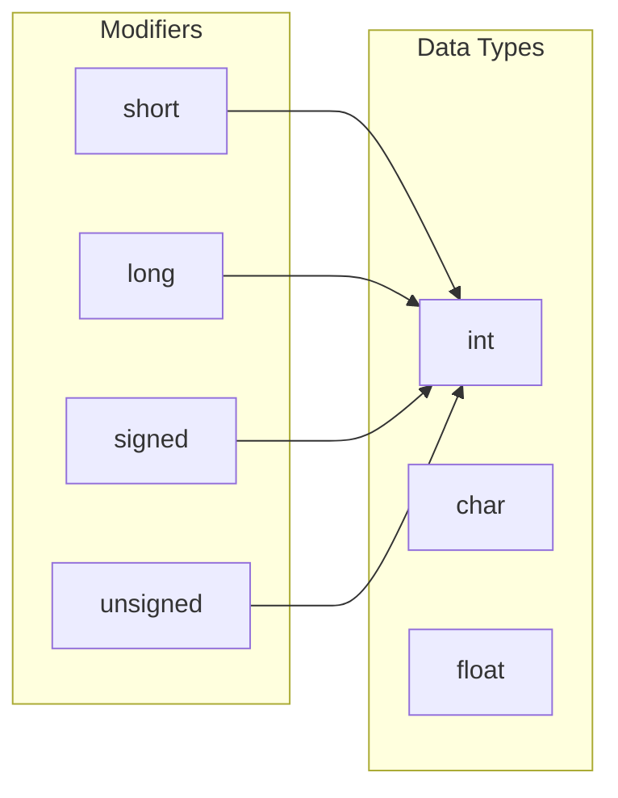
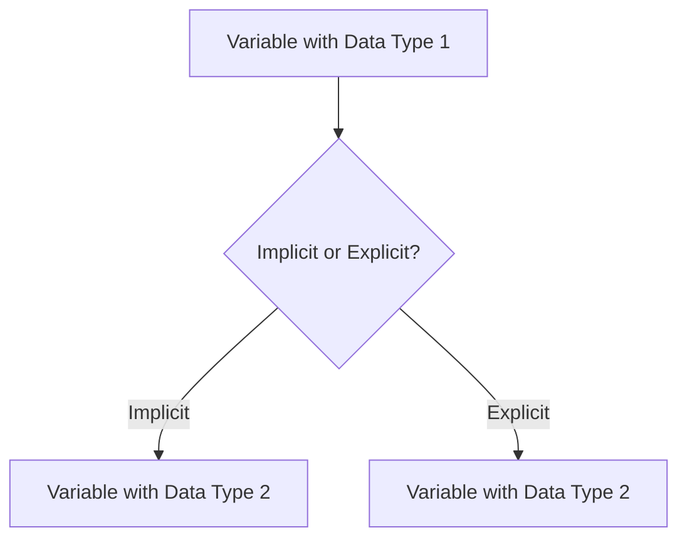

# <span style="color:#e67e22;">What we will learn in this post?</span>
<ul style='list-style-type: none; padding-left: 0;'>
<li><span style='color: #2980b9; font-size: 20px; font-weight: bold;'>👉</span> <span style='color: #2ecc71; font-size: 18px; font-weight: bold;'>Data Types in C</span></li>
<li><span style='color: #2980b9; font-size: 20px; font-weight: bold;'>👉</span> <span style='color: #2ecc71; font-size: 18px; font-weight: bold;'>Data Type Modifiers in C</span></li>
<li><span style='color: #2980b9; font-size: 20px; font-weight: bold;'>👉</span> <span style='color: #2ecc71; font-size: 18px; font-weight: bold;'>Literals in C</span></li>
<li><span style='color: #2980b9; font-size: 20px; font-weight: bold;'>👉</span> <span style='color: #2ecc71; font-size: 18px; font-weight: bold;'>Escape Sequence in C</span></li>
<li><span style='color: #2980b9; font-size: 20px; font-weight: bold;'>👉</span> <span style='color: #2ecc71; font-size: 18px; font-weight: bold;'>bool in C</span></li>
<li><span style='color: #2980b9; font-size: 20px; font-weight: bold;'>👉</span> <span style='color: #2ecc71; font-size: 18px; font-weight: bold;'>Integer Promotions in C</span></li>
<li><span style='color: #2980b9; font-size: 20px; font-weight: bold;'>👉</span> <span style='color: #2ecc71; font-size: 18px; font-weight: bold;'>Character Arithmetic in C</span></li>
<li><span style='color: #2980b9; font-size: 20px; font-weight: bold;'>👉</span> <span style='color: #2ecc71; font-size: 18px; font-weight: bold;'>Type Conversion in C</span></li>
<li><span style='color: #2980b9; font-size: 20px; font-weight: bold;'>👉</span> <span style='color: #2ecc71; font-size: 18px; font-weight: bold;'>Conclusion!</span></li>
</ul>

# <span style="color:#e67e22">C Data Types: A Beginner's Guide 🌎</span>

## <span style="color:#2980b9">Introduction</span>

In the world of programming, data types are like building blocks. They tell the compiler how to store and manipulate information. C, being a powerful language, offers various data types to handle different kinds of data. Let's explore them together!

## <span style="color:#2980b9">Basic Data Types</span>

### <span style="color:#8e44ad">Integer (`int`) 🔢</span>

-  **Definition:**  An `int` is used to store whole numbers without any decimal points.
- **Example:** 
   ```c
   int age = 25;  // Storing a person's age
   int score = 100; // Storing a game score
   ```
- **Size in Memory:** Typically 4 bytes (32 bits) on most systems.

### <span style="color:#8e44ad">Floating-Point (`float` and `double`) 🧮</span>

- **Definition:**  These types are used to store numbers with decimal points. `float` provides single-precision, while `double` offers double-precision, which means it can store more digits after the decimal point.
- **Example:**
   ```c
   float price = 19.99; // Storing a product price 
   double distance = 3.1415926535; // Storing a precise distance
   ```
- **Size in Memory:** `float`: typically 4 bytes (32 bits), `double`: typically 8 bytes (64 bits) on most systems.

### <span style="color:#8e44ad">Character (`char`) ✍️</span>

- **Definition:** A `char` stores a single character, such as a letter, number, or symbol.
- **Example:**
   ```c
   char initial = 'A'; // Storing a letter
   char symbol = '$'; // Storing a currency symbol
   ```
- **Size in Memory:** Typically 1 byte (8 bits) on most systems.

## <span style="color:#2980b9">Modified Data Types</span>

### <span style="color:#8e44ad">Signed and Unsigned Integers</span>

- **Definition:**  By default, integer types in C are signed, meaning they can represent both positive and negative numbers. You can use the keyword `unsigned` to create an unsigned integer, which can only store positive values.
- **Example:**
   ```c
   int age = -25; // Signed integer
   unsigned int counter = 255; // Unsigned integer
   ```
- **Size in Memory:** Same as their signed counterparts.

### <span style="color:#8e44ad">Short and Long Integers</span>

- **Definition:**  You can modify the size of integers using `short` or `long` keywords. `short` generally uses less memory, while `long` might provide a larger range of values.
- **Example:**
   ```c
   short int smallNumber = 100; //  Typically 2 bytes
   long int largeNumber = 999999999; // Typically 4 or 8 bytes depending on system
   ```
- **Size in Memory:** `short int`: typically 2 bytes (16 bits), `long int`: typically 4 or 8 bytes depending on the system.

## <span style="color:#2980b9">Illustrative Examples</span>

Let's see some real-world examples of how these data types are used:

```c
#include <stdio.h>

int main() {
  // Basic types
  int age = 25;          //  Stores a person's age 
  float price = 19.99;   //  Stores a product price
  char initial = 'A';    //  Stores a letter 
  
  // Modified types 
  short int smallNumber = 100; 
  long int largeNumber = 999999999; 
  
  // Output
  printf("Age: %d\n", age);   // Output: Age: 25
  printf("Price: %.2f\n", price);  // Output: Price: 19.99
  printf("Initial: %c\n", initial); // Output: Initial: A
  printf("Small Number: %hd\n", smallNumber); // Output: Small Number: 100
  printf("Large Number: %ld\n", largeNumber); // Output: Large Number: 999999999
  
  return 0; 
}
```

## <span style="color:#2980b9">Choosing the Right Data Type</span>

- **Understand the data:**  Think about the type of information you want to store (whole numbers, decimals, characters).
- **Memory efficiency:** Choose a type that uses the appropriate amount of memory, without being wasteful.
- **Data range:** Ensure the data type can hold the largest values your program might require.


## <span style="color:#2980b9">Conclusion</span>

Understanding data types in C is crucial for writing effective code. By choosing the right type, you'll improve your program's efficiency, accuracy, and readability. Keep exploring and experimenting, and soon you'll be a master of C data types! 🏆 


# <span style="color:#e67e22">Data Type Modifiers in C</span> 

C provides a set of *modifiers* that can alter the properties of basic data types like `int`, `char`, and `float`. These modifiers essentially fine-tune the size and range of values a variable can hold. Let's explore the most common ones:

## <span style="color:#2980b9">Size Modifiers: `short` and `long`</span>

*   `short`: Makes the data type smaller, typically used for integers where memory efficiency is critical.
*   `long`: Makes the data type larger, extending the range of values that can be stored.

### <span style="color:#8e44ad">Example: `short` vs `int` vs `long`</span>

```c
#include <stdio.h>

int main() {
    short shortInt = 32767;  // Typically uses 2 bytes
    int regularInt = 2147483647;  // Typically uses 4 bytes
    long longInt = 9223372036854775807;  // Typically uses 8 bytes

    printf("shortInt: %hd\n", shortInt); // Output: shortInt: 32767
    printf("regularInt: %d\n", regularInt); // Output: regularInt: 2147483647
    printf("longInt: %ld\n", longInt); // Output: longInt: 9223372036854775807

    return 0;
}
```

**Key takeaway:** Using `short` can save memory, while `long` allows you to represent a wider range of numbers.

## <span style="color:#2980b9">Sign Modifiers: `signed` and `unsigned`</span>

*   `signed`: (Default) Allows both positive and negative values.
*   `unsigned`: Restricts values to non-negative (zero and positive) values. This doubles the maximum positive value the variable can store.

### <span style="color:#8e44ad">Example: `signed` vs `unsigned`</span>

```c
#include <stdio.h>

int main() {
    signed int signedInt = -10; // Can hold negative and positive values
    unsigned int unsignedInt = 4294967294; // Can hold only non-negative values

    printf("signedInt: %d\n", signedInt); // Output: signedInt: -10
    printf("unsignedInt: %u\n", unsignedInt); // Output: unsignedInt: 4294967294

    return 0;
}
```

**Key takeaway:** `unsigned` is beneficial when dealing with numbers that are always positive, like byte counts or index positions in arrays.

## <span style="color:#2980b9">Modifier Combinations: `short int`, `long long int` etc.</span>

You can combine these modifiers to further refine the data type:

*   `short int`: A smaller integer.
*   `long int`: A larger integer.
*   `long long int`: An even larger integer.
*   `unsigned short int`: A smaller unsigned integer.
*   `unsigned long long int`: A larger unsigned integer.

### <span style="color:#8e44ad">Example: Combinations</span>

```c
#include <stdio.h>

int main() {
    short int smallInt = 100;
    long int largeInt = 1234567890;
    long long int hugeInt = 18446744073709551614; 

    printf("smallInt: %hd\n", smallInt); // Output: smallInt: 100
    printf("largeInt: %ld\n", largeInt); // Output: largeInt: 1234567890
    printf("hugeInt: %lld\n", hugeInt); // Output: hugeInt: 18446744073709551614

    return 0;
}
```

**Key takeaway:** Combinations provide more granular control over the data type's size and sign.

## <span style="color:#2980b9">Visualizing Data Type Modifiers</span>

Here's a diagram representing how modifiers affect data types in C:



**Explanation:** This diagram illustrates how modifiers (short, long, signed, unsigned) can be applied to base data types (int, char, float) to alter their characteristics.

## <span style="color:#2980b9">Choosing the Right Modifier</span>

The choice of modifier depends on the specific application:

*   Use `short` when memory is limited.
*   Use `long` when you need to represent large numbers.
*   Use `unsigned` when you only need non-negative values.
*   Use `long long` when you need to represent extremely large numbers.

**Remember:** Always consider the range of values you need to store and the memory constraints of your program. Choose the modifier that best balances these factors.


# <span style="color:#e67e22">Literals in C Programming</span> 
 
## <span style="color:#2980b9">Introduction to Literals</span> 

Literals in C are **fixed values** that represent specific data in your programs. They are like the building blocks of your code, providing the raw data your program works with. Think of them like the ingredients you use to bake a cake, or the notes you play on a musical instrument. Each literal has a specific type, which determines how it's interpreted by the compiler. 

## <span style="color:#2980b9">Types of Literals</span> 

### <span style="color:#8e44ad">Integer Literals</span> 

These represent whole numbers. There are three main types: 

* **Decimal:** Uses the standard base-10 system. 
    * Example: `123`, `45`, `0` 
* **Octal:**  Uses base-8, starting with a leading `0`. 
    * Example: `0123` (equivalent to decimal 83) 
* **Hexadecimal:**  Uses base-16, starting with `0x`. 
    * Example: `0x1A` (equivalent to decimal 26) 

```c
#include <stdio.h>

int main() {
    int decimal = 10; // Decimal literal
    int octal = 012; // Octal literal (equivalent to decimal 10)
    int hexadecimal = 0x10; // Hexadecimal literal (equivalent to decimal 16)

    printf("Decimal: %d\n", decimal); // Output: Decimal: 10
    printf("Octal: %d\n", octal); // Output: Octal: 10
    printf("Hexadecimal: %d\n", hexadecimal); // Output: Hexadecimal: 16

    return 0;
}
```

### <span style="color:#8e44ad">Floating-Point Literals</span> 

These represent numbers with decimal points. 

* Example: `3.14`, `2.718`, `1.0` 

```c
#include <stdio.h>

int main() {
    float pi = 3.14f; // Floating-point literal 
    double e = 2.718; // Double-precision floating-point literal

    printf("Pi: %.2f\n", pi); // Output: Pi: 3.14
    printf("e: %.3f\n", e); // Output: e: 2.718

    return 0;
}
```

### <span style="color:#8e44ad">Character Literals</span> 

These represent single characters enclosed in single quotes (`'`). 

* Example: `'A'`, `'!'`, `'\n'` (newline character)

```c
#include <stdio.h>

int main() {
    char letter = 'A';
    char exclamation = '!';
    char newline = '\n';

    printf("Letter: %c\n", letter); // Output: Letter: A
    printf("Exclamation: %c\n", exclamation); // Output: Exclamation: !
    printf("Newline: %c", newline); // Output: (a newline)

    return 0;
}
```

### <span style="color:#8e44ad">String Literals</span> 

These represent sequences of characters enclosed in double quotes (`"`). 

* Example: `"Hello, world!"`, `"This is a string."` 

```c
#include <stdio.h>

int main() {
    char greeting[] = "Hello, world!"; // String literal

    printf("%s\n", greeting); // Output: Hello, world! 

    return 0;
}
```

### <span style="color:#8e44ad">Boolean Literals</span> 

These represent truth values in C. They are either `true` or `false`.

* Example: `true`, `false`

```c
#include <stdio.h>

int main() {
    bool isTrue = true;
    bool isFalse = false;

    printf("isTrue: %d\n", isTrue); // Output: isTrue: 1
    printf("isFalse: %d\n", isFalse); // Output: isFalse: 0

    return 0;
}
```

## <span style="color:#2980b9">Understanding Literal Types</span> 

The type of a literal is crucial because it determines how the compiler interprets it and how it's stored in memory. For example, `10` (integer) is stored differently from `10.0` (floating-point). 

## <span style="color:#2980b9">Using Literals in Code</span> 

Literals are used extensively in C programming to:

* **Assign values to variables:**  `int age = 25;`
* **Perform calculations:**  `float result = 10.5 + 2.2;`
* **Display output:**  `printf("Hello, world!\n");`
* **Represent specific characters:**  `char initial = 'J';`

## <span style="color:#2980b9">Example: A Simple Program</span> 

```c
#include <stdio.h>

int main() {
    int age = 25; // Integer literal
    float height = 1.75; // Floating-point literal
    char initial = 'M'; // Character literal
    
    printf("Name: John\n"); // String literal
    printf("Age: %d\n", age); 
    printf("Height: %.2f meters\n", height);
    printf("Initial: %c\n", initial);

    return 0;
}
```

**Output:**

```
Name: John
Age: 25
Height: 1.75 meters
Initial: M
```

## <span style="color:#2980b9">Key Points to Remember</span> 

* Literals are fixed values that cannot be changed during program execution. 
* Choosing the correct literal type is essential for accurate calculations and data representation. 
* Literals are the foundation of C programming, providing the raw data your programs operate on. 

**Enjoy exploring the world of C programming!** 


# <span style="color:#e67e22">Escape Sequences in C: Making Your Code Sing 🎤</span>

## <span style="color:#2980b9">What are Escape Sequences?</span>

Escape sequences are special character combinations used in C strings to represent characters that are difficult or impossible to type directly. Think of them like secret codes that allow you to add special effects to your text!  🤯

### <span style="color:#8e44ad">Common Escape Sequences</span>

Here's a table of some commonly used escape sequences:

| Escape Sequence | Meaning | Example | Output |
|---|---|---|---|
| `\n` | Newline | `printf("Hello\nWorld!");` | `Hello<br>World!` |
| `\t` | Horizontal Tab | `printf("Name\tAge\n");` | `Name   Age<br>` |
| `\r` | Carriage Return | `printf("Line 1\rLine 2");` | `Line 2` |
| `\b` | Backspace | `printf("Hello\bWorld");` | `HellWorld` |
| `\a` | Alert (Beep) | `printf("\a");` | *Makes a beep sound* |
| `\\` | Backslash | `printf("This is a backslash: \\");` | `This is a backslash: \\` |
| `\'` | Single quote | `printf("This is a single quote: \'");` | `This is a single quote: '` |
| `\"` | Double quote | `printf("This is a double quote: \"");` | `This is a double quote: "` |

## <span style="color:#2980b9">Examples: Let's Escape!</span>

### <span style="color:#8e44ad">Example 1: Using \n for Newline</span>

```c
#include <stdio.h>

int main() {
    printf("This is a line of text.\nThis is another line.");
    return 0;
}
```

**Output:**
```
This is a line of text.
This is another line.
```

### <span style="color:#8e44ad">Example 2: Using \t for Tab</span>

```c
#include <stdio.h>

int main() {
    printf("Name\tAge\n");
    printf("John\t25\n");
    printf("Jane\t30");
    return 0;
}
```

**Output:**
```
Name   Age
John   25
Jane   30
```

### <span style="color:#8e44ad">Example 3: Using \\ to Escape Backslash</span>

```c
#include <stdio.h>

int main() {
    printf("This is a backslash: \\");
    return 0;
}
```

**Output:**
```
This is a backslash: \
```

## <span style="color:#2980b9">Why Use Escape Sequences?</span>

- **Clarity:** They help you represent special characters clearly in your code.
- **Control:** You can control the layout and formatting of your output with precision.
- **Consistency:** They provide a standard way to represent characters across different platforms and compilers.

## <span style="color:#2980b9">Let's Summarize</span>

Escape sequences are like hidden superpowers that give you more control over your C strings. They allow you to represent special characters, format text, and add unique features to your output. Remember to use them wisely and your code will be more readable and expressive! 🤩


# <span style="color:#e67e22">The `bool` Data Type in C: A Guide to Truth and Falsity</span> 

## <span style="color:#2980b9">Introduction: What is `bool`? </span>

In C, the `bool` data type is used to represent **truth values**: either **true** or **false**. It's a simple yet powerful way to manage conditions and decision-making in your programs. Think of it as a tiny light switch: it's either **on** (true) or **off** (false).

### <span style="color:#8e44ad">Significance of `bool` </span>

- **Clarity**:  `bool` makes your code more readable and understandable. Instead of using integers (0 for false, 1 for true), you can directly use `true` and `false`, making your intentions clear.

- **Type Safety**:  Using `bool` enforces a clear distinction between truth values and other data types, preventing unintended conversions and logic errors.

## <span style="color:#2980b9">History of `bool` in C</span> 

- The `bool` data type was **introduced in C99**, so if you're using an older compiler, you might not have it available. 

- **Before C99**, programmers often used integers (0 for false, non-zero for true) to represent boolean values. This could lead to confusion and potential errors.

## <span style="color:#2980b9">Using `bool` in C:  Examples and Applications</span> 

### <span style="color:#8e44ad">Basic Usage:  Declaring and Assigning</span> 

```c
#include <stdbool.h>  // Include the header file for bool 

int main() {
  bool is_active = true; 
  bool is_completed = false;

  // Check the values
  printf("is_active: %d\n", is_active); // Output: is_active: 1 
  printf("is_completed: %d\n", is_completed); // Output: is_completed: 0 
  
  return 0;
}
```

### <span style="color:#8e44ad">Using `bool` in Conditional Statements</span>

```c
#include <stdbool.h>

int main() {
  bool is_raining = true; 

  if (is_raining) {
    printf("Don't forget your umbrella! ☔️ \n"); 
  } else {
    printf("Enjoy the sunshine! ☀️ \n");
  }

  return 0; 
}
```

### <span style="color:#8e44ad">Logical Operators and `bool`</span>

- `&&` (logical AND) - True if both operands are true
- `||` (logical OR) - True if at least one operand is true
- `!` (logical NOT) - Inverts the truth value

```c
#include <stdbool.h>

int main() {
  bool has_key = true;
  bool is_locked = false; 

  if (has_key && !is_locked) {
    printf("You can open the door! 🔑 \n"); 
  } else {
    printf("The door is locked or you don't have the key. 🔒 \n"); 
  }

  return 0;
}
```

## <span style="color:#2980b9">Beyond Basic Usage</span>

### <span style="color:#8e44ad">`bool` in Functions</span>

```c
#include <stdbool.h> 

bool is_even(int num) {
  if (num % 2 == 0) {
    return true; 
  } else {
    return false; 
  }
}

int main() {
  int number = 8;

  if (is_even(number)) {
    printf("%d is an even number.\n", number);
  } else {
    printf("%d is an odd number.\n", number);
  }

  return 0;
}
```

### <span style="color:#8e44ad">Representing Error States</span> 

```c
#include <stdbool.h> 

bool open_file(const char* filename) {
  // ... code to open the file ... 

  if (file_pointer == NULL) {
    return false; // File could not be opened 
  } else {
    return true; // File opened successfully 
  }
}

int main() {
  bool success = open_file("data.txt");

  if (success) {
    printf("File opened successfully!\n");
  } else {
    printf("Error opening file.\n");
  }

  return 0;
}
```

## <span style="color:#2980b9">In Conclusion</span>

The `bool` data type is a valuable tool for writing clear, efficient, and reliable C code. By embracing its use, you can enhance the readability and logic of your programs, making them easier to understand, debug, and maintain. 


# <span style="color:#e67e22">Integer Promotions in C</span> 

## <span style="color:#2980b9">What are Integer Promotions?</span> 

In C, integer promotions are a crucial part of how the language handles arithmetic operations involving different integer types. When you perform operations with values of different sizes (like `char`, `short`, `int`, etc.), C converts the smaller types to a larger type to ensure consistency and prevent data loss. 

### <span style="color:#8e44ad">Why are Promotions Needed?</span>

* **Data Loss Prevention:** Imagine adding a `char` (1 byte) to an `int` (4 bytes).  If the promotion didn't happen, the `char` could be treated as a 4-byte value with its higher bytes filled with garbage, leading to incorrect results.
* **Consistent Operations:** Promotions allow for operations to be performed on values of the same size, making the compiler's job easier and ensuring predictable behavior.

## <span style="color:#2980b9">The Promotion Process</span>

1. **Smallest to Largest:** C promotes smaller integer types (like `char`, `short`, `enum`) to larger types following a hierarchy:
   - `char` (8 bits) -> `int` (16 or 32 bits)
   - `short` (16 bits) -> `int` (16 or 32 bits)
   - `enum` -> `int` (16 or 32 bits)

2. **Larger Types:** If the `int` type itself is smaller than the other operand, both operands are promoted to the larger type. For instance, if you're working with a `long int` (32 or 64 bits), both operands will be promoted to `long int`.

## <span style="color:#2980b9">Examples in Action</span>

```c
#include <stdio.h>

int main() {
  // Example 1: Adding a char and an int
  char ch = 'A';
  int num = 10;
  int sum = ch + num; 
  printf("sum: %d\n", sum); // Output: sum: 65 

  // Example 2: Multiplying a short and a long int
  short s = 5;
  long int l = 100000;
  long int product = s * l; 
  printf("product: %ld\n", product); // Output: product: 500000 

  return 0;
}
```

### <span style="color:#8e44ad">Visual Representation</span>

Here's a simple flowchart showing the promotion process:

```mermaid
graph LR
A[Smaller Type (char, short, enum)] --> B[Promote to int]
B --> C[Int Type] --> D[Larger Type (if necessary)]
```

## <span style="color:#2980b9">Important Considerations</span>

* **Unsigned Types:** Unsigned integer types (like `unsigned char` and `unsigned int`) are promoted to the corresponding signed types during calculations.
* **Floating Point:** The promotion rules are different for floating-point types (`float`, `double`) and involve conversions to the larger floating-point type.
* **Data Loss Prevention:**  While promotions help prevent data loss, it's essential to be aware of potential data loss if the original type was smaller than the promoted type.  
* **Compiler-Dependent:** The exact size of `int` and `long` might vary depending on your compiler and platform (32-bit or 64-bit). 

## <span style="color:#2980b9">Conclusion</span> 

Integer promotions in C ensure consistent and predictable behavior across operations involving various integer types. Understanding this concept helps you write more accurate and efficient code while avoiding potential pitfalls related to data loss.  


# <span style="color:#e67e22">Character Arithmetic in C: Unveiling the Magic Behind the Scenes 🧙‍♀️</span>

## <span style="color:#2980b9">Characters: Not Just Letters, But Numbers Too! 🔢</span>

In the realm of C programming, characters are more than just symbols on your screen. They are secretly represented as **integer values**, each assigned a unique code.  This secret code is defined by the **ASCII (American Standard Code for Information Interchange)** standard. 

For instance, the character 'A' is represented by the integer value 65, 'B' by 66, and so on. This means you can perform **arithmetic operations** on characters, treating them as numbers! 

### <span style="color:#8e44ad">Unveiling the ASCII Secrets 🗝️</span>

Let's peek behind the curtain and see how characters map to their ASCII values:

| Character | ASCII Value |
|---|---|
| 'A' | 65 |
| 'B' | 66 |
| 'a' | 97 |
| '0' | 48 |
| ' ' (space) | 32 |

## <span style="color:#2980b9">Arithmetic Operations on Characters: A Practical Demonstration 🧮</span>

Let's dive into some code examples to witness the magic of character arithmetic firsthand:

```c
#include <stdio.h>

int main() {
    char ch = 'A';

    // Add 1 to 'A' to get 'B'
    ch = ch + 1;
    printf("Adding 1 to 'A': %c\n", ch); // Output: Adding 1 to 'A': B

    // Subtract 2 from 'C' to get 'A'
    ch = 'C' - 2;
    printf("Subtracting 2 from 'C': %c\n", ch); // Output: Subtracting 2 from 'C': A

    // Calculate the difference between 'a' and 'A'
    int diff = 'a' - 'A';
    printf("Difference between 'a' and 'A': %d\n", diff); // Output: Difference between 'a' and 'A': 32

    return 0;
}
```

In this code:

* We declare a character variable `ch` and assign it the value 'A'.
* We perform arithmetic operations on `ch`, treating it as a number.
* The `printf()` function displays the results, showing how the character values change after arithmetic operations.

## <span style="color:#2980b9">The Power of Character Arithmetic: Beyond Simple Calculations ⚡️</span>

Character arithmetic finds its use in various scenarios:

* **Converting between uppercase and lowercase:** 
    * We can convert a lowercase character to uppercase by subtracting the ASCII value difference between 'a' and 'A' (32).
    * Similarly, we can convert an uppercase character to lowercase by adding 32.

* **Character manipulation:**
    * Shifting characters by a specific value can be used for creating ciphers or code obfuscation.

### <span style="color:#8e44ad">Illustrative Example: Case Conversion 🔀</span>

Let's see how we can convert a lowercase character to uppercase:

```c
#include <stdio.h>

int main() {
    char lowercase = 'c';
    char uppercase = lowercase - ('a' - 'A');

    printf("Lowercase: %c, Uppercase: %c\n", lowercase, uppercase); // Output: Lowercase: c, Uppercase: C

    return 0;
}
```

## <span style="color:#2980b9">Wrapping Up: Embracing the Flexibility of Character Arithmetic 🚀</span>

Character arithmetic empowers us to manipulate and modify characters in C, expanding our programming capabilities. Remember, characters are simply numerical representations, opening doors to creative and practical applications! 


# <span style="color:#e67e22">Type Conversion in C: A Comprehensive Guide</span> 

## <span style="color:#2980b9">Introduction to Type Conversion</span> 

Type conversion, also known as **type casting**, is the process of changing a variable's data type to another. This is crucial in C because it allows you to perform operations that involve variables of different types, ensuring flexibility and control over data manipulation. 

## <span style="color:#2980b9">Types of Type Conversion</span>

### <span style="color:#8e44ad">Implicit Conversion</span> 

**Implicit conversion** happens automatically by the C compiler without requiring explicit instructions from the programmer.  It typically occurs during arithmetic operations where variables of different data types are involved. 

**Example:**

```c
int num1 = 10; 
float num2 = 2.5;

// Implicit conversion: 'num1' is implicitly converted to a float before the addition
float result = num1 + num2; 

printf("Result: %.2f\n", result); // Output: Result: 12.50
```

### <span style="color:#8e44ad">Explicit Conversion</span> 

**Explicit conversion**, also called **casting**, requires the programmer to explicitly specify the desired data type using the **cast operator** `(data_type)`. 

**Example:**

```c
float num1 = 3.14;
int num2 = (int) num1; // Explicitly casting 'num1' to an integer

printf("Integer value: %d\n", num2); // Output: Integer value: 3 
```

## <span style="color:#2980b9">When Type Conversion Occurs</span>

**Type conversion is crucial in these scenarios:**

- **Arithmetic Operations:** During calculations involving variables of different data types, the compiler performs implicit conversion to ensure consistent data types. 
- **Function Calls:** When passing arguments to functions, the compiler might perform implicit conversion if the argument type doesn't match the function parameter's type. 
- **Assignments:** When assigning a value of one data type to a variable of a different type, the compiler might perform implicit conversion.

## <span style="color:#2980b9">Understanding the Conversion Process</span>

Here's a simple flowchart illustrating the concept of type conversion:



## <span style="color:#2980b9">Important Considerations</span>

- **Data Loss:** Be mindful of potential data loss when converting from a larger data type (like `double`) to a smaller one (like `int`). 
- **Precision:**  Explicit casting can sometimes result in loss of precision, especially when converting floating-point numbers to integers. 
- **Control:** Using explicit casting grants you fine-grained control over type conversions, allowing you to tailor the conversion process for specific scenarios. 

## <span style="color:#2980b9">Conclusion</span>

Type conversion is a fundamental concept in C programming that allows you to manipulate data effectively. Understanding the different types of conversion, when they happen, and their implications is essential for writing accurate and robust C code. 


<h1><span style='color:#e67e22'>Conclusion</span></h1>

That's a wrap! 🎊 We've covered a lot of ground in this post, and hopefully, you've learned something new and exciting. Remember, **learning is a journey, not a destination,** and every step we take brings us closer to understanding the world around us. 😊

Now, I'd love to hear your thoughts!  What did you think of this post?  Did you find it helpful?  Do you have any questions or suggestions for future content? Let me know in the comments below! 👇

I'm always open to feedback and eager to connect with fellow learners. 💬 Let's keep the conversation going! 🚀 


