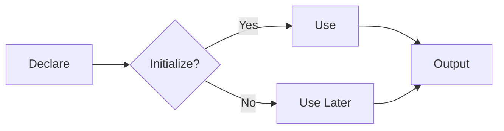

# <span style="color:#e67e22;">What we will learn in this post?</span>
<ul style='list-style-type: none; padding-left: 0;'>
<li><span style='color: #2980b9; font-size: 20px; font-weight: bold;'>👉</span> <span style='color: #2ecc71; font-size: 18px; font-weight: bold;'>C Variables</span></li>
<li><span style='color: #2980b9; font-size: 20px; font-weight: bold;'>👉</span> <span style='color: #2ecc71; font-size: 18px; font-weight: bold;'>Constants in C</span></li>
<li><span style='color: #2980b9; font-size: 20px; font-weight: bold;'>👉</span> <span style='color: #2ecc71; font-size: 18px; font-weight: bold;'>Const Qualifier in C</span></li>
<li><span style='color: #2980b9; font-size: 20px; font-weight: bold;'>👉</span> <span style='color: #2ecc71; font-size: 18px; font-weight: bold;'>Different Ways to Declare Variable as Constant in C</span></li>
<li><span style='color: #2980b9; font-size: 20px; font-weight: bold;'>👉</span> <span style='color: #2ecc71; font-size: 18px; font-weight: bold;'>Scope Rules in C</span></li>
<li><span style='color: #2980b9; font-size: 20px; font-weight: bold;'>👉</span> <span style='color: #2ecc71; font-size: 18px; font-weight: bold;'>Internal Linkage and External Linkage in C</span></li>
<li><span style='color: #2980b9; font-size: 20px; font-weight: bold;'>👉</span> <span style='color: #2ecc71; font-size: 18px; font-weight: bold;'>Global Variables in C</span></li>
<li><span style='color: #2980b9; font-size: 20px; font-weight: bold;'>👉</span> <span style='color: #2ecc71; font-size: 18px; font-weight: bold;'>Conclusion!</span></li>
</ul>

# <span style="color:#e67e22">Variables in C: Your Program's Memory Boxes</span> 

## <span style="color:#2980b9">What are Variables? </span>

Imagine a variable as a labeled box where you store information in your C program.  It's like a container that holds a specific type of data, allowing you to manipulate and use that data throughout your program.  

### <span style="color:#8e44ad">Think of it this way: </span>

* **Box:** The variable itself.
* **Label:** The variable's name, which you choose.
* **Contents:** The data stored inside the box.

## <span style="color:#2980b9">Types of Variables</span> 

C offers various variable types, each designed to hold different kinds of data.  Here are some of the most common types:

### <span style="color:#8e44ad">1. Integers (int)</span> 

Integers are used to store whole numbers (no decimals). 

**Code Example:**

```c
#include <stdio.h>

int main() {
  int age = 25; // Declaring an integer variable 'age' and assigning it the value 25
  printf("My age is: %d\n", age); // Printing the value of 'age'
  return 0;
}
```

**Output:**

```
My age is: 25
```

### <span style="color:#8e44ad">2. Floating-Point Numbers (float)</span> 

Floating-point numbers are used to store numbers with decimal points. 

**Code Example:**

```c
#include <stdio.h>

int main() {
  float price = 19.99; // Declaring a floating-point variable 'price' and assigning it the value 19.99
  printf("The price is: %.2f\n", price); // Printing the value of 'price' with 2 decimal places
  return 0;
}
```

**Output:**

```
The price is: 19.99
```

### <span style="color:#8e44ad">3. Characters (char)</span> 

Characters are used to store single letters, symbols, or special characters. 

**Code Example:**

```c
#include <stdio.h>

int main() {
  char initial = 'A'; // Declaring a character variable 'initial' and assigning it the value 'A'
  printf("My initial is: %c\n", initial); // Printing the value of 'initial'
  return 0;
}
```

**Output:**

```
My initial is: A
```

### <span style="color:#8e44ad">4. Strings (char *)</span> 

Strings are used to store sequences of characters. 

**Code Example:**

```c
#include <stdio.h>

int main() {
  char name[] = "John Doe"; // Declaring a string variable 'name' and assigning it the value "John Doe"
  printf("My name is: %s\n", name); // Printing the value of 'name'
  return 0;
}
```

**Output:**

```
My name is: John Doe
```

## <span style="color:#2980b9">How to Use Variables in Your Programs</span> 

1. **Declare:**  You start by telling the compiler what type of data your variable will hold and give it a name using the variable's type followed by the variable name.
2. **Initialize:** You can assign a value to the variable when you declare it or later in your program. 
3. **Use:** You can use the variable in your code to perform operations (like calculations or comparisons) and manipulate data. 

## <span style="color:#2980b9">Example: Calculating Area of a Triangle</span> 

```c
#include <stdio.h>

int main() {
  float base = 5.0; // Base of the triangle
  float height = 3.0; // Height of the triangle
  float area; // Variable to store the calculated area

  area = (base * height) / 2; // Calculate the area

  printf("The area of the triangle is: %.2f\n", area); // Display the area
  return 0;
}
```

**Output:**

```
The area of the triangle is: 7.50
```

## <span style="color:#2980b9">Why Variables are Important</span>

* **Flexibility:**  Variables allow you to store and reuse data dynamically.
* **Efficiency:**  You don't need to hardcode values everywhere; use variables to change things easily.
* **Readability:**  Descriptive variable names make your code easier to understand.

## <span style="color:#2980b9">Let's Visualize it!</span>

Here's a flowchart to illustrate the steps involved in using variables:



Variables are fundamental building blocks in C programming.  By understanding how to declare, initialize, and use different variable types, you can create dynamic, efficient, and readable programs. 


# <span style="color:#e67e22">Constants in C: The Unchanging Values</span> 

## <span style="color:#2980b9">What are Constants?</span> 
Constants are special variables in C that hold fixed values that **cannot be changed** during the execution of a program. Imagine them as unchanging "truths" within your code.  They bring structure and reliability to your programs.

## <span style="color:#2980b9">Why Use Constants?</span>
* **Readability:** Constants make your code easier to understand. Instead of scattered magic numbers, you have meaningful names like `PI` or `MAX_SIZE`. 
* **Maintainability:** If you need to change a constant value (like updating the maximum size of an array), you only need to modify it in one place, reducing errors.
* **Safety:** Constants prevent accidental modification of important values, protecting the integrity of your program. 

## <span style="color:#2980b9">Defining Constants in C</span>
There are two main ways to define constants in C:

### <span style="color:#8e44ad">#define Preprocessor Directive</span>

**Syntax:**

```c
#define CONSTANT_NAME value
```

* This method uses the preprocessor to replace `CONSTANT_NAME` with `value` **before** the program is compiled. 
*  It's simple and efficient but lacks type checking.

**Example:**

```c
#define PI 3.14159 
#define MAX_SIZE 100 

int main() {
  double area = PI * radius * radius; // PI is replaced by 3.14159
  // ...
}
```

### <span style="color:#8e44ad">`const` Keyword</span>

**Syntax:**

```c
const data_type CONSTANT_NAME = value;
```

* `const` declares a variable as constant, ensuring its value cannot be changed at runtime.
* It provides type checking, making your code more secure.

**Example:**

```c
const int MAX_ATTEMPTS = 3; 
const char* AUTHOR_NAME = "John Doe";

int main() {
  // MAX_ATTEMPTS = 4; // This will result in an error
  // ...
}
```

## <span style="color:#2980b9">Choosing the Right Method</span>
The choice depends on your specific needs. 

* **`#define`:** Great for simple constant values and for cases where performance is critical.
* **`const`:** Better for complex constants and when type safety is a priority.

## <span style="color:#2980b9">Constants:  Enhancing Code Quality</span>

Think of constants as the "anchors" of your C programs,  making your code more reliable, maintainable, and readable.  They help you build better software, one unchanging value at a time. 🚀 


# <span style="color:#e67e22">The `const` Qualifier in C: Keeping Things Steady</span> 

## <span style="color:#2980b9">Introduction</span>

The `const` qualifier in C is like a security guard for your variables, ensuring they remain unchanged throughout your program. It's a powerful tool for:

* **Improving code reliability:** Prevents accidental modifications, ensuring data integrity.
* **Enhancing readability:** Clearly indicates variables intended to stay constant.
* **Optimizing performance:** Allows compilers to make assumptions, potentially leading to faster code.

## <span style="color:#2980b9">Defining Constant Variables</span>

### <span style="color:#8e44ad">Syntax</span>
```c
const <data_type> <variable_name> = <value>;
```

**Example:**
```c
const int MAX_VALUE = 100; //  Declares a constant integer with a value of 100
```
**Explanation:**

* `const`: This keyword signifies that the variable is constant.
* `<data_type>`:  Specifies the variable's data type (e.g., `int`, `float`, `char`).
* `<variable_name>`:  The chosen name for your constant variable.
* `= <value>`:  Assigns an initial value to the constant variable, which cannot be changed later.

## <span style="color:#2980b9">Using `const` Variables</span>

Once defined, `const` variables can be used just like regular variables:

```c
#include <stdio.h>

int main() {
    const int MAX_VALUE = 100; //  Declare a constant integer

    int my_number = 50;

    if (my_number < MAX_VALUE) {
        printf("My number is less than the maximum value.\n"); // Output: My number is less than the maximum value.
    } else {
        printf("My number is greater than or equal to the maximum value.\n");
    }

    return 0;
}
```

**Key Points:**

* **Initialization:** `const` variables must be initialized during declaration.
* **Immutability:**  Their values are fixed and cannot be changed afterward.
* **Read-only:** You can only access the value of a `const` variable, not modify it.

## <span style="color:#2980b9">Differences Between `const` and Non-`const` Variables</span>

Let's see how `const` variables behave compared to their non-`const` counterparts:

**Non-`const`:**

```c
#include <stdio.h>

int main() {
    int my_number = 50; //  Declares a non-constant integer

    printf("Initial value: %d\n", my_number); // Output: Initial value: 50

    my_number = 75; //  Modifies the variable's value

    printf("Modified value: %d\n", my_number); // Output: Modified value: 75

    return 0;
}
```

**`const`:**

```c
#include <stdio.h>

int main() {
    const int MAX_VALUE = 100; //  Declare a constant integer

    printf("Initial value: %d\n", MAX_VALUE); // Output: Initial value: 100

    // MAX_VALUE = 75; //  This line would cause a compilation error because you cannot change a constant's value

    return 0;
}
```

## <span style="color:#2980b9">Benefits of Using `const`</span>

* **Enhanced Readability:**  Clearly indicates values that should not change.
* **Reduced Bugs:**  Prevents accidental modifications, minimizing errors.
* **Optimized Code:**  Compilers can make assumptions about `const` variables, potentially generating more efficient code.
* **Data Integrity:**  Ensures data stays consistent, particularly important in critical applications.

## <span style="color:#2980b9">Example Scenarios</span>

* **Mathematical Constants:**  `const double PI = 3.14159;`
* **Array Sizes:**  `const int ARRAY_SIZE = 10;`
* **Configuration Settings:**  `const char* DATABASE_URL = "localhost";`

## <span style="color:#2980b9">`const` in Function Arguments</span>

You can use `const` to indicate that a function argument should not be modified:

```c
void print_string(const char* str) {
    printf("%s\n", str);
}
```

This makes it clear that the function will not change the contents of the `str` string.

## <span style="color:#2980b9">Conclusion</span>

The `const` qualifier is a powerful tool in C for creating immutable variables, enhancing code clarity, and improving reliability. By understanding and utilizing `const`, you can write more robust, readable, and efficient programs.


# <span style="color:#e67e22">Declaring Constants in C</span> 

Constants are values that cannot be changed during the execution of a program. They are useful for maintaining code consistency, improving readability, and making programs easier to modify. Let's explore different ways to declare constants in C. 

## <span style="color:#2980b9">#define Preprocessor Directive</span> 

### <span style="color:#8e44ad">How it works</span> 

The `#define` directive is a preprocessor directive that performs text substitution before the code is compiled. It creates a symbolic constant that can be used throughout the program.

```c
#define PI 3.14159
```

In this example, `PI` is defined as `3.14159`. During compilation, every instance of `PI` in the code will be replaced with `3.14159`.

### <span style="color:#8e44ad">Example</span> 

```c
#include <stdio.h>

#define PI 3.14159

int main() {
    float radius = 5.0;
    float area = PI * radius * radius;
    printf("Area of the circle: %.2f\n", area); // Output: Area of the circle: 78.54
    return 0;
}
```

### <span style="color:#8e44ad">Advantages</span> 

* **Simple and efficient:**  `#define` is easy to use and doesn't introduce any runtime overhead.
* **Widely supported:** It's supported by all C compilers.

### <span style="color:#8e44ad">Disadvantages</span> 

* **No type checking:** `#define` doesn't perform any type checking, which can lead to errors if the value is used incorrectly.
* **Limited scope:** `#define` constants are available globally, which can sometimes be undesirable.

## <span style="color:#2980b9">const Keyword</span>

### <span style="color:#8e44ad">How it works</span>

The `const` keyword is a qualifier that makes a variable constant. When you declare a variable as `const`, its value cannot be modified after initialization.

```c
const int MAX_SIZE = 100;
```

### <span style="color:#8e44ad">Example</span> 

```c
#include <stdio.h>

int main() {
    const int MAX_SIZE = 100;
    int array[MAX_SIZE]; 
    // array[MAX_SIZE] = 10; // Error: Assignment of read-only location
    return 0;
}
```

### <span style="color:#8e44ad">Advantages</span>

* **Type checking:**  The `const` keyword enforces type checking, making the code more reliable.
* **Scope control:** `const` variables can be declared with different scopes, such as local or global. 

### <span style="color:#8e44ad">Disadvantages</span>

* **Slightly less efficient:**  `const` variables might introduce some overhead compared to `#define`. 

## <span style="color:#2980b9">Enumerations (Enums)</span>

### <span style="color:#8e44ad">How it works</span>

Enumerations, or `enums`, provide a way to define a set of named integer constants. They improve code readability and make it easier to manage related constants.

```c
enum Days { Monday, Tuesday, Wednesday, Thursday, Friday, Saturday, Sunday };
```

In this example, `Monday` is assigned the value `0`, `Tuesday` is `1`, and so on.

### <span style="color:#8e44ad">Example</span>

```c
#include <stdio.h>

enum Days { Monday, Tuesday, Wednesday, Thursday, Friday, Saturday, Sunday };

int main() {
    enum Days today = Wednesday; 
    printf("Today is %d\n", today); // Output: Today is 2
    return 0;
}
```

### <span style="color:#8e44ad">Advantages</span>

* **Readability and maintainability:** Enums make code more readable by using meaningful names instead of raw integer values.
* **Type safety:**  Enums enforce type safety and prevent accidental misuse of constants.

### <span style="color:#8e44ad">Disadvantages</span>

* **Less flexible:** Enums are not as flexible as other methods for defining constants. 

## <span style="color:#2980b9">Choosing the Right Method</span>

The best method for declaring constants depends on your specific needs:

* **`#define`:** Suitable for simple constants and when performance is a priority. 
* **`const`:** Preferable for constants with type checking and controlled scope. 
* **`enum`:** Ideal for creating sets of related constants and improving code readability. 

## <span style="color:#2980b9">Key Points</span>

* Constants make your code more robust and maintainable.
* They enforce code consistency and reduce the risk of accidental modifications.
* Choose the appropriate method based on your needs and coding style. 

## <span style="color:#2980b9">Example of Different Method Usages</span>

```c
#include <stdio.h>

#define PI 3.14159

const int MAX_SIZE = 100;

enum Days { Monday, Tuesday, Wednesday, Thursday, Friday, Saturday, Sunday };

int main() {
    float radius = 5.0;
    float area = PI * radius * radius;
    printf("Area of the circle: %.2f\n", area); // Output: Area of the circle: 78.54

    int array[MAX_SIZE]; 

    enum Days today = Wednesday; 
    printf("Today is %d\n", today); // Output: Today is 2
    
    return 0;
}
``` 


# <span style="color:#e67e22">Variable Scope in C: Where Your Variables Live</span> 🌎

## <span style="color:#2980b9">Understanding the Basics</span> 

Think of variable scope as the **boundaries** within which your variables can be seen and used. It's like a **visibility rule** that determines where your variables can be accessed within your C program.  

### <span style="color:#8e44ad">Local Scope: Your Private Playground</span> 

- **Variables declared inside functions** have **local scope.** 
- They're like toys in your room – only **accessible within that specific function**. 
- This helps keep your code **organized** and **prevents accidental changes** to variables from other parts of the program. 

```c
#include <stdio.h>

void myFunction() {
  int localVar = 5; // Local to myFunction
  printf("Inside myFunction: %d\n", localVar); // Accessing localVar
}

int main() {
  // printf("Inside main: %d\n", localVar); // Error: localVar not accessible here
  myFunction();
  return 0;
}

/* Output:
Inside myFunction: 5
*/ 
```

### <span style="color:#8e44ad">Global Scope:  The World's Your Playground</span>

- **Variables declared outside functions** have **global scope.**
- They are like **public parks** – **accessible from anywhere in your program.** 
- However,  using global variables extensively can lead to **spaghetti code** and **hard-to-debug issues**, so use them sparingly.

```c
#include <stdio.h>

int globalVar = 10; // Global variable

void myFunction() {
  printf("Inside myFunction: %d\n", globalVar); // Accessing globalVar
}

int main() {
  printf("Inside main: %d\n", globalVar); // Accessing globalVar
  myFunction(); 
  return 0;
}

/* Output:
Inside main: 10
Inside myFunction: 10 
*/ 
```

## <span style="color:#2980b9">Scope and Block Structures:  Building Walls</span>  

- **Block structures** (code blocks enclosed in curly braces `{}`) can create **nested scopes**. 
- It's like having **rooms within a house**, where variables declared inside a block are only visible **within that block.** 

```c
#include <stdio.h>

int main() {
  int localVar1 = 5; // Local to main
  { // Start of a new block
    int localVar2 = 10; // Local to this block
    printf("Inside the block: %d, %d\n", localVar1, localVar2); // Accessible
  } // End of the block 
  // printf("Outside the block: %d\n", localVar2); // Error: localVar2 is not accessible
  printf("Outside the block: %d\n", localVar1); // Accessible 
  return 0;
}

/* Output:
Inside the block: 5, 10
Outside the block: 5
*/ 
```

## <span style="color:#2980b9">Scope Matters:  Keeping Your Code Clean</span> 

- **Scope helps prevent conflicts** between variables with the same name in different parts of your program. 
- **Local variables promote modularity**, making your functions more self-contained and easier to understand. 
- **Global variables can lead to unintended side effects** if you're not careful. 

## <span style="color:#2980b9">Summary: A Visual Guide</span>

```mermaid
graph LR
    subgraph Main Function
        A[localVar1] --> B{Inside Block}
    end
    B --> C[localVar2]
    C --> D[printf()]
    subgraph myFunction
        E[globalVar] --> F{myFunction}
    end
    F --> G[printf()]
```

**Remember:  Scope is a powerful tool to keep your code organized, maintainable, and less error-prone!** 🏆

# <span style="color:#e67e22">Linkage in C: Internal vs External</span> 

In C, the concept of *linkage* determines how variables and functions are seen and used across different files in your project. It's like defining who gets access to your secret stash of cookies 🍪.

## <span style="color:#2980b9">Internal Linkage</span>

### <span style="color:#8e44ad">The Private Cookie Jar</span>

Variables and functions with *internal linkage* are like your private cookie jar. They can only be accessed within the same file where they are defined. 

**Think of it as having a secret stash of cookies that only you can reach.**

**Here's a simple example:**

```c
// file1.c
int secret_cookie_count = 10; // Internal linkage

int main() {
  secret_cookie_count++; 
  printf("Cookies left: %d\n", secret_cookie_count); // Access allowed
  return 0;
}

// file2.c
int main() {
  printf("Cookies left: %d\n", secret_cookie_count); // Error: secret_cookie_count is not visible
  return 0;
}
```

**Output:**

```
Cookies left: 11
```

**Explanation:**

-  `secret_cookie_count` is declared in `file1.c`, and it has internal linkage. 
- The `main` function in `file1.c` can access and modify it.
- The `main` function in `file2.c` tries to access `secret_cookie_count`, but it's **not visible** because it has internal linkage.

**How to achieve Internal Linkage:**

-  **Default:** If you don't specify anything, variables and functions with **static** storage class automatically have internal linkage.

- **Explicitly:** Use the keyword **`static`** in the declaration.

### <span style="color:#8e44ad">Mermaid Diagram for Internal Linkage</span>

```mermaid
graph LR
    subgraph file1.c
        A[secret_cookie_count] --> B{main()}
    end
    subgraph file2.c
        C{main()} --> A[secret_cookie_count]
    end
    style C stroke-color:red
    style A stroke-color:red
```

## <span style="color:#2980b9">External Linkage</span>

### <span style="color:#8e44ad">Sharing the Cookies with Friends</span>

Variables and functions with *external linkage* are like your shared cookie jar. They can be accessed from different files within your project.

**Think of it as offering your friends cookies from your shared jar. Everyone gets to enjoy them!**

**Example:**

```c
// file1.c
int shared_cookie_count = 10; // External linkage

int main() {
  shared_cookie_count++;
  printf("Cookies left: %d\n", shared_cookie_count);
  return 0;
}

// file2.c
#include <stdio.h>

int main() {
  printf("Cookies left: %d\n", shared_cookie_count); // Access allowed
  return 0;
}
```

**Output:**

```
Cookies left: 11
Cookies left: 11
```

**Explanation:**

- `shared_cookie_count` is declared in `file1.c` and has external linkage.
- Both `main` functions in `file1.c` and `file2.c` can access and use it.

**How to achieve External Linkage:**

- **Default:** If you don't specify anything, variables and functions with **automatic** storage class automatically have external linkage.

- **Explicitly:** Use the keyword **`extern`** in the declaration.

### <span style="color:#8e44ad">Mermaid Diagram for External Linkage</span>

```mermaid
graph LR
    subgraph file1.c
        A[shared_cookie_count] --> B{main()}
    end
    subgraph file2.c
        C{main()} --> A[shared_cookie_count]
    end
```

## <span style="color:#2980b9">Key Points</span>

- **Internal Linkage:** Restrict access within a single file.
- **External Linkage:** Allow access across different files.

## <span style="color:#2980b9">Choosing the Right Linkage</span>

Think about how you want to use your variables and functions. Do you want to keep them private or share them with other parts of your project? Choose the right linkage to ensure your code behaves as intended.

**Remember:**

- Keep your internal variables and functions **private** whenever possible.
- Only use **external linkage** when you need to share data or functions across files.

By understanding the concept of linkage, you can effectively manage the visibility and scope of your variables and functions in your C programs. This leads to cleaner, more organized, and maintainable code. 


# <span style="color:#e67e22">Global Variables in C: A Comprehensive Guide</span> 

## <span style="color:#2980b9">What are Global Variables?</span> 

Global variables in C are variables that are declared outside of any function. This means they can be accessed and modified from anywhere within the program, even from different functions. 

### <span style="color:#8e44ad">Example: Declaring and Using a Global Variable</span> 

```c
#include <stdio.h>

// Declaring a global variable
int global_variable = 10;

int main() {
    // Accessing and modifying the global variable
    global_variable = 20; 

    printf("The value of the global variable is: %d\n", global_variable);

    return 0;
}
```

**Output:**
```
The value of the global variable is: 20
```

## <span style="color:#2980b9">Implications for Program Design</span> 

Global variables have a significant impact on program design and can introduce both advantages and disadvantages. 

### <span style="color:#8e44ad">Advantages</span>

* **Easy Access:** Global variables provide an easy way to share data between different parts of your program. This can be useful for data that needs to be accessed by multiple functions. 

* **Centralized Data:** Global variables can act as a central location for storing data that is relevant to the entire program.

### <span style="color:#8e44ad">Disadvantages</span>

* **Namespace Pollution:** Excessive use of global variables can lead to a cluttered namespace, making it difficult to keep track of all the variables in your program. This can increase the chances of naming conflicts and make debugging more challenging.

* **Maintainability Issues:**  Modifying a global variable can have unintended consequences in other parts of your program, making it difficult to maintain and debug.

* **Potential for Bugs:** Global variables can create hidden dependencies between different parts of your program, leading to subtle bugs that are difficult to trace.

## <span style="color:#2980b9">Best Practices</span>

* **Minimize Global Variables:** Use global variables sparingly and only when absolutely necessary.
* **Data Encapsulation:** Employ techniques like structures and unions to encapsulate data and limit its scope, improving maintainability and reducing potential for errors.
* **Consider Alternatives:** Explore alternative solutions like function parameters or static variables to share data between functions, depending on the specific requirements.

## <span style="color:#2980b9">Visual Representation: Data Flow Diagram</span>

```mermaid
graph LR
subgraph Program
    A[main()] --> B[function1()]
    A --> C[function2()]
end
subgraph Global Variable
    D(global_variable)
end
B --> D
C --> D
```

This diagram illustrates how a global variable `global_variable` can be accessed and modified by different functions within a program.

## <span style="color:#2980b9">Summary</span>

Global variables provide an easy way to share data across your program but can lead to namespace pollution, maintainability issues, and potential for bugs. 

* **Use global variables judiciously** and consider alternatives like function parameters or static variables to share data between functions. 
* **Encapsulate data** using structures or unions to limit its scope and enhance program maintainability. 
* **Be mindful of the potential drawbacks** and strive to create a well-structured and organized program.


<h1><span style='color:#e67e22'>Conclusion</span></h1>

And there you have it! 🎉  We've explored the ins and outs of [topic] and hopefully gained some valuable insights along the way. 💡

Remember, this is just the beginning of the conversation. We'd love to hear your thoughts, questions, and experiences!  💬  What are your favorite tips for [topic]? Do you have any other resources to share?  

Leave your comments below 👇  Let's keep the discussion going! 


