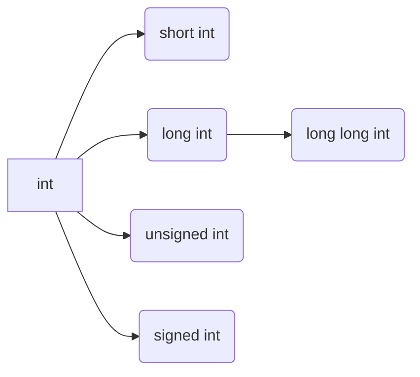
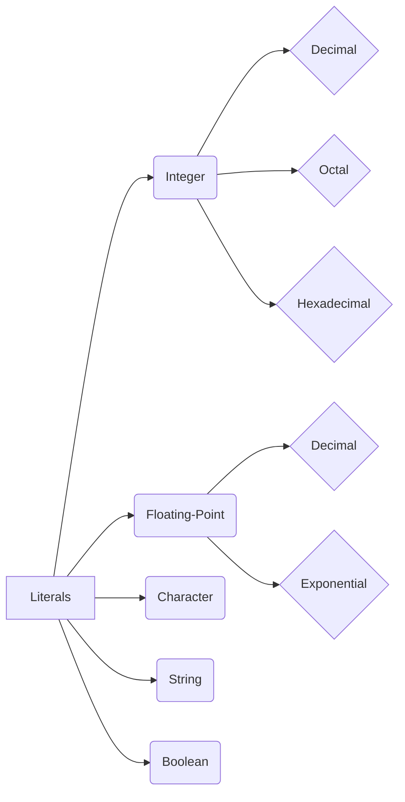
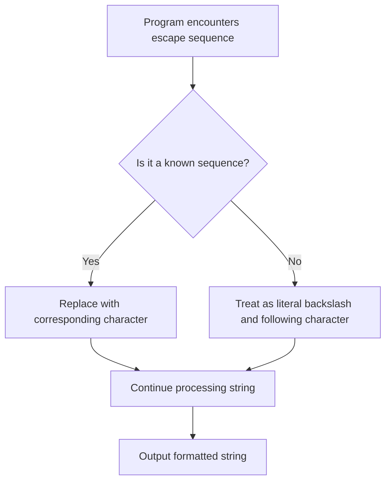
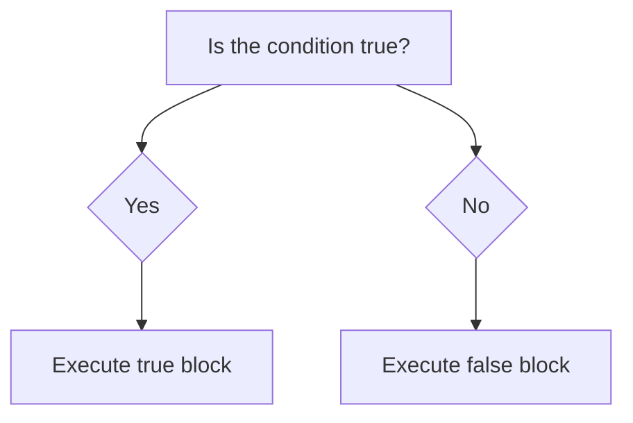
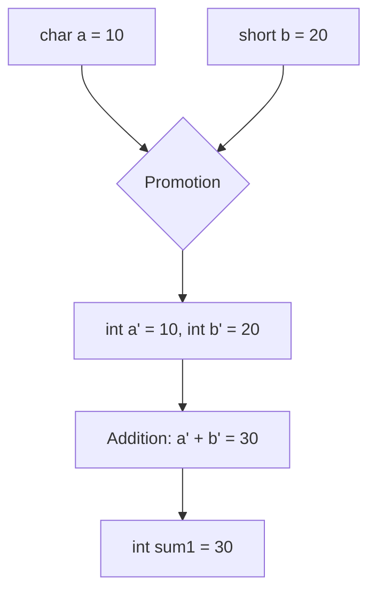
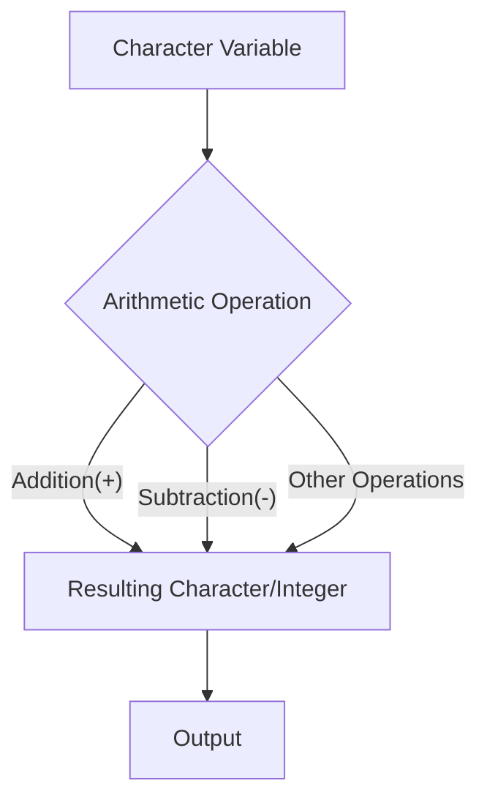
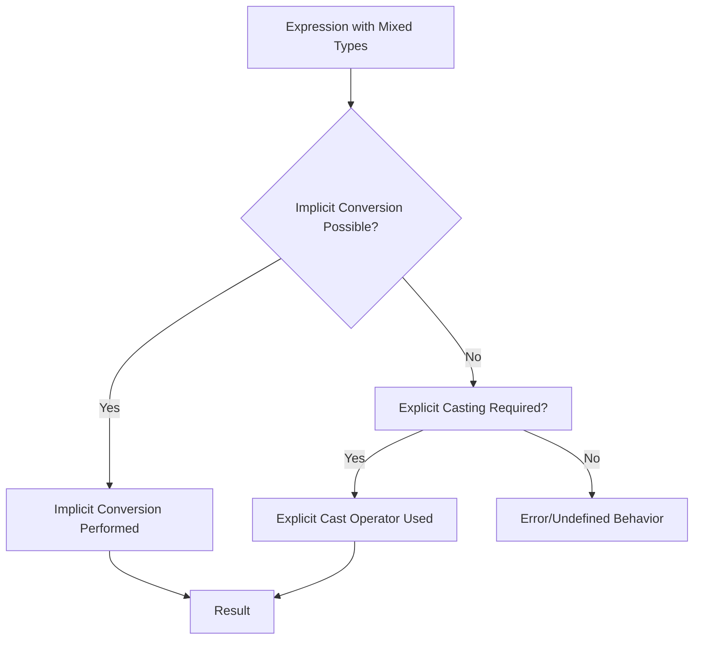
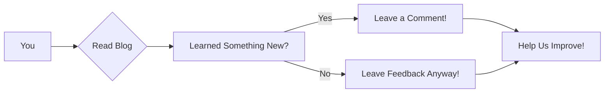

# <span style="color:#e67e22;">What we will learn in this post?</span>
<ul style='list-style-type: none; padding-left: 0;'>
<li><span style='color: #2980b9; font-size: 20px; font-weight: bold;'>👉</span> <span style='color: #2ecc71; font-size: 18px; font-weight: bold;'>Data Types in C</span></li>
<li><span style='color: #2980b9; font-size: 20px; font-weight: bold;'>👉</span> <span style='color: #2ecc71; font-size: 18px; font-weight: bold;'>Data Type Modifiers in C</span></li>
<li><span style='color: #2980b9; font-size: 20px; font-weight: bold;'>👉</span> <span style='color: #2ecc71; font-size: 18px; font-weight: bold;'>Literals in C</span></li>
<li><span style='color: #2980b9; font-size: 20px; font-weight: bold;'>👉</span> <span style='color: #2ecc71; font-size: 18px; font-weight: bold;'>Escape Sequence in C</span></li>
<li><span style='color: #2980b9; font-size: 20px; font-weight: bold;'>👉</span> <span style='color: #2ecc71; font-size: 18px; font-weight: bold;'>bool in C</span></li>
<li><span style='color: #2980b9; font-size: 20px; font-weight: bold;'>👉</span> <span style='color: #2ecc71; font-size: 18px; font-weight: bold;'>Integer Promotions in C</span></li>
<li><span style='color: #2980b9; font-size: 20px; font-weight: bold;'>👉</span> <span style='color: #2ecc71; font-size: 18px; font-weight: bold;'>Character Arithmetic in C</span></li>
<li><span style='color: #2980b9; font-size: 20px; font-weight: bold;'>👉</span> <span style='color: #2ecc71; font-size: 18px; font-weight: bold;'>Type Conversion in C</span></li>
<li><span style='color: #2980b9; font-size: 20px; font-weight: bold;'>👉</span> <span style='color: #2ecc71; font-size: 18px; font-weight: bold;'>Conclusion!</span></li>
</ul>

# <span style="color:#e67e22">C Data Types Explained 👨‍💻</span>

This guide will walk you through the fundamental data types in the C programming language.  We'll cover their uses, sizes (which can vary slightly depending on your system's architecture), and provide illustrative examples.


## <span style="color:#2980b9">Basic Data Types 🧱</span>

These are the building blocks of most C programs.

### <span style="color:#8e44ad">`int` (Integer) 🔢</span>

*   **Purpose:** Stores whole numbers (without decimal points).
*   **Size:** Typically 4 bytes (32 bits)  on most systems, but can be 2 bytes (16 bits) on some older systems.  This means it can hold numbers from approximately -2 billion to +2 billion.
*   **Example:**

```c
#include <stdio.h>
#include <limits.h> // For INT_MAX and INT_MIN

int main() {
  int age = 30;
  printf("My age is: %d\n", age); // Output: My age is: 30
  printf("Maximum int value: %d\n", INT_MAX); //Output: Maximum int value: 2147483647
  printf("Minimum int value: %d\n", INT_MIN); //Output: Minimum int value: -2147483648
  return 0;
}
```

### <span style="color:#8e44ad">`float` (Floating-Point) 🌊</span>

*   **Purpose:** Stores numbers with decimal points (single precision).
*   **Size:** Typically 4 bytes (32 bits). Offers less precision than `double`.
*   **Example:**

```c
#include <stdio.h>

int main() {
  float price = 99.99;
  printf("The price is: %.2f\n", price); // Output: The price is: 99.99
  return 0;
}
```

### <span style="color:#8e44ad">`double` (Double-Precision Floating-Point) ToDouble</span>

*   **Purpose:** Stores numbers with decimal points (double precision).  Provides higher precision than `float`.
*   **Size:** Typically 8 bytes (64 bits).
*   **Example:**

```c
#include <stdio.h>

int main() {
  double pi = 3.14159265358979323846;
  printf("The value of pi is approximately: %.15f\n", pi); // Output: The value of pi is approximately: 3.141592653589793
  return 0;
}
```

### <span style="color:#8e44ad">`char` (Character) 🔤</span>

*   **Purpose:** Stores a single character.
*   **Size:** Typically 1 byte (8 bits).  Each character is represented by a numerical ASCII code.
*   **Example:**

```c
#include <stdio.h>

int main() {
  char initial = 'J';
  printf("My initial is: %c\n", initial); // Output: My initial is: J
  return 0;
}
```


## <span style="color:#2980b9">Modified Data Types  ⚙️</span>

We can modify the basic types to control their size and signedness.

*   `short int`:  Usually 2 bytes.
*   `long int`: Usually 4 or 8 bytes (depending on the system).
*   `long long int`: Usually 8 bytes.
*   `unsigned int`:  Only stores positive integers (and zero).  It doubles the maximum positive value compared to a `signed int`.
*   `signed int`:  (default) Can store both positive and negative integers.


## <span style="color:#2980b9">Data Type Size Summary 📊</span>


| Data Type      | Size (bytes) (Typical) | Range                                      |
|-----------------|-----------------------|----------------------------------------------|
| `char`          | 1                      | -128 to 127 (signed) or 0 to 255 (unsigned) |
| `short int`     | 2                      | -32,768 to 32,767 (signed)                  |
| `int`           | 4                      | -2,147,483,648 to 2,147,483,647 (signed)     |
| `long int`      | 4 or 8                 | Varies significantly depending on the system |
| `long long int` | 8                      | Very large range                             |
| `float`         | 4                      | Approximately ±3.4 x 10<sup>38</sup>         |
| `double`        | 8                      | Approximately ±1.7 x 10<sup>308</sup>        |


**Note:**  The sizes and ranges shown above are typical but might vary depending on the compiler and the operating system you're using.  Always use `sizeof()` operator to get the exact size on your system if precision is crucial.


Remember to always choose the most appropriate data type for your variables based on the expected range and precision of the values they will hold.  Using the wrong type can lead to errors like integer overflow or loss of precision.


# <span style="color:#e67e22">Understanding C Data Type Modifiers 🧮</span>

C programming offers a flexible way to manage data through *data type modifiers*.  These modifiers fine-tune the size and properties of fundamental data types like `int`, `char`, and `float`. Let's explore the common modifiers: `short`, `long`, `signed`, and `unsigned`.

## <span style="color:#2980b9">Size Modifiers: `short` and `long`📏</span>

These modifiers control the amount of memory allocated to a variable, impacting the range of values it can hold.

### <span style="color:#8e44ad">`short` Modifier</span>

The `short` modifier generally reduces the size of an integer type (`short int` or just `short`).  It typically uses less memory than a standard `int`.

*Example:*

```c
#include <stdio.h>
#include <limits.h>

int main() {
  short int shortVar = 32767; // Maximum value for a short int on many systems
  printf("Size of short int: %zu bytes\n", sizeof(shortVar)); //Output: Size of short int: 2 bytes
  printf("Maximum short int value: %d\n", SHRT_MAX); //Output: Maximum short int value: 32767
  printf("Minimum short int value: %d\n", SHRT_MIN); //Output: Minimum short int value: -32768

  return 0;
}
```


### <span style="color:#8e44ad">`long` Modifier</span>

The `long` modifier increases the size of an integer type (`long int` or `long`) and floating-point types (`long double`). This expands the range of values it can store.

*Example:*

```c
#include <stdio.h>
#include <limits.h>

int main() {
  long int longVar = 2147483647; // Maximum value for a long int on many systems
  printf("Size of long int: %zu bytes\n", sizeof(longVar)); //Output: Size of long int: 4 bytes
  printf("Maximum long int value: %ld\n", LONG_MAX); //Output: Maximum long int value: 2147483647
  printf("Minimum long int value: %ld\n", LONG_MIN); //Output: Minimum long int value: -2147483648
  return 0;
}
```

## <span style="color:#2980b9">Sign Modifiers: `signed` and `unsigned` ➕➖</span>

These modifiers determine whether a variable can hold negative values.

### <span style="color:#8e44ad">`signed` Modifier (Default)</span>

The `signed` modifier (often implicit) indicates that a variable can store both positive and negative values.  This is the default behavior for `int`, `char`, and `short`.

### <span style="color:#8e44ad">`unsigned` Modifier</span>

The `unsigned` modifier restricts a variable to only non-negative values (0 and positive). This doubles the positive range at the cost of losing the ability to represent negative numbers.

*Example:*

```c
#include <stdio.h>
#include <limits.h>

int main() {
  unsigned int unsignedVar = 4294967295; // Maximum value for an unsigned int on many systems
  printf("Size of unsigned int: %zu bytes\n", sizeof(unsignedVar)); //Output: Size of unsigned int: 4 bytes
  printf("Maximum unsigned int value: %u\n", UINT_MAX); //Output: Maximum unsigned int value: 4294967295
  printf("Minimum unsigned int value: %u\n", 0); //Output: Minimum unsigned int value: 0
  return 0;
}
```

## <span style="color:#2980b9">Data Type Size Summary 📊</span>

The actual size of data types can vary slightly depending on the compiler and the system architecture (32-bit vs. 64-bit).  However, the general relationships between the modifiers remain consistent.




This diagram illustrates how `short` and `long` modify the base `int` type.  `signed` and `unsigned` similarly affect all integer types.


**Key takeaway:** Choosing the appropriate modifiers is crucial for efficient memory usage and avoiding potential overflow errors.  Understanding the implications of each modifier allows for writing robust and optimized C code.


# <span style="color:#e67e22">Literals in C Programming 🧮</span>


Literals in C are constant values that are directly written into the source code.  They represent fixed data that the program uses during execution. Think of them as the raw ingredients of your program!


## <span style="color:#2980b9">Integer Literals 🔢</span>

Integer literals represent whole numbers without any fractional part. They can be expressed in decimal, octal (base-8), or hexadecimal (base-16) format.

### <span style="color:#8e44ad">Decimal Literals</span>

These are the most common type of integer literal. They are written as a sequence of digits (0-9).

*   **Example:**
    ```c
    int age = 30; // age is assigned the decimal literal 30
    // Output: age = 30
    ```

### <span style="color:#8e44ad">Octal Literals</span>

Octal literals are represented by a leading `0` followed by digits (0-7).

*   **Example:**
    ```c
    int octalNum = 017; // octal literal representing decimal 15
    // Output: octalNum = 15
    ```

### <span style="color:#8e44ad">Hexadecimal Literals</span>

Hexadecimal literals begin with `0x` or `0X` followed by digits (0-9) and letters (a-f or A-F).  'a' to 'f' represent 10 to 15 respectively.

*   **Example:**
    ```c
    int hexNum = 0x1A; // hexadecimal literal representing decimal 26
    // Output: hexNum = 26
    ```


## <span style="color:#2980b9">Floating-Point Literals 📊</span>

Floating-point literals represent numbers with fractional parts. They can be written in either decimal or exponential notation.

*   **Example (Decimal):**
    ```c
    float pi = 3.14159;  // Decimal notation
    // Output: pi = 3.14159
    ```

*   **Example (Exponential):**
    ```c
    double avogadro = 6.022e23; // 6.022 x 10^23
    // Output: avogadro = 6.022e+23
    ```


## <span style="color:#2980b9">Character Literals 🔤</span>

Character literals represent single characters enclosed in single quotes (`'...'`).  Special escape sequences can be used to represent non-printable characters.

*   **Example:**
    ```c
    char initial = 'J';
    char newline = '\n'; // newline character
    // Output: initial = J, newline = (a newline)
    ```

*Escape Sequences:*

| Escape Sequence | Description          |
|-----------------|----------------------|
| `\n`            | Newline              |
| `\t`            | Horizontal Tab       |
| `\b`            | Backspace            |
| `\\`            | Backslash            |
| `\'`            | Single quote         |
| `\"`            | Double quote         |


## <span style="color:#2980b9">String Literals 📜</span>

String literals are sequences of characters enclosed in double quotes (`"..."`).  They are actually arrays of characters, terminated by a null character (`\0`).

*   **Example:**
    ```c
    char* message = "Hello, world!";
    // Output: message = Hello, world!
    ```


## <span style="color:#2980b9">Boolean Literals 🚦</span>

Boolean literals represent truth values.  In C, they are typically represented by integers: 0 for *false* and any non-zero value for *true*.  (Note:  C doesn't have a dedicated `bool` type until C99).

*   **Example:**
    ```c
    int isAdult = 1; // true
    int isMinor = 0; // false
    // Output: isAdult = 1, isMinor = 0
    ```


## <span style="color:#2980b9">Summary Diagram</span>



This comprehensive guide provides a clear understanding of different literal types in C, along with illustrative examples and a visual summary. Remember to practice using these literals in your own C programs to solidify your understanding!


# <span style="color:#e67e22">Escape Sequences in C: A Beginner's Guide 🎉</span>

Escape sequences in C are special character combinations that allow you to represent characters that are difficult or impossible to type directly.  They begin with a backslash (`\`), followed by one or more characters.  Think of them as secret codes for your compiler! 🤫


## <span style="color:#2980b9">Why Use Escape Sequences? 🤔</span>

*   **Representing Special Characters:**  Some characters have special meanings in C, like the newline character (`\n`) which moves the cursor to the next line.  Escape sequences allow you to include these characters within your strings without causing unexpected behavior.
*   **Improving Readability:** Escape sequences make your code easier to understand, especially when dealing with characters that aren't easily typed, like tabs or quotes.
*   **Controlling Formatting:** Escape sequences give you fine-grained control over the formatting of your output, enabling you to create nicely structured text.

## <span style="color:#2980b9">Common Escape Sequences 📚</span>

Here's a table summarizing some frequently used escape sequences:

| Escape Sequence | Description                                  | Example             | Output                               |
|-----------------|----------------------------------------------|----------------------|---------------------------------------|
| `\n`            | Newline (moves cursor to the next line)     | `printf("Hello\nWorld");` | `Hello <br>World`                  |
| `\t`            | Horizontal tab (moves cursor to the next tab stop) | `printf("Name:\tJohn");`     | `Name:	John`                       |
| `\\`            | Backslash                                     | `printf("C:\\Users");`    | `C:\Users`                          |
| `\"`            | Double quote                                 | `printf("He said \"Hello\"");` | `He said "Hello"`                   |
| `\'`            | Single quote                                 | `printf("It's a 'day'");`   | `It's a 'day'`                      |
| `\0`            | Null character (end of string)               | `char str[] = "Hello\0";` |  "Hello" (the \0 terminates the string)|
| `\a`            | Alert (makes a beep sound)                   | `printf("\a");`         | (Beep sound)                         |
| `\r`            | Carriage return (moves cursor to the beginning of the line) | `printf("Hello\rWorld");` | `World` (overwrites "Hello")       |


### <span style="color:#8e44ad">Example: Using Escape Sequences in Strings</span>

```c
#include <stdio.h>

int main() {
    printf("This is a line.\n"); // Newline character
    printf("This\tis\ta\ttabbed\tline.\n"); // Tab characters
    printf("This string contains a \\ backslash.\n"); // Backslash
    printf("This string contains a \" double quote.\n"); // Double quote
    printf("This string contains a \' single quote.\n"); // Single quote
    return 0;
}
```

```
//Output:
//This is a line.
//This	is	a	tabbed	line.
//This string contains a \ backslash.
//This string contains a " double quote.
//This string contains a ' single quote.
```


## <span style="color:#2980b9">Illustrative Mermaid Flowchart 🌊</span>



This flowchart shows how the C compiler handles escape sequences during string processing.  If the sequence is recognized, it's replaced; otherwise, it's treated literally.


Remember that proper use of escape sequences is crucial for writing clear, functional, and well-formatted C code.  Mastering them will elevate your C programming skills! 🚀


# <span style="color:#e67e22">Understanding the `bool` Data Type in C 💡</span>

The `bool` data type in C represents boolean values – essentially, *true* or *false*.  While not part of the original C standard, it was officially added in **C99**  and provides a more readable and maintainable way to handle logical conditions compared to using integers (0 for false, non-zero for true).

## <span style="color:#2980b9">Introducing the `bool` Type 🤔</span>

Before C99, programmers relied on integers (typically `int`) to represent boolean values.  This could lead to less clear code.  `bool` improves this situation significantly.

### <span style="color:#8e44ad">Declaration and Initialization ✍️</span>

To use `bool`, you need to include the `<stdbool.h>` header file.  Here's how you declare and initialize `bool` variables:

```c
#include <stdbool.h>

int main() {
  bool isAdult;           // Declaration
  bool isRaining = true;  // Initialization to true
  bool isSunny = false;   // Initialization to false

  return 0;
}
```

### <span style="color:#8e44ad">Values and Representation 🔢</span>

*   `true` is represented by a non-zero value (usually 1).
*   `false` is represented by 0.

Although you can technically assign other integer values to a `bool` variable, only 0 will evaluate to `false`, and any other value will be treated as `true`.  It is recommended to use only `true` and `false` directly for better code clarity.

## <span style="color:#2980b9">Using `bool` in Conditional Statements 🚦</span>

`bool` variables are particularly useful in conditional statements (`if`, `else if`, `while`, etc.).

```c
#include <stdbool.h>
#include <stdio.h>

int main() {
  bool hasPassed = true;
  if (hasPassed) {
    printf("Congratulations! You passed the exam. 🎉\n");
  } else {
    printf("Better luck next time! 🍀\n");
  }
  return 0;
}
```

//This code will print "Congratulations! You passed the exam. 🎉" because `hasPassed` is `true`.


## <span style="color:#2980b9">Boolean Operators ➕➖✖️➗</span>

C provides standard boolean operators that work seamlessly with the `bool` type:

*   `&&` (logical AND):  `true` only if both operands are `true`.
*   `||` (logical OR):  `true` if at least one operand is `true`.
*   `!` (logical NOT): Reverses the boolean value.


```c
#include <stdbool.h>
#include <stdio.h>

int main() {
  bool a = true;
  bool b = false;

  bool resultAnd = a && b;   // false
  bool resultOr = a || b;    // true
  bool resultNotA = !a;     // false

  printf("a && b: %s\n", resultAnd ? "true" : "false");
  printf("a || b: %s\n", resultOr ? "true" : "false");
  printf("!a: %s\n", resultNotA ? "true" : "false");

  return 0;
}
```

//This will output the results of the logical operations using a ternary operator for concise output.

## <span style="color:#2980b9">Benefits of Using `bool` 👍</span>

*   **Improved Code Readability:**  Makes the code easier to understand, especially in complex logical situations.
*   **Enhanced Maintainability:** Easier to modify and debug because the intent is clearer.
*   **Type Safety:**  Helps prevent accidental use of incorrect values in boolean contexts.


## <span style="color:#2980b9">Flowchart Illustrating a Boolean Decision</span>



This flowchart shows a basic `if` statement using a boolean condition.


By using the `bool` data type effectively, you write cleaner, more understandable, and maintainable C code, adhering to modern C standards like C99 and beyond. Remember to always include `<stdbool.h>` when working with boolean variables.


# <span style="color:#e67e22">Integer Promotions in C 🧮</span>


## <span style="color:#2980b9">Understanding the Basics 💡</span>

C's integer promotion rules ensure that all operands involved in an arithmetic operation are of at least the `int` type. This prevents potential data loss and simplifies the compiler's job.  Smaller integer types like `char`, `short`, `unsigned char`, and `unsigned short` are *promoted* to `int` (or `unsigned int` if `int` cannot represent all values of the original type) before calculations.  This promotion happens *implicitly*, meaning you don't need to write special code for it.

### <span style="color:#8e44ad">Why Integer Promotion?</span>

* **Data Consistency:**  Ensures uniform behavior regardless of the original type of the operands.
* **Efficiency:** Allows the CPU to perform operations on a consistent data size.
* **Preventing Overflow:**  Expanding the size of smaller types reduces the chance of overflow errors.

## <span style="color:#2980b9">The Promotion Process ⬆️</span>

The promotion process follows these steps:

1. **Type Check:** The compiler checks the type of each operand.
2. **Integral Promotion:** If an operand is smaller than `int`, it's promoted.  
3. **Unsigned Issue:** If the original type is unsigned and the promoted type (`int`) can't represent all its values, then the promoted type becomes `unsigned int`.
4. **Operation:** The arithmetic operation is performed using the promoted types.
5. **Potential Type Cast:** The result might be cast back to the original type if needed (this can lead to potential data loss).

## <span style="color:#2980b9">Illustrative Examples 💻</span>

Let's explore some examples to clarify the concept:

```c
#include <stdio.h>

int main() {
    char a = 10;        // 8-bit signed integer
    short b = 20;       // 16-bit signed integer
    int c = 30;         // 32-bit signed integer (usually)
    unsigned short d = 40; // 16-bit unsigned integer


    int sum1 = a + b;   // a and b promoted to int before addition
    int sum2 = a + d;   // a and d promoted, d to unsigned int, then a result of unsigned int is stored in int, leading to a potential warning by compiler.

    printf("sum1: %d\n", sum1); // Output: sum1: 30
    printf("sum2: %d\n", sum2); // Output: sum2: 50

    unsigned int result = a + d;
    printf("Result: %u\n", result); // Output: Result: 50

    return 0;
}
```


### <span style="color:#8e44ad">Example Breakdown</span>

* In `sum1`, both `a` (char) and `b` (short) are promoted to `int` before the addition.
* In `sum2`, `a` is promoted to `int` and `d` is promoted to `unsigned int`. The operation is then performed with unsigned ints, resulting in an unsigned int, which is then implicitly cast to a signed int.


## <span style="color:#2980b9">Visual Representation 📊</span>



This diagram shows the promotion of `char` and `short` to `int` before the addition operation.


## <span style="color:#2980b9">Important Considerations 🤔</span>

* **Overflow:**  Be cautious of potential overflow issues when dealing with unsigned integers and implicit type conversions.
* **Compiler behavior:** The exact behavior of integer promotion might vary slightly depending on your compiler and the target architecture (e.g., 64-bit vs. 32-bit).
* **Explicit Casting:** For better control, use explicit type casting (`(int)`) to ensure you get the desired result.


By understanding integer promotions, you can write more robust and predictable C code.  Remember to always be mindful of potential data loss and overflow situations resulting from these implicit conversions!


# <span style="color:#e67e22">Character Arithmetic in C: A Fun Dive! 🎉</span>

In C, characters aren't just letters or symbols; they're secretly *integers* in disguise!  This means you can perform arithmetic operations on them, leading to some interesting results. Let's explore this fascinating aspect of C programming.

## <span style="color:#2980b9">Character Representation: The Secret Code 🤫</span>

Every character is assigned a unique numerical value based on a character encoding scheme, most commonly ASCII (American Standard Code for Information Interchange).  For example:

* 'A' is usually represented as 65.
* 'a' is usually represented as 97.
* '0' is usually represented as 48.


This means that when you use a character in an arithmetic expression, C uses its underlying integer value.


### <span style="color:#8e44ad">ASCII Table Snippet 🔍</span>

A small portion of the ASCII table illustrates this concept:

| Character | ASCII Value |
|---|---|
| 'A' | 65 |
| 'B' | 66 |
| 'a' | 97 |
| 'b' | 98 |
| '0' | 48 |
| '1' | 49 |


## <span style="color:#2980b9">Arithmetic Operations on Characters ✨</span>

Let's see character arithmetic in action!

```c
#include <stdio.h>

int main() {
  char ch1 = 'A'; // 65
  char ch2 = 'a'; // 97
  char ch3 = '5'; // 53

  // Addition
  char sum1 = ch1 + 1;  // Adding 1 to 'A' gives 'B'
  printf("Adding 1 to 'A': %c \n", sum1); // Output: Adding 1 to 'A': B

  // Subtraction
  char diff = ch2 - ch1; // Difference between 'a' and 'A' is 32
  printf("Difference between 'a' and 'A': %d \n", diff); //Output: Difference between 'a' and 'A': 32

  // Converting digits to integers
  int digit = ch3 - '0'; // Convert character '5' to integer 5
  printf("Character '5' as an integer: %d \n", digit); // Output: Character '5' as an integer: 5

  return 0;
}
```

**Note:** Be cautious!  Adding or subtracting beyond the range of printable characters may lead to unexpected results (e.g., non-printable characters or wrap-around).


## <span style="color:#2980b9">Illustrative Flowchart 📊</span>



## <span style="color:#2980b9">Important Considerations 🤔</span>

* **Data Type:** Remember that the result of arithmetic operations on `char` variables might be implicitly promoted to `int` in some situations.  Explicit casting might be necessary for accurate results in certain scenarios.
* **ASCII Dependence:** The numerical values of characters are based on the encoding scheme (usually ASCII).  Different encodings (e.g., UTF-8) will have different numerical assignments.
* **Overflow and Underflow:**  Adding or subtracting beyond the range of a `char` variable can result in unexpected behavior due to integer overflow or underflow.

This exploration demonstrates the flexibility and power of C, allowing you to manipulate characters numerically for various programming tasks.  Remember to understand these nuances to write effective and predictable C code.


# <span style="color:#e67e22">Type Conversion in C 🔄</span>


Type conversion, also known as *casting*, is the process of changing a variable from one data type to another.  This is crucial in C because it allows you to perform operations involving different data types, but it's important to do it correctly to avoid unexpected results.  There are two main ways type conversion happens: implicitly and explicitly.


## <span style="color:#2980b9">Implicit Type Conversion (Automatic 🪄)</span>


Implicit type conversion happens automatically by the compiler *without* you explicitly telling it to do so. The compiler will often promote a "smaller" type to a "larger" type to prevent data loss and ensure accurate calculations.


### <span style="color:#8e44ad">When it Occurs</span>

Implicit conversions typically occur in expressions involving mixed data types.  For instance, if you add an `int` and a `float`, the `int` will be implicitly converted to a `float` before the addition takes place.


### <span style="color:#8e44ad">Examples</span>

* **Example 1:** Adding an integer and a floating-point number.

```c
#include <stdio.h>

int main() {
  int a = 5;
  float b = 2.5;
  float sum = a + b; // a is implicitly converted to float
  printf("Sum: %f\n", sum); // Output: Sum: 7.500000
  return 0;
}
```

* **Example 2:** Assigning an integer to a floating-point variable.

```c
#include <stdio.h>

int main() {
  int x = 10;
  float y = x; // x is implicitly converted to float
  printf("Value of y: %f\n", y); //Output: Value of y: 10.000000
  return 0;
}
```

**Note:** Implicit conversions can sometimes lead to unexpected results if not carefully considered, especially when dealing with potential truncation (loss of fractional part) or overflow (exceeding the range of the target type).


## <span style="color:#2980b9">Explicit Type Conversion (Casting 💪)</span>


Explicit type conversion, or casting, is when you *explicitly* tell the compiler to change a variable's data type using a *cast operator*. The general syntax is `(type) expression`.


### <span style="color:#8e44ad">When to Use It</span>

You'll use explicit casting when:

* You need to convert a variable to a different type for a specific operation.
* You want to control the conversion process to avoid potential problems.
* You're working with functions that require specific data types.

### <span style="color:#8e44ad">Examples</span>

* **Example 1:** Converting a `float` to an `int`.

```c
#include <stdio.h>

int main() {
  float pi = 3.14159;
  int int_pi = (int)pi; // Explicitly cast pi to an integer
  printf("Integer part of pi: %d\n", int_pi); //Output: Integer part of pi: 3
  return 0;
}
```

* **Example 2:** Converting a `char` to an `int`.

```c
#include <stdio.h>

int main() {
    char c = 'A';
    int ascii_value = (int)c;
    printf("ASCII value of 'A': %d\n", ascii_value); // Output: ASCII value of 'A': 65
    return 0;
}
```

**Note:** Be mindful of potential data loss when explicitly casting, especially when converting from a larger type to a smaller type (e.g., `float` to `int`).


## <span style="color:#2980b9">Type Conversion Flowchart 📊</span>




This flowchart summarizes the decision-making process involved in type conversions in C.  Remember to always be aware of potential pitfalls and choose the appropriate method for your specific scenario.  Careful consideration of data types and their limitations is key to writing robust and error-free C code.


<h1><span style='color:#e67e22'>Conclusion</span></h1>

And there you have it! 🎉 We've covered a lot of ground today, from [briefly mention topic 1] to [briefly mention topic 2], and hopefully, you've learned something new and exciting!  This information should help you [mention the key benefit of reading the blog].


## <span style="color:#2980b9">Your Thoughts Matter! 🤔</span>

We'd love to hear your thoughts on this topic! Did you find this helpful? Do you have any suggestions for future blog posts?  Maybe you have a different perspective or a valuable piece of advice to share?  Your feedback is incredibly important to us and helps us improve and create even better content.


### <span style="color:#8e44ad">Share Your Input! 🗣️</span>

*   **What did you find most useful?**  Let us know in the comments!
*   **What questions do you still have?** We're happy to answer them!
*   **What topics would you like us to cover next?**  Your ideas are always welcome!

Don't be shy!  Head down to the comments section below and let your voice be heard.  We can't wait to hear from you! 👇




Remember, even a quick comment like "Great post!" or "This helped me a lot!" goes a long way! ❤️  We appreciate your engagement and look forward to continuing this conversation with you.  See you in the comments!


