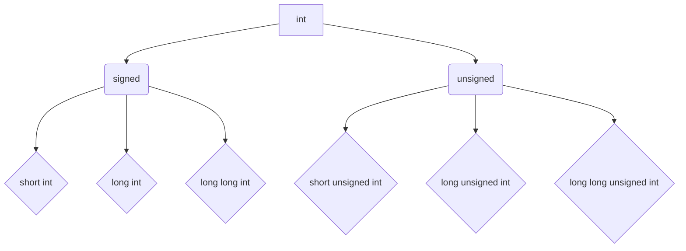
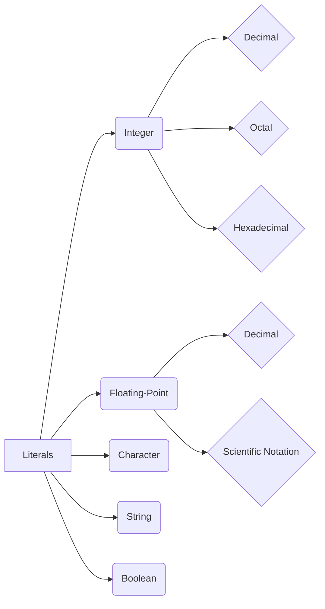
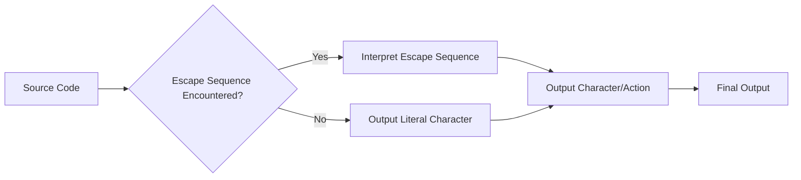
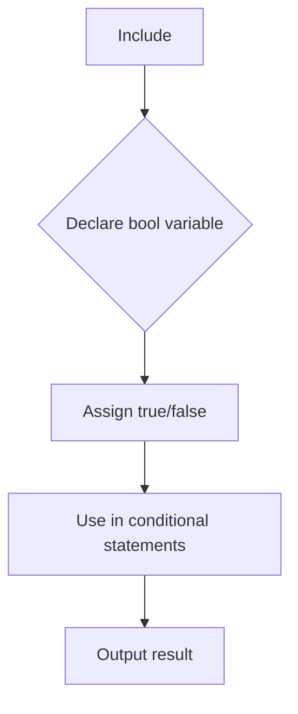
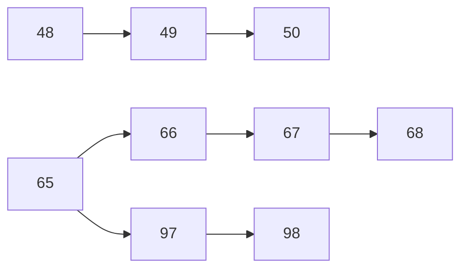
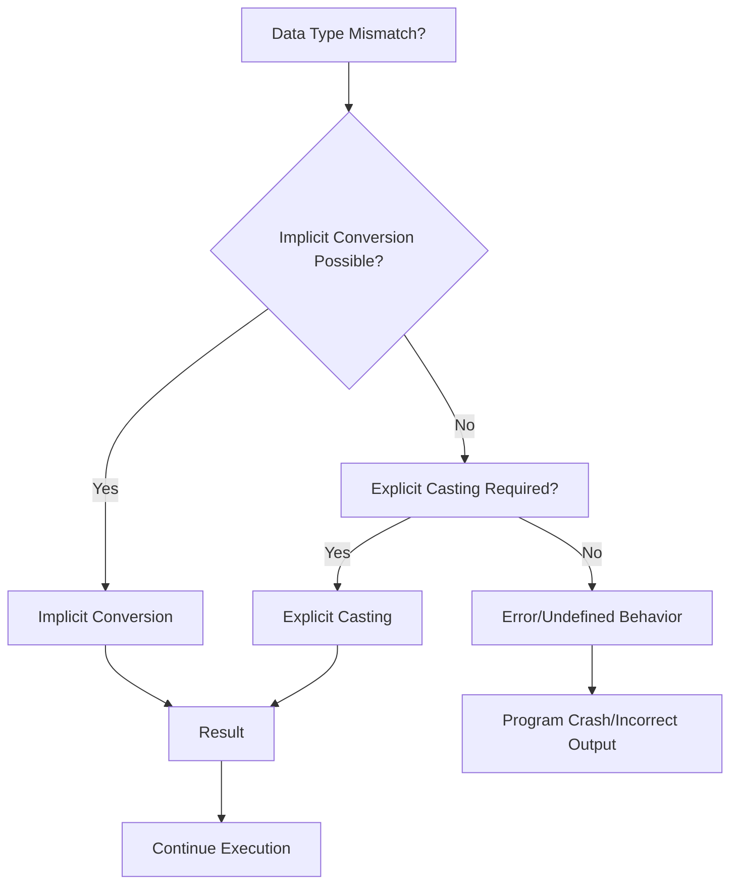
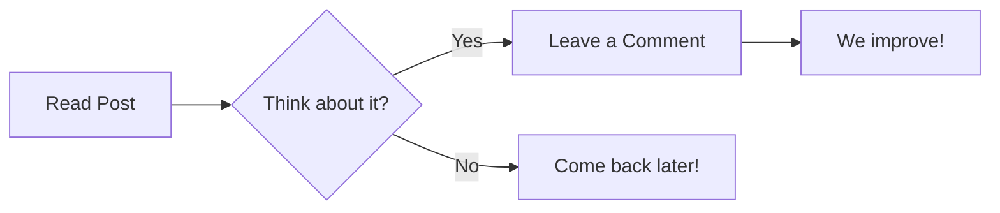

# <span style="color:#e67e22;">What we will learn in this post?</span>
<ul style='list-style-type: none; padding-left: 0;'>
<li><span style='color: #2980b9; font-size: 20px; font-weight: bold;'>👉</span> <span style='color: #2ecc71; font-size: 18px; font-weight: bold;'>Data Types in C</span></li>
<li><span style='color: #2980b9; font-size: 20px; font-weight: bold;'>👉</span> <span style='color: #2ecc71; font-size: 18px; font-weight: bold;'>Data Type Modifiers in C</span></li>
<li><span style='color: #2980b9; font-size: 20px; font-weight: bold;'>👉</span> <span style='color: #2ecc71; font-size: 18px; font-weight: bold;'>Literals in C</span></li>
<li><span style='color: #2980b9; font-size: 20px; font-weight: bold;'>👉</span> <span style='color: #2ecc71; font-size: 18px; font-weight: bold;'>Escape Sequence in C</span></li>
<li><span style='color: #2980b9; font-size: 20px; font-weight: bold;'>👉</span> <span style='color: #2ecc71; font-size: 18px; font-weight: bold;'>bool in C</span></li>
<li><span style='color: #2980b9; font-size: 20px; font-weight: bold;'>👉</span> <span style='color: #2ecc71; font-size: 18px; font-weight: bold;'>Integer Promotions in C</span></li>
<li><span style='color: #2980b9; font-size: 20px; font-weight: bold;'>👉</span> <span style='color: #2ecc71; font-size: 18px; font-weight: bold;'>Character Arithmetic in C</span></li>
<li><span style='color: #2980b9; font-size: 20px; font-weight: bold;'>👉</span> <span style='color: #2ecc71; font-size: 18px; font-weight: bold;'>Type Conversion in C</span></li>
<li><span style='color: #2980b9; font-size: 20px; font-weight: bold;'>👉</span> <span style='color: #2ecc71; font-size: 18px; font-weight: bold;'>Conclusion!</span></li>
</ul>

# <span style="color:#e67e22">C Data Types 🧮</span>

This guide introduces the fundamental data types in the C programming language. We'll explore their uses, sizes, and provide illustrative examples.  Remember that the exact size of data types might vary slightly depending on the compiler and the system architecture (32-bit vs. 64-bit).

## <span style="color:#2980b9">Basic Data Types ✨</span>

These are the building blocks of C programming.  They represent different kinds of information your program can handle.

### <span style="color:#8e44ad">Integer Types (int, short, long, long long)</span>

Integer types store whole numbers (no decimal points).  Their sizes determine the range of numbers they can hold.

*   `int`:  A standard integer. Typically 4 bytes (32 bits) on most systems.
    *   Example: `int age = 30;`  // *Output:* `age` stores the value 30.
    *   Size:  `sizeof(int)` // *Output (likely):* 4 bytes

*   `short`: A smaller integer. Typically 2 bytes (16 bits).
    *   Example: `short smallNum = 100;` // *Output:* `smallNum` stores the value 100.
    *   Size: `sizeof(short)` // *Output (likely):* 2 bytes

*   `long`: A larger integer. Typically 4 bytes (32 bits) on some systems, 8 bytes (64 bits) on others.
    *   Example: `long bigNum = 1234567890;` // *Output:* `bigNum` stores the value 1234567890.
    *   Size: `sizeof(long)` // *Output (likely):* 4 or 8 bytes

*   `long long`: The largest integer type. Typically 8 bytes (64 bits).
    *   Example: `long long veryBigNumber = 9223372036854775807;` // *Output:* `veryBigNumber` stores the maximum value for a long long.
    *   Size: `sizeof(long long)` // *Output (likely):* 8 bytes


### <span style="color:#8e44ad">Floating-Point Types (float, double, long double)</span>

Floating-point types store numbers with decimal points (real numbers).  The `double` and `long double` provide higher precision.

*   `float`: Single-precision floating-point. Typically 4 bytes (32 bits).
    *   Example: `float price = 99.99;` // *Output:* `price` stores the value 99.99.
    *   Size: `sizeof(float)` // *Output (likely):* 4 bytes

*   `double`: Double-precision floating-point. Typically 8 bytes (64 bits). More precise than `float`.
    *   Example: `double pi = 3.14159265359;` // *Output:* `pi` stores the value 3.14159265359.
    *   Size: `sizeof(double)` // *Output (likely):* 8 bytes

*   `long double`: Extended-precision floating-point.  Size varies depending on the system (often 10 or 16 bytes).
    *   Example: `long double veryPreciseNum = 1.2345678901234567890;`  // *Output:* `veryPreciseNum` stores the value 1.2345678901234567890.
    *   Size: `sizeof(long double)` // *Output (likely):* 10 or 16 bytes


### <span style="color:#8e44ad">Character Type (char)</span>

The `char` type stores a single character. It's typically 1 byte (8 bits).

*   Example: `char initial = 'J';` // *Output:* `initial` stores the character 'J'.
*   Size: `sizeof(char)` // *Output (likely):* 1 byte


## <span style="color:#2980b9">Modifiers 🛠️</span>

You can modify the basic types using keywords like `signed`, `unsigned`, and `short` and `long`.


*   `signed`:  Indicates that the variable can store both positive and negative values (default for `int`, `char`, etc.).
*   `unsigned`: Indicates that the variable can only store non-negative values (0 and positive).  This increases the maximum positive value the variable can hold.


## <span style="color:#2980b9">Example Program illustrating Data Types</span>


```c
#include <stdio.h>

int main() {
  int age = 30;
  float price = 99.99;
  char initial = 'A';
  long long bigNumber = 1234567890123456789;

  printf("Age: %d, Size of int: %lu bytes\n", age, sizeof(age));
  printf("Price: %.2f, Size of float: %lu bytes\n", price, sizeof(price));
  printf("Initial: %c, Size of char: %lu bytes\n", initial, sizeof(initial));
  printf("Big Number: %lld, Size of long long: %lu bytes\n", bigNumber, sizeof(bigNumber));

  return 0;
}
```


This program demonstrates the use of different data types and prints their sizes using `sizeof`.  The output will vary slightly depending on your system but will generally reflect the sizes mentioned above.


## <span style="color:#2980b9">Data Type Size Summary 📊</span>

| Data Type     | Typical Size (Bytes) | Range                                                              |
|---------------|-----------------------|----------------------------------------------------------------------|
| `char`        | 1                     | -128 to 127 (signed) or 0 to 255 (unsigned)                       |
| `short`       | 2                     | -32768 to 32767 (signed) or 0 to 65535 (unsigned)                   |
| `int`         | 4                     | -2147483648 to 2147483647 (signed) or 0 to 4294967295 (unsigned)     |
| `long`        | 4 or 8                | Varies by system                                                     |
| `long long`   | 8                     | -9223372036854775808 to 9223372036854775807 (signed) or 0 to 18446744073709551615 (unsigned) |
| `float`       | 4                     | Approximately ±3.4e±38                                              |
| `double`      | 8                     | Approximately ±1.7e±308                                             |
| `long double` | 10 or 16              | Varies by system                                                     |


This table provides a quick reference for the size and range of common C data types. Remember to always consider the potential range of values when choosing a data type for your variables.


# <span style="color:#e67e22">C Data Type Modifiers: Enhancing Your Variables ✨</span>


In C programming, you can modify the basic data types (like `int`, `char`, `double`) to fine-tune their size and range. This is done using *data type modifiers*.  Let's explore these modifiers and how they change the behavior of your variables.


## <span style="color:#2980b9">Understanding the Modifiers 🤔</span>

C offers four primary modifiers:

* **`short`**:  Reduces the size of the data type.  Usually, `short int` takes less memory than a regular `int`.
* **`long`**: Increases the size of the data type.  `long int` generally occupies more memory than a regular `int`.  You can even have a `long long int` for extra-large integers.
* **`signed`**: (Default for `int`, `char`) Specifies that the variable can store both positive and negative numbers.  The highest bit is used to represent the sign (+ or -).
* **`unsigned`**: Specifies that the variable can only store non-negative numbers (0 and positive). This means it can use the highest bit for representing the magnitude of the number, effectively doubling the maximum positive value compared to its signed counterpart.


### <span style="color:#8e44ad">Visualizing the Impact 📊</span>




## <span style="color:#2980b9">Examples and Explanations 💡</span>

Let's illustrate with examples.  Remember that the exact size of these types might vary slightly based on your compiler and system architecture (32-bit vs. 64-bit).

### <span style="color:#8e44ad">Integer Types 🔢</span>

```c
#include <stdio.h>
#include <limits.h> //For limits of integer types

int main() {
    short int short_var = 32767; //Maximum value for a short int on many systems
    long int long_var = 2147483647; // Maximum value for a long int on many systems (could vary)
    unsigned int unsigned_var = 4294967295; //Maximum value for unsigned int on many systems (could vary)

    printf("Size of short int: %zu bytes\n", sizeof(short_var)); //Output: Size of short int: 2 bytes
    printf("Size of long int: %zu bytes\n", sizeof(long_var)); //Output: Size of long int: 4 bytes (or 8 on 64-bit)
    printf("Size of unsigned int: %zu bytes\n", sizeof(unsigned_var)); //Output: Size of unsigned int: 4 bytes (or 8 on 64-bit)


    printf("Max short int: %d\n", SHRT_MAX); //Output: Max short int: 32767
    printf("Max long int: %ld\n", LONG_MAX); //Output: Max long int: 2147483647 (or larger on 64-bit)
    printf("Max unsigned int: %u\n", UINT_MAX); //Output: Max unsigned int: 4294967295 (or larger on 64-bit)

    return 0;
}
```

This code demonstrates the different sizes and maximum values of `short int`, `long int`, and `unsigned int`.  Note the use of `sizeof` to determine the size in bytes and the use of the `<limits.h>` header file for more precise max values.

### <span style="color:#8e44ad">Character Types 🔤</span>

```c
#include <stdio.h>

int main() {
    char signed_char = -128;
    unsigned char unsigned_char = 255;

    printf("Size of char: %zu bytes\n", sizeof(signed_char)); //Output: Size of char: 1 bytes
    printf("Signed char: %d\n", signed_char); //Output: Signed char: -128
    printf("Unsigned char: %u\n", unsigned_char); //Output: Unsigned char: 255

    return 0;
}
```

This showcases `signed char` and `unsigned char`.  `unsigned char` can store a larger range of positive values compared to `signed char` because it doesn't need a bit for a sign.

## <span style="color:#2980b9">Choosing the Right Modifier 🎯</span>

The choice of modifier depends on your specific needs:

* **Memory efficiency**: Use `short` when you know the variable won't need a large range.
* **Large values**: Use `long` or `long long` for very large numbers.
* **Non-negative values**: Use `unsigned` if you're certain your values will never be negative.  This increases the positive range.


By understanding and utilizing these modifiers effectively, you can write more efficient and precise C code! Remember to consult your compiler's documentation for precise sizes of data types on your specific system.


# <span style="color:#e67e22">Literals in C: A Comprehensive Guide 📖</span>


Literals in C are constant values that are directly written into the source code.  They represent fixed data that the compiler can directly understand. Think of them as the raw ingredients you use in your C "recipe".


## <span style="color:#2980b9">Integer Literals 🔢</span>


Integer literals represent whole numbers without any fractional part.  They can be written in different bases (decimal, octal, hexadecimal).

### <span style="color:#8e44ad">Decimal Literals</span>

These are the most common type, written using base-10 digits (0-9).

* Example:
```c
int age = 30; // age is assigned the decimal literal 30
```
*Output:* `30`


### <span style="color:#8e44ad">Octal Literals</span>

These are represented using base-8 (0-7) and are prefixed with a `0`.

* Example:
```c
int octalNum = 0377; // octal literal representing 255 in decimal
```
*Output:* `255`


### <span style="color:#8e44ad">Hexadecimal Literals</span>

These are base-16 (0-9, A-F) and are prefixed with `0x` or `0X`.

* Example:
```c
int hexNum = 0xFF; // hexadecimal literal representing 255 in decimal
```
*Output:* `255`


## <span style="color:#2980b9">Floating-Point Literals 📈</span>


Floating-point literals represent numbers with fractional parts. They can be written in decimal or scientific notation.


* Example (Decimal):
```c
float pi = 3.14159;
double gravity = 9.81;
```
*Output:* `3.14159`, `9.81`

* Example (Scientific Notation):
```c
float avogadro = 6.022e23; // 6.022 x 10^23
```
*Output:* `6.022e+23`


## <span style="color:#2980b9">Character Literals 🔤</span>


Character literals represent single characters enclosed within single quotes.


* Example:
```c
char initial = 'J';
```
*Output:* `J`


## <span style="color:#2980b9">String Literals 📜</span>


String literals represent sequences of characters enclosed within double quotes.  They are actually arrays of characters.


* Example:
```c
char* message = "Hello, world!";
```
*Output:* `Hello, world!`


## <span style="color:#2980b9">Boolean Literals ☑️</span> (C99 and later)

Boolean literals represent truth values.  `1` represents true and `0` represents false.  Although not a specific keyword for boolean in older versions of C, the integer representation is used.

* Example:
```c
int is_valid = 1; // True
int is_empty = 0; // False
```
*Output:* `1`, `0`


## <span style="color:#2980b9">Summary Diagram 📊</span>





This guide provides a clear and concise overview of literals in C, categorized by type with examples and outputs. Remember that understanding literals is fundamental to writing any C program! 🎉


# <span style="color:#e67e22">Escape Sequences in C: Unveiling Hidden Characters 🤫</span>


Escape sequences in C are special combinations of characters that represent actions or characters that can't be easily typed directly. They begin with a backslash (`\`), followed by one or more characters.  Think of them as secret codes that tell the compiler to do something specific.


## <span style="color:#2980b9">Why Use Escape Sequences? 🤔</span>

Escape sequences allow us to include characters that are difficult or impossible to type directly into our code, such as:

* **Newlines:** Moving the cursor to the next line.
* **Tabs:** Indenting text.
* **Backslashes:** Representing a literal backslash character.
* **Quotes:**  Including double quotes (`"`) or single quotes (`'`) within a string literal.


## <span style="color:#2980b9">Common Escape Sequences ⌨️</span>

Here's a table summarizing some frequently used escape sequences:


| Escape Sequence | Description                      | Example                     | Output                               |
|-----------------|----------------------------------|------------------------------|---------------------------------------|
| `\n`            | Newline (moves to next line)     | `printf("Hello\nWorld!");`   | `Hello <br> World!`                 |
| `\t`            | Horizontal tab                   | `printf("Name:\tJohn");`      | `Name:	John`                       |
| `\\`            | Backslash                        | `printf("C:\\Program Files");` | `C:\Program Files`                  |
| `\"`            | Double quote                     | `printf("He said \"Hello\"");` | `He said "Hello"`                   |
| `\'`            | Single quote                     | `printf("It's a 'day'");`     | `It's a 'day'`                       |
| `\r`            | Carriage return (moves to beginning of current line)| `printf("Hello\rWorld!");` | `World!` (Overwrites "Hello")     |
| `\b`            | Backspace (moves cursor back one space) | `printf("Hello\bWorld!");` | `HelloWorld!` (Overwrites "o")      |
| `\0`            | Null character (end of string)   | `char str[] = "Hello\0World";` | String ends at "Hello"              |
| `\a`            | Alert (bell sound - system dependent)| `printf("\a");`             | *Beep!* (typically)                 |
| `\v`            | Vertical tab                     | `printf("Line1\vLine2");`     | Line1<br>Line2 (Vertical space)     |
| `\xhh`          | Hexadecimal character (hh represents two hex digits)| `printf("\x48\x65\x6c\x6c\x6f");` | Hello (H=48, e=65, l=6c, o=6f)   |


### <span style="color:#8e44ad">Example:  String with Multiple Escape Sequences</span>

```c
#include <stdio.h>

int main() {
    printf("This is a string with a \n newline character.\n"); // Output: This is a string with a <br>newline character.<br>
    printf("This is a string with a \t tab character.\n");  // Output: This is a string with a 	tab character.<br>
    printf("This string contains a backslash: \\ \n");      // Output: This string contains a backslash: \ <br>
    printf("This string uses a double quote: \" \n");        // Output: This string uses a double quote: " <br>
    return 0;
}
```


## <span style="color:#2980b9">Visualizing Escape Sequences 📊</span>





This flowchart shows how the C compiler handles escape sequences during string processing. If it encounters an escape sequence, it interprets it and produces the corresponding action or character; otherwise, it outputs the literal character.


## <span style="color:#2980b9">Important Note:  Platform Dependency ⚠️</span>

Some escape sequences, like `\a` (bell), might behave differently depending on your operating system or compiler.


Escape sequences are powerful tools for crafting well-formatted and functional C programs. Understanding and using them effectively will significantly improve your coding skills.  Remember to use them judiciously to avoid unexpected behavior and maintain code readability.


# <span style="color:#e67e22">The `bool` Data Type in C 💡</span>

The `bool` data type in C represents boolean values, which are essentially *true* or *false*.  While not part of the original C standard, it's been a valuable addition for improving code readability and clarity.  Let's explore its usage and significance.

## <span style="color:#2980b9">Understanding `bool`</span> 

Before C99, programmers often used integers (typically `0` for *false* and any non-zero value for *true*) to represent boolean values.  This could lead to less readable and potentially error-prone code.  The introduction of `bool` in C99 (and later standardized in C11) provides a dedicated type for boolean logic, enhancing code clarity.

### <span style="color:#8e44ad">Inclusion and Definition</span>

To use `bool`, you need to include the `<stdbool.h>` header file:

```c
#include <stdbool.h> 
```

This header defines the `bool` type, along with the boolean constants `true` and `false`:

```c
//true is defined as 1
//false is defined as 0
```

## <span style="color:#2980b9">Using `bool` in Practice 💪</span>

Here's how you can use `bool` in your C programs:

```c
#include <stdio.h>
#include <stdbool.h>

int main() {
  bool isAdult;  // Declare a boolean variable

  int age = 25;

  if (age >= 18) {
    isAdult = true; // Assign true
  } else {
    isAdult = false; // Assign false
  }

  if (isAdult) {
    printf("You are an adult.\n"); // Output: You are an adult.
  } else {
    printf("You are a minor.\n");
  }

  // Example with boolean expression
  bool isEven = (age % 2 == 0);
  printf("Is age even? %s\n", isEven ? "true" : "false"); // Output: Is age even? false

  return 0;
}
```

**Explanation:**

* We declare a `bool` variable named `isAdult`.
* We use a conditional statement (`if`) to assign `true` or `false` based on the value of `age`.
* We use the boolean variable in another conditional statement to print different messages.
* We demonstrate using a boolean expression directly within a boolean assignment.


## <span style="color:#2980b9">Advantages of using `bool` ✨</span>

* **Improved Readability:**  Makes code easier to understand, especially when dealing with logical conditions.
* **Reduced Errors:** Eliminates ambiguity associated with using integers to represent boolean values.
* **Better Code Maintainability:**  Makes the code cleaner and easier to modify or debug.


## <span style="color:#2980b9">Important Note ⚠️</span>

While `bool` is a convenient type, it's crucial to remember that its underlying representation might still be an integer (often `0` and `1`).  Therefore, avoid relying on specific sizes or bit patterns of boolean variables. Always focus on their logical meaning (true/false).


## <span style="color:#2980b9">C Standards and `bool` 📜</span>

* **C99:** Introduced the `bool` type, along with `<stdbool.h>`,  making it officially part of the language.
* **C11:**  Further standardized the behavior and usage of `bool`.




This flowchart shows the basic flow of using the `bool` type.  From including the header, to declaration, assignment, and finally using the boolean value in conditionals to produce output.  This enhances the visual understanding of the process.


# <span style="color:#e67e22">Integer Promotions in C 🧮</span>


## <span style="color:#2980b9">Understanding the Basics 🤔</span>

C's integer promotion rules ensure that operations involving different integer types are performed consistently.  Essentially, smaller integer types are *promoted* to a larger type before the operation takes place. This prevents potential data loss and ensures consistent behavior across different platforms.  This promotion happens *implicitly*, meaning you don't need to write any special code for it to occur.


### <span style="color:#8e44ad">Why Integer Promotion? 🤔</span>

Imagine adding a `char` (typically 1 byte) to an `int` (typically 4 bytes).  Without promotion, the `int`'s value could be truncated to fit the `char`'s size before the addition, leading to inaccurate results. Integer promotion avoids such issues by ensuring both operands are of the same (larger) type before the arithmetic operation.


## <span style="color:#2980b9">The Promotion Rules 🎯</span>

The rules are straightforward:

* **Smaller than `int`:**  If an integer type is smaller than `int` (e.g., `char`, `short`), it's promoted to `int`.
* **Smaller than `unsigned int`:** If it's smaller than `unsigned int`, but not smaller than `int`, it's promoted to `unsigned int`.


This ensures that all operands are at least of `int` size.


## <span style="color:#2980b9">Illustrative Examples ✨</span>

Let's explore some examples to solidify your understanding.


### <span style="color:#8e44ad">Example 1: `char` + `int`</span>

```c
#include <stdio.h>

int main() {
    char a = 10;
    int b = 20;
    int sum = a + b; // 'a' is promoted to int before addition
    printf("Sum: %d\n", sum); // Output: Sum: 30
    return 0;
}
```

Here, the `char` variable `a` is promoted to `int` before being added to `b`.


### <span style="color:#8e44ad">Example 2: `short` + `unsigned int`</span>

```c
#include <stdio.h>

int main() {
    short c = 1000;
    unsigned int d = 2000;
    unsigned int sum = c + d; //'c' is promoted to unsigned int
    printf("Sum: %u\n", sum); // Output: Sum: 3000
    return 0;
}
```

In this case, `short` `c` gets promoted to `unsigned int` before addition with `d`.


### <span style="color:#8e44ad">Example 3:  `unsigned char` and `int` demonstrating potential sign extension issues </span>

```c
#include <stdio.h>

int main() {
  unsigned char uc = 250; // A value close to the maximum for an unsigned char
  int i = -10;
  int result = uc + i;
  printf("Result: %d\n", result); // Output might be 240 depending on implementation
  return 0;
}
```
In this example, note that while `uc` is promoted to `int`, the promotion might involve sign extension depending on your compiler. If it performs sign extension (treating the unsigned char as a signed number before conversion), this can lead to unexpected results.


## <span style="color:#2980b9">Visual Representation 📊</span>

```mermaid
graph TD
    A[Smaller Integer Type (e.g., char, short)] --> B{Is it smaller than int?};
    B -- Yes --> C[Promote to int];
    B -- No --> D{Is it smaller than unsigned int?};
    D -- Yes --> E[Promote to unsigned int];
    D -- No --> F[No Promotion Needed];
    C --> G[Result: int];
    E --> G;
    F --> G;
    G --> H[Operation Performed];
```


## <span style="color:#2980b9">Key Takeaways 💡</span>

* Integer promotion is automatic.
* It prevents data loss and ensures consistent results.
* Smaller types are promoted to `int` (or `unsigned int` if applicable) before operations.
* Be mindful of potential sign-extension issues when dealing with unsigned types.


This detailed explanation, with examples and a visual aid, should provide a comprehensive understanding of integer promotions in C. Remember to always consider the underlying data types when working with integers in C to avoid unexpected behavior.


# <span style="color:#e67e22">Character Arithmetic in C: A Fun Dive 😜</span>


In C, characters aren't just letters, numbers, or symbols; they're actually represented internally as *integer* values. This means you can perform arithmetic operations on them!  This is based on the ASCII (American Standard Code for Information Interchange) or a similar character encoding. Each character has a unique numerical code associated with it.  Let's explore this fascinating aspect of C programming.

## <span style="color:#2980b9">Character Representation: The Secret Code 🤫</span>

Characters are stored as integers, typically using the ASCII standard.  For example:

* 'A' is represented by the integer 65.
* 'a' is represented by the integer 97.
* '0' is represented by the integer 48.
* ' ' (space) is represented by the integer 32.


You can see the ASCII values using a simple program:


```c
#include <stdio.h>

int main() {
  char ch = 'A';
  printf("The ASCII value of '%c' is %d\n", ch, ch); // Output: The ASCII value of 'A' is 65
  ch = 'a';
  printf("The ASCII value of '%c' is %d\n", ch, ch); // Output: The ASCII value of 'a' is 97
  ch = '0';
  printf("The ASCII value of '%c' is %d\n", ch, ch); // Output: The ASCII value of '0' is 48
  return 0;
}
```

### <span style="color:#8e44ad">ASCII Table Visualization</span>

A complete ASCII table is readily available online.  It’s helpful to visualize the arrangement of characters and their corresponding numerical codes.




## <span style="color:#2980b9">Arithmetic Operations on Characters ✨</span>

Because characters are represented as integers, you can perform arithmetic operations like addition, subtraction, etc., on them. This can be useful for various tasks, such as:

* **Converting between uppercase and lowercase:** Adding or subtracting 32 from the ASCII value of a character can change its case.
* **Generating character sequences:** Adding 1 to a character can move to the next character in the ASCII table.
* **Simple encryption/decryption:**  Basic character shifting can be used for simple ciphers.


Let's see some examples:

```c
#include <stdio.h>

int main() {
  char uppercase = 'A';
  char lowercase = uppercase + 32; // Convert to lowercase
  printf("Uppercase: %c, Lowercase: %c\n", uppercase, lowercase); //Output: Uppercase: A, Lowercase: a


  char ch = 'a';
  ch++; //Increment character
  printf("Incremented character: %c\n", ch); //Output: Incremented character: b


  char num = '5';
  int numInt = num - '0'; //Convert character digit to integer
  printf("Character digit as integer: %d\n", numInt); // Output: Character digit as integer: 5

  return 0;
}
```

### <span style="color:#8e44ad">Important Note: Overflow and Underflow ⚠️</span>

Be mindful of potential *overflow* (going beyond the maximum value representable by a `char`) and *underflow* (going below the minimum value).  The behavior is implementation-defined (it depends on your compiler and system).


## <span style="color:#2980b9">Conclusion 🎉</span>

Understanding character arithmetic in C provides a powerful tool for manipulating textual data.  Remember the underlying integer representation and be cautious about potential overflow/underflow situations.  Experiment and explore the possibilities! Happy coding!


# <span style="color:#e67e22">Type Conversion in C 🔄</span>

Type conversion, also known as type casting, is the process of changing a variable from one data type to another.  This is crucial in C because different data types have different sizes and representations in memory.  Incorrect type conversion can lead to unexpected results or program crashes.  Let's explore the two main types:

## <span style="color:#2980b9">Implicit Type Conversion (Automatic 🪄)</span>

Implicit conversion happens automatically by the compiler without explicit programmer intervention. The compiler determines the conversion based on predefined rules of precedence.  This often occurs when you perform operations on variables of different data types.

### <span style="color:#8e44ad">When it Happens</span>

*   When assigning a value of a smaller data type to a variable of a larger data type (e.g., assigning an `int` to a `double`).
*   During arithmetic operations involving different data types (e.g., adding an `int` and a `float`).
*   In function calls when arguments are passed to functions.

### <span style="color:#8e44ad">Example</span>

```c
#include <stdio.h>

int main() {
  int x = 10;
  double y;  // Larger data type

  y = x; // Implicit conversion from int to double

  printf("Implicit conversion: x = %d, y = %lf\n", x, y); // Output: Implicit conversion: x = 10, y = 10.000000
  return 0;
}
```

## <span style="color:#2980b9">Explicit Type Conversion (Casting 🔨)</span>


Explicit conversion, also called casting, involves the programmer explicitly specifying the desired data type using a cast operator. This gives you more control over the conversion process, but it's also where you can easily introduce errors if not done carefully.

### <span style="color:#8e44ad">When to Use it</span>

*   When you need to force a conversion that might not happen implicitly.
*   When converting a larger data type to a smaller one (potential for data loss).
*   To ensure compatibility between different data types in expressions or function calls.

### <span style="color:#8e44ad">Example</span>

```c
#include <stdio.h>

int main() {
  double a = 10.75;
  int b;

  b = (int)a; // Explicit conversion from double to int (truncation occurs)

  printf("Explicit conversion: a = %lf, b = %d\n", a, b); // Output: Explicit conversion: a = 10.750000, b = 10

  int c = 20;
  float d = (float)c / 3; // Explicit conversion to float before division

  printf("Explicit conversion for division: c = %d, d = %f\n", c, d); // Output: Explicit conversion for division: c = 20, d = 6.666667

  return 0;
}
```

## <span style="color:#2980b9">Type Conversion Flowchart 📊</span>




## <span style="color:#2980b9">Important Considerations 🤔</span>

*   **Data Loss:** Converting from a larger data type (like `double` to `int`) can lead to loss of precision or truncation (removing the fractional part).
*   **Overflow:** Converting to a smaller data type might cause an overflow if the value is too large to fit.
*   **Undefined Behavior:** Incorrect type conversions can lead to undefined behavior, making your program unpredictable. Always be careful and understand the implications of your conversions.


By understanding both implicit and explicit type conversion, you gain essential control over your C programs and minimize the risk of errors, leading to more robust and reliable code. Remember to use explicit casts when necessary to manage potential data loss and ensure the correctness of your computations. 


<h1><span style='color:#e67e22'>Conclusion</span></h1>

And there you have it! 🎉 We've covered a lot of ground today, from [briefly mention topic 1] to [briefly mention topic 2] and even touched upon [briefly mention topic 3].  We hope you found this blog post insightful and helpful.  Perhaps you learned something new, or maybe it sparked some new ideas!💡


## <span style="color:#2980b9">Your Thoughts Matter!</span>

We'd love to hear your feedback!  What did you think of this post?  Did we miss anything crucial?  What topics would *you* like to see us cover in the future? 🤔


### <span style="color:#8e44ad">Share Your Wisdom!</span>

Your comments, suggestions, and even disagreements are all welcome!  We believe in open discussion and continuous improvement. Let's build a community around this topic together!  Your input helps us make this blog even better for everyone. 😊


This is where you can help shape the direction of our content! 👇


**Leave a comment below and let's chat!**  ⬇️


[Optional: Add a short, simple Mermaid flowchart here showing the reader's journey -  e.g., Read Post ->  Think about it -> Leave a Comment ->  We improve!]




We really appreciate you taking the time to read our blog!  Thanks a million! 🤗


