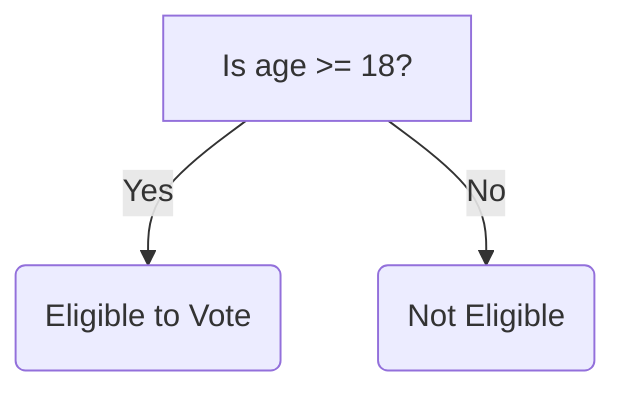
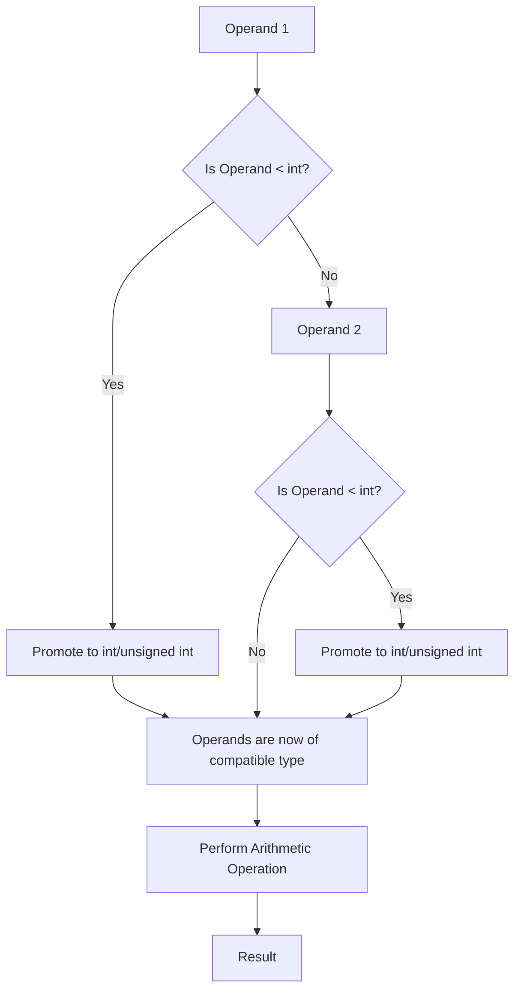
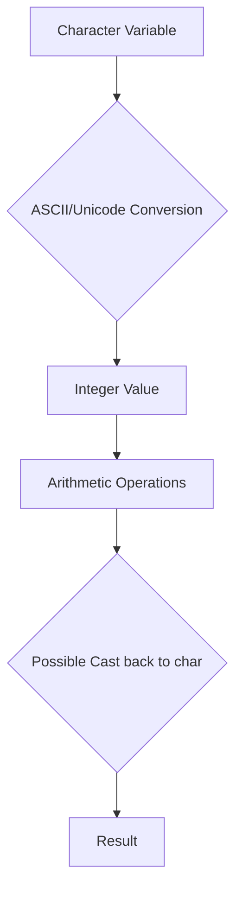
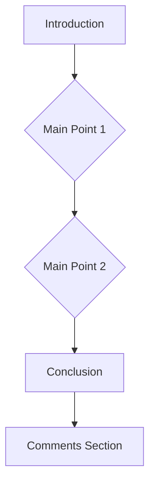

# <span style="color:#e67e22;">What we will learn in this post?</span>
<ul style='list-style-type: none; padding-left: 0;'>
<li><span style='color: #2980b9; font-size: 20px; font-weight: bold;'>👉</span> <span style='color: #2ecc71; font-size: 18px; font-weight: bold;'>Data Types in C</span></li>
<li><span style='color: #2980b9; font-size: 20px; font-weight: bold;'>👉</span> <span style='color: #2ecc71; font-size: 18px; font-weight: bold;'>Data Type Modifiers in C</span></li>
<li><span style='color: #2980b9; font-size: 20px; font-weight: bold;'>👉</span> <span style='color: #2ecc71; font-size: 18px; font-weight: bold;'>Literals in C</span></li>
<li><span style='color: #2980b9; font-size: 20px; font-weight: bold;'>👉</span> <span style='color: #2ecc71; font-size: 18px; font-weight: bold;'>Escape Sequence in C</span></li>
<li><span style='color: #2980b9; font-size: 20px; font-weight: bold;'>👉</span> <span style='color: #2ecc71; font-size: 18px; font-weight: bold;'>bool in C</span></li>
<li><span style='color: #2980b9; font-size: 20px; font-weight: bold;'>👉</span> <span style='color: #2ecc71; font-size: 18px; font-weight: bold;'>Integer Promotions in C</span></li>
<li><span style='color: #2980b9; font-size: 20px; font-weight: bold;'>👉</span> <span style='color: #2ecc71; font-size: 18px; font-weight: bold;'>Character Arithmetic in C</span></li>
<li><span style='color: #2980b9; font-size: 20px; font-weight: bold;'>👉</span> <span style='color: #2ecc71; font-size: 18px; font-weight: bold;'>Type Conversion in C</span></li>
<li><span style='color: #2980b9; font-size: 20px; font-weight: bold;'>👉</span> <span style='color: #2ecc71; font-size: 18px; font-weight: bold;'>Conclusion!</span></li>
</ul>

# <span style="color:#e67e22">C Data Types Explained 👨‍💻</span>

This guide explores the fundamental data types in the C programming language. We'll examine their characteristics, sizes, and provide illustrative examples.  Remember that the exact size (in bytes) of these data types can vary slightly depending on the compiler and the system architecture (32-bit vs. 64-bit).


## <span style="color:#2980b9">Basic Data Types ✨</span>

C offers a variety of built-in data types to represent different kinds of information.  Let's delve into the most common ones:


### <span style="color:#8e44ad">Integer Types (int, short, long, etc.) 🔢</span>

Integer types store whole numbers (no decimal point).  Their sizes differ:

*   `int`:  A standard integer.  Typically 4 bytes (32 bits) on most systems.
    *   *Example:* `int age = 30;`  // *Output:* `age` will hold the value 30.
*   `short`: A smaller integer. Usually 2 bytes (16 bits).
    *   *Example:* `short smallNum = 100;` // *Output:* `smallNum` will hold the value 100.
*   `long`: A larger integer. Typically 4 or 8 bytes depending on the system.
    *   *Example:* `long bigNum = 2147483647;` // *Output:* `bigNum` will hold the value 2147483647 (maximum for a 32-bit signed int).
*   `long long`: An even larger integer. Typically 8 bytes (64 bits).
    *   *Example:* `long long veryBigNum = 9223372036854775807;` // *Output:* `veryBigNum` will hold the value 9223372036854775807 (maximum for a 64-bit signed long long).


### <span style="color:#8e44ad">Floating-Point Types (float, double, long double) 🧮</span>

These types store numbers with decimal points:

*   `float`: Single-precision floating-point number. Typically 4 bytes (32 bits).
    *   *Example:* `float price = 99.99;` // *Output:* `price` will hold the value 99.99.
*   `double`: Double-precision floating-point number. Typically 8 bytes (64 bits), providing higher precision.
    *   *Example:* `double pi = 3.14159265359;` // *Output:* `pi` will hold a more precise value of pi than a float.
*   `long double`: Extended-precision floating-point number.  Size varies depending on the system (often 10 or 16 bytes).
    *   *Example:* `long double veryPrecise = 3.14159265358979323846;` // *Output:* `veryPrecise` will hold a highly precise value.


### <span style="color:#8e44ad">Character Type (char) 🔤</span>

The `char` type stores a single character:

*   `char`: Typically 1 byte (8 bits).  It uses ASCII or Unicode encoding to represent characters.
    *   *Example:* `char initial = 'J';` // *Output:* `initial` will hold the character 'J'.


## <span style="color:#2980b9">Size Considerations 📏</span>

The size of each data type in bytes can be determined using the `sizeof` operator:

```c
#include <stdio.h>

int main() {
    printf("Size of int: %lu bytes\n", sizeof(int));
    printf("Size of short: %lu bytes\n", sizeof(short));
    printf("Size of long: %lu bytes\n", sizeof(long));
    printf("Size of long long: %lu bytes\n", sizeof(long long));
    printf("Size of float: %lu bytes\n", sizeof(float));
    printf("Size of double: %lu bytes\n", sizeof(double));
    printf("Size of long double: %lu bytes\n", sizeof(long double));
    printf("Size of char: %lu bytes\n", sizeof(char));
    return 0;
}
```

// *Output:* (will vary depending on your system)
// Size of int: 4 bytes
// Size of short: 2 bytes
// Size of long: 8 bytes
// Size of long long: 8 bytes
// Size of float: 4 bytes
// Size of double: 8 bytes
// Size of long double: 16 bytes
// Size of char: 1 bytes


## <span style="color:#2980b9">Data Type Selection 🤔</span>

Choosing the appropriate data type is crucial for efficiency and accuracy.  Consider:

*   **Memory usage:** Use smaller types when possible to conserve memory.
*   **Range of values:** Select a type that can accommodate the expected range of values.
*   **Precision:**  For numbers with decimal points, choose `float`, `double`, or `long double` based on the required precision.


This overview provides a solid foundation for understanding C data types. Remember to consult your compiler's documentation for precise size details on your specific system.


# <span style="color:#e67e22">C Data Type Modifiers: Expanding the Basics ✨</span>

C programming offers a powerful mechanism to adjust the size and properties of its fundamental data types using *modifiers*. These modifiers fine-tune how much memory a variable occupies and the range of values it can hold. Let's explore the key modifiers:  `short`, `long`, `signed`, and `unsigned`.


## <span style="color:#2980b9">Size Modifiers: `short` and `long` 📏</span>

These modifiers primarily affect the *size* (and therefore the range) of `int`, `double`, and `float` data types.


### <span style="color:#8e44ad">`short` 🤏</span>

The `short` modifier generally reduces the size of an integer to the smallest size the compiler allows (often 2 bytes, but this is implementation-defined). This results in a smaller memory footprint, but a narrower range of possible values.

```c
#include <stdio.h>
#include <limits.h> // For SHRT_MIN, SHRT_MAX

int main() {
    short int smallNum = 32767; //Example of a short int
    printf("Size of short int: %lu bytes\n", sizeof(smallNum)); //Output: Size of short int: 2 bytes
    printf("Minimum short int value: %d\n", SHRT_MIN); // Output: Minimum short int value: -32768
    printf("Maximum short int value: %d\n", SHRT_MAX); // Output: Maximum short int value: 32767
    return 0;
}
```

### <span style="color:#8e44ad">`long` 📈</span>

The `long` modifier increases the size of an integer, or floating-point type.  This expands the range of representable values but increases memory consumption.  `long long` provides even greater capacity.


```c
#include <stdio.h>
#include <limits.h> // For LLONG_MIN, LLONG_MAX

int main() {
    long long int bigNum = 9223372036854775807; //Example of a long long int
    printf("Size of long long int: %lu bytes\n", sizeof(bigNum)); //Output: Size of long long int: 8 bytes
    printf("Minimum long long int value: %lld\n", LLONG_MIN); // Output: Minimum long long int value: -9223372036854775808
    printf("Maximum long long int value: %lld\n", LLONG_MAX); // Output: Maximum long long int value: 9223372036854775807
    return 0;
}
```

## <span style="color:#2980b9">Sign Modifiers: `signed` and `unsigned` ➕➖</span>

These modifiers control the interpretation of the most significant bit (MSB) of an integer.


### <span style="color:#8e44ad">`signed` (Default) 🤔</span>

By default, integers are *signed*. This means the MSB is used to represent the sign (0 for positive, 1 for negative)  reducing the magnitude of positive values that can be represented.


### <span style="color:#8e44ad">`unsigned` ➕</span>

The `unsigned` modifier indicates that the integer variable will *only* store non-negative values.  The MSB is then part of the magnitude, doubling the maximum positive value that can be stored.


```c
#include <stdio.h>
#include <limits.h>

int main() {
    unsigned int posNum = 4294967295; //Example of an unsigned int
    printf("Size of unsigned int: %lu bytes\n", sizeof(posNum)); //Output: Size of unsigned int: 4 bytes
    printf("Maximum unsigned int value: %u\n", UINT_MAX); // Output: Maximum unsigned int value: 4294967295
    signed int negNum = -1; // Example of a signed int
    printf("Minimum signed int value: %d\n", INT_MIN);  //Output: Minimum signed int value: -2147483648
    printf("Maximum signed int value: %d\n", INT_MAX);  //Output: Maximum signed int value: 2147483647
    return 0;
}
```


## <span style="color:#2980b9">Data Type Size Summary 📊</span>

The actual sizes of data types are *implementation-defined* (depend on your compiler and system architecture). However, here’s a typical representation:


| Data Type       | Typical Size (bytes) | Range (signed)                     | Range (unsigned)                 |
|-----------------|-----------------------|--------------------------------------|------------------------------------|
| `char`          | 1                     | -128 to 127                         | 0 to 255                           |
| `short int`     | 2                     | -32,768 to 32,767                   | 0 to 65,535                        |
| `int`           | 4                     | -2,147,483,648 to 2,147,483,647     | 0 to 4,294,967,295                 |
| `long int`      | 4 or 8                | Varies                              | Varies                              |
| `long long int` | 8                     | -9,223,372,036,854,775,808 to ... | 0 to 18,446,744,073,709,551,615 |
| `float`         | 4                     |  ~ ±3.4e ±38                        | N/A                               |
| `double`        | 8                     | ~ ±1.7e ±308                       | N/A                               |


**Note:** The `long long int` is guaranteed to be at least 64 bits in C99 and later.


Remember to choose the appropriate data type and modifiers based on your program's needs, balancing memory efficiency with the required range of values. Using the `sizeof` operator can help verify the actual size on your system.


# <span style="color:#e67e22">Literals in C: A Visual Guide 📖</span>


In C programming, a *literal* is a constant value that is directly written into the source code.  Think of it as a way to represent a specific value directly within your program.  They're essential building blocks for any C program!  Let's explore the different types.


## <span style="color:#2980b9">Integer Literals 🔢</span>

Integer literals represent whole numbers without any fractional part.  They come in various forms:

### <span style="color:#8e44ad">Decimal Literals</span>

These are the most common type, expressed in base-10 (0-9).

* **Example:** `10`, `-5`, `0`, `2147483647` (maximum for a signed 32-bit integer)

```c
#include <stdio.h>

int main() {
  int num1 = 10;
  int num2 = -5;
  printf("num1: %d\n", num1); // Output: num1: 10
  printf("num2: %d\n", num2); // Output: num2: -5
  return 0;
}
```

### <span style="color:#8e44ad">Octal Literals</span>

Represented in base-8 (0-7), prefixed with `0`.

* **Example:** `012` (decimal equivalent: 10)

```c
#include <stdio.h>

int main() {
  int octalNum = 012;
  printf("Octal 012 in decimal: %d\n", octalNum); // Output: Octal 012 in decimal: 10
  return 0;
}
```

### <span style="color:#8e44ad">Hexadecimal Literals</span>

Represented in base-16 (0-9, A-F), prefixed with `0x` or `0X`.

* **Example:** `0x1A` (decimal equivalent: 26), `0XFF` (decimal equivalent: 255)

```c
#include <stdio.h>

int main() {
  int hexNum = 0x1A;
  printf("Hexadecimal 0x1A in decimal: %d\n", hexNum); //Output: Hexadecimal 0x1A in decimal: 26
  return 0;
}
```


## <span style="color:#2980b9">Floating-Point Literals 🧮</span>

These represent numbers with fractional parts.  They can be expressed in either decimal or scientific notation.

* **Example (Decimal):** `3.14`, `-2.5`, `0.0`
* **Example (Scientific Notation):** `1.2e3` (1.2 x 10³ = 1200), `-5.6e-2` (-5.6 x 10⁻² = -0.056)

```c
#include <stdio.h>

int main() {
  float pi = 3.14159f; // f suffix indicates float
  double bigNum = 1.2e3;
  printf("pi: %f\n", pi);  // Output: pi: 3.141590
  printf("bigNum: %lf\n", bigNum); // Output: bigNum: 1200.000000
  return 0;
}
```

## <span style="color:#2980b9">Character Literals 🔤</span>

These represent single characters enclosed in single quotes.


* **Example:** `'A'`, `'%'`, `'\n'` (newline character), `'\t'` (tab character)

```c
#include <stdio.h>

int main() {
  char letter = 'A';
  char newline = '\n';
  printf("Letter: %c\n", letter); // Output: Letter: A
  printf("Newline:\n"); // Output: Newline followed by a newline
  return 0;
}
```

## <span style="color:#2980b9">String Literals 📜</span>

These represent sequences of characters enclosed in double quotes.

* **Example:** `"Hello, world!"`, `"C Programming"`

```c
#include <stdio.h>

int main() {
  char* message = "Hello, world!";
  printf("%s\n", message); // Output: Hello, world!
  return 0;
}
```


## <span style="color:#2980b9">Boolean Literals (C99 and later) ☑️</span>

These represent truth values: `true` (represented as 1) or `false` (represented as 0).


* **Example:** `bool isTrue = true;`, `bool isFalse = false;`

```c
#include <stdio.h>
#include <stdbool.h> // Required for bool type

int main() {
  bool isTrue = true;
  bool isFalse = false;
  printf("isTrue: %d\n", isTrue); // Output: isTrue: 1
  printf("isFalse: %d\n", isFalse); // Output: isFalse: 0
  return 0;
}
```


This guide provides a comprehensive overview of literals in C. Remember to choose the appropriate literal type based on the data you're working with in your program!


# <span style="color:#e67e22">Escape Sequences in C: A Visual Guide 🧵</span>

Escape sequences in C are special character combinations that allow you to include characters in your strings that you can't type directly, such as newlines, tabs, or quotation marks.  They start with a backslash (`\`). Think of them as secret codes for your compiler! ✨


## <span style="color:#2980b9">Understanding Escape Sequences 🤔</span>

Escape sequences are crucial for formatting text and controlling the output of your C programs.  They let you create multi-line strings, add special characters, and improve code readability.

### <span style="color:#8e44ad">Common Escape Sequences</span>

Here's a table summarizing some frequently used escape sequences:

| Escape Sequence | Description             | Example                      | Output                               |
|-----------------|--------------------------|-------------------------------|---------------------------------------|
| `\n`            | Newline (line break)     | `"Hello\nWorld"`             | `Hello<br>World`                    |
| `\t`            | Horizontal tab           | `"Name\tAge"`                | `Name    Age`                       |
| `\\`            | Backslash                | `"C:\\Program Files"`         | `C:\Program Files`                  |
| `\"`            | Double quote             | `"He said, \"Hello!\""`       | `He said, "Hello!"`                 |
| `\'`            | Single quote             | `'It\'s a quote'`            | `It's a quote`                     |
| `\?`            | Question mark            | `"What\?`                     | `What?`                             |
| `\0`            | Null character (end of string)| `"Hello\0World"`           | `Hello` (World is ignored)        |
| `\a`            | Audible alert (bell)     | `printf("\a");`              | *Beeps your speaker*                 |
| `\r`            | Carriage return          | `"Hello\rWorld"`             | `World` (Overwrites "Hello")        |
| `\v`            | Vertical tab             | `"Line1\vLine2"`             | *Line 1 and Line 2 are vertically separated (effects may vary)* |


## <span style="color:#2980b9">Examples in Action 🚀</span>

Let's see how these escape sequences work in practice:

```c
#include <stdio.h>

int main() {
  printf("This is a single line.\n"); // \n creates a newline
  printf("Name:\tJohn\nAge:\t30\n"); // \t adds a tab
  printf("This string contains a double quote: \"Hello!\"\n"); // \" escapes the double quote
  printf("This string contains a backslash: C:\\\\Windows\\System32\n");// \\ escapes the backslash
  printf("This is a test of the bell sound: \a\n"); // \a makes a beep
  return 0;
}
```

/*Output:
This is a single line.
Name:	John
Age:	30
This string contains a double quote: "Hello!"
This string contains a backslash: C:\\Windows\System32
This is a test of the bell sound: (beep sound)
*/


## <span style="color:#2980b9">Visualizing Escape Sequences 📊</span>

```mermaid
graph LR
A[Your Code] --> B{Escape Sequence \n};
B --> C[New Line];
A --> D{Escape Sequence \t};
D --> E[Horizontal Tab];
A --> F{Escape Sequence \\};
F --> G[Backslash Character];
A --> H{Escape Sequence \"};
H --> I[Double Quote];
```


## <span style="color:#2980b9">Key Takeaways 💡</span>

* Escape sequences enhance string manipulation and output formatting in C.
* Understanding these sequences is crucial for writing clear and well-structured programs.
* Mastering escape sequences improves code readability and makes debugging easier.
* Remember that `\` is the escape character—it signals the start of a special sequence.


This guide provides a comprehensive overview of escape sequences in C.  Happy coding! 🎉


# <span style="color:#e67e22">Understanding the `bool` Data Type in C 💡</span>

The `bool` data type in C represents boolean values, which are either *true* or *false*.  While not present in older C standards, it's a valuable addition that enhances code readability and clarity.  Let's delve into its significance and usage.


## <span style="color:#2980b9">A Brief History 📜</span>

The `bool` type wasn't part of the original C standard. It was officially introduced in **C99**, becoming a standard part of the language. Before C99, programmers typically used integers (0 for *false*, non-zero for *true*) to represent boolean values. This often led to less readable and potentially error-prone code.


## <span style="color:#2980b9">Significance of `bool` 👍</span>

* **Improved Readability:** Using `bool` explicitly clarifies the intent of your code.  It immediately communicates that a variable is meant to hold a true/false value, making the code easier to understand and maintain.
* **Reduced Errors:**  Explicitly using `bool` minimizes the risk of accidental misinterpretations of integer values as booleans.
* **Enhanced Maintainability:**  Code that uses `bool` is generally easier to modify and debug.  The meaning of variables is unambiguous.

## <span style="color:#2980b9">Using `bool` in Your Code 💻</span>

To use `bool`, you'll need to include the `<stdbool.h>` header file. This header file defines the `bool` type, along with the constants `true` and `false`.

### <span style="color:#8e44ad">Example 1: Simple Boolean Variable</span>

```c
#include <stdio.h>
#include <stdbool.h>

int main() {
  bool isAdult = true;  //Declares a boolean variable and initializes it to true

  if (isAdult) {
    printf("You are an adult.\n"); //This will print because isAdult is true
  } else {
    printf("You are not an adult.\n");
  }
  return 0;
}
/*
Output:
You are an adult.
*/
```

### <span style="color:#8e44ad">Example 2: Boolean Expression</span>

```c
#include <stdio.h>
#include <stdbool.h>

int main() {
  int age = 25;
  bool isEligible = (age >= 18); // Boolean expression evaluates to true

  if (isEligible) {
    printf("You are eligible to vote.\n"); //This will print because isEligible is true
  } else {
    printf("You are not eligible to vote.\n");
  }
  return 0;
}
/*
Output:
You are eligible to vote.
*/
```


### <span style="color:#8e44ad">Example 3:  Using `stdbool.h` for clarity</span>

Before C99, the following code would have been typical:


```c
#include <stdio.h>

int main() {
    int flag = 1; //Represents a true condition. Less clear than bool.

    if (flag) {
        printf("Flag is set!\n");
    }
    return 0;
}
/*
Output:
Flag is set!
*/
```

This achieves the same result, but using `stdbool.h` offers improved clarity:

```c
#include <stdio.h>
#include <stdbool.h>

int main() {
    bool flag = true;

    if (flag) {
        printf("Flag is set!\n");
    }
    return 0;
}
/*
Output:
Flag is set!
*/
```


## <span style="color:#2980b9">Flowchart illustrating a boolean decision 📊</span>




In summary, the `bool` data type, introduced in C99, significantly improves the readability, maintainability, and robustness of C programs by providing a dedicated way to represent boolean values. Its use is highly recommended for modern C development.


# <span style="color:#e67e22">Integer Promotions in C 🧮</span>

C's integer promotion rules ensure that arithmetic operations are performed consistently, regardless of the size of the integer operands.  Smaller integer types are implicitly converted (promoted) to larger types before calculations. This prevents data loss and ensures predictable results. Let's explore this fascinating aspect of C!


## <span style="color:#2980b9">The "Usual Arithmetic Conversions" ✨</span>

When arithmetic operations (`+`, `-`, `*`, `/`, `%`) involve operands of different integer types,  the C compiler applies a set of rules known as the "usual arithmetic conversions".  These conversions ensure that both operands are of the same type before the operation is executed.  Here's a breakdown:

### <span style="color:#8e44ad">Steps Involved in Integer Promotion</span>

1. **Integer Types Smaller Than `int` are Promoted:**  If either operand is a type smaller than `int` (like `char`, `short`, `unsigned char`, `unsigned short`), it's promoted to `int` (if `int` can represent all values of the original type) or to `unsigned int` (otherwise).

2. **Operands of Different Signedness:** If one operand is signed and the other is unsigned, and the unsigned type has the same or greater rank than the signed type, then the signed operand is converted to unsigned.

3. **Operands of Different Ranks:** If after step 1 and 2 the operands have different types, the lower-ranked type is promoted to the higher-ranked type.


## <span style="color:#2980b9">Illustrative Examples 💡</span>

Let's look at some code examples to clarify these rules:

```c
#include <stdio.h>

int main() {
    char a = 10;          // 8-bit (on many systems)
    short b = 20;         // 16-bit (on many systems)
    int c = 30;           // 32-bit (on many systems)
    unsigned int d = 40;  // 32-bit (on many systems)

    int sum1 = a + b;     // a and b are promoted to int before addition
    int sum2 = b + c;     // b is promoted to int, then addition happens between two ints
    unsigned int sum3 = b + d; //b promoted to int, then int is promoted to unsigned int since d is unsigned int
    int sum4 = a + d;    // a is promoted to int then int + unsigned int conversion happens.

    printf("sum1: %d\n", sum1); // Output: sum1: 30
    printf("sum2: %d\n", sum2); // Output: sum2: 50
    printf("sum3: %u\n", sum3); // Output: sum3: 50
    printf("sum4: %u\n", sum4); // Output: sum4: 50 (if int is 32 bit)

    return 0;
}
```

**Explanation:**

* In `sum1`, both `a` (char) and `b` (short) are promoted to `int` before the addition.
* In `sum2`, `b` (short) is promoted to `int` before adding to `c` (int).
* In `sum3`, `b` is promoted to `int` and then to `unsigned int` to match `d`.
* In `sum4`, `a` is promoted to `int` and then an implicit conversion to `unsigned int` is performed before addition with `d`.


## <span style="color:#2980b9">Flowchart of Integer Promotion 📈</span>




## <span style="color:#2980b9">Important Considerations 🤔</span>

* **Potential for Overflow:** Be mindful of potential integer overflow when dealing with promotions. If the promoted type cannot hold the value, unexpected results might occur.
* **Compiler-Specific Behavior:** While the general rules are standardized, minor variations might exist across different compilers.
* **`sizeof` Operator:**  Using the `sizeof` operator helps to understand the size of a variable after promotion; note that the `sizeof` is always calculated at compile time.


This explanation, along with the provided examples and flowchart, should offer a comprehensive understanding of integer promotions in C. Remember to always be aware of these rules to write robust and predictable C code! 


# <span style="color:#e67e22">Character Arithmetic in C 🧑‍💻</span>

In C, characters are not just letters, numbers, or symbols; they're actually represented internally as *integer* values.  This allows us to perform arithmetic operations directly on them!  This is often useful for tasks like converting between uppercase and lowercase letters or performing simple character manipulations.


## <span style="color:#2980b9">Character Representation 🔢</span>

C uses a standard character encoding scheme like ASCII (American Standard Code for Information Interchange) or Unicode (a more extensive international standard). Each character is assigned a unique numerical code. For instance:

* `'A'` is usually represented as 65 (in ASCII).
* `'a'` is usually represented as 97 (in ASCII).
* `'0'` is usually represented as 48 (in ASCII).


### <span style="color:#8e44ad">ASCII Table Snippet</span>

A small part of the ASCII table to illustrate:

| Character | ASCII Value |
|---|---|
| `'0'` | 48 |
| `'1'` | 49 |
| `'A'` | 65 |
| `'a'` | 97 |


## <span style="color:#2980b9">Arithmetic Operations on Characters ➕➖✖️➗</span>


You can perform standard arithmetic operations (+, -, *, /, %) on character variables, as if they were integers. The result will be an integer value which can then be cast back to a character if needed.

### <span style="color:#8e44ad">Examples</span>

Let's look at some examples:


```c
#include <stdio.h>

int main() {
  char ch1 = 'A';
  char ch2 = 'a';
  char ch3 = '5';

  // Adding integers to characters
  char ch4 = ch1 + 1;     // 'A' + 1 = 'B'
  char ch5 = ch2 + 32;     // 'a' + 32 =  (this results in a different character. this is not always a useful operation)
  char ch6 = ch3 - '0';   // '5' - '0' = 5  (extracting numeric value from a digit character)


  // Subtracting characters
  int diff = ch2 - ch1;   // 'a' - 'A' = 32 (the difference between uppercase and lowercase 'a')

  printf("ch1: %c, ch4: %c\n", ch1, ch4); // Output: ch1: A, ch4: B
  printf("ch2: %c, ch5: %c\n", ch2, ch5); //Output: ch2: a, ch5: z
  printf("ch3: %c, ch6: %d\n", ch3, ch6); // Output: ch3: 5, ch6: 5
  printf("Difference between 'a' and 'A': %d\n", diff); // Output: Difference between 'a' and 'A': 32

  return 0;
}
```

**Important Note:**  Be cautious when performing multiplication and division on characters. The result might be an integer value that doesn't represent a valid printable character.


## <span style="color:#2980b9">Converting Case 🔄</span>


Character arithmetic is especially useful for converting between uppercase and lowercase letters:


```c
#include <stdio.h>

int main() {
    char upper = 'Z';
    char lower = 'a';

    // Convert uppercase to lowercase
    char lowerCase = upper + 32;  // Assuming ASCII

    // Convert lowercase to uppercase
    char upperCase = lower - 32;  // Assuming ASCII

    printf("Uppercase to lowercase: %c\n", lowerCase); // Output: Uppercase to lowercase: z
    printf("Lowercase to uppercase: %c\n", upperCase); // Output: Lowercase to uppercase: A

    return 0;
}
```

**Remember**:  The 32 value used above relies on the ASCII encoding. This might not work consistently across different encodings like Unicode.


## <span style="color:#2980b9">Flowchart illustrating character to integer conversion</span>



This flowchart shows the process of converting a character to an integer for arithmetic and then potentially converting the result back to a character.  Remember to always consider potential overflow and the limitations of your character encoding.


# <span style="color:#e67e22">Type Conversion in C 🔄</span>

Type conversion, also known as *casting*, is the process of changing a variable from one data type to another.  C allows both implicit (automatic) and explicit (manual) type conversions.  Let's explore both!

## <span style="color:#2980b9">Implicit Type Conversion (Automatic) 🤖</span>

Implicit type conversion happens automatically by the compiler without requiring any special syntax from the programmer.  It usually occurs when you perform an operation involving variables of different data types. The compiler promotes the "smaller" type to a "larger" type to avoid data loss.

### <span style="color:#8e44ad">How it Works</span>

The compiler follows a set of rules to determine the resulting data type. Generally, it promotes to the largest type involved in the operation.

* **Integer Promotion:**  `char`, `short`, and `int` are often promoted to `int` before arithmetic operations.
* **Floating-Point Promotion:** `float` is often promoted to `double`.

### <span style="color:#8e44ad">Examples</span>

```c
#include <stdio.h>

int main() {
  int x = 10;
  float y = 3.14;
  float sum = x + y; // x is implicitly converted to float before addition

  printf("Sum: %f\n", sum); // Output: Sum: 13.140000  
  return 0;
}
```

```c
#include <stdio.h>

int main() {
    char a = 'A';
    int b = a + 1; // 'A' (ASCII 65) is promoted to int, then added to 1

    printf("Value of b: %d\n", b); // Output: Value of b: 66
    return 0;
}
```


## <span style="color:#2980b9">Explicit Type Conversion (Casting) 🔨</span>

Explicit type conversion, or casting, is done manually by the programmer using casting operators. This gives you more control over the conversion process.  However, be cautious as it can lead to data loss or unexpected behavior if not done carefully.

### <span style="color:#8e44ad">Syntax</span>

The syntax for explicit type conversion is:

```c
(dataType) expression; 
```

For example: `(float)x` converts the integer variable `x` to a float.

### <span style="color:#8e44ad">Examples</span>

```c
#include <stdio.h>

int main() {
  int x = 10;
  float y = 3.14;
  int z = (int)y; // Explicitly convert float y to int, losing decimal part

  printf("Value of z: %d\n", z); // Output: Value of z: 3
  return 0;
}
```

```c
#include <stdio.h>

int main() {
    double pi = 3.14159;
    int intPi = (int)pi; // Explicit conversion, truncating the decimal part

    printf("Original pi: %f\n", pi); // Output: Original pi: 3.141590
    printf("Integer pi: %d\n", intPi); // Output: Integer pi: 3
    return 0;
}
```


## <span style="color:#2980b9">When to Use Which Type of Conversion 🤔</span>

* **Implicit:** Use implicit conversion when it's safe and the compiler can handle it without data loss.  This often happens naturally in arithmetic expressions.
* **Explicit:** Use explicit conversion when you need fine-grained control over the conversion process or when there's a potential for data loss (e.g., converting `double` to `int`).  Explicit casting makes your intentions clear to the compiler and other programmers.


## <span style="color:#2980b9">Potential Pitfalls ⚠️</span>

* **Data Loss:**  Converting a larger type to a smaller type (e.g., `double` to `int`) can lead to data loss, as the fractional part is truncated.
* **Overflow:**  If the result of a conversion exceeds the range of the target type, it can lead to overflow, resulting in unpredictable behavior.


This detailed explanation with examples and visual elements should provide a clear understanding of type conversion in C. Remember to always be mindful of potential data loss and overflow when performing conversions, especially explicit ones. Using explicit casts responsibly can significantly improve code clarity and reliability.


<h1><span style='color:#e67e22'>Conclusion</span></h1>

So there you have it!  We've covered a lot of ground today, from [briefly mention topic 1] to [briefly mention topic 2], and hopefully, you've found it insightful and engaging! 😄

## <span style="color:#2980b9">Your Thoughts Matter! ✨</span>

This blog post is just the beginning of a conversation. We'd *love* to hear your thoughts, feedback, and suggestions.  Did you find anything particularly helpful?  Do you have any questions that weren't answered?  Perhaps you have some brilliant ideas to add to the discussion? 🤔


### <span style="color:#8e44ad">Share Your Wisdom! 🗣️</span>

Don't be shy!  The comments section is the perfect place to share your expertise and connect with other readers. Let's build a community around this topic and continue learning together.  Your input is invaluable! 💖


We're excited to see what you have to say! 👇


***

**Example of how you can leave a comment:**

```
I really enjoyed learning about [specific topic mentioned in the blog].  I had a question about [your question]...
```


---

**A simple flowchart summarizing the blog post (example):**



Remember, your voice matters!  Let's keep the conversation going! 🎉


