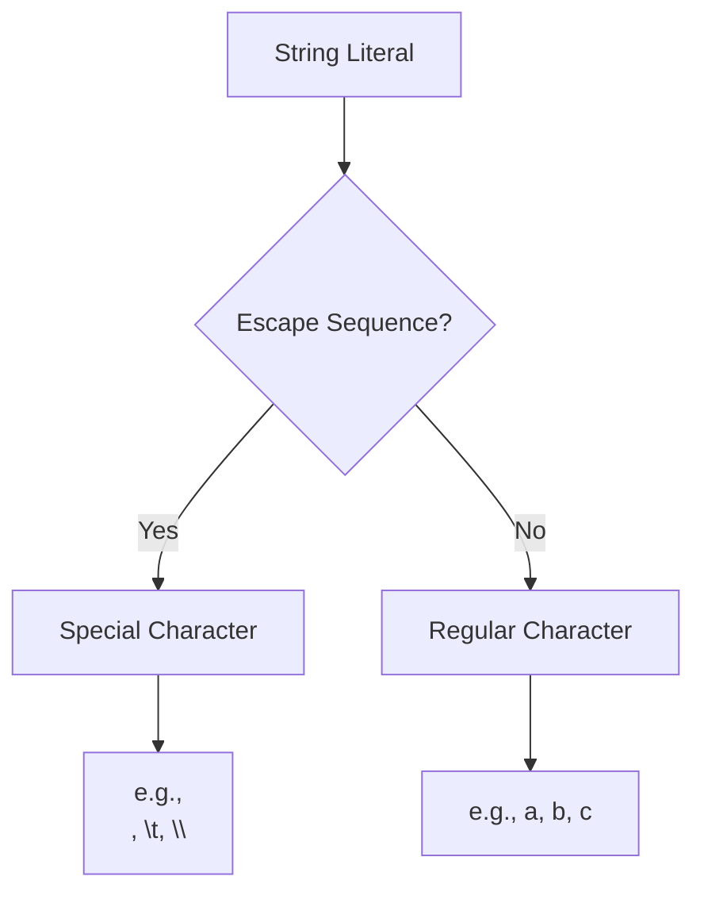
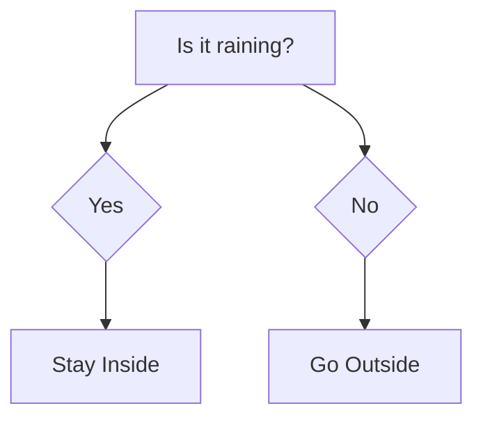
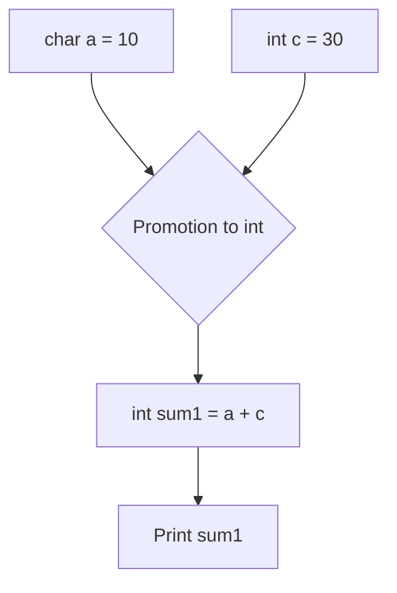
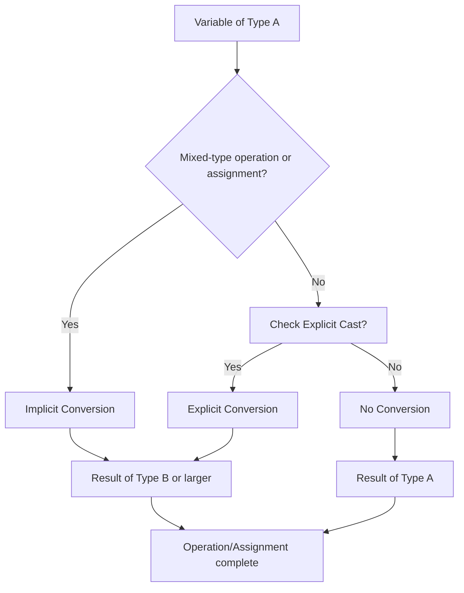
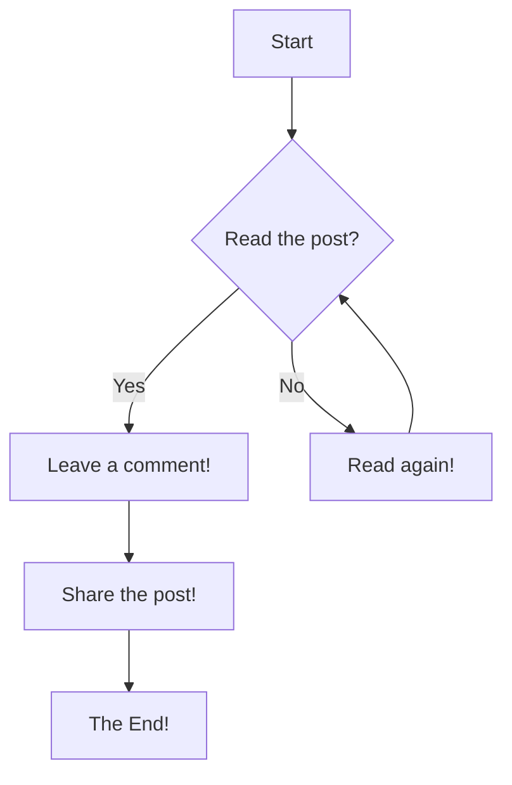

# <span style="color:#e67e22;">What we will learn in this post?</span>
<ul style='list-style-type: none; padding-left: 0;'>
<li><span style='color: #2980b9; font-size: 20px; font-weight: bold;'>👉</span> <span style='color: #2ecc71; font-size: 18px; font-weight: bold;'>Data Types in C</span></li>
<li><span style='color: #2980b9; font-size: 20px; font-weight: bold;'>👉</span> <span style='color: #2ecc71; font-size: 18px; font-weight: bold;'>Data Type Modifiers in C</span></li>
<li><span style='color: #2980b9; font-size: 20px; font-weight: bold;'>👉</span> <span style='color: #2ecc71; font-size: 18px; font-weight: bold;'>Literals in C</span></li>
<li><span style='color: #2980b9; font-size: 20px; font-weight: bold;'>👉</span> <span style='color: #2ecc71; font-size: 18px; font-weight: bold;'>Escape Sequence in C</span></li>
<li><span style='color: #2980b9; font-size: 20px; font-weight: bold;'>👉</span> <span style='color: #2ecc71; font-size: 18px; font-weight: bold;'>bool in C</span></li>
<li><span style='color: #2980b9; font-size: 20px; font-weight: bold;'>👉</span> <span style='color: #2ecc71; font-size: 18px; font-weight: bold;'>Integer Promotions in C</span></li>
<li><span style='color: #2980b9; font-size: 20px; font-weight: bold;'>👉</span> <span style='color: #2ecc71; font-size: 18px; font-weight: bold;'>Character Arithmetic in C</span></li>
<li><span style='color: #2980b9; font-size: 20px; font-weight: bold;'>👉</span> <span style='color: #2ecc71; font-size: 18px; font-weight: bold;'>Type Conversion in C</span></li>
<li><span style='color: #2980b9; font-size: 20px; font-weight: bold;'>👉</span> <span style='color: #2ecc71; font-size: 18px; font-weight: bold;'>Conclusion!</span></li>
</ul>

# <span style="color:#e67e22">C Data Types Explained 👨‍💻</span>

This guide explores the fundamental data types in C programming.  We'll look at their sizes, uses, and provide illustrative examples. Remember that the exact size of a data type might vary slightly depending on the compiler and the system architecture (32-bit vs. 64-bit).

## <span style="color:#2980b9">Basic Data Types 🧱</span>

These are the building blocks of your C programs.


### <span style="color:#8e44ad">Integers (`int`) 🔢</span>

* **Description:**  Used to store whole numbers (no decimal point).
* **Size:** Typically 4 bytes (32 bits) on most systems, but can be 2 or 8 bytes depending on the system.
* **Range:** Approximately -2,147,483,648 to 2,147,483,647 for a 4-byte `int`.
* **Example:**

```c
#include <stdio.h>
#include <limits.h> //for INT_MAX and INT_MIN

int main() {
  int age = 30;
  int count = 1000;
  printf("Age: %d\n", age); //Output: Age: 30
  printf("Count: %d\n", count); //Output: Count: 1000
  printf("Maximum int value: %d\n", INT_MAX); //Output: Maximum int value: 2147483647
  printf("Minimum int value: %d\n", INT_MIN); //Output: Minimum int value: -2147483648
  return 0;
}
```


### <span style="color:#8e44ad">Floating-Point Numbers (`float`, `double`) 🧮</span>

* **Description:** Used to store numbers with decimal points.  `double` provides higher precision than `float`.
* **Size:** `float` is typically 4 bytes, `double` is typically 8 bytes.
* **Range:**  `float` and `double` have a much wider range than `int`, but they can't represent all decimal numbers exactly due to the way they are stored in memory (floating-point representation).
* **Example:**

```c
#include <stdio.h>

int main() {
  float price = 99.99;
  double pi = 3.14159265358979323846;
  printf("Price: %.2f\n", price); //Output: Price: 99.99
  printf("Pi: %lf\n", pi); //Output: Pi: 3.141593
  return 0;
}
```

### <span style="color:#8e44ad">Characters (`char`) 🔤</span>

* **Description:** Used to store single characters.  Each character is represented by a numerical code (typically ASCII or Unicode).
* **Size:** Typically 1 byte.
* **Example:**

```c
#include <stdio.h>

int main() {
  char initial = 'J';
  char symbol = '$';
  printf("Initial: %c\n", initial); //Output: Initial: J
  printf("Symbol: %c\n", symbol); //Output: Symbol: $
  printf("Initial ASCII value: %d\n", initial); //Output: Initial ASCII value: 74
  return 0;
}
```


## <span style="color:#2980b9">Other Important Types ✨</span>

* **`void`:** Represents the absence of a type. Often used for functions that don't return a value.
* **`short int`:** A smaller integer type (usually 2 bytes).
* **`long int`:** A larger integer type (usually 8 bytes on 64-bit systems).
* **`long long int`:** An even larger integer type (usually 8 bytes).
* **`unsigned int`:**  Stores only non-negative integers, effectively doubling the positive range.  Similar `unsigned` modifiers exist for `short`, `long`, and `long long`.
* **`bool` (C99 and later):** Stores either `true` or `false`.


## <span style="color:#2980b9">Data Type Sizes Visualization 📊</span>

```mermaid
graph LR
    A[int (4 bytes)] --> B(Range: -2,147,483,648 to 2,147,483,647)
    C[float (4 bytes)] --> D(Range: ~ ±3.4e±38)
    E[double (8 bytes)] --> F(Range: ~ ±1.7e±308)
    G[char (1 byte)] --> H(ASCII characters)
```


This diagram shows the typical sizes of these data types.  Remember that these sizes are implementation-dependent.  Always use `sizeof()` operator in your code if you need to know the exact size on your system.  For example: `sizeof(int)` will return the size of an `int` in bytes on your specific compiler and architecture.

Choosing the right data type is crucial for efficient memory management and program performance. Remember to consider the range and precision required for your variables.


# <span style="color:#e67e22">C Data Type Modifiers: Expanding the Basics 🧮</span>

In C programming, we use *data type modifiers* to fine-tune the size and properties of our basic data types (like `int`, `char`, etc.).  This allows for greater control over memory usage and the range of values a variable can hold. Let's explore the common modifiers:


## <span style="color:#2980b9">Understanding the Modifiers 📖</span>

We'll focus on four key modifiers: `short`, `long`, `signed`, and `unsigned`.

### <span style="color:#8e44ad">`short` and `long` : Size Matters!</span>

These modifiers primarily affect the *size* (number of bytes) of the data type they modify.  The exact size isn't strictly defined by the standard, but it provides *hints* to the compiler.  Generally:

*   `short int` : Usually uses less memory than a regular `int`.
*   `long int` : Usually uses more memory than a regular `int`.
*   `long long int` :  The largest integer type, consuming the most memory.


**Example:**

```c
#include <stdio.h>
#include <limits.h> //For limits of data types

int main() {
    printf("Size of short int: %zu bytes\n", sizeof(short int)); //Output: Size of short int: 2 bytes
    printf("Size of int: %zu bytes\n", sizeof(int)); //Output: Size of int: 4 bytes
    printf("Size of long int: %zu bytes\n", sizeof(long int)); //Output: Size of long int: 8 bytes
    printf("Size of long long int: %zu bytes\n", sizeof(long long int)); //Output: Size of long long int: 8 bytes
    printf("Minimum short int: %d\n", SHRT_MIN); //Output: Minimum short int: -32768
    printf("Maximum short int: %d\n", SHRT_MAX); //Output: Maximum short int: 32767
    return 0;
}
```

### <span style="color:#8e44ad">`signed` and `unsigned`:  Positive or Negative? 🤔</span>


These modifiers determine the *range* of values a variable can hold.

*   `signed` (default): Allows both positive and negative numbers.  The highest bit is used to represent the sign.
*   `unsigned`: Allows only non-negative numbers (0 and positive).  All bits are used to represent the magnitude.


**Example:**

```c
#include <stdio.h>
#include <limits.h>

int main() {
    printf("Size of unsigned int: %zu bytes\n", sizeof(unsigned int)); //Output: Size of unsigned int: 4 bytes
    printf("Minimum unsigned int: %u\n", 0);  //Output: Minimum unsigned int: 0
    printf("Maximum unsigned int: %u\n", UINT_MAX); //Output: Maximum unsigned int: 4294967295
    return 0;
}
```

Using `unsigned` effectively doubles the *positive* range of an integer type, but at the cost of not being able to represent negative numbers.


## <span style="color:#2980b9">Combining Modifiers 💪</span>


You can combine modifiers to create even more specific data types. For example:

*   `unsigned short int`
*   `signed long long int` (often shortened to `long long int`)


**Example:**

```c
#include <stdio.h>
#include <limits.h>

int main() {
    printf("Size of unsigned short int: %zu bytes\n", sizeof(unsigned short int)); //Output: Size of unsigned short int: 2 bytes
    printf("Maximum unsigned short int: %u\n", USHRT_MAX); //Output: Maximum unsigned short int: 65535
    return 0;
}
```


## <span style="color:#2980b9">Choosing the Right Modifier 🎯</span>


The choice of modifier depends on your specific needs:

*   **Memory efficiency:** Use `short` if you need to store smaller numbers and save memory.
*   **Range:**  Use `long long` for very large numbers. Use `unsigned` if you only need non-negative values.

Remember to consider the potential trade-offs between memory usage and the range of representable values.  Using the wrong modifier can lead to unexpected behavior, such as *integer overflow* (exceeding the maximum value).


## <span style="color:#2980b9">Visual Summary: Data Type Sizes (Illustrative)</span>

```mermaid
graph LR
    A[char (1 byte)] --> B(short (2 bytes));
    B --> C(int (4 bytes));
    C --> D(long (8 bytes));
    D --> E(long long (8 bytes));
    subgraph "Signed vs Unsigned"
        C --> F[signed int];
        C --> G[unsigned int];
    end
```

This diagram provides a general idea of sizes. The actual sizes can vary depending on the compiler and system architecture.  Remember that these are *typical* sizes.  Always use `sizeof` to determine the actual size on your specific system.


# <span style="color:#e67e22">Literals in C: A Comprehensive Guide 📖</span>


In C programming, a *literal* is a constant value that is directly written into the source code.  They represent fixed values that the compiler can understand and use directly.  Think of them as the raw data you feed into your program.


## <span style="color:#2980b9">Categorizing C Literals ✨</span>

C literals are categorized based on their data type.  Here's a breakdown:


### <span style="color:#8e44ad">Integer Literals 🔢</span>

These represent whole numbers without any fractional part.

* **Decimal (Base-10):**  Uses digits 0-9.
    * Example: `int age = 30;`  // *age* will hold the value 30.
* **Octal (Base-8):**  Starts with a leading `0`. Uses digits 0-7.
    * Example: `int octalNum = 017;` // *octalNum* will hold the value 15 (decimal equivalent).
* **Hexadecimal (Base-16):** Starts with `0x` or `0X`. Uses digits 0-9 and letters A-F (or a-f).
    * Example: `int hexNum = 0x1A;` // *hexNum* will hold the value 26 (decimal equivalent).


### <span style="color:#8e44ad">Floating-Point Literals 🌊</span>

These represent numbers with fractional parts.

* **Single-precision (float):**  Use `f` or `F` suffix.
    * Example: `float pi = 3.14159f;` // *pi* will hold the value 3.14159 as a single-precision float.
* **Double-precision (double):**  No suffix needed.
    * Example: `double e = 2.71828;`  // *e* will hold the value 2.71828 as a double-precision float.
* **Long double:** Use `l` or `L` suffix.
    * Example: `long double veryPrecise = 1.2345678901234567890L;` // *veryPrecise* will hold a high-precision value.


### <span style="color:#8e44ad">Character Literals 🔤</span>

These represent single characters enclosed in single quotes.

* **Example:** `char initial = 'J';` // *initial* will hold the character 'J'.
* **Escape Sequences:** Special characters can be represented using escape sequences:
    * `\n` (newline)
    * `\t` (tab)
    * `\\` (backslash)
    * `\'` (single quote)
    * `\"` (double quote)
    * Example: `char newline = '\n';`  // *newline* will hold the newline character.


### <span style="color:#8e44ad">String Literals 📜</span>

These represent sequences of characters enclosed in double quotes.  They're actually arrays of characters.

* **Example:** `char* message = "Hello, world!";` // *message* will point to an array containing "Hello, world!".


### <span style="color:#8e44ad">Boolean Literals 💡</span>

Represent truth values (though not a built-in type in older C standards). In C99 and later,  `<stdbool.h>` is used.

* `true` or `false`
    * Example: `#include <stdbool.h> bool isAdult = true;`  // *isAdult* will be true.


## <span style="color:#2980b9">Example Code Snippet 💻</span>


```c
#include <stdio.h>
#include <stdbool.h>

int main() {
  int age = 25;             // Integer literal
  float price = 99.99f;     // Floating-point literal (float)
  double pi = 3.14159;      // Floating-point literal (double)
  char initial = 'A';       // Character literal
  char* message = "Hello!"; // String literal
  bool isWorking = true;    // Boolean literal

  printf("Age: %d\n", age);         // Output: Age: 25
  printf("Price: %.2f\n", price);    // Output: Price: 99.99
  printf("Pi: %lf\n", pi);         // Output: Pi: 3.141590
  printf("Initial: %c\n", initial); // Output: Initial: A
  printf("Message: %s\n", message); // Output: Message: Hello!
  printf("Is Working: %s\n", isWorking ? "true" : "false"); // Output: Is Working: true

  return 0;
}
```


## <span style="color:#2980b9">Visual Representation 🤔</span>


```mermaid
graph TD
    A[Integer Literal] --> B(10, 012, 0xA);
    A --> C(Decimal, Octal, Hexadecimal);
    D[Floating-Point Literal] --> E(3.14f, 3.14, 3.14L);
    D --> F(float, double, long double);
    G[Character Literal] --> H('A', 'B', '\n');
    I[String Literal] --> J("Hello", "World!");
    K[Boolean Literal] --> L(true, false);
```


This diagram visually shows the different types of literals and some examples of each.  Remember that understanding literals is fundamental to writing any C program! 🎉


# <span style="color:#e67e22">Escape Sequences in C: Unveiling Hidden Characters 🤫</span>


Escape sequences in C are special character combinations that allow you to include characters that are difficult or impossible to type directly into your string literals.  They start with a backslash (`\`). Think of them as secret codes for your compiler! 🚀


## <span style="color:#2980b9">Understanding Escape Sequences</span>

Escape sequences let you insert things like newlines, tabs, and other special characters into your strings.  Without them, you'd be severely limited in what you could represent.

### <span style="color:#8e44ad">Common Escape Sequences</span>

Here's a table summarizing some of the most frequently used escape sequences:

| Escape Sequence | Description                     | Example Output          |
|-----------------|---------------------------------|--------------------------|
| `\n`            | Newline (moves cursor to next line) | *Starts a new line*     |
| `\t`            | Horizontal tab (indents)           | *Adds a tab space*      |
| `\b`            | Backspace (moves cursor back one space) | *Moves cursor back*   |
| `\r`            | Carriage return (moves cursor to beginning of line) | *Returns to start of line* |
| `\\`            | Backslash (inserts a backslash)    | `\`                     |
| `\'`            | Single quote (inserts a single quote) | `'`                     |
| `\"`            | Double quote (inserts a double quote)| `"`                     |
| `\?`            | Question mark (inserts a question mark) | `?`                     |
| `\0`            | Null character (ends a string)     | *String termination*    |


## <span style="color:#2980b9">Examples in Action 💪</span>

Let's see how these escape sequences work in practice.


```c
#include <stdio.h>

int main() {
    printf("This is a string.\nThis is on a new line.\n"); //Output: This is a string. This is on a new line.

    printf("Tab example:\tThis text is indented.\n"); //Output: Tab example: This text is indented.

    printf("This string uses a \\backslash.\n");  //Output: This string uses a \backslash.

    printf("This string uses a \"double quote\" and a 'single quote'.\n"); // Output: This string uses a "double quote" and a 'single quote'.

    char str[] = "This is a string.\0This part is ignored.";
    printf("%s\n", str);  // Output: This is a string.

    return 0;
}
```


## <span style="color:#2980b9">Visualizing Escape Sequences 📊</span>



This flowchart demonstrates how the compiler handles escape sequences versus regular characters within a string literal.


## <span style="color:#2980b9">Important Notes 📌</span>

* Escape sequences are crucial for creating formatted output and manipulating strings in C.
* The `\0` (null character) is particularly significant; it marks the end of a C-style string.  Incorrect handling can lead to unexpected behavior or errors.
*  Always use escape sequences when needed to represent special characters correctly within your strings.  This ensures clarity and avoids potential problems.


By understanding and using escape sequences effectively, you can write cleaner, more readable, and more powerful C code! ✨


# <span style="color:#e67e22">The `bool` Data Type in C 💡</span>

The `bool` data type in C represents boolean values, which are essentially *true* or *false*.  While not part of the original C standard, it's been officially incorporated to improve code readability and maintainability.  Let's delve into its significance and usage.


## <span style="color:#2980b9">Understanding Boolean Logic 🧠</span>

Boolean logic deals with only two values: truth and falsehood. In C, these are typically represented by integers: `0` for *false* and any non-zero value (usually `1`) for *true*.  The `bool` type provides a more expressive and safer way to handle these values.

### <span style="color:#8e44ad">C Standards and `bool`</span>

The `bool` type was formally introduced in the **C99 standard**.  Before C99, programmers often used integers to represent boolean values, which could lead to ambiguity and potential errors.


## <span style="color:#2980b9">Using `bool` in C 💻</span>

To use `bool`, you need to include the `<stdbool.h>` header file. This header file defines the `bool` type, as well as the boolean constants `true` and `false`.

```c
#include <stdio.h>
#include <stdbool.h>

int main() {
  bool isAdult = true;  // Declaring a boolean variable
  bool isRaining = false; // Another boolean variable

  if (isAdult) {
    printf("You are an adult.\n"); //This will execute
  }

  if (!isRaining) {
    printf("It's not raining.\n"); //This will execute
  }

  // Demonstrating boolean operations
  bool result = isAdult && !isRaining; //Logical AND
  printf("Is adult and not raining: %s\n", result ? "true" : "false"); //true

  result = isAdult || isRaining; // Logical OR
  printf("Is adult or raining: %s\n", result ? "true" : "false"); // true

  return 0;
}
```

<!-- Output:
You are an adult.
It's not raining.
Is adult and not raining: true
Is adult or raining: true
-->


## <span style="color:#2980b9">Advantages of using `bool` 👍</span>

* **Improved Readability:**  Using `bool` makes your code clearer and easier to understand.  It immediately conveys the intent of a variable or function.
* **Type Safety:**  The compiler can perform better type checking, catching potential errors related to boolean operations.
* **Maintainability:**  Using `bool` improves code maintainability and reduces the risk of subtle bugs.


## <span style="color:#2980b9">Example:  A Simple Flowchart 📊</span>




This flowchart visually represents a simple decision-making process using boolean logic.  The question "Is it raining?" produces a boolean value (true or false), which dictates the subsequent action.


## <span style="color:#2980b9">Conclusion 🏁</span>

The `bool` data type significantly enhances C programming by providing a dedicated and safer way to handle boolean values. Its inclusion in C99 improved the language's expressive power and overall code quality. By using `bool`, you can write more readable, maintainable, and less error-prone C code.  Remember to include `<stdbool.h>` whenever you're using this data type!


# <span style="color:#e67e22">Integer Promotions in C 🔢</span>


## <span style="color:#2980b9">Understanding the Basics 🤔</span>

C, being a powerful language, handles different integer types (like `char`, `short`, `int`) with varying sizes.  To ensure consistent and predictable behavior during arithmetic operations, C employs a mechanism called *integer promotion*.  This essentially means smaller integer types get automatically "upgraded" to a larger type before calculations are performed.  This prevents potential data loss and ensures accurate results.

### <span style="color:#8e44ad">Why Integer Promotion?</span>

Imagine adding a `char` variable (typically 1 byte) to an `int` variable (usually 4 bytes).  Without promotion, the result might be truncated or inaccurate. Integer promotion guarantees that both operands are at least the size of an `int` before the operation, mitigating such problems.


## <span style="color:#2980b9">The Promotion Process ⬆️</span>

The promotion rules are straightforward:

* **Smaller than `int`:**  If an operand is smaller than an `int` (e.g., `char`, `short`), it's promoted to `int`.
* **`int` or larger:** If an operand is already `int` or larger (`int`, `long`, `long long`), it remains unchanged.
* **`unsigned char`, `unsigned short`:**  If an operand is `unsigned char` or `unsigned short`, it’s promoted to `int` *if* `int` can represent all values of the original type. Otherwise, it's promoted to `unsigned int`.


## <span style="color:#2980b9">Illustrative Examples 💡</span>


Here are some code snippets showcasing integer promotion:

```c
#include <stdio.h>

int main() {
  char a = 10;
  short b = 20;
  int c = 30;
  long long d = 40;

  // Example 1: char + int
  int sum1 = a + c;  // 'a' is promoted to int before addition
  printf("Sum 1: %d\n", sum1); // Output: Sum 1: 40

  // Example 2: short + short
  int sum2 = b + b;  // Both 'b' are promoted to int
  printf("Sum 2: %d\n", sum2); // Output: Sum 2: 40

  //Example 3: Mixing signed and unsigned
  unsigned short e = 10;
  short f = -5;
  int sum3 = e + f; // e is promoted to int, then addition happens.
  printf("Sum 3: %d\n",sum3); // Output: Sum 3: 5

  return 0;
}
```





## <span style="color:#2980b9">Important Considerations 🤔</span>

* **`unsigned` types:**  Be mindful when mixing signed and unsigned types.  The signed type might be implicitly promoted to `unsigned`, potentially leading to unexpected results (e.g., wrapping around).
* **Compiler specifics:**  While the general principles are standard, subtle variations might exist across different C compilers.


This explanation, along with the examples and diagrams, should give you a clear understanding of integer promotion in C. Remember to always be aware of type sizes and potential implications when working with different integer types! 


# <span style="color:#e67e22">Character Arithmetic in C: A Fun Dive 😜</span>


In C, characters aren't just letters, numbers, or symbols; they're actually represented internally as *integer* values! This seemingly simple fact opens up a whole new world of possibilities, allowing you to perform arithmetic operations directly on them.  Let's explore this fascinating aspect of C programming.


## <span style="color:#2980b9">Character Representation: The ASCII Table 🗄️</span>

The most common character encoding is ASCII (American Standard Code for Information Interchange).  It assigns a unique numerical value (an integer) to each character.  For instance:

* 'A' is usually 65
* 'a' is usually 97
* '0' is usually 48
* ' ' (space) is usually 32

You can find a complete ASCII table online.  This integer representation is key to understanding character arithmetic.


### <span style="color:#8e44ad">Example: Printing ASCII Values</span>

```c
#include <stdio.h>

int main() {
  char ch1 = 'A';
  char ch2 = 'a';
  char ch3 = '0';

  printf("ASCII value of 'A': %d\n", ch1); // Output: ASCII value of 'A': 65
  printf("ASCII value of 'a': %d\n", ch2); // Output: ASCII value of 'a': 97
  printf("ASCII value of '0': %d\n", ch3); // Output: ASCII value of '0': 48
  return 0;
}
```


## <span style="color:#2980b9">Arithmetic Operations on Characters ➕➖✖️➗</span>

Because characters are essentially integers, you can perform standard arithmetic operations on them: addition, subtraction, multiplication, and division.  However, remember that the *result* will be an integer.


### <span style="color:#8e44ad">Example: Adding Characters</span>

```c
#include <stdio.h>

int main() {
  char ch = 'A';
  int result = ch + 1; //Adding 1 to 'A' (65)
  printf("'%c' + 1 = %d ('%c')\n", ch, result, result); //Output: 'A' + 1 = 66 ('B')
  return 0;
}
```

This example shows how adding 1 to 'A' (ASCII 65) results in 66, which is the ASCII value of 'B'.


### <span style="color:#8e44ad">Example:  Subtracting Characters (Finding the difference)</span>

```c
#include <stdio.h>

int main() {
    char ch1 = 'Z';
    char ch2 = 'A';
    int diff = ch1 - ch2;
    printf("The difference between 'Z' and 'A' is: %d\n", diff); //Output: The difference between 'Z' and 'A' is: 25

    return 0;
}
```

This demonstrates how to find the difference between two characters using subtraction.


## <span style="color:#2980b9">Important Considerations 🤔</span>

* **Overflow:** Be mindful of integer overflow. If the result of an arithmetic operation exceeds the maximum value a `char` can hold, you might get unexpected results.
* **Data Type:**  It's often safer to cast characters to `int` before performing arithmetic to avoid potential issues.
* **Unsigned vs. Signed:** The range of values a `char` can hold depends on whether it's declared as `signed` or `unsigned`.


## <span style="color:#2980b9">Practical Applications ✨</span>

Character arithmetic is useful in various scenarios:

* **Converting between uppercase and lowercase:**  Adding or subtracting 32 can switch between uppercase and lowercase letters (assuming ASCII).
* **Simple cryptography:** Basic Caesar ciphers use character arithmetic for encryption/decryption.
* **Text manipulation:**  Certain text processing tasks might benefit from directly manipulating character codes.


```mermaid
graph TD
    A[Character (e.g., 'A')] --> B{ASCII Value (65)};
    B --> C[Arithmetic Operation (+, -, *, /)];
    C --> D[Integer Result];
    D --> E[Conversion back to char (optional)];
```

This flowchart illustrates the process of performing arithmetic on characters.  Remember to always be aware of the underlying integer representation and potential pitfalls!


# <span style="color:#e67e22">Type Conversion in C 🔄</span>

Type conversion, also known as *type casting*, is the process of changing a variable from one data type to another.  This is crucial in C because different operations require different data types. For example, you can't directly add a `float` and an `int` without converting them to a compatible type.  There are two main ways this happens: implicitly (automatically) and explicitly (manually).


## <span style="color:#2980b9">Implicit Type Conversion (Automatic) ✨</span>

Implicit type conversion happens automatically by the compiler without requiring any explicit code from the programmer.  The compiler performs these conversions based on predefined rules of precedence. Generally, smaller data types are implicitly promoted to larger types to avoid data loss during calculations.


### <span style="color:#8e44ad">When it Happens</span>

*   **Mixed-type arithmetic:** When you perform an arithmetic operation with variables of different types, the compiler usually converts the smaller type to the larger type before performing the operation.
*   **Function arguments:** If a function expects a specific data type and you pass it a different type, implicit conversion might occur.
*   **Assignments:** When you assign a value of one type to a variable of another type (with sufficient space), the compiler might implicitly convert the value.

### <span style="color:#8e44ad">Example</span>

```c
#include <stdio.h>

int main() {
  int x = 5;
  float y = 2.5;
  float sum = x + y; // x is implicitly converted to float

  printf("Sum: %f\n", sum); // Output: Sum: 7.500000
  return 0;
}
```


## <span style="color:#2980b9">Explicit Type Conversion (Casting) 🛠️</span>

Explicit type conversion, also known as *casting*, is when you explicitly tell the compiler to convert a variable from one type to another using *cast operators*. This gives you more control over the conversion process, but also carries the risk of data loss if not done carefully.

### <span style="color:#8e44ad">How it's Done</span>

The syntax for casting in C is:

`(target_type) expression`

where `target_type` is the desired data type and `expression` is the variable or value you want to convert.


### <span style="color:#8e44ad">Example</span>

```c
#include <stdio.h>

int main() {
  float pi = 3.14159;
  int int_pi = (int)pi; // Explicitly converting float to int

  printf("Float pi: %f\n", pi); // Output: Float pi: 3.141590
  printf("Integer pi: %d\n", int_pi); // Output: Integer pi: 3 (fractional part lost)
  return 0;
}
```

Notice the loss of precision when converting from `float` to `int` in the example above.


## <span style="color:#2980b9">Type Conversion Flowchart 📊</span>




**Key Considerations:**

*   **Data Loss:** Be mindful of potential data loss, especially when converting from larger types to smaller types (e.g., `double` to `int`).
*   **Precision:**  Floating-point numbers can lose precision during conversion to integers.
*   **Overflow/Underflow:** Converting to a smaller data type can cause overflow (too big) or underflow (too small) errors.


By understanding both implicit and explicit type conversions, you can write more robust and efficient C code. Remember to choose the appropriate method based on your needs and always be aware of the potential pitfalls.


<h1><span style='color:#e67e22'>Conclusion</span></h1>

So, there you have it! 🎉 We've covered a lot of ground today, from [mention briefly the main topics covered in the blog post].  We hope this post has been insightful and helpful to you.  Whether you're a seasoned pro or just starting out, we believe that [mention the key takeaway from the blog post] is crucial for success.


## <span style="color:#2980b9">Your Thoughts Matter! 🤔</span>

We'd love to hear your thoughts on this topic!  Did you find this post helpful?  Do you have any suggestions for future posts?  Perhaps you have a different perspective or a unique experience to share?  Let's keep the conversation going! 👇


### <span style="color:#8e44ad">Share Your Feedback!</span>

* **Leave a comment below!** 💬 We really appreciate your feedback and are always looking for ways to improve.
* **Share this post!** 📣  Help spread the word and let others benefit from this information.
* **Suggest a topic!**💡 What other topics would you like us to cover?


We believe in the power of community and collaboration. Your input is invaluable to us and helps us create better content.  So don't be shy – let your voice be heard! ✨


---

**Example of how to use Mermaid for a simple flowchart (if applicable to your blog post):**



---

We can't wait to read your comments! 😊


