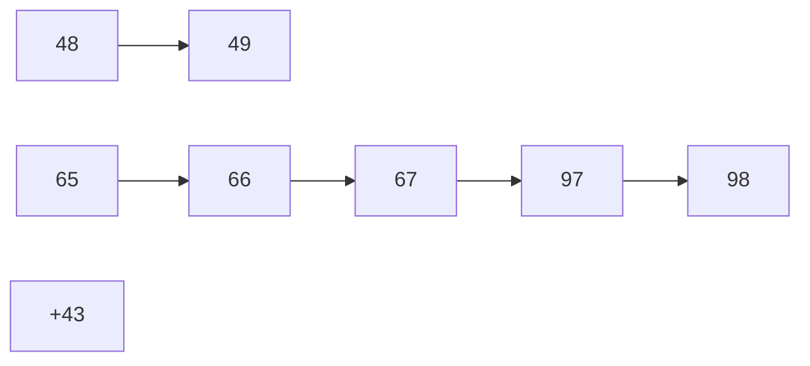
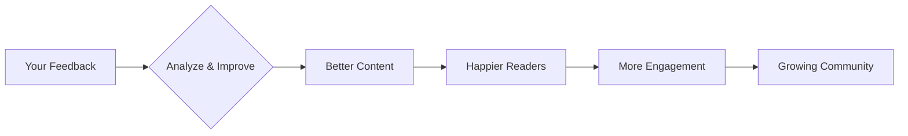

# <span style="color:#e67e22;">What we will learn in this post?</span>
<ul style='list-style-type: none; padding-left: 0;'>
<li><span style='color: #2980b9; font-size: 20px; font-weight: bold;'>👉</span> <span style='color: #2ecc71; font-size: 18px; font-weight: bold;'>Data Types in C</span></li>
<li><span style='color: #2980b9; font-size: 20px; font-weight: bold;'>👉</span> <span style='color: #2ecc71; font-size: 18px; font-weight: bold;'>Data Type Modifiers in C</span></li>
<li><span style='color: #2980b9; font-size: 20px; font-weight: bold;'>👉</span> <span style='color: #2ecc71; font-size: 18px; font-weight: bold;'>Literals in C</span></li>
<li><span style='color: #2980b9; font-size: 20px; font-weight: bold;'>👉</span> <span style='color: #2ecc71; font-size: 18px; font-weight: bold;'>Escape Sequence in C</span></li>
<li><span style='color: #2980b9; font-size: 20px; font-weight: bold;'>👉</span> <span style='color: #2ecc71; font-size: 18px; font-weight: bold;'>bool in C</span></li>
<li><span style='color: #2980b9; font-size: 20px; font-weight: bold;'>👉</span> <span style='color: #2ecc71; font-size: 18px; font-weight: bold;'>Integer Promotions in C</span></li>
<li><span style='color: #2980b9; font-size: 20px; font-weight: bold;'>👉</span> <span style='color: #2ecc71; font-size: 18px; font-weight: bold;'>Character Arithmetic in C</span></li>
<li><span style='color: #2980b9; font-size: 20px; font-weight: bold;'>👉</span> <span style='color: #2ecc71; font-size: 18px; font-weight: bold;'>Type Conversion in C</span></li>
<li><span style='color: #2980b9; font-size: 20px; font-weight: bold;'>👉</span> <span style='color: #2ecc71; font-size: 18px; font-weight: bold;'>Conclusion!</span></li>
</ul>

# <span style="color:#e67e22">C Data Types: A Visual Guide 🧮</span>


C is a powerful language, but understanding its data types is crucial.  This guide visually explores the fundamental data types, explaining their sizes and uses with examples.


## <span style="color:#2980b9">Basic Data Types 🧱</span>

These are the building blocks of C programming. They define the kind of values a variable can hold and how much memory it occupies.

### <span style="color:#8e44ad">Integers (`int`) 🔢</span>

*   **Description:** Used to store whole numbers (without decimal points).
*   **Size:** Typically 4 bytes (32 bits) on most modern systems, but can vary depending on the compiler and system architecture.  Can represent numbers from approximately -2 billion to +2 billion.
*   **Example:**

```c
#include <stdio.h>
#include <limits.h> // For INT_MAX and INT_MIN

int main() {
  int age = 30;
  printf("Age: %d\n", age); // Output: Age: 30
  printf("Size of int: %zu bytes\n", sizeof(int)); //Output: Size of int: 4 bytes (likely)
  printf("Minimum int value: %d\n", INT_MIN); // Output: Minimum int value: -2147483648 (likely)
  printf("Maximum int value: %d\n", INT_MAX); // Output: Maximum int value: 2147483647 (likely)
  return 0;
}
```

### <span style="color:#8e44ad">Floating-Point Numbers (`float`, `double`) 📈</span>

*   **Description:** Used to store numbers with decimal points. `double` provides higher precision than `float`.
*   **Size:** `float`: Typically 4 bytes; `double`: Typically 8 bytes.
*   **Example:**

```c
#include <stdio.h>

int main() {
  float price = 99.99;
  double pi = 3.14159265358979323846; 
  printf("Price: %.2f\n", price); // Output: Price: 99.99
  printf("Pi: %.17f\n", pi);    // Output: Pi: 3.14159265358979312 (might vary slightly)
  printf("Size of float: %zu bytes\n", sizeof(float)); //Output: Size of float: 4 bytes (likely)
  printf("Size of double: %zu bytes\n", sizeof(double)); //Output: Size of double: 8 bytes (likely)
  return 0;
}
```

### <span style="color:#8e44ad">Characters (`char`) 🔤</span>

*   **Description:** Used to store single characters.  They are essentially small integers representing ASCII or Unicode values.
*   **Size:** Typically 1 byte.
*   **Example:**

```c
#include <stdio.h>

int main() {
  char initial = 'J';
  printf("Initial: %c\n", initial); // Output: Initial: J
  printf("Size of char: %zu bytes\n", sizeof(char)); //Output: Size of char: 1 byte (likely)
  return 0;
}
```


## <span style="color:#2980b9">Other Important Types ✨</span>


*   **`void`**: Represents the absence of a type. Used in functions that don't return a value or in pointers that can point to any data type.
*   **`bool` (C99 and later)**: Represents boolean values (true or false).  Often implemented as `_Bool`, which is typically 1 byte.


## <span style="color:#2980b9">Memory Representation 🤔</span>

The size of each data type influences how much memory it consumes.  Larger types require more memory.  This is important for memory management and efficiency.


```mermaid
graph LR
    A[int (4 bytes)] --> B(Stores whole numbers);
    C[float (4 bytes)] --> D(Stores decimal numbers);
    E[double (8 bytes)] --> F(Stores high-precision decimals);
    G[char (1 byte)] --> H(Stores single characters);
```

Remember that the exact sizes might vary slightly depending on your compiler and system. Always use `sizeof()` to determine the size on your specific environment.  This is critical for writing portable and efficient code.


# <span style="color:#e67e22">C Data Type Modifiers 🛠️</span>


In C programming, you can modify the basic data types (like `int`, `char`, etc.) to fine-tune their size and range.  These modifiers are like adding extra features to your building blocks! Let's explore the common ones:


## <span style="color:#2980b9">Size Modifiers: `short` and `long` 📏</span>


These modifiers primarily affect the *size* (number of bytes) and thus the *range* of integer types.


### <span style="color:#8e44ad">`short` 🤏</span>

The `short` modifier generally creates a smaller integer type than the default `int`.  It's not guaranteed to be a specific size (it's implementation-defined), but it's usually 2 bytes (16 bits).


* **Example:**

```c
#include <stdio.h>
#include <limits.h> //For limits of data types

int main() {
  short int smallNum = 32767;  //Usually the maximum value for a 2-byte short
  printf("Size of short int: %zu bytes\n", sizeof(short int)); //Output: Size of short int: 2 bytes (might vary)
  printf("Maximum value of short int: %d\n", SHRT_MAX); //Output: Maximum value of short int: 32767 (might vary)
  printf("Small number: %d\n", smallNum); //Output: Small number: 32767
  return 0;
}
```


### <span style="color:#8e44ad">`long` 📏</span>

`long` creates a larger integer type than the default `int`. Again, its exact size is implementation-defined, but it's often 4 bytes (32 bits) or even 8 bytes (64 bits) depending on your system's architecture (32-bit vs. 64-bit).  You can also use `long long` for an even larger integer.


* **Example:**

```c
#include <stdio.h>
#include <limits.h>

int main() {
  long int largeNum = 2147483647; //Usually the maximum value for a 4-byte long
  printf("Size of long int: %zu bytes\n", sizeof(long int)); //Output: Size of long int: 4 or 8 bytes (implementation-defined)
  printf("Maximum value of long int: %ld\n", LONG_MAX); //Output: Maximum value of long int: 2147483647 (might vary)
  printf("Large number: %ld\n", largeNum); //Output: Large number: 2147483647
  return 0;
}
```


## <span style="color:#2980b9">Sign Modifiers: `signed` and `unsigned` ➕➖</span>


These modifiers control the *representation* of numbers—whether they can be positive, negative, or only positive.


### <span style="color:#8e44ad">`signed` ➕➖</span>

This is the *default* for integer types.  It means the number can be positive or negative.  The first bit is used to represent the sign (+ or -).


### <span style="color:#8e44ad">`unsigned` ➕</span>

This modifier indicates that the number will *always* be positive or zero.  All bits are used to represent the magnitude of the number. This doubles the maximum positive value compared to a signed integer of the same size but eliminates the possibility of negative values.


* **Example:**

```c
#include <stdio.h>
#include <limits.h>

int main() {
  unsigned int positiveNum = 4294967295; //Usually the maximum value for a 4-byte unsigned int
  signed int signedNum = -10;

  printf("Size of unsigned int: %zu bytes\n", sizeof(unsigned int)); //Output: Size of unsigned int: 4 bytes (usually)
  printf("Maximum value of unsigned int: %u\n", UINT_MAX); //Output: Maximum value of unsigned int: 4294967295 (might vary)
  printf("Positive number: %u\n", positiveNum); //Output: Positive number: 4294967295
  printf("Signed number: %d\n", signedNum); //Output: Signed number: -10
  return 0;
}
```


## <span style="color:#2980b9">Data Type Modifier Combinations 🔀</span>

You can combine these modifiers.  For instance, `unsigned long long int` creates a very large, positive-only integer.


## <span style="color:#2980b9">Choosing the Right Modifier 🤔</span>

The best modifier depends on your needs:

* **Memory:** Use `short` if you need to conserve memory.
* **Range:** Use `long` or `long long` if you need to store very large numbers.
* **Sign:** Use `unsigned` if you only need positive values (increases the positive range).

Remember that the precise size of data types can vary slightly between compilers and systems, so it's always good to use `sizeof()` to check.


```mermaid
graph TD
    A[Base Data Type (e.g., int)] --> B{Modifier?};
    B -- Yes --> C[Modified Data Type];
    C --> D{short?};
    C --> E{long?};
    C --> F{signed?};
    C --> G{unsigned?};
    D --> H[smaller size];
    E --> I[larger size];
    F --> J[positive and negative];
    G --> K[positive only];
    B -- No --> A;
```


# <span style="color:#e67e22">Literals in C Programming 🧮</span>

Literals in C are constant values that are directly written into the source code.  They represent fixed data that the compiler can understand and use during program execution. Think of them as the raw ingredients you provide to your C program.

## <span style="color:#2980b9">Integer Literals 🔢</span>

Integer literals represent whole numbers without any fractional part.  They can be expressed in decimal, octal (base-8), or hexadecimal (base-16) formats.

### <span style="color:#8e44ad">Decimal Literals</span>

These are the most common type of integer literal, represented as a sequence of digits (0-9).

* **Example:**

```c
int age = 30; // age is assigned the decimal literal 30
printf("Age: %d\n", age); // Output: Age: 30
```

### <span style="color:#8e44ad">Octal Literals</span>

Octal literals start with a leading `0` and are composed of digits (0-7).

* **Example:**

```c
int octalValue = 012; // octal literal representing 10 in decimal
printf("Octal Value: %d\n", octalValue); // Output: Octal Value: 10
```

### <span style="color:#8e44ad">Hexadecimal Literals</span>

Hexadecimal literals start with `0x` or `0X` and are composed of digits (0-9) and letters (A-F or a-f, where A-F represent 10-15).

* **Example:**

```c
int hexValue = 0x1A; // hexadecimal literal representing 26 in decimal
printf("Hex Value: %d\n", hexValue); // Output: Hex Value: 26
```


## <span style="color:#2980b9">Floating-Point Literals 📈</span>

Floating-point literals represent numbers with fractional parts. They can be expressed in either decimal or exponential notation.

* **Example (Decimal):**

```c
float price = 99.99;
double pi = 3.14159;
printf("Price: %.2f\n", price); // Output: Price: 99.99
printf("Pi: %f\n", pi); // Output: Pi: 3.141590
```

* **Example (Exponential):**

```c
float smallNumber = 1.2e-3; // 1.2 x 10^-3 = 0.0012
double bigNumber = 6.022e23; // 6.022 x 10^23 (Avogadro's Number)
printf("Small Number: %e\n", smallNumber); // Output: Small Number: 1.200000e-03
printf("Big Number: %e\n", bigNumber); // Output: Big Number: 6.022000e+23
```

## <span style="color:#2980b9">Character Literals 🔤</span>

Character literals represent single characters enclosed in single quotes.  Special escape sequences can be used to represent non-printable characters.

* **Example:**

```c
char initial = 'J';
char newline = '\n'; //newline character
char tab = '\t'; //tab character
printf("Initial: %c\n", initial); // Output: Initial: J
printf("Hello\nWorld\n"); // Output: Hello (newline) World (newline)
printf("Name\tAge\n"); //Output: Name    Age (tab)

```


## <span style="color:#2980b9">String Literals 📜</span>

String literals represent sequences of characters enclosed in double quotes. They are actually arrays of characters terminated by a null character ('\0').

* **Example:**

```c
char* greeting = "Hello, World!";
printf("%s\n", greeting); // Output: Hello, World!
```

## <span style="color:#2980b9">Boolean Literals ☑️</span>  (C99 and later)

Boolean literals represent truth values: `true` (represented as 1) and `false` (represented as 0).  Note that older C standards may not explicitly support `bool`.

* **Example:**

```c
#include <stdbool.h> //needed for bool
bool isAdult = true;
bool isMinor = false;
printf("Is Adult: %d\n", isAdult);  // Output: Is Adult: 1
printf("Is Minor: %d\n", isMinor); // Output: Is Minor: 0
```


This comprehensive guide explains the different types of literals in C with clear examples and explanations.  Remember that understanding literals is crucial for writing any C program! 🎉


# <span style="color:#e67e22">Escape Sequences in C: Unveiling Hidden Characters 🤫</span>

Escape sequences in C are special combinations of characters that represent characters that are difficult or impossible to type directly.  They allow you to include special formatting and control characters within your strings. Think of them as secret codes that tell the compiler to do something specific! ✨

## <span style="color:#2980b9">Understanding the Basics 💡</span>

Escape sequences always begin with a backslash (`\`).  Following the backslash is a character that determines the action. For example, `\n` represents a newline character, while `\t` represents a tab.

### <span style="color:#8e44ad">Common Escape Sequences</span>

Here's a table summarizing some frequently used escape sequences:

| Escape Sequence | Description                               | Example                                   | Output                                      |
|-----------------|-------------------------------------------|--------------------------------------------|---------------------------------------------|
| `\n`            | Newline (moves cursor to the next line)     | `printf("Hello\nWorld");`                 | // Hello <br> World                        |
| `\t`            | Horizontal tab (moves cursor to the next tab stop) | `printf("Name:\tAge:\nJohn\t30");`          | // Name:	Age: <br> John	30                 |
| `\\`            | Backslash (prints a backslash character)   | `printf("This is a backslash: \\");`       | // This is a backslash: \                    |
| `\'`            | Single quote (prints a single quote)        | `printf("This is a single quote: \'");`    | // This is a single quote: '                  |
| `\"`            | Double quote (prints a double quote)       | `printf("This is a double quote: \"");`   | // This is a double quote: "                 |
| `\?`            | Question mark (prints a question mark)     | `printf("This is a question mark: \?");` | // This is a question mark: ?                 |
| `\0`            | Null character (marks the end of a string) | `char str[] = "Hello\0World";`            | // Only "Hello" will be printed            |
| `\a`            | Alert (typically a beep)                 | `printf("\a");`                           | // *Beep!* (depends on the system)            |
| `\r`            | Carriage return (moves cursor to the beginning of the line) | `printf("Hello\rWorld");`                | // World (Overwrites "Hello")               |
| `\v`            | Vertical tab                               | `printf("Line1\vLine2");`                | // Line1 (moves cursor down vertically) Line2 |


## <span style="color:#2980b9">Examples in Action 🚀</span>


Here are a few examples demonstrating the use of escape sequences in C strings:


```c
#include <stdio.h>

int main() {
  printf("This is a single line.\n"); // Output: This is a single line. (new line)
  printf("This uses a tab:\tTabbed text.\n"); // Output: This uses a tab:	Tabbed text. (tab and new line)
  printf("This is a \"quoted\" string.\n"); // Output: This is a "quoted" string. (double quotes)
  printf("Backslash: \\ \n"); // Output: Backslash: \ (backslash)
  return 0;
}
```

## <span style="color:#2980b9">Why Use Escape Sequences? 🤔</span>

* **Special Characters:**  Escape sequences allow you to include characters that have special meanings in C, such as double quotes within a string literal.
* **Control Flow:** They provide a way to control the output formatting, such as moving the cursor to a new line or inserting tabs.
* **String Termination:** The null character (`\0`) is crucial for marking the end of a C-style string.

## <span style="color:#2980b9">Visual Representation with Mermaid.js 📊</span>

```mermaid
graph LR
A[Escape Sequence \\] --> B(Character);
B --> C{Newline (\n), Tab (\t), etc.};
C --> D[Formatted Output];
```

This diagram shows how an escape sequence leads to a specific character and ultimately affects the output.  Remember that the choice of escape sequence dictates the resulting formatting or character displayed!


By understanding and effectively using escape sequences, you gain greater control over your C programs' output and improve the readability of your code! 🎉


# <span style="color:#e67e22">Boolean Logic in C: Unveiling the `bool` Type 💡</span>

C, traditionally known for its flexibility and low-level access, didn't initially have a dedicated Boolean data type.  Early C programmers relied on integer types (typically `int`) to represent true/false values. However, the introduction of the `bool` type significantly improved code readability and maintainability.

## <span style="color:#2980b9">The Arrival of `bool` 📅</span>

The `bool` data type was officially introduced in the **C99 standard**. Before C99, programmers often used `0` for false and any non-zero value for true, leading to potential ambiguity.

### <span style="color:#8e44ad">Why `bool` Matters 🤔</span>

* **Improved Readability:** Using `bool` makes your code much clearer and easier to understand.  Instead of cryptic `if (x == 0)` statements, you can write `if (!myBool)`, which is far more self-explanatory.
* **Reduced Errors:**  Explicitly using `bool` minimizes the risk of accidental misinterpretations of integer values as Boolean conditions.
* **Enhanced Maintainability:**  Cleaner code is easier to maintain and debug.

## <span style="color:#2980b9">Using `bool` in Practice 💻</span>

To use `bool`, you need to include the `<stdbool.h>` header file. This header defines the `bool` type and the Boolean literals `true` and `false`.

```c
#include <stdio.h>
#include <stdbool.h>

int main() {
  bool isAdult = true;  // Declare a boolean variable and assign true
  bool isRainy = false; // Declare a boolean variable and assign false

  if (isAdult) {
    printf("You are an adult.\n"); //This will print
  }

  if (!isRainy) {
    printf("It's not raining.\n"); //This will print
  }

  int age = 20;
  bool isEligible = (age >= 18); //Boolean expression
  if(isEligible){
    printf("Eligible to vote!\n"); // This will print
  }

  return 0;
}
```

/* Output:
You are an adult.
It's not raining.
Eligible to vote!
*/


## <span style="color:#2980b9">Boolean Expressions and Operators 🧮</span>

You can use Boolean operators like `&&` (AND), `||` (OR), and `!` (NOT) to create complex Boolean expressions.

```c
bool a = true;
bool b = false;

bool resultAnd = a && b; // false
bool resultOr = a || b;  // true
bool resultNot = !a;    // false

printf("a && b: %s\n", resultAnd ? "true" : "false"); //Output: a && b: false
printf("a || b: %s\n", resultOr ? "true" : "false");  //Output: a || b: true
printf("!a: %s\n", resultNot ? "true" : "false");     //Output: !a: false
```

## <span style="color:#2980b9">Visualizing Boolean Logic with a Flowchart 📊</span>

```mermaid
graph TD
    A[Input a: true] --> B{a && b};
    C[Input b: false] --> B;
    B -- false --> D[Result: false];
    E[Input a: true] --> F{a || b};
    C --> F;
    F -- true --> G[Result: true];
```

This flowchart visually represents the AND and OR operations used in the previous example.

## <span style="color:#2980b9">Conclusion 🎉</span>

The `bool` data type is a valuable addition to C, enhancing code clarity and reducing errors. While not mandatory, its use is highly recommended for writing robust and maintainable C programs, particularly in larger projects.  Embrace the power of `bool` for a cleaner and more expressive coding experience!


# <span style="color:#e67e22">Integer Promotions in C 🧮</span>


## <span style="color:#2980b9">Understanding the Basics 🤔</span>

C, being a powerful language, handles different integer types (like `char`, `short`, `int`) with varying sizes depending on the system architecture.  To ensure consistent and predictable behavior during arithmetic operations, C employs a process called *integer promotion*.  This means that smaller integer types are automatically converted to a larger type before calculations are performed.  This prevents potential data loss and ensures consistent results across different platforms.


### <span style="color:#8e44ad">The Promotion Process ⬆️</span>

The integer promotion rules are straightforward:

* **Smaller than `int`:**  If an operand is of type `char`, `short`, or `unsigned char`, `unsigned short`, it's promoted to `int` if `int` can represent all the values of the original type. Otherwise, it's promoted to `unsigned int`.

* **Larger than or equal to `int`:**  Types like `int`, `long`, `long long`, `unsigned int`, `unsigned long`, and `unsigned long long` remain unchanged.  No promotion occurs.


## <span style="color:#2980b9">Illustrative Examples 💡</span>


Let's examine some examples to solidify the concept:

```c
#include <stdio.h>

int main() {
    char a = 10;
    short b = 20;
    int c = 30;

    // a + b: Both 'a' and 'b' are promoted to 'int' before addition.
    int sum_ab = a + b; 
    printf("a + b = %d\n", sum_ab); // Output: a + b = 30

    // a + c: 'a' is promoted to 'int', 'c' remains 'int'.
    int sum_ac = a + c;
    printf("a + c = %d\n", sum_ac); // Output: a + c = 40

    unsigned short d = 65535; //Max value for a 16-bit unsigned short
    int e = 1;
    int sum_de = d + e; // d is promoted to int then added
    printf("d + e = %d\n", sum_de); //Output: d + e = 65536

    return 0;
}
```


### <span style="color:#8e44ad">Flowchart of Promotion</span>

```mermaid
graph TD
    A[Operand Type] --> B{Smaller than int?};
    B -- Yes --> C[Promote to int (if possible) or unsigned int];
    B -- No --> D[No Promotion];
    C --> E[Result];
    D --> E;
    E --> F[Arithmetic Operation];
```


## <span style="color:#2980b9">Why Integer Promotion Matters 👍</span>


* **Data Consistency:**  Ensures consistent results irrespective of the underlying hardware architecture.
* **Avoids Data Loss:** Prevents the truncation of data that could occur if smaller types were directly used in operations with larger types.
* **Simplified Compiler Design:**  Simplifies the compiler's task by reducing the number of different arithmetic operations it needs to handle.


## <span style="color:#2980b9">Important Considerations ⚠️</span>

While integer promotion simplifies things, be mindful of potential *overflows*. If the result of an operation exceeds the capacity of the promoted type, unpredictable behavior might occur.  Consider using larger integer types (like `long long`) when working with potentially large numbers to mitigate this risk.  Always remember to choose the appropriate data type according to your program's needs.


# <span style="color:#e67e22">Character Arithmetic in C: A Fun Dive 🧮</span>

In C, characters aren't just letters, numbers, or symbols; they're secretly integers!  This might seem strange at first, but it's the key to understanding character arithmetic.  Each character is assigned a unique numerical value based on a character encoding scheme, most commonly ASCII (American Standard Code for Information Interchange).  This allows us to perform mathematical operations directly on characters.

## <span style="color:#2980b9">ASCII Representation: The Secret Code 🤫</span>

ASCII assigns a 7-bit integer value to each character.  For example:

* 'A' is represented as 65
* 'a' is represented as 97
* '0' is represented as 48
* '+' is represented as 43

This means we can treat 'A' as the integer 65 in our code.  Let's see how this works!

### <span style="color:#8e44ad">Visualizing ASCII</span>




## <span style="color:#2980b9">Performing Arithmetic on Characters ✨</span>

Because characters are essentially integers, we can add, subtract, multiply, and even do more complex operations on them.

### <span style="color:#8e44ad">Addition and Subtraction Examples</span>

Let's add and subtract characters:


```c
#include <stdio.h>

int main() {
  char ch1 = 'A'; // 65
  char ch2 = 'a'; // 97
  char ch3 = '5'; // 53

  char sum1 = ch1 + ch2; // 65 + 97 = 162
  char diff1 = ch2 - ch1; // 97 - 65 = 32
  char sum2 = ch3 + 5;  // 53 + 5 = 58

  printf("Sum of 'A' and 'a': %d \n", sum1); // Output: 162
  printf("Difference between 'a' and 'A': %d \n", diff1); // Output: 32
  printf("Result of adding 5 to '5': %d \n", sum2); // Output: 58

  return 0;
}
```

**Note:** The output shows the *integer* representation of the result, not necessarily a printable character.


### <span style="color:#8e44ad">Incrementing and Decrementing Characters</span>

We can easily increment or decrement characters to move through the ASCII table.

```c
#include <stdio.h>

int main() {
  char ch = 'A';
  ch++; //ch is now 'B'
  printf("Incremented character: %c \n", ch); //Output: B

  ch--; // ch is back to 'A'
  printf("Decremented character: %c \n", ch); //Output: A

  return 0;
}
```

This is particularly useful for cycling through uppercase or lowercase letters.


## <span style="color:#2980b9">Important Considerations 🤔</span>

* **Data Type:** Be mindful of potential integer overflow if your calculations exceed the range of a `char`.
* **Character Encoding:**  While ASCII is common, other encodings (like UTF-8) exist, affecting character values.
* **Printing Characters:**  Use the `%c` format specifier in `printf` to print the character representation, and `%d` to print the integer value.


## <span style="color:#2980b9">Practical Applications 💡</span>

Character arithmetic is surprisingly useful:

* **Converting between uppercase and lowercase:**  Adding or subtracting 32 can switch a letter's case.
* **Simple ciphers:** Basic encryption techniques can use character arithmetic to shift characters.
* **Generating character sequences:** You can create loops that generate sequences of characters.


This exploration of character arithmetic in C demonstrates the power of treating seemingly simple data types like integers. Remember the underlying integer representation and be careful with data types and potential overflows. Happy coding! 🎉


# <span style="color:#e67e22">Type Conversion in C 🔄</span>

Type conversion, also known as *casting*, is the process of changing a variable from one data type to another.  This is crucial in C because the compiler needs to know exactly what type of data it's working with to perform operations correctly.  C offers both *implicit* and *explicit* type conversion.

## <span style="color:#2980b9">Implicit Type Conversion (Automatic Type Promotion) ✨</span>

Implicit conversion happens automatically without the programmer explicitly specifying it. The compiler performs this conversion based on the context of the operation.  Typically, the compiler promotes a "smaller" data type to a "larger" data type to avoid data loss.

### <span style="color:#8e44ad">Examples of Implicit Conversion</span>

* **Mixing `int` and `float`:**

```c
#include <stdio.h>

int main() {
  int numInt = 10;
  float numFloat = 2.5;
  float sum = numInt + numFloat; // numInt is implicitly converted to float before addition

  printf("Sum: %f\n", sum); // Output: Sum: 12.500000  (numInt promoted to float)
  return 0;
}
```

* **`char` to `int`:**

```c
#include <stdio.h>

int main() {
    char ch = 'A';
    int asciiVal = ch; // ch is implicitly converted to its ASCII value (65)

    printf("ASCII value of 'A': %d\n", asciiVal); // Output: ASCII value of 'A': 65
    return 0;
}
```

**Mermaid Flowchart illustrating Implicit Conversion:**

```mermaid
graph LR
A[Smaller Data Type (e.g., int)] --> B{Compiler Detects Mixed Types};
B -- Different Types --> C[Automatic Type Promotion to Larger Type (e.g., float)];
C --> D[Operation Performed];
D --> E[Result];
```


## <span style="color:#2980b9">Explicit Type Conversion (Casting) 🎯</span>

Explicit conversion, also known as *casting*, is when the programmer explicitly tells the compiler to convert a variable from one type to another using *type casting operators*.  This gives the programmer more control but also requires more care to avoid unexpected results (like data truncation).

### <span style="color:#8e44ad">Examples of Explicit Conversion</span>

* **`float` to `int`:**

```c
#include <stdio.h>

int main() {
  float numFloat = 12.75;
  int numInt = (int)numFloat; // Explicit conversion using casting

  printf("Integer part: %d\n", numInt); // Output: Integer part: 12 (Fractional part is truncated)
  return 0;
}
```

* **`int` to `char`:**

```c
#include <stdio.h>

int main() {
    int num = 65;
    char ch = (char)num; // Explicitly cast the integer to a character

    printf("Character: %c\n", ch); // Output: Character: A
    return 0;
}
```


**Important Note:**  Be mindful of potential data loss during explicit conversion, especially when converting from a larger type to a smaller type (e.g., `double` to `int`).

### <span style="color:#8e44ad">When to Use Explicit Conversion</span>

* When you need to force a specific type for an operation (e.g., to ensure compatibility in a function call).
* When you're aware of potential data loss and are prepared to manage it.
* When dealing with pointers and memory addresses.


Explicit type conversion is powerful but demands careful consideration of potential consequences.  Understanding both implicit and explicit type conversion is essential for writing correct and efficient C code. 

This detailed explanation with examples and visuals helps clarify the concept of type conversion in C. Remember to always compile and run the code examples to fully grasp the outputs.


<h1><span style='color:#e67e22'>Conclusion</span></h1>

So, there you have it!  We've covered a lot of ground today, from [mention a key topic from the blog post] to [mention another key topic].  Hopefully, you found this post helpful and informative 🤔.  We've tried our best to make it clear and engaging, but we're always looking for ways to improve! ✨

## <span style="color:#2980b9">Your Feedback Matters! 😃</span>

This is where *you* come in!  We value your thoughts and opinions, and your feedback is crucial to help us create even better content in the future.  Did you find anything confusing?  Do you have any suggestions for future topics?  Or maybe you just want to share your own experiences related to what we've discussed?

### <span style="color:#8e44ad">Share Your Thoughts! 🗣️</span>

Don't be shy!  Head down to the comments section below and let us know what you think.  We're excited to hear from you and engage in a discussion.  Every comment, suggestion, and piece of feedback helps us grow and improve.  Let's build a community together! 🥳

Here's a quick visual summary of how your feedback helps us:



* **We appreciate all types of feedback:**  positive, negative, or suggestions for improvement.
* **Your comments help us shape future posts:**  Your input directly influences the content we create.
* **Join the conversation:** Engage with other readers and share your insights!


We can't wait to read what you have to say!  👇


