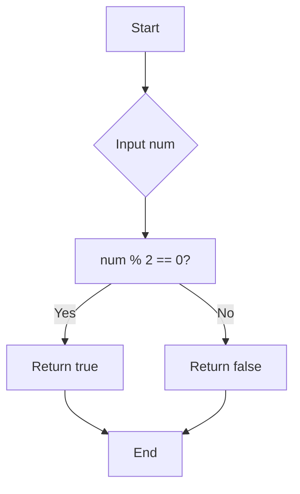
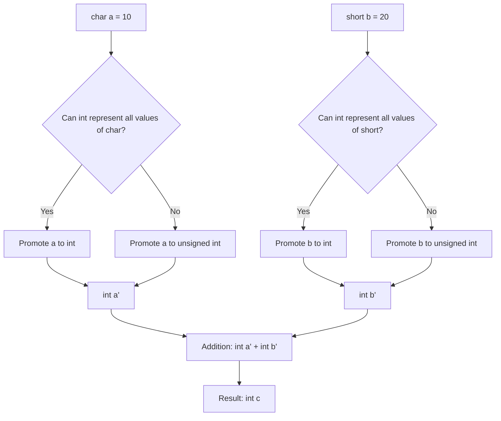
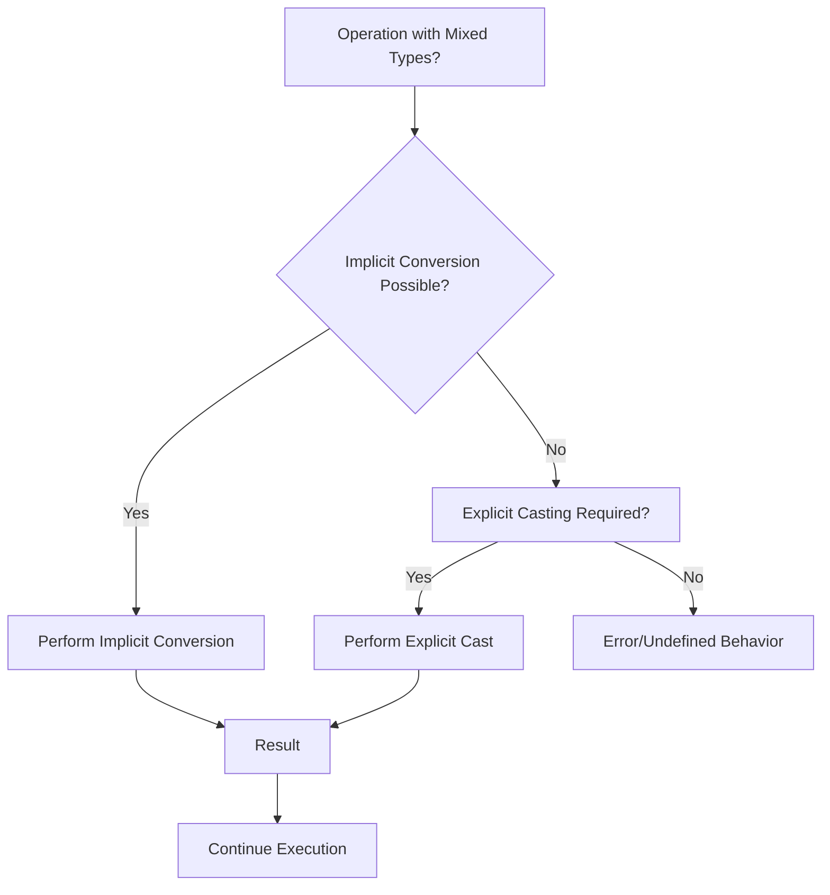
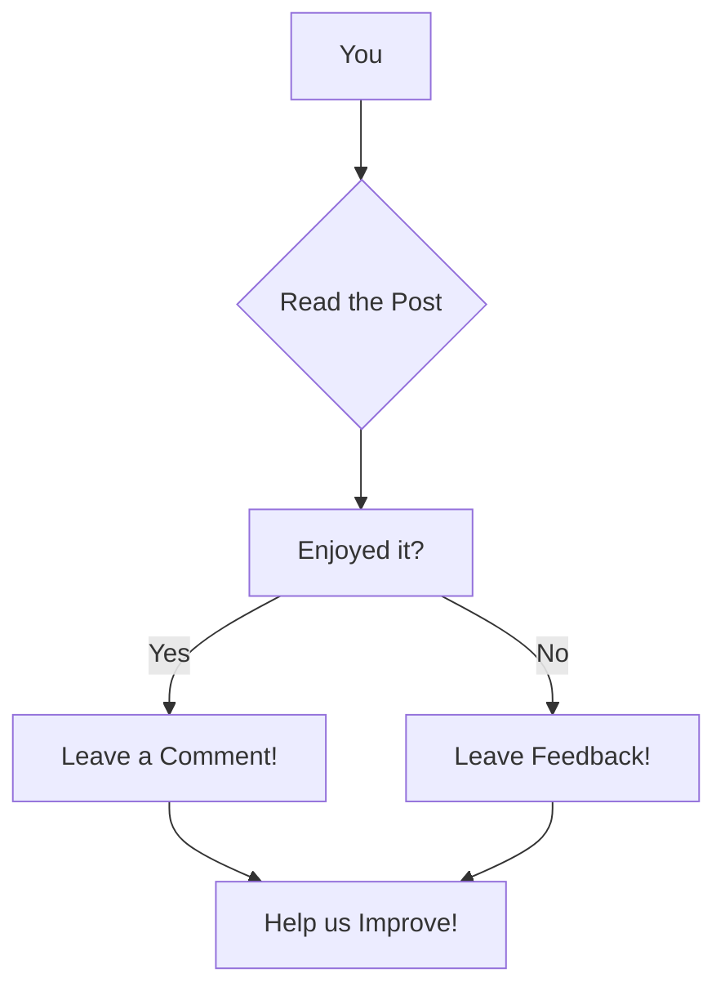

# <span style="color:#e67e22;">What we will learn in this post?</span>
<ul style='list-style-type: none; padding-left: 0;'>
<li><span style='color: #2980b9; font-size: 20px; font-weight: bold;'>👉</span> <span style='color: #2ecc71; font-size: 18px; font-weight: bold;'>Data Types in C</span></li>
<li><span style='color: #2980b9; font-size: 20px; font-weight: bold;'>👉</span> <span style='color: #2ecc71; font-size: 18px; font-weight: bold;'>Data Type Modifiers in C</span></li>
<li><span style='color: #2980b9; font-size: 20px; font-weight: bold;'>👉</span> <span style='color: #2ecc71; font-size: 18px; font-weight: bold;'>Literals in C</span></li>
<li><span style='color: #2980b9; font-size: 20px; font-weight: bold;'>👉</span> <span style='color: #2ecc71; font-size: 18px; font-weight: bold;'>Escape Sequence in C</span></li>
<li><span style='color: #2980b9; font-size: 20px; font-weight: bold;'>👉</span> <span style='color: #2ecc71; font-size: 18px; font-weight: bold;'>bool in C</span></li>
<li><span style='color: #2980b9; font-size: 20px; font-weight: bold;'>👉</span> <span style='color: #2ecc71; font-size: 18px; font-weight: bold;'>Integer Promotions in C</span></li>
<li><span style='color: #2980b9; font-size: 20px; font-weight: bold;'>👉</span> <span style='color: #2ecc71; font-size: 18px; font-weight: bold;'>Character Arithmetic in C</span></li>
<li><span style='color: #2980b9; font-size: 20px; font-weight: bold;'>👉</span> <span style='color: #2ecc71; font-size: 18px; font-weight: bold;'>Type Conversion in C</span></li>
<li><span style='color: #2980b9; font-size: 20px; font-weight: bold;'>👉</span> <span style='color: #2ecc71; font-size: 18px; font-weight: bold;'>Conclusion!</span></li>
</ul>

# <span style="color:#e67e22">Exploring C Data Types 🧮</span>

C, a powerful programming language, offers a variety of data types to represent different kinds of information.  Understanding these types is crucial for writing efficient and correct programs. Let's delve into the fundamental data types:

## <span style="color:#2980b9">Basic Data Types 🧱</span>

These are the building blocks of C programming. They define the kind of values a variable can hold and how much memory it occupies.

### <span style="color:#8e44ad">Integer Types (int, short, long, etc.) 🔢</span>

These types store whole numbers (no decimal point).  The size (in bytes) of each type may vary depending on the system architecture (32-bit vs 64-bit), but generally:

* `short int` (or `short`): Typically 2 bytes.  *Example:* `short age = 25;`  // *Output:* age = 25
* `int`: Typically 4 bytes. *Example:* `int score = 1000;` // *Output:* score = 1000
* `long int` (or `long`): Typically 4 or 8 bytes. *Example:* `long population = 7800000000;` // *Output:* population = 7800000000
* `long long int` (or `long long`): Typically 8 bytes.  *Example:* `long long bigNumber = 9223372036854775807;` //*Output:* bigNumber = 9223372036854775807


### <span style="color:#8e44ad">Floating-Point Types (float, double, long double) 📈</span>

These types store numbers with decimal points.  Precision increases with the size:

* `float`: Typically 4 bytes (single precision). *Example:* `float price = 99.99;` // *Output:* price = 99.99
* `double`: Typically 8 bytes (double precision). *Example:* `double pi = 3.14159265359;` // *Output:* pi = 3.14159265359
* `long double`: Typically 10 or 16 bytes (extended precision). *Example:* `long double veryPrecise = 1.2345678901234567890;` // *Output:* veryPrecise = 1.2345678901234567890

### <span style="color:#8e44ad">Character Type (char) 🔤</span>

This type stores a single character.  It uses ASCII or Unicode encoding.

* `char`: Typically 1 byte.  *Example:* `char initial = 'J';` // *Output:* initial = J


## <span style="color:#2980b9">Memory Representation 💾</span>

The size of each data type determines how much memory it occupies.  This impacts program efficiency and memory usage.  Larger data types require more memory.

```mermaid
graph LR
    A[int (4 bytes)] --> B(Stores whole numbers);
    C[float (4 bytes)] --> D(Stores decimal numbers with single precision);
    E[char (1 byte)] --> F(Stores single character);
```

## <span style="color:#2980b9">Modifiers ⚙️</span>

C allows you to modify the basic data types using keywords like `signed`, `unsigned`, and `const`.

* `signed`:  Indicates that the variable can store both positive and negative values (default for `int`, `char`, etc.).
* `unsigned`: Indicates that the variable can only store non-negative values. This extends the positive range at the cost of losing the ability to represent negative numbers.
* `const`:  Declares a constant variable whose value cannot be changed after initialization.


## <span style="color:#2980b9">Example Program Illustrating Data Types ✨</span>

```c
#include <stdio.h>

int main() {
  int age = 30;
  float price = 25.99;
  char initial = 'A';
  unsigned int positive_number = 100; // Only positive values allowed.
  const float PI = 3.14159; // Constant value; cannot be changed

  printf("Age: %d\n", age);
  printf("Price: %.2f\n", price);
  printf("Initial: %c\n", initial);
  printf("Positive Number: %u\n", positive_number);
  printf("PI: %.5f\n", PI);

  return 0;
}
```

This program demonstrates the usage of different data types and their output. Remember to compile and run this code to see the actual output on your system. The output will vary slightly based on your system's architecture and compiler.

This comprehensive guide provides a clear understanding of C's fundamental data types, paving the way for more advanced programming concepts. Remember to consult your C compiler's documentation for precise size information for each data type on your specific system.


# <span style="color:#e67e22">C Data Type Modifiers Explained 🎉</span>

In C programming, we use *data type modifiers* to fine-tune the size and properties of our basic data types (like `int`, `char`, `double`).  Think of them as tools to adjust the precision and range of your variables. Let's explore the most common ones:

## <span style="color:#2980b9">Understanding the Modifiers ⚙️</span>

These modifiers change how much memory a variable occupies and what kind of values it can hold.  Here's a breakdown:


### <span style="color:#8e44ad">`short` and `long` 📏</span>

These modifiers primarily affect the *size* of `int`, `double`, and `float` variables.

* **`short`:**  Makes the integer type smaller (usually 2 bytes).  This reduces memory usage but limits the range of numbers you can store.
* **`long`:** Makes the integer or floating-point type larger (usually 4 or 8 bytes depending on the system and compiler). This increases the range of values you can store, but it uses more memory.
* **`long long`:** Extends the range even further than `long`. This is useful for storing extremely large integers.


**Examples:**

```c
#include <stdio.h>
#include <limits.h> // For integer limits

int main() {
  short shortInt = 32767; // Short int, typically 2 bytes
  long long longInt = 9223372036854775807; // Long long int, typically 8 bytes

  printf("Size of short int: %zu bytes\n", sizeof(shortInt));  // Output: Size of short int: 2 bytes
  printf("Size of long long int: %zu bytes\n", sizeof(longInt)); // Output: Size of long long int: 8 bytes
  printf("Maximum short int: %d\n", SHRT_MAX); //Output: Maximum short int: 32767
  printf("Maximum long long int: %lld\n", LLONG_MAX); //Output: Maximum long long int: 9223372036854775807

  return 0;
}
```


### <span style="color:#8e44ad">`signed` and `unsigned` ➕➖</span>

These modifiers specify the *range* of values a variable can hold:


* **`signed`:** (Default for `int`, `char`, etc.)  Allows both positive and negative numbers.  The highest bit represents the sign (0 for positive, 1 for negative).
* **`unsigned`:** Allows only non-negative numbers (0 and positive).  All bits are used to represent the magnitude of the number, effectively doubling the positive range compared to a `signed` type of the same size.


**Examples:**

```c
#include <stdio.h>
#include <limits.h>

int main() {
  unsigned int unsignedInt = 4294967295; // Usually 4 bytes, all positive
  signed int signedInt = -2147483648;  // Usually 4 bytes, positive and negative

  printf("Size of unsigned int: %zu bytes\n", sizeof(unsignedInt)); // Output: Size of unsigned int: 4 bytes
  printf("Size of signed int: %zu bytes\n", sizeof(signedInt)); // Output: Size of signed int: 4 bytes
  printf("Maximum unsigned int: %u\n", UINT_MAX); //Output: Maximum unsigned int: 4294967295
  printf("Minimum signed int: %d\n", INT_MIN); //Output: Minimum signed int: -2147483648
  return 0;
}
```


## <span style="color:#2980b9">Visualizing the Impact 📊</span>

Here's a simple illustration of how `signed` and `unsigned` impact the range of a 4-byte integer:


```mermaid
graph LR
    A[Signed Int (4 bytes)] --> B(Range: -2,147,483,648 to 2,147,483,647);
    C[Unsigned Int (4 bytes)] --> D(Range: 0 to 4,294,967,295);
```

## <span style="color:#2980b9">Choosing the Right Modifier 🤔</span>

The choice of modifier depends on your specific needs:


* Use `short` to save memory if you're sure your numbers will fit within its smaller range.
* Use `long` or `long long` when you need to represent very large numbers.
* Use `unsigned` when you're dealing with only positive values (e.g., counts, indices).  It can provide a larger positive range for the same number of bytes.  However, be aware that using `unsigned` variables with functions that expect `signed` variables can lead to unexpected behavior.


By understanding and strategically using these modifiers, you can write more efficient and effective C programs! ✨


# <span style="color:#e67e22">Literals in C: A Visual Guide 📖</span>


Literals in C are fixed values that are directly written into your code.  They represent the actual data you want your program to work with. Think of them as the raw ingredients of your program! 🎂


## <span style="color:#2980b9">Integer Literals 🔢</span>

Integer literals represent whole numbers without any fractional part.  They can be written in decimal, octal (base-8), or hexadecimal (base-16) format.

### <span style="color:#8e44ad">Decimal Literals</span>

These are the most common type, using base-10.

*   Example: `10`, `-5`, `0`, `2147483647` (maximum for a signed 32-bit integer)

```c
#include <stdio.h>

int main() {
  int decimalNum = 10;
  printf("Decimal Number: %d\n", decimalNum); // Output: Decimal Number: 10
  return 0;
}
```


### <span style="color:#8e44ad">Octal Literals</span>

Represented by a leading `0`.

*   Example: `012` (decimal equivalent is 10)

```c
#include <stdio.h>

int main() {
  int octalNum = 012;
  printf("Octal Number: %d\n", octalNum); // Output: Octal Number: 10
  return 0;
}
```


### <span style="color:#8e44ad">Hexadecimal Literals</span>

Represented by a leading `0x` or `0X`.  Use letters `A-F` (or `a-f`) for digits 10-15.

*   Example: `0xA` (decimal equivalent is 10), `0xFF` (decimal equivalent is 255)

```c
#include <stdio.h>

int main() {
  int hexNum = 0xA;
  printf("Hexadecimal Number: %d\n", hexNum); // Output: Hexadecimal Number: 10
  return 0;
}
```


## <span style="color:#2980b9">Floating-Point Literals 🧮</span>

These literals represent numbers with fractional parts.  They can be written in either decimal or exponential notation.

*   **Decimal Notation:** `3.14`, `-2.5`, `0.0`
*   **Exponential Notation:** `1.2e3` (1.2 * 10<sup>3</sup> = 1200), `-5.2E-2` (-5.2 * 10<sup>-2</sup> = -0.052)

```c
#include <stdio.h>

int main() {
  float floatNum = 3.14;
  double doubleNum = 1.2e3;
  printf("Float Number: %f\n", floatNum); // Output: Float Number: 3.140000
  printf("Double Number: %lf\n", doubleNum); // Output: Double Number: 1200.000000
  return 0;
}
```


## <span style="color:#2980b9">Character Literals 🔤</span>

These represent single characters enclosed within single quotes.

*   Example: `'A'`, `'b'`, `'5'`, `'\n'` (newline character), `'\t'` (tab character)

```c
#include <stdio.h>

int main() {
  char charA = 'A';
  printf("Character: %c\n", charA); // Output: Character: A
  return 0;
}
```


## <span style="color:#2980b9">String Literals 📜</span>

These represent sequences of characters enclosed within double quotes.  They are actually arrays of characters, automatically null-terminated (`\0`).

*   Example: `"Hello, world!"`, `"C Programming"`

```c
#include <stdio.h>

int main() {
  char* str = "Hello, world!";
  printf("String: %s\n", str); // Output: String: Hello, world!
  return 0;
}
```


## <span style="color:#2980b9">Boolean Literals (C99 and later) ☑️</span>

These represent truth values.  

*   `true` (represented as 1)
*   `false` (represented as 0)


```c
#include <stdio.h>
#include <stdbool.h>

int main() {
  bool isTrue = true;
  bool isFalse = false;
  printf("isTrue: %d\n", isTrue); //Output: isTrue: 1
  printf("isFalse: %d\n", isFalse); //Output: isFalse: 0
  return 0;
}
```


This comprehensive guide helps you understand and use different types of literals effectively in your C programs! 👍


# <span style="color:#e67e22">Escape Sequences in C: Unveiling Hidden Characters 🤫</span>

Escape sequences in C are special character combinations that let you represent characters that are difficult or impossible to type directly, such as newlines, tabs, or backslashes.  They start with a backslash (`\`), followed by a specific character.  Think of them as secret codes for your compiler! 🗝️


## <span style="color:#2980b9">Why Use Escape Sequences? 🤔</span>

* **Representing Special Characters:**  Some characters have special meanings in C (like the newline character that starts a new line).  Escape sequences allow you to use these characters *literally* within your strings.

* **Improving Readability:**  Escape sequences make your code cleaner and easier to read, especially when dealing with characters that aren't easily typed on a keyboard.

* **Portability:** Escape sequences provide a consistent way to represent certain characters regardless of the operating system or encoding.


## <span style="color:#2980b9">Common Escape Sequences ✨</span>

Here's a table showcasing frequently used escape sequences:

| Escape Sequence | Description                     | Example in String          | Output                               |
|-----------------|---------------------------------|-----------------------------|---------------------------------------|
| `\n`           | Newline (moves to the next line) | `"Hello\nWorld"`           | `Hello<br>World`                     |
| `\t`           | Horizontal tab                  | `"Name:\tJohn"`            | `Name:    John`                      |
| `\\`           | Backslash                       | `"C:\\Users"`              | `C:\Users`                          |
| `\"`           | Double quote                     | `"He said, \"Hello!\""`    | `He said, "Hello!"`                  |
| `\'`           | Single quote                     | `'It\'s a bird!'`         | `It's a bird!`                       |
| `\?`           | Question mark                    | `"What?\?"`                | `What??`                             |
| `\0`           | Null character (end of string)   | `"Hello\0World"`           | `Hello` (World is ignored)          |
| `\a`           | Alert (makes a beep sound)      | `printf("\a");`            | *(Produces a beep sound)*           |
| `\b`           | Backspace                       | `"Hello\bWorld"`           | `HelloWorld` (overwrites the 'o')   |
| `\r`           | Carriage return (moves to the beginning of the line) | `"Hello\rWorld"`       | `World` (overwrites "Hello")      |
| `\v`           | Vertical tab                    | `"Line1\vLine2"`           | *(Moves cursor down one line)*         |
| `\ooo`         | Octal representation of a char | `"\101"` (A in octal)     | `A`                                  |
| `\xhh`         | Hexadecimal representation of a char | `"\x41"` (A in hex)       | `A`                                  |


### <span style="color:#8e44ad">Example Code Snippets 💻</span>

```c
#include <stdio.h>

int main() {
    printf("This is a string with a newline character.\nThis is on the next line.\n"); //Output: This is a string with a newline character.
                                                                                    //This is on the next line.

    printf("Name:\tJohn Doe\n"); //Output: Name:	John Doe
    printf("Path: C:\\Users\\Documents\n"); //Output: Path: C:\Users\Documents

    printf("He said, \"Hello!\" \n"); //Output: He said, "Hello!"

    return 0;
}
```


## <span style="color:#2980b9">Escape Sequence Flowchart 🗺️</span>

```mermaid
graph TD
    A[Encounter Backslash (\)] --> B{Is it a valid escape sequence?};
    B -- Yes --> C[Interpret and replace with corresponding character];
    B -- No --> D[Treat backslash as a literal character];
    C --> E[Continue processing string];
    D --> E;
    E[End of String Processing]
```

This flowchart visually represents how the C compiler handles escape sequences.


This comprehensive guide, complete with visuals and examples, should provide a clear understanding of escape sequences in C. Remember to practice using these sequences to master them! 👍


# <span style="color:#e67e22">Boolean Bliss: Understanding the `bool` in C 😇</span>

The `bool` data type in C represents boolean values, which are simply *true* or *false*.  While not available in older C standards, it's a valuable addition for writing cleaner and more readable code.  Let's delve into its significance and usage.

## <span style="color:#2980b9">The Story of `bool` 📜</span>

Before C99, C programmers relied on integers (typically `int`) to represent boolean values: 0 for *false* and any non-zero value for *true*. This could lead to ambiguity and less readable code.  C99 introduced the `bool` type, making code much clearer and less prone to errors.  This improvement is a significant part of modern C programming practices.

### <span style="color:#8e44ad">Standard Compliance ⚖️</span>

The `bool` data type is part of the C99 standard and later standards (C11, C17, etc.).  To use it, you'll need a compiler that supports C99 or later.  Most modern C compilers do.


## <span style="color:#2980b9">Using the `bool` Type 🚀</span>

The `bool` type can hold only two values: `true` and `false`.

*   **Declaration:**  You declare boolean variables just like other types:

```c
bool isAdult;
bool isLoggedIn = false;
```

*   **Assignment:**  You assign values using `true` and `false`:

```c
isAdult = true;
```

*   **Header file:** Remember to include the `<stdbool.h>` header file:

```c
#include <stdbool.h>
```


*   **Comparison Operators:** Boolean variables are commonly used with comparison operators:

```c
int age = 20;
bool isEligible = (age >= 18); // isEligible will be true
```

*   **Conditional Statements:** They shine in conditional statements:

```c
if (isLoggedIn) {
    printf("Welcome back!\n");
} else {
    printf("Please log in.\n");
}
```

## <span style="color:#2980b9">Example: Checking for Even Numbers 🧮</span>

This example demonstrates a simple function that checks if a number is even using `bool`:

```c
#include <stdio.h>
#include <stdbool.h>

bool isEven(int num) {
    return (num % 2 == 0);  // Returns true if num is even, false otherwise
}

int main() {
    int number;
    printf("Enter an integer: ");
    scanf("%d", &number);

    if (isEven(number)) {
        printf("%d is even.\n", number);
    } else {
        printf("%d is odd.\n", number);
    }

    return 0;
}

/*
Example Output:
Enter an integer: 10
10 is even.

Enter an integer: 7
7 is odd.
*/
```

## <span style="color:#2980b9">Flowchart illustrating the `isEven` function 📊</span>




## <span style="color:#2980b9">Benefits of Using `bool` ✨</span>

*   **Readability:**  Code becomes significantly more readable and self-documenting.
*   **Maintainability:** Easier to understand and modify.
*   **Reduced Errors:** Less chance of misinterpreting integer values as boolean flags.


Using `bool` enhances the clarity and robustness of your C code, especially in larger projects.  It’s a simple yet powerful feature that makes your code more maintainable and easier to debug. Remember to always include `<stdbool.h>` when you use it!


# <span style="color:#e67e22">Integer Promotions in C: A Visual Guide 🧮</span>

C's integer promotion rules ensure that operations involving different integer types are performed consistently.  Smaller integer types are automatically "promoted" to larger ones before calculations, avoiding potential data loss and ensuring predictable results. Let's dive in!


## <span style="color:#2980b9">The Fundamentals 💡</span>

Integer promotion primarily involves converting smaller integer types (like `char`, `short`, `int`, etc.) to a larger type, usually `int` or `unsigned int`. This process happens *implicitly*—you don't need to write explicit casting code.  The goal is to have both operands of an arithmetic operation be of the same type.

### <span style="color:#8e44ad">Why Promote? 🤔</span>

* **Data Loss Prevention:**  Performing operations directly with smaller types can lead to unexpected truncation (losing information) because smaller types have limited bit widths. Promotion prevents this.
* **Consistent Results:**  Ensuring consistent types during arithmetic calculations creates more predictable and reliable code.
* **Efficiency (Sometimes):** In some architectures, operations on larger data types might be faster than their smaller counterparts.


## <span style="color:#2980b9">The Promotion Process ⬆️</span>

The promotion process follows these steps:

1. **If `int` can represent all the values of the original type,** the smaller integer type is promoted to `int`.
2. **If `int` *cannot* represent all values of the original type,** the smaller integer type is promoted to `unsigned int`.

This ensures that no data is lost during the promotion.

### <span style="color:#8e44ad">Illustrative Example 🔍</span>

```c
#include <stdio.h>

int main() {
    char a = 10;  // 8-bit signed integer
    short b = 20; // 16-bit signed integer
    int c = a + b; // a and b are promoted to int before addition

    printf("Result: %d\n", c); // Output: Result: 30
    return 0;
}
```

In this example, both `a` (char) and `b` (short) are promoted to `int` before the addition because `int` can represent all the possible values of both `char` and `short`.


## <span style="color:#2980b9">Visualizing the Process 📊</span>




## <span style="color:#2980b9">Important Considerations 🤔</span>

* **Unsigned Integers:**  Promotions involving unsigned integers can lead to slightly more complex behavior due to how unsigned arithmetic works.
* **`float` and `double`:**  Floating-point types also undergo promotions (usually to `double`), but that's a separate topic.
* **Compiler-Specifics:** While the general rules are standard, minor variations might exist between different C compilers.


## <span style="color:#2980b9">Example with Unsigned Int Unsigned Int Example ⚠️</span>

```c
#include <stdio.h>
#include <limits.h> //For CHAR_BIT

int main() {
    unsigned char a = 250;
    short b = -10;

    int c = a + b;

    printf("Result: %d\n", c); //Output: Result: 240 (Assuming CHAR_BIT = 8)
    //unsigned char (a) is promoted to int, -10 (b) is promoted to int. The result is 250 + (-10) = 240

    return 0;
}
```

In this example, `a` (unsigned char) is promoted to `int`, but the result is still an `int`. The behaviour is different than you might expect from solely considering the algebraic result, showing the impact of unsigned integer representation.


This guide provides a comprehensive overview of integer promotions in C.  Understanding these rules is crucial for writing correct, predictable, and efficient C code. Remember to always be mindful of the types involved in your operations!


# <span style="color:#e67e22">Character Arithmetic in C:  A Fun Dive 🔡</span>

In C, characters aren't just letters, numbers, or symbols; they're secretly integers!  This means you can perform arithmetic operations on them.  Let's explore how this works.


## <span style="color:#2980b9">Character Representation: The ASCII Code 🤖</span>

Every character is assigned a unique numerical value based on the ASCII (American Standard Code for Information Interchange) standard.  For example:

*   'A' is represented by the integer 65.
*   'a' is represented by the integer 97.
*   '0' is represented by the integer 48.
*   ' ' (space) is represented by the integer 32.

This means that when you declare a `char` variable, you're actually storing an integer under the hood.

### <span style="color:#8e44ad">ASCII Table Snippet</span>

You can find complete ASCII tables online. Here's a tiny visual:

```
'A' -> 65
'B' -> 66
'a' -> 97
'b' -> 98
'0' -> 48
'1' -> 49
```


## <span style="color:#2980b9">Arithmetic Operations on Characters ✨</span>

Because characters are integers, we can add, subtract, multiply, and divide them.  The result will be an integer representing another character (or potentially a number outside the printable ASCII range).

### <span style="color:#8e44ad">Addition Example➕</span>

```c
#include <stdio.h>

int main() {
  char ch = 'A'; // 'A' is 65
  ch = ch + 1;   // ch becomes 'B' (66)
  printf("Character after adding 1: %c\n", ch); // Output: Character after adding 1: B
  return 0;
}
```

### <span style="color:#8e44ad">Subtraction Example ➖</span>

```c
#include <stdio.h>

int main() {
  char ch = 'z'; // 'z' is 122
  ch = ch - 2;   // ch becomes 'x' (120)
  printf("Character after subtracting 2: %c\n", ch); // Output: Character after subtracting 2: x
  return 0;
}
```

### <span style="color:#8e44ad">Important Note: Overflow and Underflow ⚠️</span>

Be cautious!  If you perform arithmetic that results in a value outside the range of a `char` (typically -128 to 127 or 0 to 255 depending on your system), you might encounter *overflow* or *underflow*, leading to unexpected results.


## <span style="color:#2980b9">Converting between Characters and Integers 🔄</span>

You can explicitly convert between `char` and `int` using type casting:

```c
#include <stdio.h>

int main() {
  char ch = '7';
  int num = (int)ch; // Explicitly cast char to int
  printf("Integer representation of '7': %d\n", num); //Output: Integer representation of '7': 55
  char newCh = (char)(num + 1); //Explicitly cast int to char
  printf("Character representation after adding 1: %c\n", newCh); //Output: Character representation after adding 1: 8

  return 0;
}
```

## <span style="color:#2980b9">Practical Applications 🤔</span>

Character arithmetic is surprisingly useful:

*   **Converting case:**  Adding or subtracting 32 can switch between uppercase and lowercase letters (assuming ASCII).
*   **Simple ciphers:**  Creating basic encryption/decryption schemes.
*   **Handling character codes:**  Working with special characters or control characters.


## <span style="color:#2980b9">Summary 🎯</span>

Remember, characters are fundamentally integers in C. Understanding this allows you to perform clever manipulations and create interesting programs. Be mindful of potential overflow issues when doing arithmetic with characters.  Happy coding! 🎉


# <span style="color:#e67e22">Type Conversion in C 🔄</span>

Type conversion, also known as *casting*, is the process of changing a variable from one data type to another.  This is crucial in C because it allows you to perform operations involving variables of different types.  C offers both implicit and explicit type conversion mechanisms.

## <span style="color:#2980b9">Implicit Type Conversion (Automatic Type Promotion) 🪄</span>

Implicit conversion happens automatically without your explicit instruction.  The compiler performs this conversion based on certain rules and the context of the operation. This typically happens when you're performing operations with mixed data types.  C follows a set of rules to determine the resulting data type. Usually, the smaller data type will be "promoted" to the larger one.

### <span style="color:#8e44ad">How it Works</span>

*   **Rule of Thumb:**  Smaller types (like `char`, `short`) are promoted to larger types (like `int`, `float`, `double`) to avoid data loss.
*   **Example:**  If you add an `int` and a `float`, the `int` will be implicitly converted to a `float` before the addition takes place.

```c
#include <stdio.h>

int main() {
  int x = 10;
  float y = 3.14;
  float sum = x + y; // x is implicitly converted to float

  printf("Sum: %f\n", sum); // Output: Sum: 13.140000 (Implicit Conversion)
  return 0;
}
```

## <span style="color:#2980b9">Explicit Type Conversion (Casting) 🔨</span>

Explicit conversion, also called *casting*, requires you to explicitly tell the compiler to convert a variable from one data type to another using casting operators.  This gives you more control over the conversion process.  However, it can lead to data loss if not handled carefully.

### <span style="color:#8e44ad">How it Works</span>

*   **Syntax:**  The syntax is `(type) expression`.  For example, `(int) 3.14` converts the `float` value 3.14 to an integer.
*   **Example:**  Converting a `double` to an `int` will truncate the decimal part.


```c
#include <stdio.h>

int main() {
  double z = 7.77;
  int w = (int) z; // Explicit conversion to int

  printf("Integer value: %d\n", w); // Output: Integer value: 7 (Explicit Conversion)
  return 0;
}
```

## <span style="color:#2980b9">When Type Conversion Occurs 🤔</span>

Type conversion occurs in various scenarios:

*   **Arithmetic Operations:** When operands of different types are used in arithmetic operations.
*   **Function Calls:** When passing arguments to a function that expects a different data type.
*   **Assignments:** When assigning a value of one type to a variable of another type.
*   **Explicit Casting:** When using casting operators to force a conversion.


## <span style="color:#2980b9">Potential Issues ⚠️</span>


*   **Data Loss:** Converting from a larger type to a smaller type can lead to data loss (e.g., truncation of decimal values).
*   **Undefined Behavior:**  In some cases, incorrect type conversions can result in undefined behavior, making your program unpredictable.


## <span style="color:#2980b9">Type Conversion Flowchart</span>




Remember to always be mindful of potential data loss and undefined behavior when performing type conversions in C.  Choose the right conversion method (implicit or explicit) based on the specific context and your requirements.  Understanding type conversion is fundamental to writing correct and efficient C code.


<h1><span style='color:#e67e22'>Conclusion</span></h1>

And there you have it! 🎉 We've covered a lot of ground today, from  `initial concepts` to the *final details*.  We hope this post has been helpful and insightful for you.  Perhaps you learned something new, or maybe it just sparked some interesting thoughts.  Either way, we're thrilled you joined us on this journey! 


## <span style="color:#2980b9">Your Thoughts Matter!</span> 🗣️

This is where *you* come in!  We'd love to hear your feedback, comments, and suggestions.  Did we miss anything?  Do you have any questions?  Or perhaps you have some brilliant ideas to add to the conversation? 🤔


### <span style="color:#8e44ad">Share Your Wisdom!</span> 💡

Let us know what you think in the comments section below!  Your input is incredibly valuable and helps us improve and create even better content for you in the future.  We're all ears (and eyes!) 👀


**Here's a quick summary of what we discussed:**

*   **Point 1:**  [Briefly reiterate point 1]
*   **Point 2:**  [Briefly reiterate point 2]
*   **Point 3:**  [Briefly reiterate point 3]

We can't wait to read what you have to say!  Let's keep the conversation going!  👇





