# <span style="color:#e67e22;">What we will learn in this post?</span>
<ul style='list-style-type: none; padding-left: 0;'>
<li><span style='color: #2980b9; font-size: 20px; font-weight: bold;'>👉</span> <span style='color: #2ecc71; font-size: 18px; font-weight: bold;'>Data Types in C</span></li>
<li><span style='color: #2980b9; font-size: 20px; font-weight: bold;'>👉</span> <span style='color: #2ecc71; font-size: 18px; font-weight: bold;'>Data Type Modifiers in C</span></li>
<li><span style='color: #2980b9; font-size: 20px; font-weight: bold;'>👉</span> <span style='color: #2ecc71; font-size: 18px; font-weight: bold;'>Literals in C</span></li>
<li><span style='color: #2980b9; font-size: 20px; font-weight: bold;'>👉</span> <span style='color: #2ecc71; font-size: 18px; font-weight: bold;'>Escape Sequence in C</span></li>
<li><span style='color: #2980b9; font-size: 20px; font-weight: bold;'>👉</span> <span style='color: #2ecc71; font-size: 18px; font-weight: bold;'>bool in C</span></li>
<li><span style='color: #2980b9; font-size: 20px; font-weight: bold;'>👉</span> <span style='color: #2ecc71; font-size: 18px; font-weight: bold;'>Integer Promotions in C</span></li>
<li><span style='color: #2980b9; font-size: 20px; font-weight: bold;'>👉</span> <span style='color: #2ecc71; font-size: 18px; font-weight: bold;'>Character Arithmetic in C</span></li>
<li><span style='color: #2980b9; font-size: 20px; font-weight: bold;'>👉</span> <span style='color: #2ecc71; font-size: 18px; font-weight: bold;'>Type Conversion in C</span></li>
<li><span style='color: #2980b9; font-size: 20px; font-weight: bold;'>👉</span> <span style='color: #2ecc71; font-size: 18px; font-weight: bold;'>Conclusion!</span></li>
</ul>

# <span style="color:#e67e22">C Data Types: A Comprehensive Guide 🧮</span>

This guide explores the fundamental data types in C, explaining their usage and memory allocation.  We'll use examples and visuals to make it easy to understand.

## <span style="color:#2980b9">Basic Data Types 🧱</span>

C offers several built-in data types to represent different kinds of information.  The size (in bytes) of these types can vary slightly depending on the compiler and the system architecture (e.g., 32-bit vs. 64-bit).

### <span style="color:#8e44ad">Integer Types (int, short, long, etc.) 🔢</span>

Integer types store whole numbers (no fractional part).

*   `int`: A standard integer.  
    *   Example: `int age = 30;`  // *Output:* `age` will hold the value 30.  Size: typically 4 bytes (32 bits).
*   `short`: A smaller integer.
    *   Example: `short smallNum = 100;` // *Output:* `smallNum` will hold the value 100. Size: typically 2 bytes (16 bits).
*   `long`: A larger integer.
    *   Example: `long bigNum = 2147483647;` // *Output:* `bigNum` will hold the value 2147483647. Size: typically 4 or 8 bytes (32 or 64 bits).
*   `long long`: An even larger integer.
    *   Example: `long long veryBigNumber = 9223372036854775807;` // *Output:* `veryBigNumber` will hold the value 9223372036854775807. Size: typically 8 bytes (64 bits).
*   `unsigned int`, `unsigned short`, `unsigned long`, `unsigned long long`: These versions store only positive numbers, allowing for a larger positive range.

### <span style="color:#8e44ad">Floating-Point Types (float, double, long double) 🧮</span>

Floating-point types store numbers with fractional parts (decimal numbers).

*   `float`: Single-precision floating-point number.
    *   Example: `float price = 99.99f;` // Note the `f` suffix. *Output:* `price` will hold the value 99.99. Size: typically 4 bytes (32 bits).
*   `double`: Double-precision floating-point number (more precision).
    *   Example: `double pi = 3.141592653589793;` *Output:* `pi` will hold the value 3.141592653589793. Size: typically 8 bytes (64 bits).
*   `long double`: Extended-precision floating-point number (even more precision).
    *   Example: `long double highPrecision = 3.14159265358979323846;` *Output:* `highPrecision` will hold the value 3.14159265358979323846. Size: typically 10, 12, or 16 bytes.


### <span style="color:#8e44ad">Character Type (char) 🔤</span>

The `char` type stores a single character.  It's usually represented using ASCII or Unicode.

*   Example: `char initial = 'J';` // *Output:* `initial` will hold the character 'J'. Size: typically 1 byte (8 bits).


## <span style="color:#2980b9">Memory Allocation Visualization 💡</span>

Here's a simple visualization of how these types might be allocated in memory (sizes are typical, but may vary):

```mermaid
graph LR
    A[int (4 bytes)] --> B{Data};
    C[float (4 bytes)] --> D{Data};
    E[char (1 byte)] --> F{Data};
    G[double (8 bytes)] --> H{Data};
```

## <span style="color:#2980b9">Choosing the Right Data Type 🤔</span>

Selecting the appropriate data type is crucial for efficiency and accuracy.  Consider:

*   **Memory usage:**  Use smaller types (e.g., `short` instead of `long`) when possible to save memory, especially when dealing with large arrays.
*   **Range of values:** Ensure the chosen type can accommodate the expected range of values.
*   **Precision:** For numbers with decimal points, choose `float`, `double`, or `long double` based on the required precision.


This guide provides a foundational understanding of C data types.  Remember to consult your compiler's documentation for precise size information on your specific system.  Happy coding! 🎉


# <span style="color:#e67e22">C Data Type Modifiers: Expanding the Basics ⚙️</span>


C provides several modifiers that let you fine-tune the size and properties of its basic data types (like `int`, `char`, etc.).  These modifiers allow for better control over memory usage and the range of values a variable can hold. Let's explore the key players:


## <span style="color:#2980b9">Size Modifiers: `short` and `long` 📏</span>

These modifiers primarily affect the size (number of bytes) allocated for integer types (`int`, `char`).


### <span style="color:#8e44ad">`short` 🤏</span>

*   **Purpose:**  Reduces the size of an integer type, typically to 2 bytes (16 bits). This saves memory if you don't need a large range of values.
*   **Example:**
    ```c
    short smallNumber = 100; // smallNumber likely occupies 2 bytes.
    ```
    //Output: The value of smallNumber will be 100, stored in 2 bytes of memory.


### <span style="color:#8e44ad">`long` 📏</span>

*   **Purpose:** Increases the size of an integer type, typically to 4 or 8 bytes (32 or 64 bits) depending on your system's architecture (32-bit or 64-bit). This expands the range of values the variable can store.
*   **Example:**
    ```c
    long bigNumber = 2147483647; // bigNumber likely occupies 4 or 8 bytes, depending on your system.
    ```
    // Output: The value of bigNumber will be 2147483647, stored in either 4 or 8 bytes.


## <span style="color:#2980b9">Sign Modifiers: `signed` and `unsigned` ➕➖</span>

These modifiers determine whether a variable can hold negative values.


### <span style="color:#8e44ad">`signed` (Default) ⚖️</span>

*   **Purpose:**  Indicates that the variable can store both positive and negative values.  This is the *default* behavior for `int`, `char`, and other integer types.  A signed `int`, for example, typically uses one bit to represent the sign (positive or negative).
*   **Example:**
    ```c
    signed int num = -10; // num can hold negative numbers
    ```
    // Output: The value of num will be -10.


### <span style="color:#8e44ad">`unsigned` ➕</span>

*   **Purpose:** Specifies that the variable can only store non-negative values (0 and positive numbers). This gives you a larger positive range compared to its signed counterpart because the sign bit is used to represent a larger positive value.
*   **Example:**
    ```c
    unsigned int positiveNum = 10;  // positiveNum cannot be negative.
    ```
    // Output: The value of positiveNum will be 10.  If you try to assign a negative value, it will likely wrap around to a large positive number.


## <span style="color:#2980b9">Combining Modifiers 💪</span>

You can combine these modifiers to create more specialized data types:

*   `unsigned short int`:  A small, non-negative integer.
*   `long long int`: A very large integer (often 8 bytes).
*   `unsigned long long int`: A very large, non-negative integer.


## <span style="color:#2980b9">Impact on Range and Memory 💾</span>

The following table summarizes the impact of modifiers on the range of values and memory usage for `int` (Note: the actual sizes can vary slightly across different compilers and architectures):


| Data Type           | Typical Size (bytes) | Typical Range                                      |
|----------------------|-----------------------|-------------------------------------------------|
| `short int`         | 2                     | -32,768 to 32,767                               |
| `unsigned short int` | 2                     | 0 to 65,535                                     |
| `int`                | 4                     | -2,147,483,648 to 2,147,483,647                 |
| `unsigned int`       | 4                     | 0 to 4,294,967,295                             |
| `long int`          | 4 or 8                | System-dependent                                |
| `unsigned long int`  | 4 or 8                | System-dependent                                |
| `long long int`     | 8                     | -9,223,372,036,854,775,808 to 9,223,372,036,854,775,807 |
| `unsigned long long int` | 8                     | 0 to 18,446,744,073,709,551,615                    |


Remember to choose the data type that best fits your needs in terms of required range and memory efficiency!  Using smaller data types when possible improves memory management and makes your code more efficient.  However, ensure that the chosen data type is large enough to accommodate all possible values your variable might hold, avoiding potential overflow errors.


# <span style="color:#e67e22">Literals in C: A Comprehensive Guide 📖</span>


Literals in C are constant values that are directly written into the source code. They represent fixed data that the compiler understands and incorporates into your program.  Think of them as the raw ingredients you use in your C recipe! 🍰


## <span style="color:#2980b9">Integer Literals 🔢</span>

Integer literals represent whole numbers without any fractional part.  They come in various forms:

### <span style="color:#8e44ad">Decimal Literals</span>

These are the most common type, representing numbers in base-10.

* **Example:** `10`, `-5`, `0`, `2147483647` (maximum for a signed 32-bit integer)

```c
#include <stdio.h>

int main() {
  int age = 30; // Example of decimal literal
  printf("My age is: %d\n", age); // Output: My age is: 30
  return 0;
}
```

### <span style="color:#8e44ad">Octal Literals</span>

Represented in base-8 (using digits 0-7), prefixed with `0`.

* **Example:** `012` (decimal 10), `077` (decimal 63)

```c
#include <stdio.h>

int main() {
  int num = 012; // Octal literal
  printf("Octal 012 is decimal: %d\n", num); // Output: Octal 012 is decimal: 10
  return 0;
}
```

### <span style="color:#8e44ad">Hexadecimal Literals</span>

Represented in base-16 (using digits 0-9 and A-F or a-f), prefixed with `0x` or `0X`.

* **Example:** `0x1A` (decimal 26), `0xFF` (decimal 255)


```c
#include <stdio.h>

int main() {
  int num = 0x1A; // Hexadecimal literal
  printf("Hexadecimal 0x1A is decimal: %d\n", num); // Output: Hexadecimal 0x1A is decimal: 26
  return 0;
}
```


## <span style="color:#2980b9">Floating-Point Literals 🧮</span>

Floating-point literals represent numbers with fractional parts.  They can be expressed in two ways:

### <span style="color:#8e44ad">Decimal Notation</span>

* **Example:** `3.14`, `-2.5`, `0.0`, `1e6` (scientific notation for 1 x 10<sup>6</sup> = 1,000,000)

```c
#include <stdio.h>

int main() {
  float pi = 3.14159f; // 'f' indicates a float literal
  double gravity = 9.81; // double literal (default for decimal floating point)
  printf("Pi: %f, Gravity: %lf\n", pi, gravity); // Output: Pi: 3.141590, Gravity: 9.810000
  return 0;
}
```

### <span style="color:#8e44ad">Hexadecimal Floating-Point Notation (C99 and later)</span>

This notation is less commonly used.  It uses a hexadecimal significand and an exponent.  It's prefixed with `0x` or `0X` and includes a `p` or `P` to separate the significand and exponent.

* **Example:** `0x1.fp1` (where `f` represents hexadecimal F).  It's often used in low level programming or embedded systems.


## <span style="color:#2980b9">Character Literals 🔤</span>

Character literals represent single characters enclosed in single quotes.

* **Example:** `'A'`, `'b'`, `'5'`, `'\n'` (newline), `'\t'` (tab), `'\\'` (backslash)

```c
#include <stdio.h>

int main() {
  char initial = 'J';
  printf("My initial is: %c\n", initial); // Output: My initial is: J
  printf("Newline:\n"); // Output: (newline character)
  return 0;
}
```

## <span style="color:#2980b9">String Literals 📜</span>

String literals represent sequences of characters enclosed in double quotes.  They are actually arrays of characters, terminated by a null character (`\0`).

* **Example:** `"Hello, world!"`, `"C Programming"`

```c
#include <stdio.h>

int main() {
  char* message = "Hello, world!";
  printf("%s\n", message); // Output: Hello, world!
  return 0;
}
```


## <span style="color:#2980b9">Boolean Literals (Since C99) ☑️</span>

Boolean literals represent truth values.

* **Example:** `true` (represented as 1), `false` (represented as 0)

```c
#include <stdio.h>
#include <stdbool.h> // Needed for bool type

int main() {
  bool isAdult = true;
  printf("Is adult: %d\n", isAdult); // Output: Is adult: 1
  return 0;
}
```

This guide provides a comprehensive overview of literals in C. Remember to choose the correct literal type based on the data you need to represent in your programs.  Happy coding! 🎉


# <span style="color:#e67e22">Escape Sequences in C: Unleashing the Power of Special Characters 🎉</span>

Escape sequences in C are special combinations of characters that represent actions or characters that cannot be easily typed directly.  They're like secret codes that tell the compiler to do something specific, rather than just printing a literal character. Think of them as shortcuts to create formatted text!


## <span style="color:#2980b9">Understanding Escape Sequences 💡</span>

Escape sequences always begin with a backslash (`\`), followed by one or more characters. The combination of the backslash and the following characters represents a single special character or action.


### <span style="color:#8e44ad">Common Escape Sequences 🗄️</span>

Here's a table summarizing some commonly used escape sequences:

| Escape Sequence | Description                               | Example (in a string) | Output                               |
|-----------------|-------------------------------------------|------------------------|---------------------------------------|
| `\n`            | Newline (moves the cursor to the next line) | `"Hello\nWorld"`       | `Hello <br> World`                   |
| `\t`            | Horizontal tab (adds horizontal spacing)     | `"Name:\tJohn"`        | `Name:	John`                         |
| `\r`            | Carriage return (moves the cursor to the beginning of the line) | `"Line1\rLine2"`      | `Line2`                               |
| `\\`            | Backslash (prints a backslash character)   | `"C:\\temp"`          | `C:\temp`                              |
| `\'`            | Single quote (prints a single quote)       | `'It\'s a string'`    | `It's a string`                       |
| `\"`            | Double quote (prints a double quote)      | `"He said \"Hello\" "` | `He said "Hello" `                     |
| `\?`            | Question mark (prints a question mark)     | `"What?\?"`           | `What??`                               |
| `\0`            | Null character (marks the end of a string)| `"Hello\0World"`       | `Hello` (World is ignored)              |
| `\a`            | Alert (makes a beep sound)                | `printf("\a");`        | *(Beep sound)*                          |
| `\b`            | Backspace (moves the cursor one position back)| `"Hello\bWorld"`      | `Hello World` (backspace removes 'o')   |  *(Might not be visually apparent)* |


## <span style="color:#2980b9">Examples in Action 🚀</span>

Let's see how these escape sequences work in practice:

```c
#include <stdio.h>

int main() {
  printf("This is a line.\nThis is a new line.\n"); //Output: This is a line. <br> This is a new line.

  printf("Name:\tJohn\tDoe\n"); //Output: Name: John Doe

  printf("This is a backslash: \\ \n"); //Output: This is a backslash: \

  printf("He said \"Hello\"\n"); //Output: He said "Hello"


  printf("This is a tab:\tfollowed by text.\n"); //Output: This is a tab:	followed by text.

  return 0;
}
```

## <span style="color:#2980b9">Why Use Escape Sequences? 🤔</span>

* **Representing special characters:**  Characters like newline (`\n`), tab (`\t`), and backslash (`\\`) have special meanings in C and can't be directly typed into a string literal. Escape sequences provide a way to include them.
* **Improving readability:**  Escape sequences make your code cleaner and easier to read by representing special actions concisely.
* **Formatting output:**  They help you control the layout and formatting of your program's output, making it more user-friendly.


## <span style="color:#2980b9">A Simple Flowchart Illustrating Escape Sequence Processing 🗺️</span>


Escape sequences are essential tools for any C programmer. Mastering them allows for greater control over string manipulation and output formatting, leading to cleaner, more efficient, and readable code.  Remember to practice using these to solidify your understanding!


# <span style="color:#e67e22">The `bool` Data Type in C 💡</span>

The `bool` data type in C represents boolean values, which can be either *true* or *false*.  While not part of the original C standard, it was officially added in **C99**, significantly improving code readability and maintainability.  Before C99, programmers typically used integers (0 for false, non-zero for true) to represent boolean values. This made the code harder to read and understand.

## <span style="color:#2980b9">Understanding `bool` 🤔</span>

The `bool` data type is defined in the `<stdbool.h>` header file.  It's essentially an integer type, but with only two possible values:

*   `true`: Represents a logical truth.  Generally represented by the integer value `1`.
*   `false`: Represents a logical falsehood.  Generally represented by the integer value `0`.

### <span style="color:#8e44ad">Including `<stdbool.h>` ➡️</span>

It's crucial to include the `<stdbool.h>` header file at the beginning of your C code to use the `bool` type.  This header file defines the `bool` type, `true`, and `false` macros.

```c
#include <stdio.h>
#include <stdbool.h> // Include this for bool

int main() {
  // ... your code here ...
  return 0;
}
```

## <span style="color:#2980b9">Using `bool` in Practice 💻</span>

Here's how you can declare and use boolean variables:

```c
#include <stdio.h>
#include <stdbool.h>

int main() {
  bool isAdult;       // Declare a boolean variable
  isAdult = true;     // Assign true
  bool isRaining = false; // Declare and initialize

  if (isAdult) {      // Conditional statement using bool
    printf("You are an adult.\n");
  } else {
    printf("You are not an adult.\n");
  }

  if (isRaining){
    printf("Remember your umbrella! ☔️\n");
  } else {
    printf("Enjoy the sunshine! ☀️\n");
  }
  return 0;
}
```

<!-- Output of the above code -->
```
/*
You are an adult.
Enjoy the sunshine! ☀️
*/
```


## <span style="color:#2980b9">Advantages of using `bool` 👍</span>

*   **Improved Readability:** Makes your code easier to understand, especially in logical expressions.
*   **Enhanced Maintainability:**  Simplifies code modification and debugging.
*   **Type Safety:**  The compiler can perform type checking, helping to catch errors during compilation.

## <span style="color:#2980b9">Before C99: The Integer Approach ⚠️</span>


Before the introduction of `bool` in C99, programmers often used integers to represent boolean values: `0` for `false` and any non-zero value (usually `1`) for `true`.  This wasn't type-safe and could lead to confusion.

```c
#include <stdio.h>

int main() {
  int flag = 1; //Represents true

  if (flag) {
    printf("Flag is true\n");
  }
  return 0;
}
```

<!-- Output of the above code -->
```
/*
Flag is true
*/
```

This works, but it lacks the clarity and type safety provided by `bool`.

```mermaid
graph TD
    A[Is it raining?] --> B{Yes};
    A --> C{No};
    B --> D[Take an umbrella ☔️];
    C --> E[Enjoy the sun ☀️];
```


## <span style="color:#2980b9">Flowchart illustrating a boolean decision 📊</span>



Using `bool` makes such conditional flows significantly clearer and more maintainable in larger programs.  Remember to always include `<stdbool.h>` when utilizing the `bool` data type for optimal code functionality and readability.


# <span style="color:#e67e22">Integer Promotions in C 🧮</span>

C's integer promotion rules ensure that operations involving different integer types are performed consistently and without unexpected behavior.  Essentially, smaller integer types are automatically "upgraded" to a larger type before any calculation happens. This avoids potential data loss and ensures the correct result. Let's dive in!


## <span style="color:#2980b9">The Process of Promotion ✨</span>

Integer promotion happens implicitly (automatically) by the compiler.  The goal is to have all operands involved in an arithmetic operation be at least of the type `int`.  Here's a breakdown:

* **Step 1:  Check the Type:** The compiler checks the types of each operand in an expression.
* **Step 2:  Promote to `int` (or `unsigned int`):** If an operand is smaller than `int` (e.g., `char`, `short`, `unsigned char`, `unsigned short`), it's promoted to `int` *if* `int` can represent all the values of the original type. If `int` can't represent all possible values (e.g., if you have an `unsigned short` and `int` is only 16 bits and `unsigned short` is 16 bits), then it's promoted to `unsigned int`.
* **Step 3:  Operation:** After promotion, the arithmetic operation is performed using the larger type.
* **Step 4:  Potential Demotion (Implicit or Explicit):** The result might need to be converted back to the original type (demotion), possibly resulting in truncation (loss of data) if the result is too large to fit.


### <span style="color:#8e44ad">Example Scenario 🚶‍♀️</span>

Let's say we're adding a `char` and a `short`:

```c
#include <stdio.h>

int main() {
  char a = 10;
  short b = 20;
  int sum = a + b; // Implicit promotion occurs here

  printf("Sum: %d\n", sum); // Output: Sum: 30
  return 0;
}
```

Here's what happens:

1. `a` (a `char`) is promoted to an `int` (because `int` can hold a `char`).
2. `b` (a `short`) is promoted to an `int`.
3. The addition `a + b` is performed using `int` arithmetic, yielding an `int` result of `30`.


## <span style="color:#2980b9">Visualizing the Promotion 📈</span>

```mermaid
graph TD
    A[char a = 10] --> B{Promotion to int};
    C[short b = 20] --> B;
    B --> D[int sum = a + b];
    D --> E[printf("Sum: %d\n", sum)];
```


## <span style="color:#2980b9">Illustrative Examples 💡</span>

Let's explore some more examples to highlight different scenarios:

### <span style="color:#8e44ad">Example 1:  `unsigned char` + `int`</span>

```c
#include <stdio.h>

int main() {
  unsigned char c = 250; // unsigned char usually 1 byte (8 bits)
  int d = 10;
  int result = c + d;

  printf("Result: %d\n", result); // Output: Result: 260
  return 0;
}
```

Here, `c` is promoted to `int` before addition.

### <span style="color:#8e44ad">Example 2:  Potential for Overflow/Truncation ⚠️</span>

```c
#include <stdio.h>
#include <limits.h> // Defines CHAR_MAX

int main() {
    char x = CHAR_MAX; //Maximum value for a char (e.g., 127)
    int y = 10;
    char z = (char)(x + y); // Explicit casting back to char

    printf("x: %d, y: %d, z: %d\n", x, y, z); //Output shows how this can cause unexpected results
    return 0;
}
```

Here, `x + y` would produce a value larger than what a `char` can hold. The result would be truncated back to a `char`.


**Important Note:** The exact sizes of `int`, `short`, etc., are implementation-defined (depending on your compiler and system architecture), but the promotion rules remain consistent.  Always be mindful of potential data loss due to overflow when working with smaller integer types and integer promotion.


## <span style="color:#2980b9">Key Takeaways 🔑</span>

* Integer promotion helps avoid unexpected behavior in arithmetic operations by ensuring operands are at least of type `int`.
* Smaller integer types are automatically promoted.
* Be cautious about potential overflow and truncation when casting back to smaller types after an operation.  Careful use of `int` can help mitigate such situations.
* Understanding integer promotion is crucial for writing correct and portable C code.


# <span style="color:#e67e22">Character Arithmetic in C 🧮</span>

In C, characters aren't just letters, numbers, or symbols; they are represented internally as *integer* values. This seemingly simple fact opens up a world of possibilities, allowing us to perform arithmetic directly on characters!  This is incredibly useful for tasks like manipulating text, creating simple ciphers, or even generating ASCII art.

## <span style="color:#2980b9">Character Representation 🔤</span>

Characters are typically represented using a character encoding scheme like ASCII (American Standard Code for Information Interchange) or Unicode.  ASCII uses 7 bits to represent 128 characters, including uppercase and lowercase letters, numbers, punctuation marks, and control characters.  Unicode is a much broader standard, supporting characters from many languages.

### <span style="color:#8e44ad">ASCII Example</span>

Let's focus on ASCII for simplicity.  In ASCII:

* 'A' is represented by the integer 65.
* 'a' is represented by the integer 97.
* '0' is represented by the integer 48.

This means that when you declare a `char` variable, you're essentially declaring an integer variable that's small enough to hold a single character's ASCII value.


## <span style="color:#2980b9">Arithmetic Operations on Characters ✨</span>

Since characters are represented as integers, you can perform standard arithmetic operations on them: addition, subtraction, multiplication, and division.


### <span style="color:#8e44ad">Addition and Subtraction ➕➖</span>

Let's explore addition and subtraction with examples:

```c
#include <stdio.h>

int main() {
  char ch1 = 'A'; // ASCII 65
  char ch2 = 'a'; // ASCII 97

  char sum = ch1 + 1;  //Adding 1 to 'A'
  char diff = ch2 - 32; //Subtracting 32 from 'a'

  printf("ch1 + 1 = %c (%d)\n", sum, sum); //Output: ch1 + 1 = B (66)
  printf("ch2 - 32 = %c (%d)\n", diff, diff); //Output: ch2 - 32 = A (65)


  return 0;
}
```

As you can see, adding 1 to 'A' results in 'B', and subtracting 32 from 'a' converts it to 'A' (because the difference between lowercase and uppercase letters in ASCII is 32).


### <span style="color:#8e44ad">Other Operations ✖️➗</span>


While addition and subtraction are common, other operations might be less intuitive:

```c
#include <stdio.h>

int main() {
  char ch = '5'; // ASCII 53

  char multiplied = ch * 2; //Multiplying '5' by 2

  printf("'5' * 2 = %d\n", multiplied); //Output: '5' * 2 = 106 (not '10')

  return 0;
}

```

Note that multiplying `'5'` by 2 results in `106` which is not the character representation of `10`.


## <span style="color:#2980b9">Important Considerations 🤔</span>

* **Overflow:** Be mindful of potential integer overflow. If you perform arithmetic that exceeds the range of a `char` (typically -128 to 127 or 0 to 255), the result will wrap around.
* **Data Types:**  When mixing `char` with other integer types (like `int`), implicit type conversions may occur.  Be explicit with casting when necessary to avoid unexpected behavior.
* **Unsigned vs. Signed:**  `char` can be signed or unsigned depending on the compiler.  Understanding this distinction is vital for avoiding unexpected results.


## <span style="color:#2980b9">Visual Representation of Character Arithmetic 📊</span>

```mermaid
graph TD
    A[Character 'A' (65)] --> B{+1};
    B --> C[Character 'B' (66)];
    D[Character 'a' (97)] --> E{-32};
    E --> F[Character 'A' (65)];
```

This diagram visually demonstrates the addition and subtraction operations shown in the code examples.


This exploration of character arithmetic in C demonstrates its flexibility and power, enabling interesting manipulation of text and numerical data, but always remember to consider the potential pitfalls and limitations!


# <span style="color:#e67e22">Type Conversion in C 🔄</span>

Type conversion, also known as *casting*, is the process of changing a variable from one data type to another.  This is crucial in C because different data types occupy different amounts of memory and have different interpretations.  C offers both *implicit* (automatic) and *explicit* (manual) type conversion.


## <span style="color:#2980b9">Implicit Type Conversion (Automatic) ✨</span>

Implicit type conversion happens automatically by the compiler without any explicit instruction from the programmer.  The compiler performs this conversion based on a set of predefined rules, usually promoting a "smaller" type to a "larger" type to avoid data loss.


### <span style="color:#8e44ad">When it Occurs</span>

* **In expressions:** When different data types are used in an arithmetic operation, the compiler implicitly converts them to a common type.
* **Function arguments:** When a function expects a specific data type, and you pass an argument of a different type, implicit conversion may occur.
* **Assignments:** When assigning a value of one type to a variable of another type, the compiler might perform an implicit conversion.

### <span style="color:#8e44ad">Example</span>

```c
#include <stdio.h>

int main() {
  int numInt = 10;
  float numFloat = 3.14;
  double result;

  result = numInt + numFloat; // Implicit conversion of int to float, then result stored in double

  printf("Result: %lf\n", result); // Output: Result: 13.140000
  return 0;
}
```

In this example, `numInt` (an integer) is implicitly converted to a floating-point number before addition with `numFloat`. The result, which is a float, is then implicitly converted to a double before being assigned to the `result` variable.


## <span style="color:#2980b9">Explicit Type Conversion (Casting) 🔨</span>

Explicit type conversion, also known as casting, is when the programmer explicitly tells the compiler to convert a variable from one data type to another using a *cast operator*.  This gives the programmer more control over the conversion process.


### <span style="color:#8e44ad">When to Use It</span>

* **Data type narrowing:** Converting a larger data type (like `double` to `int`) will truncate the fractional part.  You might use this when you're sure you only need the integer part.
* **Specific conversions:** Converting between different pointer types, between characters and integers, or other specific situations where implicit conversion wouldn't be appropriate.
* **Controlling the conversion behavior:** Explicit casting allows you to manage how data is converted, which is important when dealing with potential data loss.


### <span style="color:#8e44ad">Example</span>

```c
#include <stdio.h>

int main() {
  double numDouble = 12.78;
  int numInt;

  numInt = (int) numDouble; // Explicit conversion (casting) from double to int

  printf("Integer part: %d\n", numInt); // Output: Integer part: 12
  return 0;
}
```

Here, we explicitly cast `numDouble` to an integer using `(int)`. This truncates the decimal part, resulting in only the integer portion (12) being stored in `numInt`.


## <span style="color:#2980b9">Flowchart illustrating Implicit vs Explicit Conversion 📊</span>

```mermaid
graph TD
    A[Variable of Type A] --> B{Different Type in Expression/Assignment?};
    B -- Yes --> C[Implicit Conversion];
    C --> D[Result of Type B or Common Type];
    B -- No --> E[No Conversion];
    E --> D;
    F[Variable of Type A] --> G[Explicit Cast (Type B)];
    G --> H[Result of Type B];
    D --> I[Used in Program];
    H --> I;
```


**Important Note:**  While explicit casting offers control, it can also lead to data loss or unexpected behavior if not handled carefully.  Always consider the potential implications before using explicit type conversion.  Understanding the size and range of each data type is crucial for effective type conversion in C.


<h1><span style='color:#e67e22'>Conclusion</span></h1>

So, there you have it! We've covered a lot of ground today, from  `introduction` to `conclusion`.  Hopefully, you found this post insightful and enjoyable! 😊

We're always striving to improve, and your feedback is incredibly valuable to us.  We want to know what you thought! Did you find anything particularly helpful?  Was there anything confusing?  What topics would you like to see us cover next? 🤔


## <span style="color:#2980b9">Share Your Thoughts!</span>

Let's keep the conversation going!  The comments section below is the perfect place to share your thoughts, ask questions, or offer suggestions. ✨  Your input helps us create even better content for everyone.  We genuinely appreciate your engagement and look forward to hearing from you!


### <span style="color:#8e44ad">How to Leave a Comment 👇</span>

* **Simply scroll down to the comments section.**  You'll see a box where you can type your message.
* **Share your thoughts, questions, or suggestions.** Be as detailed or brief as you like!
* **Click "Post Comment"** and you're all set! 🎉


We're excited to hear from you!  Let's build a vibrant community together. 🤝


