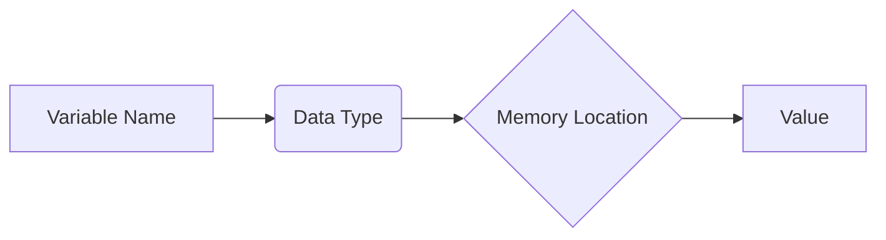
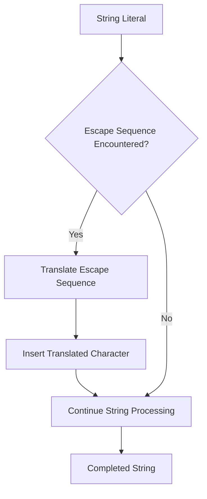
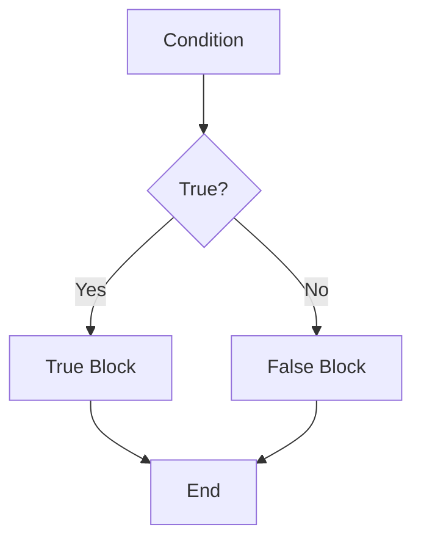

# <span style="color:#e67e22;">What we will learn in this post?</span>
<ul style='list-style-type: none; padding-left: 0;'>
<li><span style='color: #2980b9; font-size: 20px; font-weight: bold;'>👉</span> <span style='color: #2ecc71; font-size: 18px; font-weight: bold;'>Data Types in C</span></li>
<li><span style='color: #2980b9; font-size: 20px; font-weight: bold;'>👉</span> <span style='color: #2ecc71; font-size: 18px; font-weight: bold;'>Data Type Modifiers in C</span></li>
<li><span style='color: #2980b9; font-size: 20px; font-weight: bold;'>👉</span> <span style='color: #2ecc71; font-size: 18px; font-weight: bold;'>Literals in C</span></li>
<li><span style='color: #2980b9; font-size: 20px; font-weight: bold;'>👉</span> <span style='color: #2ecc71; font-size: 18px; font-weight: bold;'>Escape Sequence in C</span></li>
<li><span style='color: #2980b9; font-size: 20px; font-weight: bold;'>👉</span> <span style='color: #2ecc71; font-size: 18px; font-weight: bold;'>bool in C</span></li>
<li><span style='color: #2980b9; font-size: 20px; font-weight: bold;'>👉</span> <span style='color: #2ecc71; font-size: 18px; font-weight: bold;'>Integer Promotions in C</span></li>
<li><span style='color: #2980b9; font-size: 20px; font-weight: bold;'>👉</span> <span style='color: #2ecc71; font-size: 18px; font-weight: bold;'>Character Arithmetic in C</span></li>
<li><span style='color: #2980b9; font-size: 20px; font-weight: bold;'>👉</span> <span style='color: #2ecc71; font-size: 18px; font-weight: bold;'>Type Conversion in C</span></li>
<li><span style='color: #2980b9; font-size: 20px; font-weight: bold;'>👉</span> <span style='color: #2ecc71; font-size: 18px; font-weight: bold;'>Conclusion!</span></li>
</ul>

# <span style="color:#e67e22">C Data Types Explained 🎉</span>

This guide will walk you through the fundamental data types in the C programming language. We'll cover their sizes, uses, and provide illustrative examples.  Let's dive in!


## <span style="color:#2980b9">Basic Data Types 🧱</span>

These are the building blocks of your C programs. They define the kind of values a variable can hold and how much memory it occupies.

### <span style="color:#8e44ad">Integer Types (int, short, long, etc.) 🔢</span>

*Integer types* store whole numbers (without decimal points).  The size (in bytes) can vary depending on the system, but common sizes are:

* `int`: Usually 4 bytes (32 bits).  Represents a range of numbers from -2,147,483,648 to 2,147,483,647.
* `short int` (or `short`): Typically 2 bytes (16 bits). Smaller range than `int`.
* `long int` (or `long`): Usually 4 or 8 bytes (32 or 64 bits), depending on the system. Larger range than `int`.
* `long long int` (or `long long`): Typically 8 bytes (64 bits).  The largest integer type.


```c
#include <stdio.h>
#include <limits.h> //For INT_MAX, INT_MIN etc.

int main() {
  int age = 30;
  short smallNum = 100;
  long bigNum = 1234567890;
  long long veryBigNum = 9223372036854775807; //Maximum value for long long int.

  printf("Age: %d\n", age);  // Output: Age: 30
  printf("Small Number: %hd\n", smallNum); //Output: Small Number: 100
  printf("Big Number: %ld\n", bigNum); //Output: Big Number: 1234567890
  printf("Very Big Number: %lld\n", veryBigNum); //Output: Very Big Number: 9223372036854775807
  printf("Maximum int: %d\n", INT_MAX); //Output: Maximum int: 2147483647
  printf("Minimum int: %d\n", INT_MIN); //Output: Minimum int: -2147483648

  return 0;
}
```


### <span style="color:#8e44ad">Floating-Point Types (float, double, long double) 🧮</span>

*Floating-point types* store numbers with decimal points.  They offer varying precision:

* `float`: Usually 4 bytes (32 bits).  Single precision.
* `double`: Usually 8 bytes (64 bits). Double precision, more accurate than `float`.
* `long double`: Usually 10 or 16 bytes.  Extended precision, even more accurate.


```c
#include <stdio.h>

int main() {
  float price = 99.99;
  double pi = 3.14159265358979323846;
  long double veryPrecise = 1.23456789012345678901234567890L;

  printf("Price: %.2f\n", price); // Output: Price: 99.99
  printf("Pi: %lf\n", pi);       // Output: Pi: 3.141593
  printf("Very Precise: %Lf\n", veryPrecise); // Output: Very Precise: 1.234568 (precision varies depending on system and compiler)

  return 0;
}
```

### <span style="color:#8e44ad">Character Type (char) 🔤</span>

The `char` type stores a single character. It's usually 1 byte (8 bits).

```c
#include <stdio.h>

int main() {
  char initial = 'J';
  printf("Initial: %c\n", initial); // Output: Initial: J
  return 0;
}
```


## <span style="color:#2980b9">Modified Data Types 🛠️</span>

You can modify the basic types using keywords like `signed`, `unsigned`, and `const`.

* `unsigned`:  Allows only non-negative values, doubling the positive range.
* `signed`: Specifies that the variable can hold both positive and negative values (default for integers).
* `const`: Declares a variable whose value cannot be changed after initialization.


```c
#include <stdio.h>

int main() {
  unsigned int positiveInt = 4294967295; //Maximum value for unsigned int (on 32-bit systems).
  const float gravity = 9.81; //This value cannot be changed in the program

  printf("Unsigned Int: %u\n", positiveInt); // Output: Unsigned Int: 4294967295
  //gravity = 10.0; //This line would generate a compiler error.
  printf("Gravity: %f\n", gravity); // Output: Gravity: 9.810000
  return 0;
}
```


## <span style="color:#2980b9">Memory Representation 🧠</span>


A simple diagram illustrating memory allocation:



The size of a data type determines how much memory it occupies.  This impacts the range of values it can store and efficiency.

Remember that the exact size of each data type might slightly vary across different compilers and operating systems.  Using `sizeof()` operator can give you the precise size in bytes on your system.


This comprehensive overview should give you a solid foundation in understanding C data types. Remember to consult your compiler's documentation for platform-specific details. Happy coding! 😄


# <span style="color:#e67e22">C Data Type Modifiers:  A Deep Dive 🔬</span>

C offers several *modifiers* that fine-tune the properties of its basic data types (like `int`, `char`, `float`, etc.). These modifiers control the size and range of values a variable can hold. Let's explore the most common ones:


## <span style="color:#2980b9">Size Modifiers: `short` and `long` 📏</span>

These modifiers primarily affect the size (number of bytes) allocated for integer types (`int`) and floating-point types (`float`, `double`).  The exact sizes aren't strictly defined in the standard; they depend on the compiler and the system architecture.  Generally:

* **`short`**:  Reduces the size of an integer.  A `short int` (or just `short`) is usually 2 bytes.
* **`long`**: Increases the size of an integer or floating-point number. A `long int` (or `long`) is usually 4 bytes (but can be 8 bytes on some 64-bit systems).  `long double` provides higher precision than `double`.


### <span style="color:#8e44ad">Example: `short` and `long` int</span>

```c
#include <stdio.h>
#include <limits.h> // For INT_MAX, etc.

int main() {
  short int shortVar = 32767; // Usually max value for a 2-byte short
  long int longVar = 2147483647; // Usually max value for a 4-byte long

  printf("Size of short int: %zu bytes\n", sizeof(shortVar)); // Output: Size of short int: 2 bytes
  printf("Size of long int: %zu bytes\n", sizeof(longVar)); // Output: Size of long int: 4 bytes or 8 bytes

  printf("Maximum short int: %d\n", SHRT_MAX); //Output: Maximum short int: 32767
  printf("Maximum long int: %ld\n", LONG_MAX); // Output: Maximum long int: 2147483647 or 9223372036854775807

  return 0;
}
```


## <span style="color:#2980b9">Sign Modifiers: `signed` and `unsigned` ➕➖</span>

These modifiers dictate whether a variable can hold both positive and negative values or only positive values.


* **`signed`**: (Default for `int`, `char`, etc.) Allows both positive and negative numbers. The highest bit represents the sign.
* **`unsigned`**: Allows only non-negative numbers (0 and positive values). All bits represent the magnitude of the number, leading to a larger positive range.


### <span style="color:#8e44ad">Example: `signed` and `unsigned` int</span>

```c
#include <stdio.h>
#include <limits.h>

int main() {
  signed int signedVar = -10;
  unsigned int unsignedVar = 10;

  printf("Size of signed int: %zu bytes\n", sizeof(signedVar)); // Output: Size of signed int: 4 bytes
  printf("Size of unsigned int: %zu bytes\n", sizeof(unsignedVar)); // Output: Size of unsigned int: 4 bytes

  printf("Minimum signed int: %d\n", INT_MIN); //Output: Minimum signed int: -2147483648
  printf("Maximum signed int: %d\n", INT_MAX); // Output: Maximum signed int: 2147483647
  printf("Maximum unsigned int: %u\n", UINT_MAX); // Output: Maximum unsigned int: 4294967295

  return 0;
}
```

## <span style="color:#2980b9">Visual Representation: Range of Integer Types 📊</span>

```mermaid
graph LR
    A[signed char (e.g., -128 to 127)] --> B(1 byte);
    C[unsigned char (e.g., 0 to 255)] --> B;
    D[signed short int (e.g., -32768 to 32767)] --> E(2 bytes);
    F[unsigned short int (e.g., 0 to 65535)] --> E;
    G[signed int (e.g., -2147483648 to 2147483647)] --> H(4 bytes);
    I[unsigned int (e.g., 0 to 4294967295)] --> H;
    J[signed long int (system-dependent)] --> K(4 or 8 bytes);
    L[unsigned long int (system-dependent)] --> K;
```

**Note:** The exact ranges depend on your system's architecture.  Use `<limits.h>` to get the precise limits for your compiler.


Remember to choose the appropriate data type modifier based on your needs, considering the required range and memory usage. Using `unsigned` when appropriate can extend the positive range, while `long` or `short` fine-tune memory consumption.  Careful selection leads to efficient and robust C code! 🎉


# <span style="color:#e67e22">Literals in C: A Comprehensive Guide 📖</span>

Literals in C are constant values that are directly written into the source code.  They represent fixed data that the compiler understands and can use directly. Think of them as the raw data you feed into your C program. Let's explore the different types!


## <span style="color:#2980b9">Integer Literals 🔢</span>

Integer literals represent whole numbers without any fractional part.  They can be expressed in decimal, octal (base-8), or hexadecimal (base-16) formats.

### <span style="color:#8e44ad">Decimal Literals</span>

These are the most common type, using the standard base-10 system.

* **Example:** `10`, `-5`, `0`, `2147483647` (maximum value for a signed 32-bit integer)

```c
#include <stdio.h>

int main() {
  int decimalNum = 10;
  printf("Decimal Number: %d\n", decimalNum); // Output: Decimal Number: 10
  return 0;
}
```

### <span style="color:#8e44ad">Octal Literals</span>

These are represented by a leading `0` (zero).

* **Example:** `012` (decimal equivalent is 10), `077`

```c
#include <stdio.h>

int main() {
  int octalNum = 012;
  printf("Octal Number (decimal equivalent): %d\n", octalNum); // Output: Octal Number (decimal equivalent): 10
  return 0;
}
```

### <span style="color:#8e44ad">Hexadecimal Literals</span>

These are represented by a leading `0x` (zero x).  They use digits 0-9 and letters A-F (or a-f) for values 10-15.

* **Example:** `0x1A` (decimal equivalent is 26), `0xFF`


```c
#include <stdio.h>

int main() {
  int hexNum = 0x1A;
  printf("Hexadecimal Number (decimal equivalent): %d\n", hexNum); // Output: Hexadecimal Number (decimal equivalent): 26
  return 0;
}
```


## <span style="color:#2980b9">Floating-Point Literals 🧮</span>

Floating-point literals represent numbers with fractional parts. They can be expressed in either decimal or scientific notation.

* **Example (Decimal):** `3.14`, `-2.5`, `0.0`
* **Example (Scientific Notation):** `1.2e3` (1.2 x 10<sup>3</sup> = 1200), `-5.6e-2` (-5.6 x 10<sup>-2</sup> = -0.056)

```c
#include <stdio.h>

int main() {
  float floatNum = 3.14f; // 'f' suffix is important to specify float data type
  double doubleNum = 1.2e3;
  printf("Float Number: %f\n", floatNum); // Output: Float Number: 3.140000
  printf("Double Number: %lf\n", doubleNum); // Output: Double Number: 1200.000000
  return 0;
}
```


## <span style="color:#2980b9">Character Literals 🔤</span>

Character literals represent single characters enclosed in single quotes.

* **Example:** `'A'`, `'a'`, `'5'`, `'\n'` (newline character), `'\\'` (backslash character)


```c
#include <stdio.h>

int main() {
  char charA = 'A';
  printf("Character: %c\n", charA); // Output: Character: A
  printf("ASCII value of 'A': %d\n", charA); // Output: ASCII value of 'A': 65
  return 0;
}
```

## <span style="color:#2980b9">String Literals 📜</span>

String literals represent sequences of characters enclosed in double quotes.  They are actually arrays of characters, ending with a null character (`\0`).

* **Example:** `"Hello, world!"`, `"C Programming"`

```c
#include <stdio.h>

int main() {
  char* str = "Hello, world!";
  printf("String: %s\n", str); // Output: String: Hello, world!
  return 0;
}
```


## <span style="color:#2980b9">Boolean Literals (C99 and later) ☑️</span>

C99 introduced boolean literals represented by the keywords `true` and `false` (often mapped to 1 and 0 respectively).

* **Example:** `bool isTrue = true;`


```c
#include <stdio.h>
#include <stdbool.h> // Needed for bool type

int main() {
  bool isTrue = true;
  printf("Boolean value: %d\n", isTrue); // Output: Boolean value: 1
  return 0;
}
```


This guide provides a solid foundation for understanding literals in C. Remember to choose the appropriate literal type based on the data you're working with in your programs!  Happy coding! 🎉


# <span style="color:#e67e22">Escape Sequences in C: Unveiling Hidden Characters 🤫</span>

Escape sequences in C are special combinations of characters that represent characters that are difficult or impossible to type directly.  They start with a backslash (`\`), followed by a specific character. Think of them as secret codes that allow you to insert special formatting or characters into your strings.


## <span style="color:#2980b9">Understanding the Need for Escape Sequences 🤔</span>

Imagine you want to print a string containing a double quote (`"`) – a character already used to define the beginning and end of a string.  Typing `"` directly inside the string would confuse the compiler.  This is where escape sequences come to the rescue!  They allow you to insert special characters without causing syntax errors.


### <span style="color:#8e44ad">Common Escape Sequences 📜</span>

Here are some frequently used escape sequences:

* `\n`: **Newline** – Moves the cursor to the beginning of the next line.
* `\t`: **Horizontal Tab** – Moves the cursor to the next tab stop (usually 8 spaces).
* `\\`: **Backslash** – Represents a literal backslash character.
* `\"`: **Double Quote** – Represents a double quote character within a string.
* `\'`: **Single Quote** – Represents a single quote character within a string.
* `\0`: **Null Character** – Represents the end of a string (important for C-style strings).


## <span style="color:#2980b9">Examples in Action ✨</span>

Let's illustrate how these escape sequences work:

```c
#include <stdio.h>

int main() {
    printf("This is a newline character:\nThis is on the next line.\n"); // Output: This is a newline character:
                                                                        // This is on the next line.

    printf("This uses a tab:\tTabbed text.\n"); // Output: This uses a tab:	Tabbed text.

    printf("This string contains a double quote: \"Hello!\"\n"); //Output: This string contains a double quote: "Hello!"

    printf("This string uses a backslash: \\n\n"); // Output: This string uses a backslash: \n

    printf("This is a single quote: 'Hi'\n"); // Output: This is a single quote: 'Hi'

    return 0;
}
```


## <span style="color:#2980b9">Visualizing Escape Sequence Processing ⚙️</span>



This flowchart illustrates the process of handling escape sequences during string compilation.


## <span style="color:#2980b9">Beyond the Basics ➕</span>

Escape sequences offer more functionalities than shown above, including:

* **Octal and Hexadecimal Representations:** You can represent characters using their octal (\ooo) or hexadecimal (\xhh) values.  For example, `\012` (octal for newline) is equivalent to `\n`.
* **Special Characters:**  There are escape sequences for other special characters like alert (`\a`), backspace (`\b`), carriage return (`\r`), and vertical tab (`\v`).


By mastering escape sequences, you gain greater control over your C programs’ output, enabling you to create more sophisticated and readable text formats.  Remember the backslash is your key to unlocking these hidden powers! 🎉


# <span style="color:#e67e22">The `bool` Data Type in C 🧐</span>


## <span style="color:#2980b9">Introduction to Boolean Values 🤔</span>

In C programming, the `bool` data type represents boolean values:  **true** or **false**.  Before the formal introduction of the `bool` type, programmers typically used integers (0 for false, non-zero for true).  The formal standardization of `bool` significantly improved code readability and maintainability.  It was introduced in the **C99 standard**.

### <span style="color:#8e44ad">Significance of `bool`</span>

*   **Improved Readability:** Using `bool` makes code easier to understand.  It clearly indicates that a variable holds a true/false value.
*   **Enhanced Maintainability:** The explicit use of `bool` reduces ambiguity and makes it easier to modify and debug code.
*   **Reduced Errors:**  Eliminates the potential for confusion arising from using integers to represent boolean values.


## <span style="color:#2980b9">Using the `bool` Data Type 💻</span>

To use `bool`, you need to include the `<stdbool.h>` header file. This header file defines the `bool` type, as well as the boolean constants `true` and `false`.

```c
#include <stdio.h>
#include <stdbool.h>

int main() {
  bool isAdult = true;
  bool isRaining = false;

  if (isAdult) {
    printf("You are an adult.\n"); // Output: You are an adult.
  }

  if (!isRaining) {
    printf("It's not raining.\n"); // Output: It's not raining.
  }

  return 0;
}
```

### <span style="color:#8e44ad">Example:  Checking for Even Numbers</span>

```c
#include <stdio.h>
#include <stdbool.h>

bool isEven(int num) {
  return num % 2 == 0;
}

int main() {
  int number = 10;
  bool result = isEven(number);

  if (result) {
    printf("%d is even.\n", number); // Output: 10 is even.
  } else {
    printf("%d is odd.\n", number);
  }
  return 0;
}
```

## <span style="color:#2980b9">Boolean Operations ➕➖✖️➗</span>

C supports standard boolean operations:

*   `!` (Logical NOT): Inverts the boolean value.  `!true` is `false`, `!false` is `true`.
*   `&&` (Logical AND): Returns `true` only if both operands are `true`.
*   `||` (Logical OR): Returns `true` if at least one operand is `true`.


### <span style="color:#8e44ad">Example: Combining Boolean Operations</span>

```c
#include <stdio.h>
#include <stdbool.h>

int main() {
  bool a = true;
  bool b = false;

  bool result = a && !b; // true && !false => true && true => true
  printf("Result of a && !b: %s\n", result ? "true" : "false"); // Output: Result of a && !b: true

  result = a || b; // true || false => true
  printf("Result of a || b: %s\n", result ? "true" : "false"); // Output: Result of a || b: true

  return 0;
}
```

## <span style="color:#2980b9">Flowchart Illustrating Boolean Logic 🗺️</span>




This flowchart demonstrates a simple `if` statement based on a boolean condition.


This detailed explanation with examples and visual aids should provide a clear understanding of the `bool` data type in C. Remember to always include `<stdbool.h>` when using `bool`, `true`, and `false`.


# <span style="color:#e67e22">Integer Promotions in C 🧮</span>

C's integer promotion rules ensure that arithmetic operations are performed consistently, regardless of the size of the integer operands.  Essentially, smaller integer types are automatically "upgraded" to larger types before calculations begin. This avoids potential data loss and ensures consistent behavior across different platforms.

## <span style="color:#2980b9">Understanding the Process ⬆️</span>

Integer promotion happens *implicitly* – the compiler handles it automatically.  The process follows these steps:


### <span style="color:#8e44ad">Step 1:  Conversion to `int`</span>

*   If an integer type smaller than `int` (like `char`, `short`, or `unsigned char`, `unsigned short`) is involved in an expression, it's promoted to `int` (or `unsigned int` if `int` cannot represent all values of the original type).


### <span style="color:#8e44ad">Step 2:  Further Promotion (if necessary)</span>

*   If, after Step 1, you have an expression with both `int` and `unsigned int`, the `int` might be further promoted to `unsigned int` to avoid potential issues with signed/unsigned comparisons.
*   If there are different integer sizes (e.g., `int` and `long`), the smaller type is promoted to the larger type.


## <span style="color:#2980b9">Illustrative Examples ✨</span>

Let's look at some code examples to clarify:

**Example 1: `char` and `int` addition**

```c
#include <stdio.h>

int main() {
  char a = 10;
  int b = 20;
  int sum = a + b; // 'a' is promoted to 'int' before addition
  printf("Sum: %d\n", sum); // Output: Sum: 30
  return 0;
}
```

**Example 2: `short` and `long` multiplication**

```c
#include <stdio.h>

int main() {
  short x = 100;
  long y = 2000L; // The 'L' suffix indicates a long integer
  long product = x * y; // 'x' is promoted to 'long' before multiplication
  printf("Product: %ld\n", product); // Output: Product: 200000
  return 0;
}
```

**Example 3:  `unsigned short` and `int` comparison**

```c
#include <stdio.h>

int main() {
  unsigned short u = 65535; // Maximum value for a 16-bit unsigned short
  int v = -1;
  if (u > v) {
      printf("u is greater than v\n"); // Output: u is greater than v
  }
  return 0;
}
```


In this case, `v` (`-1`) is treated as a large positive integer during the comparison because `u` is unsigned, and the comparison happens within the unsigned integer space.


## <span style="color:#2980b9">Visualizing the Process 📊</span>

```mermaid
graph TD
    A[Smaller Integer Type (e.g., char, short)] --> B{Is it smaller than int?};
    B -- Yes --> C[Promote to int (or unsigned int)];
    B -- No --> D[Proceed to next step];
    C --> E[Result];
    D --> F{Are there different integer sizes?};
    F -- Yes --> G[Promote smaller type to larger type];
    F -- No --> E;
    G --> E;
```


## <span style="color:#2980b9">Important Considerations 🤔</span>

*   **Potential for overflow:** Be mindful of potential integer overflows when dealing with promotions.  If the result of an operation exceeds the capacity of the promoted type, unexpected behavior can occur.
*   **Signed vs. Unsigned:**  Pay close attention to signed and unsigned types.  Mixing them can lead to unexpected results due to implicit type conversions.


By understanding integer promotions, you can write more robust and predictable C code, avoiding subtle bugs related to implicit type conversions. Remember to always consider potential overflows and the differences between signed and unsigned integers.


# <span style="color:#e67e22">Character Arithmetic in C ✍️</span>

In C, characters are not just letters, numbers, or symbols; they are fundamentally represented as *integer* values. This seemingly simple fact opens up a world of interesting possibilities, especially when it comes to performing arithmetic operations.  Let's explore this fascinating aspect of C programming!

## <span style="color:#2980b9">Character Representation 🔢</span>

Computers store everything as numbers, including characters.  Each character is associated with a unique integer value based on a character encoding standard like ASCII (American Standard Code for Information Interchange) or Unicode.  For example:

*   `'A'` is typically represented as `65` in ASCII.
*   `'a'` is typically represented as `97` in ASCII.
*   `'0'` is typically represented as `48` in ASCII.


### <span style="color:#8e44ad">ASCII Table Snippet</span>

Here's a tiny snippet of the ASCII table to illustrate:

| Character | ASCII Value |
|---|---|
| `'0'` | 48 |
| `'1'` | 49 |
| `'A'` | 65 |
| `'a'` | 97 |


## <span style="color:#2980b9">Arithmetic Operations on Characters ➕➖✖️➗</span>

Because characters are integers, you can perform standard arithmetic operations on them.  This is particularly useful for tasks like:

*   Converting between uppercase and lowercase letters.
*   Performing simple character manipulations.
*   Generating character sequences.

Let's see some examples:


### <span style="color:#8e44ad">Example 1: Uppercase to Lowercase Conversion</span>

```c
#include <stdio.h>

int main() {
  char uppercaseChar = 'A';
  char lowercaseChar = uppercaseChar + 32; // ASCII difference between 'A' and 'a' is 32

  printf("Uppercase: %c, Lowercase: %c\n", uppercaseChar, lowercaseChar); // Output: Uppercase: A, Lowercase: a
  return 0;
}
```

### <span style="color:#8e44ad">Example 2:  Character Increment</span>

```c
#include <stdio.h>

int main() {
  char initialChar = 'x';
  char incrementedChar = initialChar + 1;

  printf("Initial Character: %c, Incremented Character: %c\n", initialChar, incrementedChar); // Output: Initial Character: x, Incremented Character: y

  return 0;
}
```

### <span style="color:#8e44ad">Example 3: Character Difference</span>

```c
#include <stdio.h>

int main() {
    char char1 = 'Z';
    char char2 = 'A';
    int difference = char1 - char2;
    printf("The difference between '%c' and '%c' is: %d\n", char1, char2, difference); // Output: The difference between 'Z' and 'A' is: 25
    return 0;
}
```

**Important Note:** Be mindful of potential overflow issues when performing arithmetic on characters.  If you exceed the maximum or minimum representable value for a `char` (often -128 to 127 or 0 to 255 depending on your system), unexpected behavior may occur.


## <span style="color:#2980b9">Visualizing Character Arithmetic</span>

```mermaid
graph LR
    A[Character 'A' (65)] --> B{Add 32};
    B --> C[Character 'a' (97)];
    subgraph "ASCII Representation"
        A;
        C;
    end
```

This diagram visually shows the addition operation converting 'A' to 'a'.


Remember that understanding character representation as integers unlocks powerful techniques in C programming.  Experiment with different arithmetic operations and observe the results to gain a deeper understanding.  Happy coding! 🎉


# <span style="color:#e67e22">Type Conversion in C 🔄</span>

Type conversion, also known as *casting*, is the process of changing a variable from one data type to another.  This is crucial in C because it allows for flexibility in handling different kinds of data.  However, it's important to understand how and when to use it to avoid errors.


## <span style="color:#2980b9">Implicit Type Conversion (Automatic Casting) 🤫</span>

Implicit type conversion happens automatically without you explicitly telling the compiler to do it.  The compiler performs this conversion based on predefined rules.  It usually happens during arithmetic operations involving different data types.


### <span style="color:#8e44ad">How it Works</span>

The compiler promotes the "smaller" data type to the "larger" data type before performing the operation.  This ensures that no data is lost during the calculation.  The order of precedence generally follows: `char` < `short` < `int` < `long` < `float` < `double`.

**Example:**

```c
#include <stdio.h>

int main() {
  int num1 = 10;
  float num2 = 2.5;
  float result = num1 + num2; // num1 is implicitly converted to float

  printf("Result: %f\n", result); // Output: Result: 12.500000
  return 0;
}
```

In this example, the `int` `num1` is automatically converted to a `float` before being added to `num2`.


## <span style="color:#2980b9">Explicit Type Conversion (Casting) 🎯</span>

Explicit type conversion involves manually specifying the target data type using a *cast operator*.  This gives you more control over the conversion process, but also requires more caution as it can lead to data loss or unexpected results if not done carefully.


### <span style="color:#8e44ad">The Cast Operator</span>

The cast operator has the syntax: `(target_type) variable`.


**Example:**

```c
#include <stdio.h>

int main() {
  float num1 = 12.75;
  int num2 = (int)num1; // Explicitly convert float to int

  printf("Integer part: %d\n", num2); // Output: Integer part: 12 (fractional part is truncated)
  return 0;
}
```

Here, we explicitly convert the `float` `num1` to an `int`. Note that the fractional part is truncated—not rounded—during the conversion.


### <span style="color:#8e44ad">When to Use Explicit Conversion</span>

*   When you need to control how a type is converted, especially if you anticipate potential data loss.
*   When you're dealing with functions that require specific data types as input.
*   To perform operations that aren't implicitly supported between different data types.


## <span style="color:#2980b9">Visualizing Type Conversion 📊</span>

```mermaid
graph TD
    A[int num1 = 10;] --> B{Implicit Conversion?};
    B -- Yes --> C[float num1 = 10.0;];
    B -- No --> D[Explicit Conversion Needed];
    C --> E[Addition with float num2];
    D --> F[(float)int_var];
    F --> E;
    E --> G[float result];
```


## <span style="color:#2980b9">Potential Pitfalls ⚠️</span>

*   **Data Loss:** Converting a `double` to an `int` can lead to loss of precision (the fractional part is discarded).
*   **Overflow:**  Attempting to assign a value larger than the target data type can lead to unexpected results (overflow).
*   **Undefined Behavior:**  Some conversions are undefined in C, leading to unpredictable outcomes.


Remember to always consider the potential consequences of type conversions and choose the appropriate method (implicit or explicit) based on your needs.  Carefully analyze your code to avoid unexpected behavior and ensure your program functions correctly.


<h1><span style='color:#e67e22'>Conclusion</span></h1>

So there you have it!  We've covered a lot of ground today, from  `initial concepts` to  **practical applications**.  Hopefully, this blog post has been helpful and insightful ✨.  We've explored the key aspects of [mention the topic of the blog post briefly], and I'm excited to see how you'll put this knowledge into practice 💪.


## <span style="color:#2980b9">Your Turn!  Let's Connect! 🤗</span>

This is where *you* come in!  We'd love to hear your thoughts, feedback, and suggestions.  Did you find this post helpful?  Did we miss anything?  Do you have any burning questions 🔥?


### <span style="color:#8e44ad">Share Your Wisdom! 🗣️</span>

The comments section is the perfect place to share your experiences, insights, and even your own tips and tricks!  Let's build a community around this topic and learn from each other.  Your contributions will help us improve and make this blog even better for everyone.

We especially encourage you to share:

*   **Your own successes:**  What worked well for you?
*   **Challenges you faced:** How did you overcome them?
*   **Ideas for future posts:** What topics would you like us to cover?


Don't be shy!  Leave your comments below 👇.  We can't wait to read what you have to say!


This simple flowchart shows how your feedback helps us improve and grow the community! Let's make it happen! 🎉


