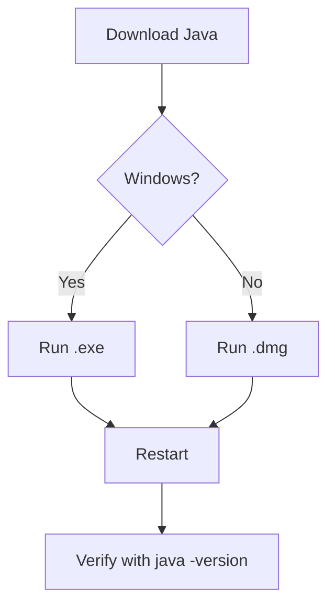
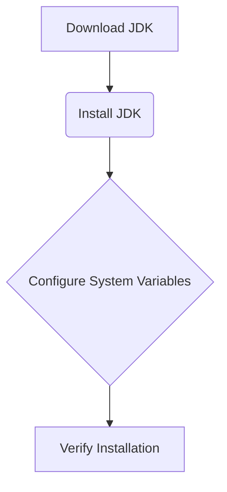
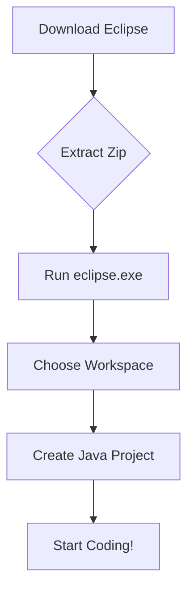
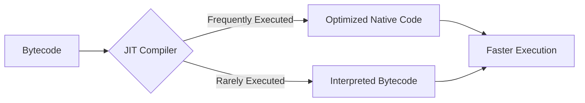

# <span style="color:#e67e22;">What we will learn in this post?</span>
<ul style='list-style-type: none; padding-left: 0;'>
<li><span style='color: #2980b9; font-size: 20px; font-weight: bold;'>👉</span> <span style='color: #2ecc71; font-size: 18px; font-weight: bold;'>Introduction to Java</span></li>
<li><span style='color: #2980b9; font-size: 20px; font-weight: bold;'>👉</span> <span style='color: #2ecc71; font-size: 18px; font-weight: bold;'>History of Java</span></li>
<li><span style='color: #2980b9; font-size: 20px; font-weight: bold;'>👉</span> <span style='color: #2ecc71; font-size: 18px; font-weight: bold;'>Java vs C++ vs Python</span></li>
<li><span style='color: #2980b9; font-size: 20px; font-weight: bold;'>👉</span> <span style='color: #2ecc71; font-size: 18px; font-weight: bold;'>How to Download and Install Java</span></li>
<li><span style='color: #2980b9; font-size: 20px; font-weight: bold;'>👉</span> <span style='color: #2ecc71; font-size: 18px; font-weight: bold;'>Setting Up the Environment in Java</span></li>
<li><span style='color: #2980b9; font-size: 20px; font-weight: bold;'>👉</span> <span style='color: #2ecc71; font-size: 18px; font-weight: bold;'>How to Download and Install Eclipse on Windows</span></li>
<li><span style='color: #2980b9; font-size: 20px; font-weight: bold;'>👉</span> <span style='color: #2ecc71; font-size: 18px; font-weight: bold;'>Java Development Kit (JDK) in Java</span></li>
<li><span style='color: #2980b9; font-size: 20px; font-weight: bold;'>👉</span> <span style='color: #2ecc71; font-size: 18px; font-weight: bold;'>JVM and its Architecture</span></li>
<li><span style='color: #2980b9; font-size: 20px; font-weight: bold;'>👉</span> <span style='color: #2ecc71; font-size: 18px; font-weight: bold;'>JDK vs JRE vs JVM</span></li>
<li><span style='color: #2980b9; font-size: 20px; font-weight: bold;'>👉</span> <span style='color: #2ecc71; font-size: 18px; font-weight: bold;'>Just In Time (JIT) Compiler</span></li>
<li><span style='color: #2980b9; font-size: 20px; font-weight: bold;'>👉</span> <span style='color: #2ecc71; font-size: 18px; font-weight: bold;'>JIT vs JVM</span></li>
<li><span style='color: #2980b9; font-size: 20px; font-weight: bold;'>👉</span> <span style='color: #2ecc71; font-size: 18px; font-weight: bold;'>Byte Code vs Machine Code</span></li>
<li><span style='color: #2980b9; font-size: 20px; font-weight: bold;'>👉</span> <span style='color: #2ecc71; font-size: 18px; font-weight: bold;'>Recap and Conclusion</span></li>
</ul>

# <span style="color:#e67e22">What is Java? 🤔</span>

Java is a versatile and powerful programming language known for its *platform independence* ("write once, run anywhere").  It's been a favorite for decades due to its reliability and vast community support.


## <span style="color:#2980b9">Key Features ✨</span>

* **Object-Oriented:**  Java uses objects to structure its code, making it easier to manage complex programs.
* **Platform Independent:**  Java code runs on any system with a Java Virtual Machine (JVM).  This is a huge advantage!
* **Robust:** Java has strong memory management and error handling features, reducing crashes.
* **Secure:** Designed with security in mind, reducing vulnerabilities.
* **Large Community & Libraries:**  Tons of resources, pre-built code (libraries), and helpful people are available.

### <span style="color:#8e44ad">Simple Example</span>

```java
public class Hello {
    public static void main(String[] args) {
        System.out.println("Hello, world!");
    }
}
```


## <span style="color:#2980b9">Use Cases 💻</span>

* **Android App Development:** A major use case!  Many Android apps are built using Java (or Kotlin, which interoperates seamlessly).
* **Enterprise Applications:**  Building large-scale, robust systems for businesses.
* **Web Applications:** Creating dynamic and interactive websites using frameworks like Spring.
* **Big Data Technologies:** Java is used in processing and analyzing large datasets (e.g., Hadoop).


## <span style="color:#2980b9">Why is it so Popular? 🤔</span>

Java's combination of features, widespread adoption, and extensive community support makes it a top choice for developers worldwide. Its versatility allows for a wide range of applications, ensuring its continued relevance in the tech landscape.


# <span style="color:#e67e22">Java's Journey: From Oak to JVM ☕</span>

Java's story begins in the early 90s at Sun Microsystems.  The goal?  To create a platform-independent language for interactive television, a project codenamed "Oak" 🌳.  It soon evolved into a general-purpose language, focusing on "write once, run anywhere" (WORA) capabilities.


## <span style="color:#2980b9">The Birth and Rise of Java 🚀</span>

*   **Initial Release (1996):** Java 1.0 brought the core language features, including `public static void main(String[] args)` - the familiar entry point for many Java programs.
*   **Early Adoption:**  Its platform independence and robust features fueled its rapid adoption for web applications (servlets, JSP) and enterprise solutions.

### <span style="color:#8e44ad">Key Motivations</span>
*   _Simplicity_: Easier to learn and use than C++.
*   _Portability_:  Run on any platform with a Java Virtual Machine (JVM).
*   _Robustness_:  Memory management features reduced crashes.

## <span style="color:#2980b9">Major Updates and Evolution 🔄</span>

*   **Java 2 (J2SE, J2EE, J2ME):**  Modularized into editions for different platforms.
*   **Java 5 (2004):** Generics (`<T>`) improved type safety, autoboxing simplified coding.
*   **Java 8 (2014):** Lambda expressions (`->`) and streams modernized the language.
*   **Java 17 (LTS, 2021):**  Continued performance improvements, enhanced security.


```mermaid
graph LR
A[Oak (1991)] --> B(Java 1.0 (1996));
B --> C{Java 2 (J2SE/EE/ME)};
C --> D[Java 5 (2004)];
D --> E[Java 8 (2014)];
E --> F[Java 17 (2021)];
```

Java continues to evolve, constantly adapting to the changing needs of developers and the software landscape.  Its longevity and versatility are testaments to its enduring impact.


# <span style="color:#e67e22">Java vs. C++ vs. Python: A Quick Comparison ☕💻🐍</span>


## <span style="color:#2980b9">Syntax & Readability</span>

* **Java:**  More verbose than Python, less so than C++.  Uses curly braces `{}` extensively.  `public class MyClass { ... }`
* **C++:**  Complex syntax, requiring manual memory management.  Supports many paradigms (OOP, procedural). `int main() { ... }`
* **Python:**  Simple, readable syntax using indentation.  `def my_function(): ...`


### <span style="color:#8e44ad">Readability Summary</span>
Python > Java > C++


## <span style="color:#2980b9">Performance</span>

* **Java:**  Fast due to JVM optimization, but slower than C++.
* **C++:**  Very fast, offering low-level control.  Needs careful memory management.
* **Python:**  Interpreted, generally slower than Java and C++, but offers many libraries for optimization.


### <span style="color:#8e44ad">Performance Summary</span>
C++ > Java > Python


## <span style="color:#2980b9">Primary Use Cases</span>

* **Java:**  _Enterprise applications_, Android apps, _big data_ processing.
* **C++:** _Game development_, high-performance computing, operating systems.
* **Python:** _Data science_, machine learning, web development (backend), scripting.


### <span style="color:#8e44ad">Use Case Summary</span>

| Language | Use Cases                               |
| -------- | --------------------------------------- |
| Java     | Enterprise, Android, Big Data           |
| C++      | Games, HPC, OS                           |
| Python   | Data Science, ML, Web Dev (Backend)     |


This comparison provides a high-level overview.  Each language has strengths and weaknesses depending on the specific project requirements.


# <span style="color:#e67e22">☕ Getting Java on Your System 💻</span>

## <span style="color:#2980b9">Windows Installation 🪟</span>

### <span style="color:#8e44ad">Download & Install</span>

1. Go to [https://www.java.com/en/download/](https://www.java.com/en/download/).  
2. Click the *“Download Java”* button.
3. Once downloaded, double-click the `.exe` file.
4. Follow the on-screen instructions.  Click *“Next”* or *“Install”*.
5. *Restart* your computer when prompted.

Verify Installation: Open a command prompt (`cmd`) and type `java -version`. You should see Java version information.


## <span style="color:#2980b9">Mac Installation 🍎</span>

### <span style="color:#8e44ad">Download & Install</span>

1. Visit [https://www.java.com/en/download/](https://www.java.com/en/download/).
2. Download the macOS installer package (`.dmg`).
3. Open the downloaded file.
4. Follow the on-screen instructions.  Drag the Java icon into the *Applications* folder.
5. *Restart* your computer when prompted.

Verify Installation: Open *Terminal* and type `java -version`.  You should see Java version information.





# <span style="color:#e67e22">Setting Up Your Java Environment ☕</span>

Let's get you coding in Java!  This guide will walk you through setting up your development environment.

## <span style="color:#2980b9">Download & Install the JDK ⬇️</span>

First, download the Java Development Kit (JDK) from [Oracle's website](https://www.oracle.com/java/technologies/downloads/).  Choose the version appropriate for your operating system (Windows, macOS, or Linux).  Run the installer and follow the on-screen instructions.  *Remember the installation directory!*


### <span style="color:#8e44ad">Configuring System Variables ⚙️</span>

This step is crucial! We need to tell your computer where to find Java.

*   **Find System Variables:** Search for "environment variables" in your operating system's settings.
*   **Edit `PATH`:**  Add the paths to your JDK's `bin` directory (e.g., `C:\Program Files\Java\jdk-17\bin` on Windows).  This allows you to run `javac` (compiler) and `java` (runtime) from anywhere in your command line.
*   **Add `JAVA_HOME` (Optional but Recommended):** Create a new system variable named `JAVA_HOME` and set its value to your JDK's installation directory (e.g., `C:\Program Files\Java\jdk-17`).  This makes it easier to manage your Java installation.




## <span style="color:#2980b9">Verify Your Installation ✅</span>

Open your command prompt or terminal and type:

`java -version`

and

`javac -version`

If both commands display version information, congratulations! You've successfully set up your Java environment.  Now you're ready to start coding! 🎉


# <span style="color:#e67e22">Eclipse for Java: A Windows Guide 💻</span>

## <span style="color:#2980b9">Download & Installation ⬇️</span>

1.  Visit the official Eclipse website ([https://www.eclipse.org/downloads/](https://www.eclipse.org/downloads/)).
2.  Download the *Eclipse IDE for Java Developers* package (check the 64-bit version for optimal performance).  This is usually a `.zip` file.
3.  Extract the downloaded zip file to a desired location (e.g., `C:\eclipse`).  *Avoid spaces in the directory path.*

### <span style="color:#8e44ad">Important Note</span>
*   Ensure you have Java Development Kit (JDK) installed beforehand.  You can check by opening command prompt and typing `javac -version`.


## <span style="color:#2980b9">Configuration & First Run 🚀</span>

1.  Navigate to the extracted folder and double-click `eclipse.exe`.
2.  Eclipse will ask you to choose a workspace directory – this is where your projects will be saved.  Choose a location and click *OK*.
3.  The *Welcome* screen will appear. You are ready to start creating your first Java project!


## <span style="color:#2980b9">Setting up your first project 🛠️</span>
* Create a new Java project via `File > New > Java Project`.
* Name your project (e.g., `MyFirstProject`).
* Click `Finish`.




Remember to consult the official Eclipse documentation for more advanced configurations and troubleshooting.  Enjoy your Java journey! 🎉


# <span style="color:#e67e22">What is the Java Development Kit (JDK)? ☕</span>

The Java Development Kit (JDK) is like a toolbox for Java programmers.  It's essential for creating, compiling, and running Java applications. Think of it as the *complete package* you need to build anything Java-related.  Without it, you can't write Java programs!


## <span style="color:#2980b9">Key Components of the JDK 🛠️</span>

The JDK contains several important parts:

* **Java Compiler (`javac`):** This translates your human-readable Java code into bytecode—the language the Java Virtual Machine (JVM) understands.  Think of it as a translator.
* **Java Virtual Machine (JVM):**  This is the engine that runs your Java bytecode. It's platform-independent, meaning your Java program can run on Windows, macOS, Linux, etc., without modification.
* **Java Runtime Environment (JRE):**  This includes the JVM and other necessary libraries for running Java applications. It's a subset of the JDK.
* **Java API (Application Programming Interface):** A vast collection of pre-written code that provides ready-made functions for common tasks, saving you time and effort.  Examples include classes for handling input/output, networking, and more.


### <span style="color:#8e44ad">Why is the JDK Important? 🤔</span>

* **Development:**  You *need* the JDK to *compile* and *debug* your Java code.
* **Execution:** The JRE (part of the JDK) is needed to *run* your Java programs.
* **Access to Libraries:** The API provides powerful tools, boosting your development speed and efficiency.

## <span style="color:#2980b9">Simplified Workflow 💻</span>

```mermaid
graph TD
    A[Java Code (.java)] --> B{javac (Compiler)};
    B --> C[Bytecode (.class)];
    C --> D[JVM];
    D --> E[Running Application];
```

In short, the JDK is the *foundation* upon which all Java development rests.  It's an indispensable tool for any serious Java programmer.


# <span style="color:#e67e22">JVM Architecture ☕</span>

The Java Virtual Machine (JVM) acts like a translator between your Java code and your computer's operating system.  This is key to Java's platform independence!

## <span style="color:#2980b9">Key Components ⚙️</span>

The JVM's core components work together seamlessly:

* **Class Loader:** Loads `.class` files (your compiled Java code) into memory.
* **Runtime Data Area:** Stores all the data needed while your program runs (method areas, heap, stack, etc.).
* **Execution Engine:**  Interprets or compiles bytecode (the intermediary language generated by the Java compiler) into machine-specific instructions. *Just-in-time (JIT)* compilation significantly boosts performance by converting frequently used bytecode to native machine code.
* **Garbage Collector:** Automatically manages memory, freeing up space occupied by objects no longer in use.  This prevents memory leaks!


### <span style="color:#8e44ad">Platform Independence ✨</span>

Java's platform independence (also known as *write once, run anywhere*) relies heavily on the JVM.  Instead of compiling directly to machine code for a specific operating system, Java compiles to *bytecode*.  The JVM then handles translating this bytecode into instructions your operating system understands.  This means you can write Java code on one machine (e.g., Windows) and run it on another (e.g., macOS) without modification.


## <span style="color:#2980b9">Simplified Diagram 📊</span>

```mermaid
graph LR
    A[Java Code] --> B(Java Compiler);
    B --> C{Bytecode (.class)};
    C --> D[JVM];
    D --> E[Operating System];
    E --> F[Hardware];
```

This shows how Java code is compiled, then interpreted/executed by the JVM on different operating systems.  The JVM acts as an *abstraction layer*, hiding the underlying OS specifics from your Java code.


# <span style="color:#e67e22">Java Ecosystem: JDK, JRE, and JVM Explained ☕</span>

Understanding the core components of the Java ecosystem is crucial for any developer. Let's break down JDK, JRE, and JVM:

## <span style="color:#2980b9">The Java Virtual Machine (JVM) ⚙️</span>

The JVM is the *heart* of Java.  It's an *abstract machine* that executes Java bytecode.  Think of it as a translator: it takes the compiled `.class` files (bytecode) and translates them into instructions your computer's processor can understand.  This is what allows Java's "write once, run anywhere" (WORA) capability.

### <span style="color:#8e44ad">Key Role:</span>
* Executes Java bytecode.
* Manages memory.
* Provides security features.


## <span style="color:#2980b9">The Java Runtime Environment (JRE) 📦</span>

The JRE is a *subset* of the JDK. It contains everything the JVM needs to *run* Java applications, including the JVM itself, core libraries, and other supporting files.  If you only need to *run* Java programs, the JRE is all you need.

### <span style="color:#8e44ad">Key Role:</span>
* Provides the environment for JVM execution.
* Includes core libraries.


## <span style="color:#2980b9">The Java Development Kit (JDK) 🛠️</span>

The JDK is the *complete package* for Java development. It includes the JRE, plus *development tools* like the Java compiler (`javac`), debugger (`jdb`), and other utilities necessary for creating and testing Java applications.

### <span style="color:#8e44ad">Key Role:</span>
* Contains the JRE and development tools.
* Enables compilation of Java code.
* Provides tools for debugging and testing.


In short:  **JDK** contains **JRE**, which contains the **JVM**. You need the JDK to *develop* Java apps, and the JRE to *run* them. The JVM is the engine that makes it all work!


# <span style="color:#e67e22">Java's JIT Compiler: 🚀 Speeding Up Your Code</span>

Java's Just-In-Time (JIT) compiler is a crucial component that significantly boosts your program's performance.  Instead of interpreting bytecode directly (like an interpreter), the JIT compiler translates frequently used sections of bytecode into highly optimized native machine code *during* runtime.  This process leads to dramatic speed improvements.


## <span style="color:#2980b9">How JIT Improves Performance ⚡</span>

*   **Faster Execution:** Native code runs much faster than interpreted bytecode.
*   **Adaptive Optimization:**  The JIT compiler analyzes code execution patterns and optimizes accordingly. It can identify "hot spots" (frequently executed code sections) for enhanced optimization.
*   **Method Inlining:**  The JIT compiler can replace method calls with the actual method code, reducing overhead.


### <span style="color:#8e44ad">The JIT Compilation Process ⚙️</span>



This diagram shows how the JIT compiler selectively optimizes code based on usage frequency.


## <span style="color:#2980b9">Benefits Summary 👍</span>

*   **Improved Responsiveness:** Applications run faster and more smoothly.
*   **Reduced Resource Consumption:** Optimized code can use fewer system resources.
*   **Better Scalability:**  The performance gains are particularly noticeable in large or complex applications.

In short, Java's JIT compiler is a powerful engine that makes your Java applications run significantly faster and more efficiently.  It's a key element contributing to Java's popularity and success.


# <span style="color:#e67e22">Java Runtime Environment: JIT & JVM ☕</span>

The Java runtime environment relies heavily on two key components: the Java Virtual Machine (JVM) and the Just-In-Time (JIT) compiler.  Let's explore their roles and interaction.


## <span style="color:#2980b9">The JVM: Your Java Home 🏠</span>

The JVM is the *foundation* of Java's platform independence.  It's an **abstract machine** that executes Java bytecode (`.class` files).  Think of it as a translator, understanding the bytecode instructions and executing them on your specific operating system.

### <span style="color:#8e44ad">Key JVM Responsibilities:</span>
*   Memory Management (Garbage Collection ♻️)
*   Security 🔒
*   Bytecode Verification


## <span style="color:#2980b9">JIT Compiler: Speed Demon 🚀</span>

The JIT compiler is a crucial part of the JVM's performance optimization strategy.  Instead of interpreting bytecode instruction-by-instruction (which is slow), the JIT compiler translates frequently executed parts of the bytecode into *native machine code* at runtime. This greatly improves performance.


### <span style="color:#8e44ad">JIT's Role:</span>
*   **Translation:** Converts bytecode to native code.
*   **Optimization:** Improves the efficiency of the native code.
*   **Adaptive Optimization:**  Monitors code execution and optimizes further based on runtime behavior.


## <span style="color:#2980b9">JVM and JIT Interaction 🤝</span>

```mermaid
graph LR
    A[Java Source Code] --> B(Java Compiler);
    B --> C{Bytecode (.class)};
    C --> D[JVM];
    D --> E[JIT Compiler];
    E --> F(Optimized Native Code);
    F --> G[Execution];
```

The JVM loads the bytecode. The JIT then steps in, selectively compiling frequently used parts into native code, improving the application's speed.  The JVM manages the overall execution environment, including memory and security, while the JIT focuses on performance.  They work together seamlessly to provide a fast and reliable Java experience.


# <span style="color:#e67e22">Bytecode vs. Machine Code ☕</span>

## <span style="color:#2980b9">Understanding the Difference</span>

Imagine you have a recipe (your program).  *Machine code* is like having the recipe written in a language only your specific oven (computer's processor) understands.  Different ovens (different processors) need different recipes.

*Bytecode*, on the other hand, is a more *generic recipe*. It's like a simplified version that a special translator (the Java Virtual Machine or JVM) can convert into the specific language of *any* oven.


### <span style="color:#8e44ad">Key Differences Summarized</span>

* **Machine Code:**  Low-level, directly executable by the processor.  `01101000` (example).  Processor-specific.
* **Bytecode:**  Intermediate level, platform-independent.  Requires a JVM to translate to machine code.  `aload_0` (example).


## <span style="color:#2980b9">Java and Cross-Platform Support 🚀</span>

Java uses bytecode for its famous "write once, run anywhere" capability.  Here's how it works:

* You write your Java code.
* A **compiler** translates it into bytecode (.class files).
* The JVM on *any* operating system (Windows, macOS, Linux) reads this bytecode and translates it into the specific machine code for that system.

This eliminates the need to compile your code separately for each platform, making Java incredibly portable.


```mermaid
graph TD
    A[Java Code] --> B{Compiler};
    B --> C[Bytecode (.class)];
    C --> D{JVM (Windows)};
    C --> E{JVM (macOS)};
    C --> F{JVM (Linux)};
    D --> G[Machine Code (Windows)];
    E --> H[Machine Code (macOS)];
    F --> I[Machine Code (Linux)];
```

**In short:** Bytecode acts as a bridge, allowing Java programs to run on various platforms without modification.  This is a major advantage for developers, promoting code reusability and reducing development time and effort.


# <span style="color:#e67e22">Java: A Quick Overview 🚀</span>

This overview covers the essentials of Java, a powerful and versatile programming language.  Let's dive in! We'd love to hear your thoughts and experiences in the comments below 👇

## <span style="color:#2980b9">What is Java? 🤔</span>

Java is a widely used, *object-oriented* programming language known for its **platform independence** ("write once, run anywhere"). This means you can write Java code on one operating system (like Windows) and run it on another (like macOS) without modification.  It's used for everything from Android apps to large-scale enterprise systems.

### <span style="color:#8e44ad">Key Features ✨</span>

* **Object-Oriented:**  Java uses objects to represent data and actions. This makes code more organized and reusable.
* **Platform Independent:** Thanks to the Java Virtual Machine (JVM), Java code runs on any system with a JVM.
* **Robust:** Java has strong memory management features that help prevent crashes and security vulnerabilities.
* **Secure:** Java's security features protect against malicious code.
* **Multi-threaded:** Java allows for multiple tasks to run concurrently, improving performance.


## <span style="color:#2980b9">The Java Virtual Machine (JVM) ⚙️</span>

The JVM is crucial to Java's platform independence.  It acts as an intermediary between your Java code and the underlying operating system.


This diagram shows how your Java code interacts with the JVM and then your operating system.


### <span style="color:#8e44ad">JVM's Role 💡</span>

* **Translation:** The JVM translates your Java bytecode (`.class` files) into instructions that the specific operating system understands.
* **Memory Management:** The JVM handles memory allocation and garbage collection, freeing up developers from manual memory management.


## <span style="color:#2980b9">Getting Started with Java 👨‍💻</span>

To start programming in Java, you'll need:

* **JDK (Java Development Kit):** This provides the tools you need to compile and run Java programs.
* **IDE (Integrated Development Environment):**  An IDE like Eclipse, IntelliJ IDEA, or NetBeans makes coding easier.
* **A text editor:**  If you prefer a simpler approach, a plain text editor will do.

**Example:**  A simple "Hello, World!" program:

```java
public class Main {
  public static void main(String[] args) {
    System.out.println("Hello, World!");
  }
}
```


## <span style="color:#2980b9">Let's Discuss! 🗣️</span>

What are your experiences with Java? What are your favorite aspects of the language?  What challenges have you faced?  Share your thoughts in the comments below!  Let's learn from each other.


