# <span style="color:#e67e22;">What we will learn in this post?</span>
<ul style='list-style-type: none; padding-left: 0;'>
<li><span style='color: #2980b9; font-size: 20px; font-weight: bold;'>👉</span> <span style='color: #2ecc71; font-size: 18px; font-weight: bold;'>Decision-Making in C</span></li>
<li><span style='color: #2980b9; font-size: 20px; font-weight: bold;'>👉</span> <span style='color: #2ecc71; font-size: 18px; font-weight: bold;'>C if Statement</span></li>
<li><span style='color: #2980b9; font-size: 20px; font-weight: bold;'>👉</span> <span style='color: #2ecc71; font-size: 18px; font-weight: bold;'>C if else Statement</span></li>
<li><span style='color: #2980b9; font-size: 20px; font-weight: bold;'>👉</span> <span style='color: #2ecc71; font-size: 18px; font-weight: bold;'>C if-else-if Ladder</span></li>
<li><span style='color: #2980b9; font-size: 20px; font-weight: bold;'>👉</span> <span style='color: #2ecc71; font-size: 18px; font-weight: bold;'>Switch Statement in C</span></li>
<li><span style='color: #2980b9; font-size: 20px; font-weight: bold;'>👉</span> <span style='color: #2ecc71; font-size: 18px; font-weight: bold;'>Using Range in switch case in C</span></li>
<li><span style='color: #2980b9; font-size: 20px; font-weight: bold;'>👉</span> <span style='color: #2ecc71; font-size: 18px; font-weight: bold;'>Loops in C</span></li>
<li><span style='color: #2980b9; font-size: 20px; font-weight: bold;'>👉</span> <span style='color: #2ecc71; font-size: 18px; font-weight: bold;'>C for Loop</span></li>
<li><span style='color: #2980b9; font-size: 20px; font-weight: bold;'>👉</span> <span style='color: #2ecc71; font-size: 18px; font-weight: bold;'>While Looping in C</span></li>
<li><span style='color: #2980b9; font-size: 20px; font-weight: bold;'>👉</span> <span style='color: #2ecc71; font-size: 18px; font-weight: bold;'>do while Loop in C</span></li>
<li><span style='color: #2980b9; font-size: 20px; font-weight: bold;'>👉</span> <span style='color: #2ecc71; font-size: 18px; font-weight: bold;'>for versus while Loop in C</span></li>
<li><span style='color: #2980b9; font-size: 20px; font-weight: bold;'>👉</span> <span style='color: #2ecc71; font-size: 18px; font-weight: bold;'>continue Statement in C</span></li>
<li><span style='color: #2980b9; font-size: 20px; font-weight: bold;'>👉</span> <span style='color: #2ecc71; font-size: 18px; font-weight: bold;'>break Statement in C</span></li>
<li><span style='color: #2980b9; font-size: 20px; font-weight: bold;'>👉</span> <span style='color: #2ecc71; font-size: 18px; font-weight: bold;'>goto Statement in C</span></li>
<li><span style='color: #2980b9; font-size: 20px; font-weight: bold;'>👉</span> <span style='color: #2ecc71; font-size: 18px; font-weight: bold;'>Conclusion!</span></li>
</ul>

# <span style="color:#e67e22">Decision-Making in C Programming 💡</span>

C programming, like any other programming language, needs a way to make choices and control the order in which instructions are executed. This is where *decision-making* comes in. It allows your program to react differently based on various conditions, making your programs dynamic and responsive.  Think of it as giving your program the ability to think! 🤔

## <span style="color:#2980b9">The `if` Statement: Making Simple Choices</span>

The most basic decision-making structure in C is the `if` statement. It checks a condition, and if the condition is true, it executes a block of code.  If the condition is false, it skips that block.

### <span style="color:#8e44ad">Basic `if` Example</span>

```c
#include <stdio.h>

int main() {
  int age = 20;

  if (age >= 18) {
    printf("You are an adult! 🎉\n"); // This line will be executed
  }

  return 0;
}
```

**Commented Output:**

```
You are an adult! 🎉
```

### <span style="color:#8e44ad">`if-else` Statement: Handling Two Possibilities</span>

The `if-else` statement extends the `if` statement by adding an `else` block. This block is executed only if the condition in the `if` statement is *false*.

```c
#include <stdio.h>

int main() {
  int age = 15;

  if (age >= 18) {
    printf("You are an adult!\n");
  } else {
    printf("You are a minor. 👶\n"); // This line will be executed
  }

  return 0;
}
```

**Commented Output:**

```
You are a minor. 👶
```


## <span style="color:#2980b9">`if-else if-else` Statement:  Multiple Choices</span>

For situations with more than two possibilities, you can use the `if-else if-else` structure.  It checks conditions sequentially until one is found to be true.

```c
#include <stdio.h>

int main() {
  int grade = 85;

  if (grade >= 90) {
    printf("A grade! 🏆\n");
  } else if (grade >= 80) {
    printf("B grade! 👍\n"); // This line will be executed
  } else if (grade >= 70) {
    printf("C grade\n");
  } else {
    printf("Needs improvement. 🤔\n");
  }

  return 0;
}
```

**Commented Output:**

```
B grade! 👍
```

## <span style="color:#2980b9">Flowchart Representation</span>

Here's a flowchart illustrating the `if-else if-else` structure:

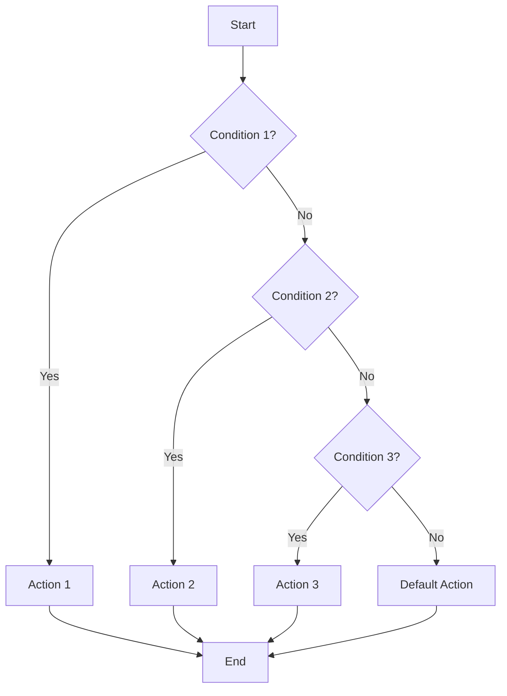

## <span style="color:#2980b9">Importance of Decision Making</span>

* **Control Flow:**  Decision-making statements directly control the order in which your code executes.  Without them, your programs would simply run line by line without any adaptation to input or circumstances.
* **Flexibility and Responsiveness:**  They make your programs dynamic and capable of responding to different inputs and situations.
* **Creating Interactive Programs:**  Decision-making is crucial for building interactive applications that adapt to user actions.
* **Problem Solving:**  Many programming problems require making decisions based on various conditions, and these statements provide the tools to do so.


This introduction provides a foundational understanding of decision-making in C.  As you progress, you'll encounter more advanced techniques and structures, but mastering the `if`, `else if`, and `else` statements is a fundamental first step!  Happy coding! 😄


# <span style="color:#e67e22">The Mighty `if` Statement in C 👑</span>

The `if` statement is a fundamental control flow structure in C.  It allows your program to make decisions based on whether a condition is true or false.  Think of it as a branching path in your code – one path is taken if the condition is true, and another (or none) if it's false.


## <span style="color:#2980b9">Syntax of the `if` Statement</span>

The basic syntax is straightforward:

```c
if (condition) {
  // Code to execute if the condition is true
}
```

* **`if` keyword:**  Signals the start of a conditional statement.
* **`(condition)`:** An expression that evaluates to either `true` (non-zero) or `false` (zero).  This often involves comparison operators (`==`, `!=`, `>`, `<`, `>=`, `<=`) or logical operators (`&&` - AND, `||` - OR, `!` - NOT).
* **`{ ... }` (code block):** The code within these curly braces will only be executed if the `condition` is true.


### <span style="color:#8e44ad">Example: Checking if a number is positive</span>

```c
#include <stdio.h>

int main() {
  int num = 10;

  if (num > 0) {
    printf("The number is positive.\n"); // This line will be executed
  }

  return 0;
}
```

**Output:**

```
The number is positive.
```


## <span style="color:#2980b9">Adding an `else` Clause ➕</span>

You can extend the `if` statement with an `else` clause to specify code to execute when the condition is false.

```c
if (condition) {
  // Code to execute if the condition is true
} else {
  // Code to execute if the condition is false
}
```

### <span style="color:#8e44ad">Example: Checking for positive or negative numbers</span>

```c
#include <stdio.h>

int main() {
  int num = -5;

  if (num > 0) {
    printf("The number is positive.\n");
  } else {
    printf("The number is not positive.\n"); // This line will be executed
  }

  return 0;
}
```

**Output:**

```
The number is not positive.
```


## <span style="color:#2980b9">The `else if` Ladder 🪜</span>

For multiple conditions, you can chain `else if` statements to create a decision tree.  This allows you to check various conditions sequentially.


```c
if (condition1) {
  // Code for condition1
} else if (condition2) {
  // Code for condition2
} else if (condition3) {
  // Code for condition3
} else {
  // Code if none of the above conditions are true
}
```

### <span style="color:#8e44ad">Example: Checking the range of a number</span>

```c
#include <stdio.h>

int main() {
  int num = 75;

  if (num < 0) {
    printf("The number is negative.\n");
  } else if (num >= 0 && num <= 50) {
    printf("The number is between 0 and 50.\n");
  } else if (num > 50 && num <= 100) {
    printf("The number is between 50 and 100.\n"); //This line will execute
  } else {
    printf("The number is greater than 100.\n");
  }

  return 0;
}
```

**Output:**

```
The number is between 50 and 100.
```


## <span style="color:#2980b9">Flowchart Representation 🗺️</span>

Here's a flowchart illustrating the `if-else if-else` structure:

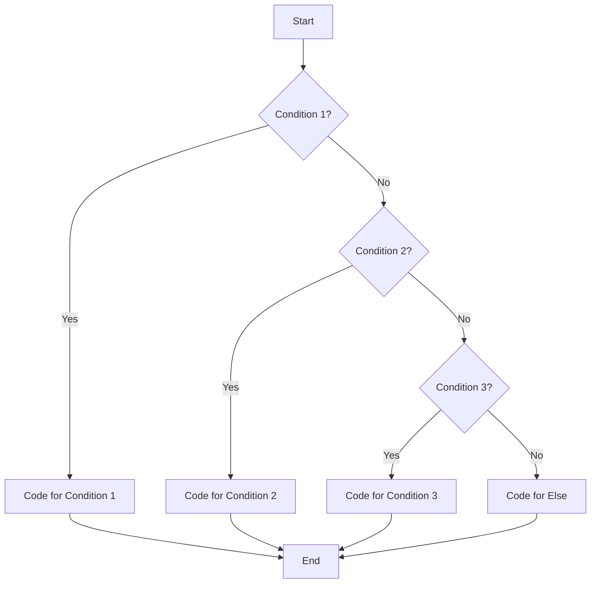


This visual representation clearly shows how the code flows based on different conditions.  Remember that the `if` statement is a fundamental building block for creating more complex and dynamic C programs!


# <span style="color:#e67e22">Conditional Logic with `if else` in C</span> 🎉

This guide explores the powerful `if else` statement in C, a fundamental tool for controlling the flow of your program's execution.  It allows your program to make decisions based on conditions, leading to different actions depending on the outcome.

## <span style="color:#2980b9">Syntax and Structure 🏗️</span>

The basic syntax of an `if else` statement is straightforward:


```c
if (condition) {
  // Code to execute if the condition is true
} else {
  // Code to execute if the condition is false
}
```

*   **`condition`**: This is an expression that evaluates to either `true` (non-zero) or `false` (zero).  It's usually a comparison using operators like `==` (equal to), `!=` (not equal to), `>`, `<`, `>=`, `<=`.

*   **`{}` (curly braces)**: These are crucial for grouping multiple statements within the `if` and `else` blocks.  If you have only one statement, you can omit the braces, but using them consistently improves readability and avoids potential errors.


### <span style="color:#8e44ad">Example: Checking for Even Numbers 🧮</span>

Let's illustrate with a simple program that checks if a number is even or odd:

```c
#include <stdio.h>

int main() {
  int number = 10; // You can change this number to test

  if (number % 2 == 0) {
    printf("The number %d is even.\n", number); // Output if the number is even
  } else {
    printf("The number %d is odd.\n", number); // Output if the number is odd
  }
  return 0;
}
```

**Output:**

```
The number 10 is even.
```

If you change `number` to 7, the output will be:

```
The number 7 is odd.
```


## <span style="color:#2980b9">Flowchart Representation 📊</span>

The following flowchart visually represents the execution flow of an `if else` statement:

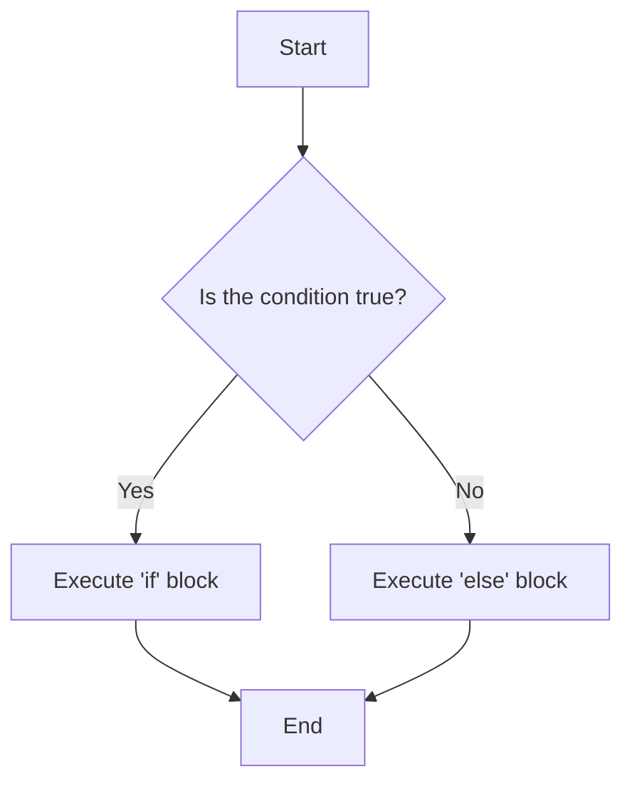


## <span style="color:#2980b9">Nested `if else` Statements 嵌套</span>

You can nest `if else` statements within each other to handle more complex decision-making scenarios.  This allows you to create multiple levels of conditions.


### <span style="color:#8e44ad">Example: Grade Classification 🎓</span>

This example classifies a student's grade based on their score:

```c
#include <stdio.h>

int main() {
  int score = 85; // Example score

  if (score >= 90) {
    printf("Grade: A\n");
  } else if (score >= 80) {
    printf("Grade: B\n");
  } else if (score >= 70) {
    printf("Grade: C\n");
  } else if (score >= 60) {
    printf("Grade: D\n");
  } else {
    printf("Grade: F\n");
  }
  return 0;
}
```

**Output:**

```
Grade: B
```


## <span style="color:#2980b9">`if` Statement without `else` 🤔</span>

Sometimes you only need to execute a block of code *if* a condition is true.  In such cases, you can use an `if` statement without the `else` part:

```c
if (condition) {
  // Code to execute if the condition is true
}
```

This simply checks the condition and executes the code only when the condition evaluates to `true`.


## <span style="color:#2980b9">Best Practices ✨</span>

*   **Indentation:** Use consistent indentation to make your code readable and easy to understand.
*   **Comments:** Add comments to explain complex logic or the purpose of different code sections.
*   **Braces:** Always use curly braces `{}` even for single-line statements within `if` and `else` blocks to prevent errors and enhance readability.  This is especially important as your code grows more complex.


By mastering the `if else` statement, you gain a crucial building block for creating dynamic and responsive C programs capable of handling a variety of situations. Remember to practice and experiment to solidify your understanding!


# <span style="color:#e67e22">Understanding the `if-else-if` Ladder in C</span> 🪜

The `if-else-if` ladder is a powerful control flow statement in C that allows you to check multiple conditions sequentially.  Think of it like a staircase where you step through each condition until one is met, or you reach the end.  This is different from using multiple separate `if` statements, as only *one* block of code will execute within the entire ladder.

## <span style="color:#2980b9">How it Works</span> ➡️

The `if-else-if` ladder follows this basic structure:

```c
if (condition1) {
  // Code to execute if condition1 is true
} else if (condition2) {
  // Code to execute if condition1 is false and condition2 is true
} else if (condition3) {
  // Code to execute if condition1 and condition2 are false, and condition3 is true
} else {
  // Code to execute if none of the above conditions are true
}
```

The conditions are evaluated one after another.  If a condition is true, the corresponding code block is executed, and the rest of the ladder is skipped. If no condition is true, the `else` block (if present) is executed.

## <span style="color:#2980b9">Illustrative Examples</span> ✨

### <span style="color:#8e44ad">Example 1: Grading System</span>

Let's create a simple grading system based on a student's score:

```c
#include <stdio.h>

int main() {
  int score;

  printf("Enter your score: ");
  scanf("%d", &score);

  if (score >= 90) {
    printf("Grade: A\n"); // Output if score is 90 or above
  } else if (score >= 80) {
    printf("Grade: B\n"); // Output if score is 80-89
  } else if (score >= 70) {
    printf("Grade: C\n"); // Output if score is 70-79
  } else if (score >= 60) {
    printf("Grade: D\n"); // Output if score is 60-69
  } else {
    printf("Grade: F\n"); // Output if score is below 60
  }

  return 0;
}
```

**Commented Output (for score = 85):**

```
Enter your score: 85
Grade: B
```


### <span style="color:#8e44ad">Example 2: Day of the Week</span>

This example determines the day of the week based on a numerical input:

```c
#include <stdio.h>

int main() {
  int day;

  printf("Enter day number (1-7): ");
  scanf("%d", &day);

  if (day == 1) {
    printf("Sunday\n");
  } else if (day == 2) {
    printf("Monday\n");
  } else if (day == 3) {
    printf("Tuesday\n");
  } else if (day == 4) {
    printf("Wednesday\n");
  } else if (day == 5) {
    printf("Thursday\n");
  } else if (day == 6) {
    printf("Friday\n");
  } else if (day == 7) {
    printf("Saturday\n");
  } else {
    printf("Invalid day number\n");
  }

  return 0;
}
```

**Commented Output (for day = 3):**

```
Enter day number (1-7): 3
Tuesday
```


## <span style="color:#2980b9">Flowchart Representation</span> 📊

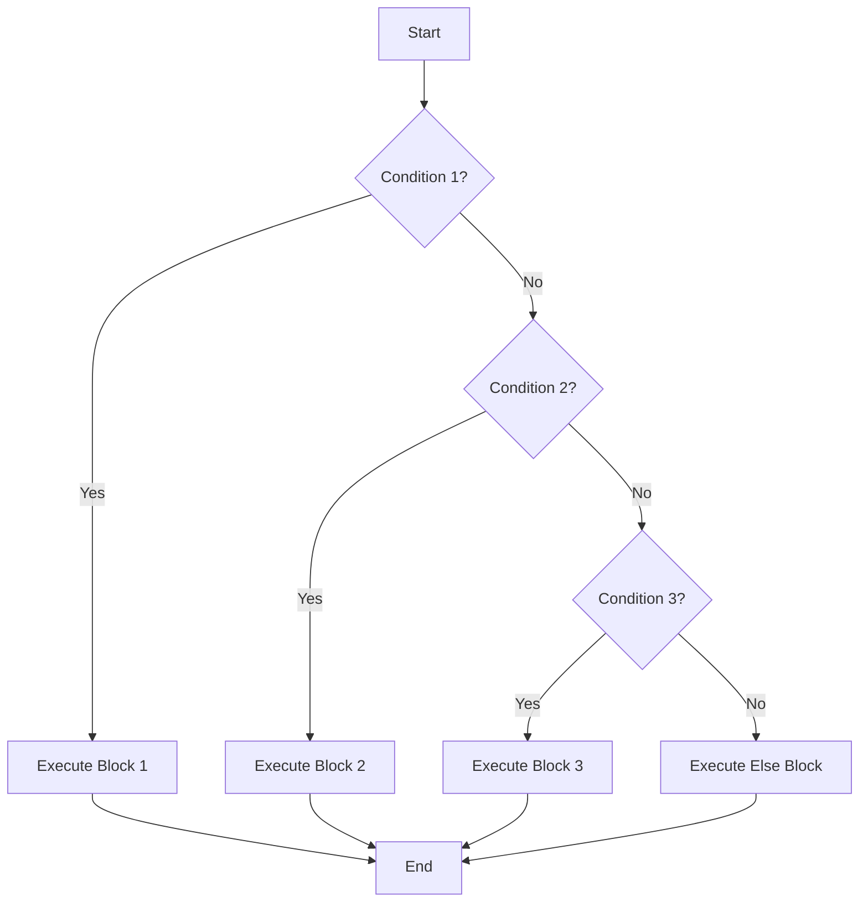

This flowchart visually represents the sequential nature of the `if-else-if` ladder.


## <span style="color:#2980b9">Key Advantages</span> ✅

* **Sequential Evaluation:** Conditions are checked one by one, ensuring efficient execution.
* **Clear Logic:**  Improves code readability and maintainability compared to multiple independent `if` statements.
* **Single Execution:** Only one code block within the ladder will ever execute for a given set of inputs.


By understanding and utilizing the `if-else-if` ladder effectively, you can create more robust and elegant C programs capable of handling complex decision-making scenarios. Remember to always prioritize clear and well-structured code for better readability and maintainability!


# <span style="color:#e67e22">The `switch` Statement in C: A Comprehensive Guide ✨</span>

The `switch` statement in C is a powerful control flow mechanism that allows you to execute different blocks of code based on the value of an expression.  It's often more efficient and readable than a chain of `if-else if-else` statements, especially when dealing with multiple possible values. Think of it as a supercharged, more streamlined version of multiple `if` statements checking against the same variable.


## <span style="color:#2980b9">Syntax and Structure ⚙️</span>

The basic syntax of a `switch` statement is as follows:


```c
switch (expression) {
  case constant1:
    // Code to execute if expression == constant1
    break;
  case constant2:
    // Code to execute if expression == constant2
    break;
  ...
  case constantN:
    // Code to execute if expression == constantN
    break;
  default:
    // Code to execute if expression doesn't match any constant
    break; 
}
```

* **`expression`**: This is an integer expression (or an expression that can be implicitly converted to an integer).  The value of this expression determines which `case` label will be executed.
* **`case constant1`, `case constant2`, ..., `case constantN`**: These are *case labels*. Each label represents a specific value that the `expression` might have.  The `constant` must be an integer literal or an integer constant.
* **`default` (optional)**: This is the optional default case. If the `expression` doesn't match any of the `case` labels, the code within the `default` block is executed.
* **`break`**: The `break` statement is crucial. It terminates the execution of the `switch` statement after a matching `case` is found.  Without `break`, execution "falls through" to the next `case` label.  This can be used intentionally but often leads to errors if forgotten.


### <span style="color:#8e44ad">Important Note on Fallthrough</span>

The absence of a `break` statement results in *fallthrough*. This means that if a `case` matches, the code in that `case` will be executed, and the execution will continue to the next `case` *until* a `break` statement is encountered or the end of the `switch` statement is reached. This behaviour can be used deliberately for handling multiple cases with the same code, but it's vital to understand and use it cautiously to avoid errors.


## <span style="color:#2980b9">Examples: `switch` vs. `if-else` 📊</span>

Let's illustrate with examples comparing `switch` and `if-else` for determining the day of the week based on a numerical representation (1 for Monday, 2 for Tuesday, etc.):


### <span style="color:#8e44ad">Example using `if-else`</span>

```c
#include <stdio.h>

int main() {
  int day = 3; // Wednesday

  if (day == 1) {
    printf("Monday\n"); // Monday
  } else if (day == 2) {
    printf("Tuesday\n"); // Tuesday
  } else if (day == 3) {
    printf("Wednesday\n"); // Wednesday
  } else if (day == 4) {
    printf("Thursday\n"); //Thursday
  } else if (day == 5) {
    printf("Friday\n"); //Friday
  } else if (day == 6) {
    printf("Saturday\n"); //Saturday
  } else if (day == 7) {
    printf("Sunday\n"); //Sunday
  } else {
    printf("Invalid day\n"); //Invalid day
  }
  return 0;
}
```

### <span style="color:#8e44ad">Example using `switch`</span>

```c
#include <stdio.h>

int main() {
  int day = 3; // Wednesday

  switch (day) {
    case 1:
      printf("Monday\n");
      break;
    case 2:
      printf("Tuesday\n");
      break;
    case 3:
      printf("Wednesday\n");
      break;
    case 4:
      printf("Thursday\n");
      break;
    case 5:
      printf("Friday\n");
      break;
    case 6:
      printf("Saturday\n");
      break;
    case 7:
      printf("Sunday\n");
      break;
    default:
      printf("Invalid day\n");
      break;
  }
  return 0;
}
```

Both examples will output: `Wednesday`


## <span style="color:#2980b9">Flowchart illustrating `switch` statement ➡️</span>

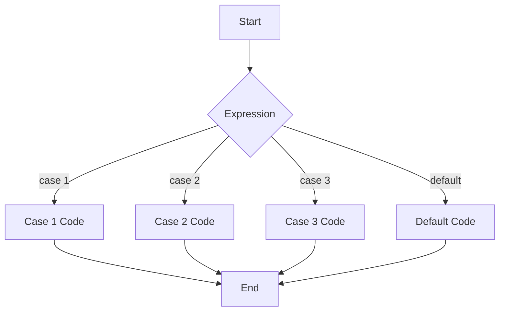


## <span style="color:#2980b9">When to Use Which? 🤔</span>

* Use `switch` when you have a single variable to test against a number of discrete, constant values.  It's generally more readable and potentially more efficient than a long `if-else if` chain in these scenarios.
* Use `if-else if-else` when you need to test for ranges of values, complex conditions, or non-constant expressions.


By understanding the strengths and limitations of both `switch` and `if-else`, you can write cleaner, more efficient, and easier-to-maintain C code. Remember the importance of the `break` statement in `switch` to avoid unintended fallthrough!


# <span style="color:#e67e22">Limitations of `switch` Statements for Range Checks in C</span> ⚠️


## <span style="color:#2980b9">The Problem: Range Checks and `switch`</span>


The humble `switch` statement in C is great for checking equality against a discrete set of values.  However, it falls short when you need to check if a variable falls within a *range* of values.  Let's illustrate this with an example:


Imagine you want to assign letter grades based on numerical scores:

* 90-100: A
* 80-89: B
* 70-79: C
* 60-69: D
* Below 60: F


You *cannot* directly express this with a `switch` statement.  A `switch` only handles *exact* matches.  Attempting to do so would require numerous `case` labels for each individual score, which is inefficient and unwieldy.


### <span style="color:#8e44ad">Illustrative Example (Inefficient `switch` attempt)</span>


```c
#include <stdio.h>

int main() {
  int score = 85;
  char grade;

  switch (score) {
    case 100: case 99: case 98: case 97: case 96: case 95: case 94: case 93: case 92: case 91: case 90:
      grade = 'A';
      break;
    case 89: case 88: case 87: case 86: case 85: case 84: case 83: case 82: case 81: case 80:
      grade = 'B';
      break;
    // ...and so on...  This is tedious!
    default:
      grade = 'F';
  }
  printf("Your grade is: %c\n", grade); // Output: Your grade is: B
  return 0;
}
```


## <span style="color:#2980b9">Workarounds and Alternatives 🎉</span>


Thankfully, several alternatives offer cleaner and more efficient solutions for range checks:


### <span style="color:#8e44ad">1. `if-else if-else` Ladder 🪜</span>


This is the most straightforward approach.  It's readable and directly expresses the range conditions:

```c
#include <stdio.h>

int main() {
  int score = 75;
  char grade;

  if (score >= 90) {
    grade = 'A';
  } else if (score >= 80) {
    grade = 'B';
  } else if (score >= 70) {
    grade = 'C';
  } else if (score >= 60) {
    grade = 'D';
  } else {
    grade = 'F';
  }
  printf("Your grade is: %c\n", grade); // Output: Your grade is: C
  return 0;
}
```


### <span style="color:#8e44ad">2.  Array Lookup 🔎</span>


For evenly spaced ranges, an array lookup provides a concise and efficient solution:

```c
#include <stdio.h>

int main() {
  int score = 85;
  char grades[] = {'F', 'F', 'F', 'F', 'F', 'F', 'D', 'C', 'B', 'A'}; // Index represents tens digit
  char grade = grades[score / 10];  // Integer division to get index
  printf("Your grade is: %c\n", grade); //Output: Your grade is: B
  return 0;
}
```


This approach cleverly uses integer division to map scores to array indices. Note that this is only efficient if your ranges are of equal size, otherwise it would need adjustments.

### <span style="color:#8e44ad">3. Function for Clarity ✨</span>


For improved code readability, encapsulate the grade calculation within a function:

```c
#include <stdio.h>

char getGrade(int score) {
  if (score >= 90) return 'A';
  if (score >= 80) return 'B';
  if (score >= 70) return 'C';
  if (score >= 60) return 'D';
  return 'F';
}

int main() {
  int score = 95;
  char grade = getGrade(score);
  printf("Your grade is: %c\n", grade); // Output: Your grade is: A
  return 0;
}

```

## <span style="color:#2980b9">Flowchart for `if-else if-else` Approach</span>


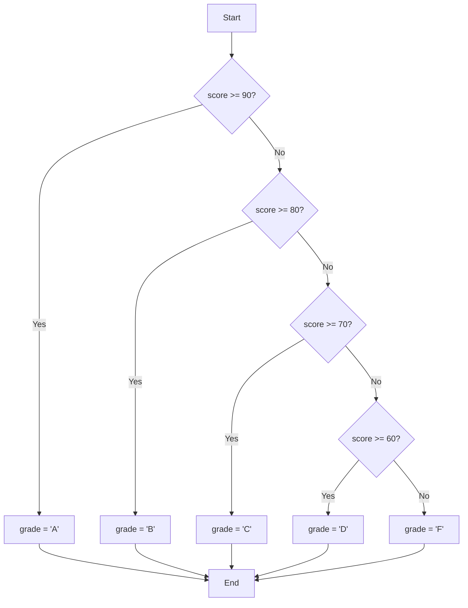


In conclusion, while the `switch` statement is valuable for equality checks, using `if-else if-else` chains, array lookups (for appropriately structured data), or well-defined functions provide superior flexibility and clarity when dealing with range checks in C.  Choose the method that best suits your specific needs and coding style, prioritizing readability and maintainability.


# <span style="color:#e67e22">Loops in C Programming 🔄</span>

Loops are fundamental in programming. They allow you to execute a block of code repeatedly, saving you from writing the same code multiple times.  Think of them as automated repeaters for your instructions! This significantly reduces code length and improves readability.

## <span style="color:#2980b9">Why Use Loops? 🤔</span>

Imagine you need to print numbers from 1 to 10.  Without loops, you'd have to write `printf()` ten times!  Loops make this task concise and efficient. They're essential for tasks like:

*   Processing arrays and lists.
*   Iterating through files.
*   Repeating actions until a condition is met.
*   Creating patterns and structures.


## <span style="color:#2980b9">Types of Loops in C 🌀</span>

C offers three primary loop types: `for`, `while`, and `do-while`. Let's explore each:

### <span style="color:#8e44ad">1. `for` loop 🔁</span>

The `for` loop is ideal when you know the number of iterations in advance.

```c
#include <stdio.h>

int main() {
  // Print numbers 1 to 5
  for (int i = 1; i <= 5; i++) {
    printf("%d ", i); // Output: 1 2 3 4 5
  }
  printf("\n");
  return 0;
}
```

**Flowchart (Mermaid):**

```mermaid
graph TD
    A[Initialization: int i = 1] --> B{Condition: i <= 5?};
    B -- Yes --> C[printf("%d ", i)];
    C --> D[Increment: i++];
    D --> B;
    B -- No --> E[End];
```


### <span style="color:#8e44ad">2. `while` loop 🔄</span>

The `while` loop continues as long as a specified condition is true.  Be cautious – an infinite loop can occur if the condition never becomes false!

```c
#include <stdio.h>

int main() {
  int i = 1;
  // Print numbers 1 to 5
  while (i <= 5) {
    printf("%d ", i); // Output: 1 2 3 4 5
    i++;
  }
  printf("\n");
  return 0;
}
```

**Flowchart (Mermaid):**

```mermaid
graph TD
    A[Initialization: int i = 1] --> B{Condition: i <= 5?};
    B -- Yes --> C[printf("%d ", i)];
    C --> D[Increment: i++];
    D --> B;
    B -- No --> E[End];
```


### <span style="color:#8e44ad">3. `do-while` loop 🔁</span>

Similar to `while`, but the block of code executes *at least once* before the condition is checked.

```c
#include <stdio.h>

int main() {
  int i = 1;
  // Print numbers 1 to 5
  do {
    printf("%d ", i); // Output: 1 2 3 4 5
    i++;
  } while (i <= 5);
  printf("\n");
  return 0;
}
```

**Flowchart (Mermaid):**

```mermaid
graph TD
    A[Initialization: int i = 1] --> B[printf("%d ", i)];
    B --> C[Increment: i++];
    C --> D{Condition: i <= 5?};
    D -- Yes --> B;
    D -- No --> E[End];
```


## <span style="color:#2980b9">Choosing the Right Loop 🤔</span>

*   Use `for` when you know the number of iterations beforehand.
*   Use `while` when the number of iterations is determined by a condition that might change during the loop's execution.
*   Use `do-while` when the code block *must* execute at least once.


Remember to always carefully consider your loop's termination condition to avoid infinite loops!  Happy coding! 🎉


# <span style="color:#e67e22">The Mighty `for` Loop in C 🔄</span>

The `for` loop in C is a powerful tool for repeatedly executing a block of code.  It's perfect for situations where you know *exactly* how many times you need to repeat something. Think of it as a highly organized, efficient way to automate repetitive tasks! ✨


## <span style="color:#2980b9">Understanding the Syntax 📖</span>

The basic syntax of a `for` loop follows this structure:

```c
for (initialization; condition; increment/decrement) {
  // Code to be executed repeatedly
}
```

Let's break it down:

* **`initialization`:** This statement is executed *only once* at the beginning of the loop. It's typically used to declare and initialize a counter variable.
* **`condition`:** This expression is checked *before* each iteration. If it's true, the loop body executes. If it's false, the loop terminates.
* **`increment/decrement`:** This statement is executed *after* each iteration. It's usually used to update the counter variable, bringing it closer to the point where the `condition` becomes false.


### <span style="color:#8e44ad">A Simple Example: Printing Numbers 1-5</span>

```c
#include <stdio.h>

int main() {
  for (int i = 1; i <= 5; i++) {
    printf("Iteration %d\n", i); //Prints the current iteration number
  }
  return 0;
}
```

**Output:**

```
Iteration 1
Iteration 2
Iteration 3
Iteration 4
Iteration 5
```


## <span style="color:#2980b9">Use Cases and Examples 🚀</span>

The `for` loop is incredibly versatile. Here are some common use cases:


### <span style="color:#8e44ad">Iterating through Arrays</span>

```c
#include <stdio.h>

int main() {
  int numbers[] = {10, 20, 30, 40, 50};
  int array_size = sizeof(numbers) / sizeof(numbers[0]); //Calculate the array size

  for (int i = 0; i < array_size; i++) {
    printf("Number at index %d: %d\n", i, numbers[i]);
  }
  return 0;
}
```

**Output:**

```
Number at index 0: 10
Number at index 1: 20
Number at index 2: 30
Number at index 3: 40
Number at index 4: 50
```


### <span style="color:#8e44ad">Nested Loops Nested Loops 🔄</span>

Nested loops involve placing one `for` loop inside another. This is useful for processing multi-dimensional data structures like matrices.


```c
#include <stdio.h>

int main() {
  for (int i = 1; i <= 3; i++) {
    for (int j = 1; j <= 3; j++) {
      printf("(%d, %d) ", i, j);
    }
    printf("\n");
  }
  return 0;
}
```

**Output:**

```
(1, 1) (1, 2) (1, 3) 
(2, 1) (2, 2) (2, 3) 
(3, 1) (3, 2) (3, 3) 
```

### <span style="color:#8e44ad">Flowchart of a Simple `for` Loop</span>

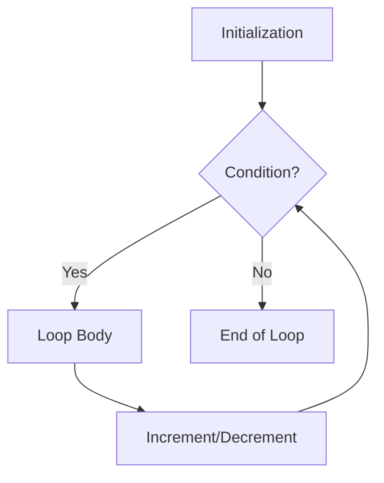


## <span style="color:#2980b9">Key Considerations 🤔</span>

* **Infinite Loops:**  Be cautious!  If your `condition` never becomes false, you'll create an infinite loop that runs forever.  Make sure your counter variable is updated correctly.
* **Off-by-one errors:** These are common mistakes where the loop iterates one time too many or one time too few. Carefully consider your starting and ending conditions.


This comprehensive guide should give you a solid understanding of the `for` loop in C.  Practice is key – experiment with different examples to solidify your knowledge! 💪


# <span style="color:#e67e22">The Wonderful World of `while` Loops in C 🌎</span>


The `while` loop in C is a fundamental control flow statement that allows you to repeatedly execute a block of code as long as a specified condition remains true.  Think of it as a tireless worker that keeps going until it's explicitly told to stop!


## <span style="color:#2980b9">Syntax and Execution Conditions ⚙️</span>

The basic syntax of a `while` loop is straightforward:

```c
while (condition) {
  // Code to be executed repeatedly
}
```

*   **`condition`**: This is a boolean expression (an expression that evaluates to either true or false). The code within the curly braces `{}` will execute only if the `condition` evaluates to `true`.
*   **Code Block**: The code inside the curly braces is the body of the loop.  This is where you put the instructions you want to repeat.

The loop continues to execute as long as the `condition` remains `true`.  Once the `condition` becomes `false`, the loop terminates, and the program continues with the code that follows the loop.


### <span style="color:#8e44ad">Important Note:</span> ⚠️

It's crucial to ensure that your `condition` eventually becomes `false`. Otherwise, you'll create an *infinite loop*, which will run forever and crash your program (or at least make it unresponsive).


## <span style="color:#2980b9">Indefinite Iterations: Examples ✨</span>

`while` loops are particularly useful when you don't know beforehand how many times you need to repeat a block of code. The number of iterations depends entirely on the condition being evaluated.


### <span style="color:#8e44ad">Example 1:  Summing Numbers until a Limit is Reached</span>

This example sums numbers entered by the user until the sum exceeds 100.

```c
#include <stdio.h>

int main() {
  int sum = 0, number;

  printf("Enter numbers to add (enter a non-positive number to stop):\n");

  while (sum <= 100) {
    printf("Enter a number: ");
    scanf("%d", &number);

    if (number > 0) {
      sum += number;
      printf("Current sum: %d\n", sum);
    } else {
      break; // Exit the loop if a non-positive number is entered
    }
  }

  printf("Final sum: %d\n", sum); //Outputs: Final sum: 108 (if the sum exceeds 100)
  return 0;
}
```

### <span style="color:#8e44ad">Example 2: Guessing Game 🎮</span>

This example demonstrates a simple guessing game where the user tries to guess a secret number.

```c
#include <stdio.h>
#include <stdlib.h>
#include <time.h>

int main() {
  int secretNumber, guess;
  srand(time(NULL)); // Seed the random number generator
  secretNumber = rand() % 100 + 1; // Generate a random number between 1 and 100

  printf("Welcome to the Number Guessing Game!\n");

  while (1) { //Infinite loop, breaks when guess is correct
    printf("Guess a number between 1 and 100: ");
    scanf("%d", &guess);

    if (guess < secretNumber) {
      printf("Too low!\n");
    } else if (guess > secretNumber) {
      printf("Too high!\n");
    } else {
      printf("Congratulations! You guessed it in %d tries!\n", guess);
      break; // Exit the loop if the guess is correct
    }
  }
  return 0;
}
```


## <span style="color:#2980b9">Flowchart 📊</span>

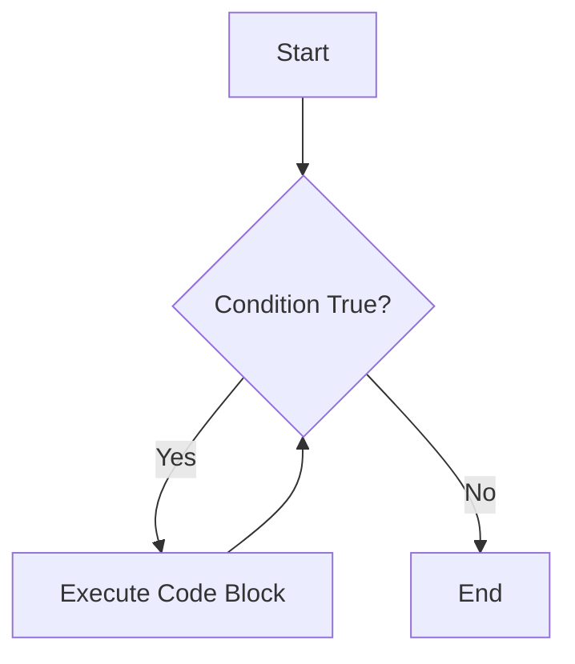


Remember to always carefully design your `while` loop conditions to prevent infinite loops and ensure your program behaves as expected.  Happy coding! 🎉


# <span style="color:#e67e22">The `do...while` Loop in C: A Deep Dive 🔄</span>

The `do...while` loop in C is a post-test loop, meaning it executes the code block *at least once* before checking the condition.  This differs from the `while` loop, which is a pre-test loop and might not execute at all if the condition is initially false. Let's explore this crucial difference with examples and visuals.


## <span style="color:#2980b9">Syntax and Structure 🧱</span>

The basic syntax of a `do...while` loop is straightforward:

```c
do {
  // Code to be executed repeatedly
} while (condition); 
```

*   **`do`**: This keyword marks the beginning of the loop.
*   **`{` and `}`**: These curly braces enclose the code block that will be executed repeatedly.
*   **`while (condition)`**: This part specifies the condition that controls the loop.  The loop continues as long as the `condition` evaluates to true.  Crucially, the condition is checked *after* the code block has executed at least once.
*   **`;`**:  Don't forget the semicolon at the end of the `while` statement! This is a common source of errors.


## <span style="color:#2980b9">Comparison with `while` Loop 🆚</span>

Here's a table summarizing the key differences:

| Feature          | `while` Loop                     | `do...while` Loop                |
|-----------------|---------------------------------|-----------------------------------|
| Condition Check | Before each iteration           | After each iteration             |
| Minimum Iterations | Zero (if condition is false initially) | One (always executes at least once) |
| Use Case         | When you might not need to execute at all | When you need to execute at least once |


## <span style="color:#2980b9">Examples to Illustrate 💡</span>

Let's see `do...while` in action:

### <span style="color:#8e44ad">Example 1:  Printing Numbers</span>

```c
#include <stdio.h>

int main() {
  int i = 5; //Initialize i to 5

  do {
    printf("Value of i: %d\n", i); //Prints the current value of i
    i--; //Decrements i by 1
  } while (i > 0); //Continues as long as i is greater than 0

  return 0;
}
```

**Output:**

```
Value of i: 5
Value of i: 4
Value of i: 3
Value of i: 2
Value of i: 1
```

### <span style="color:#8e44ad">Example 2:  User Input Loop</span>

This example demonstrates a scenario where a `do...while` loop is particularly useful: prompting a user for input until they provide valid data.


```c
#include <stdio.h>

int main() {
  int age;
  do {
    printf("Enter your age (must be positive): ");
    scanf("%d", &age);
    if (age <=0) {
      printf("Invalid age. Please enter a positive number.\n");
    }
  } while (age <= 0); //Loop continues until the user inputs a positive age
  printf("You entered a valid age: %d\n", age);
  return 0;
}
```

**Output (Example):**

```
Enter your age (must be positive): -5
Invalid age. Please enter a positive number.
Enter your age (must be positive): 0
Invalid age. Please enter a positive number.
Enter your age (must be positive): 25
You entered a valid age: 25
```


## <span style="color:#2980b9">Flowchart Representation 📊</span>

Here's a Mermaid flowchart illustrating the `do...while` loop's execution:

```mermaid
graph TD
    A[Start] --> B{do { ... }};
    B --> C[Code Block];
    C --> D{Condition?};
    D -- Yes --> B;
    D -- No --> E[End];
```


## <span style="color:#2980b9">Key Takeaways 📝</span>

*   The `do...while` loop guarantees at least one execution of the code block.
*   It's ideal for scenarios where you need to perform an action at least once before checking a condition.
*   Remember the semicolon after the `while` condition!


By understanding the nuances of `do...while`, you'll be better equipped to choose the most appropriate loop for your C programming tasks. Remember to always consider whether you need to guarantee at least one execution before deciding between `while` and `do...while`.


# <span style="color:#e67e22">C Loops: `for` vs. `while`</span> 🔄


This document compares the `for` and `while` loops in C, highlighting their strengths and showcasing their appropriate use cases with illustrative examples.


## <span style="color:#2980b9">The `for` Loop 🔁</span>


The `for` loop is ideal when you know the number of iterations in advance.  It's structured to concisely handle repetitive tasks with a clearly defined beginning, condition, and increment/decrement.

### <span style="color:#8e44ad">Syntax and Structure</span>

```c
for (initialization; condition; increment/decrement) {
  // Code to be executed repeatedly
}
```

*   **Initialization:** Executed once at the beginning of the loop. Typically used to declare and initialize a counter variable.
*   **Condition:** Checked before each iteration. If true, the loop body executes; otherwise, the loop terminates.
*   **Increment/Decrement:** Executed after each iteration. Usually updates the counter variable.


### <span style="color:#8e44ad">Example: Printing numbers 1 to 10</span>

```c
#include <stdio.h>

int main() {
  for (int i = 1; i <= 10; i++) {
    printf("%d ", i); //Prints each number
  }
  printf("\n"); //Newline for better formatting
  return 0;
}
```

**Output:**

```
1 2 3 4 5 6 7 8 9 10 
```


## <span style="color:#2980b9">The `while` Loop 🔄</span>


The `while` loop is perfect for situations where the number of iterations isn't known beforehand. It continues executing as long as a specified condition remains true.

### <span style="color:#8e44ad">Syntax and Structure</span>

```c
while (condition) {
  // Code to be executed repeatedly
}
```

*   **Condition:** Checked before each iteration.  If true, the loop body executes; otherwise, the loop terminates.


### <span style="color:#8e44ad">Example: Reading numbers until a negative number is entered</span>


```c
#include <stdio.h>

int main() {
  int num;
  printf("Enter numbers (enter a negative number to stop):\n");
  while (1) { //Infinite loop until condition breaks
    scanf("%d", &num);
    if (num < 0) {
      break; //Exit the loop if num is negative
    }
    printf("You entered: %d\n", num);
  }
  printf("Loop terminated.\n");
  return 0;
}
```

**Output (example):**

```
Enter numbers (enter a negative number to stop):
10
You entered: 10
25
You entered: 25
-5
Loop terminated.
```

## <span style="color:#2980b9">Choosing Between `for` and `while` 🤔</span>


*   Use a **`for` loop** when you know the number of iterations in advance (e.g., iterating through an array, repeating a task a fixed number of times).  It's more readable and structured for such scenarios.

*   Use a **`while` loop** when the number of iterations is unknown or depends on a condition (e.g., reading user input until a specific value is entered, simulating events until a certain state is reached).  It provides greater flexibility for dynamic looping.


## <span style="color:#2980b9">Flowcharts 📊</span>


**For Loop:**

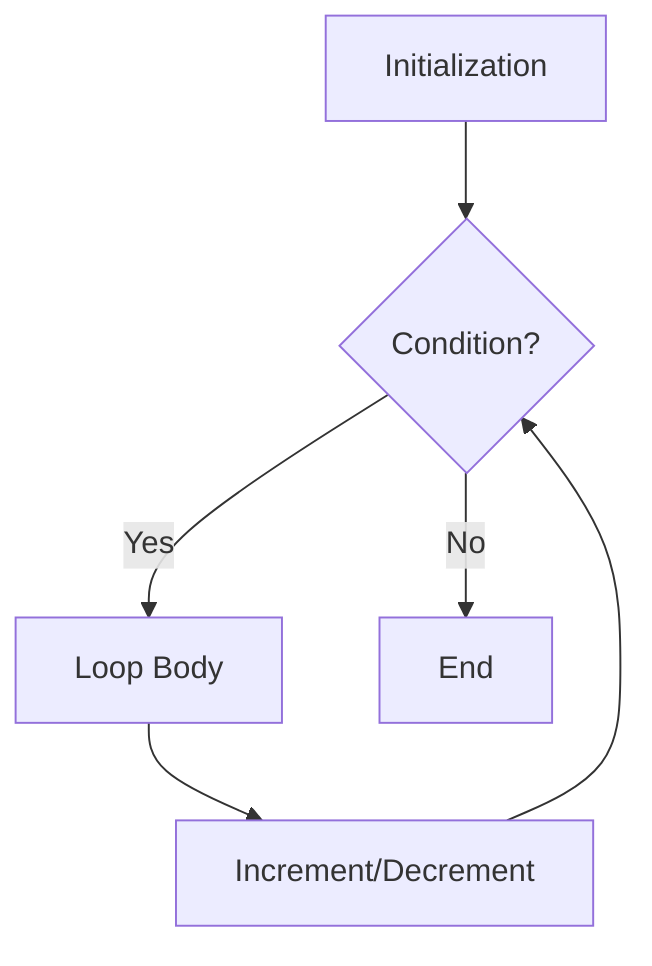

**While Loop:**

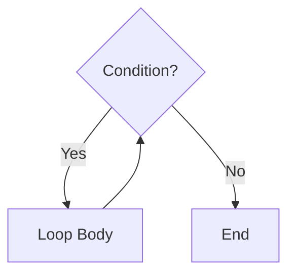


This comparison provides a clear understanding of the functionalities and appropriate use cases of both `for` and `while` loops in C programming. Remember to choose the loop that best suits the specific needs of your program for improved code readability and efficiency.


# <span style="color:#e67e22">The Mighty `continue` Statement in C 🤸</span>

The `continue` statement in C is a powerful tool for controlling the flow of *loops*.  It allows you to skip the rest of the current iteration and jump directly to the *next* iteration. Think of it as a shortcut that bypasses specific parts of your loop based on certain conditions.

## <span style="color:#2980b9">Understanding `continue`'s Role ✨</span>

Unlike the `break` statement (which exits the loop entirely), `continue` only affects the *current iteration*.  It essentially says, "Okay, I'm done with this one; let's move on to the next!" This is particularly useful when you want to process only certain elements within a loop, ignoring others based on some criteria.

### <span style="color:#8e44ad">A Simple Analogy 💡</span>

Imagine you're sorting laundry. You encounter a sock that's not dirty. Instead of stopping the entire sorting process, you simply skip that sock and proceed to the next item.  `continue` does the same in your code—it skips the current item and proceeds to the next iteration.

## <span style="color:#2980b9">Examples Illustrating `continue` 💪</span>

Let's see `continue` in action with some examples:

**Example 1: Skipping Even Numbers**

```c
#include <stdio.h>

int main() {
  for (int i = 1; i <= 10; i++) {
    if (i % 2 == 0) { // If i is even
      continue;       // Skip the rest of this iteration
    }
    printf("%d ", i); // Print only odd numbers
  }
  printf("\n"); // Newline for better formatting
  return 0;
}
```

**Commented Output:**

```
1 3 5 7 9 
```

**Example 2: Processing Only Positive Numbers**

```c
#include <stdio.h>

int main() {
  int numbers[] = {1, -2, 3, -4, 5, 0};
  int size = sizeof(numbers) / sizeof(numbers[0]);

  for (int i = 0; i < size; i++) {
    if (numbers[i] <= 0) { // If number is not positive
      continue;           // Skip to the next number
    }
    printf("%d ", numbers[i]);
  }
  printf("\n");
  return 0;
}
```

**Commented Output:**

```
1 3 5 
```


## <span style="color:#2980b9">Flowchart Visualization 🗺️</span>

Here's a flowchart illustrating the behavior of a `for` loop with a `continue` statement:

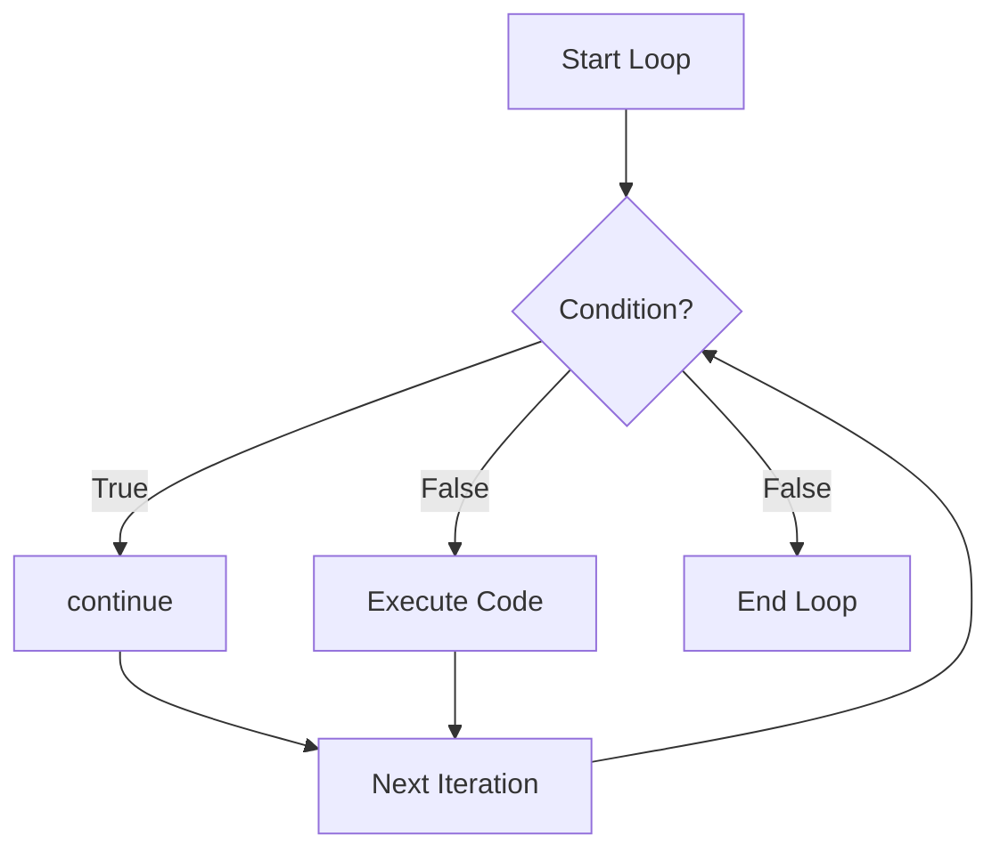

* **A:** Start of the loop.
* **B:** Condition check.
* **C:** If the condition is true, `continue` is executed, skipping the rest of the loop body and going directly to the next iteration (E).
* **D:** If the condition is false, the code inside the loop body is executed.
* **E:** The loop proceeds to the next iteration.
* **F:** The loop ends.


## <span style="color:#2980b9">Key Takeaways 🎯</span>

*   `continue` skips the *rest* of the current iteration of a loop.
*   It's different from `break`, which *exits* the loop entirely.
*   `continue` is useful for selectively processing elements within a loop based on specific conditions.


By understanding and using `continue` effectively, you can write more concise and efficient C code to handle various looping scenarios.  Remember to choose the right control flow statement based on your specific needs!


# <span style="color:#e67e22">The Mighty `break` Statement in C 💥</span>


The `break` statement in C is like a powerful escape hatch. It allows you to abruptly exit from loops (like `for`, `while`, `do-while`) or `switch` statements, preventing further iterations or case executions.  Let's explore its functionalities with examples and visual aids.


## <span style="color:#2980b9">Breaking Free from Loops 🔄</span>

The `break` statement immediately terminates the innermost loop it's enclosed in.  Execution then continues with the statement *following* the loop.

### <span style="color:#8e44ad">Example: `for` loop</span>

```c
#include <stdio.h>

int main() {
  for (int i = 0; i < 5; i++) {
    printf("Iteration: %d\n", i);
    if (i == 2) {
      break; // Exits the loop when i is 2
    }
  }
  printf("Loop finished!\n");
  return 0;
}
```

**Output:**

```
Iteration: 0
Iteration: 1
Iteration: 2
Loop finished!
```

### <span style="color:#8e44ad">Mermaid Flowchart for `for` loop with `break`</span>

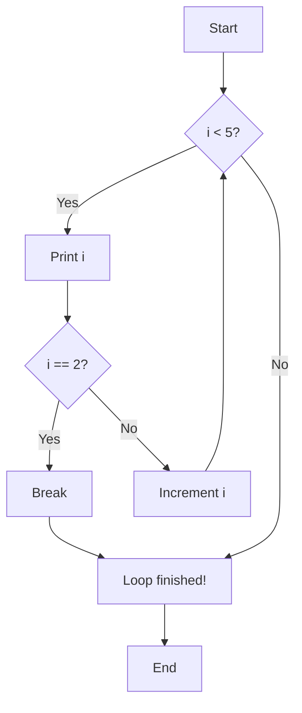


## <span style="color:#2980b9">Exiting `switch` Statements 🚪</span>

In a `switch` statement, `break` prevents fall-through. Without `break`, execution would continue into the next `case` even if the current condition is met.


### <span style="color:#8e44ad">Example: `switch` statement</span>

```c
#include <stdio.h>

int main() {
  int day = 3;
  switch (day) {
    case 1:
      printf("Monday\n");
      break;
    case 2:
      printf("Tuesday\n");
      break;
    case 3:
      printf("Wednesday\n");
      break;
    default:
      printf("Other day\n");
  }
  printf("Switch finished!\n");
  return 0;
}
```

**Output:**

```
Wednesday
Switch finished!
```

### <span style="color:#8e44ad">Example: `switch` statement without `break` (demonstrating fallthrough)</span>

```c
#include <stdio.h>

int main() {
  int day = 3;
  switch (day) {
    case 1:
      printf("Monday\n");
    case 2:
      printf("Tuesday\n");
    case 3:
      printf("Wednesday\n");
    default:
      printf("Other day\n");
  }
  printf("Switch finished!\n");
  return 0;
}
```

**Output:**

```
Wednesday
Other day
Switch finished!
```

*Notice how without `break`, the code "falls through" to the `default` case.*


## <span style="color:#2980b9">Key Differences & Best Practices ✨</span>

*   `break` in loops: Exits the *entire* loop.
*   `break` in `switch`: Exits the *current* `case` within the `switch`.
*   Always use `break` in `switch` cases unless you intend for fallthrough (which is generally discouraged for readability).
*   Overuse of `break` can make code less readable. Consider if a `continue` statement (which skips the current iteration and proceeds to the next) might be a better alternative in loops.


By understanding and utilizing the `break` statement effectively, you can create cleaner, more efficient, and easier-to-maintain C programs. Remember to use it judiciously! 😉


# <span style="color:#e67e22">The `goto` Statement in C: A Controversial Jump</span> ✈️

The `goto` statement in C is a powerful, yet often controversial, control flow statement. It allows you to transfer program execution unconditionally to a labeled statement within the same function.  Think of it as a direct jump to a specific point in your code. While it offers flexibility, its overuse can lead to "spaghetti code" – a tangled, difficult-to-understand program.

## <span style="color:#2980b9">Syntax and Basic Usage</span> ➡️

The syntax is straightforward:

```c
goto label; 

// ... some code ...

label:
  statement; 
```

*   `label:`:  A label is an identifier (a name) followed by a colon (`:`) that marks a specific point in your code.  It must be within the same function as the `goto` statement.
*   `goto label;`: This statement unconditionally transfers control to the statement immediately following the label `label:`.

### <span style="color:#8e44ad">Example: Simple `goto`</span>

```c
#include <stdio.h>

int main() {
  int x = 10;

  if (x > 5) {
    goto end; // Jumps to the 'end' label
  }

  printf("This line won't be printed.\n"); //This will be skipped

  end:
  printf("This line will always be printed.\n"); //This will always be printed
  return 0;
}
```

**Commented Output:**

```
This line will always be printed.
```


## <span style="color:#2980b9">Potential Uses (with Caution!)</span> ⚠️

While generally discouraged, `goto` can be useful in *very specific* situations:

* **Error Handling:**  Exiting nested loops or functions gracefully in case of an error.  However, structured exception handling (`try-catch` blocks in other languages) is usually preferred.

* **Breaking out of deeply nested loops:**  While `break` and `continue` can handle many cases, `goto` might offer a cleaner solution for exceptionally complex nested structures.  But, seriously consider refactoring your code instead.


## <span style="color:#2980b9">The Controversy: Why `goto` is Often Shunned</span> 🚫

* **Readability and Maintainability:**  Excessive use of `goto` creates "spaghetti code," making programs hard to follow, debug, and maintain. The flow of control becomes unpredictable and difficult to visualize.

* **Debugging Nightmare:** Tracing the execution path in a program littered with `goto` statements can be a nightmare.


### <span style="color:#8e44ad">Example: Spaghetti Code (Avoid This!)</span>

```c
#include <stdio.h>

int main() {
  int i = 0;
  int j = 0;

  start:
    if (i > 5) goto end;
    j++;
    if (j > 3) goto next_i;
    printf("i = %d, j = %d\n", i, j);
    goto loop_end;

  next_i:
    i++;
    goto start;

  loop_end:
    continue;

  end:
  printf("Finished\n");
  return 0;
}
```

**Commented Output:** (Illustrates the unpredictable flow)

```
i = 0, j = 1
i = 0, j = 2
i = 0, j = 3
i = 1, j = 1
i = 1, j = 2
i = 1, j = 3
i = 2, j = 1
i = 2, j = 2
i = 2, j = 3
i = 3, j = 1
i = 3, j = 2
i = 3, j = 3
i = 4, j = 1
i = 4, j = 2
i = 4, j = 3
i = 5, j = 1
i = 5, j = 2
i = 5, j = 3
Finished
```

This example is convoluted and demonstrates how `goto` can lead to difficult-to-understand code.

## <span style="color:#2980b9">Flowchart Comparison</span> 📊

A simple `if-else` structure:

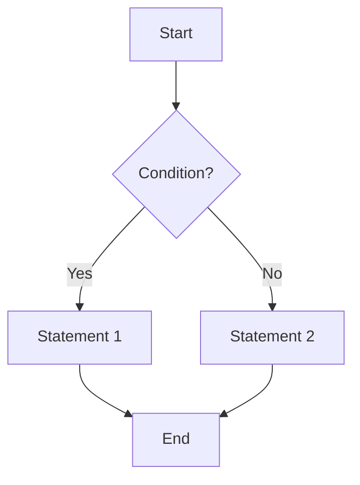

The same logic with `goto` (illustrating the less clear flow):


Even in this simple example, the `goto` version is slightly less intuitive.  Imagine the complexity in larger, more intricate programs.


**In Conclusion:** While `goto` exists, its use should be extremely limited and only considered when other structured control flow mechanisms are demonstrably inadequate.  Prioritize writing clean, readable, and maintainable code using structured programming techniques.  Most modern coding styles strongly advise against using `goto` except in the most exceptional circumstances.


<h1><span style='color:#e67e22'>Conclusion</span></h1>

And there you have it!  We've covered a lot of ground today, and hopefully, you found it helpful and interesting. 😊  We'd love to hear your thoughts!  Did anything surprise you?  Do you have any questions or different perspectives?  Maybe you have some fantastic ideas for future posts?  Let us know in the comments section below! 👇 We're always eager to hear from you and learn from your experiences.  Let's keep the conversation going!  💬


