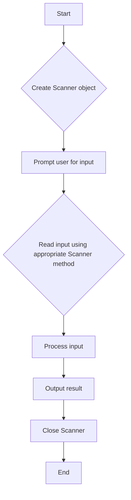

# <span style="color:#e67e22;">What we will learn in this post?</span>
<ul style='list-style-type: none; padding-left: 0;'>
<li><span style='color: #2980b9; font-size: 20px; font-weight: bold;'>👉</span> <span style='color: #2ecc71; font-size: 18px; font-weight: bold;'>How to Take Input from Users in Java</span></li>
<li><span style='color: #2980b9; font-size: 20px; font-weight: bold;'>👉</span> <span style='color: #2ecc71; font-size: 18px; font-weight: bold;'>Scanner Class in Java</span></li>
<li><span style='color: #2980b9; font-size: 20px; font-weight: bold;'>👉</span> <span style='color: #2ecc71; font-size: 18px; font-weight: bold;'>BufferedReader Class in Java</span></li>
<li><span style='color: #2980b9; font-size: 20px; font-weight: bold;'>👉</span> <span style='color: #2ecc71; font-size: 18px; font-weight: bold;'>Scanner vs BufferedReader in Java</span></li>
<li><span style='color: #2980b9; font-size: 20px; font-weight: bold;'>👉</span> <span style='color: #2ecc71; font-size: 18px; font-weight: bold;'>Ways to Read Input from Console in Java</span></li>
<li><span style='color: #2980b9; font-size: 20px; font-weight: bold;'>👉</span> <span style='color: #2ecc71; font-size: 18px; font-weight: bold;'>Print Output in Java</span></li>
<li><span style='color: #2980b9; font-size: 20px; font-weight: bold;'>👉</span> <span style='color: #2ecc71; font-size: 18px; font-weight: bold;'>print() vs println() in Java</span></li>
<li><span style='color: #2980b9; font-size: 20px; font-weight: bold;'>👉</span> <span style='color: #2ecc71; font-size: 18px; font-weight: bold;'>Formatted Outputs in Java</span></li>
<li><span style='color: #2980b9; font-size: 20px; font-weight: bold;'>👉</span> <span style='color: #2ecc71; font-size: 18px; font-weight: bold;'>Conclusion!</span></li>
</ul>

# <span style="color:#e67e22">User Input in Java: Mastering Scanner & BufferedReader</span> ⌨️

This guide demonstrates how to efficiently handle user input in Java using the `Scanner` and `BufferedReader` classes.  Learning to effectively `read input in Java console` is crucial for interactive program development.


## <span style="color:#2980b9">Using Scanner for User Input</span> ➡️

The `Scanner` class offers a straightforward approach for reading various data types.

### <span style="color:#8e44ad">Example: Reading an Integer</span> 🔢

```java
import java.util.Scanner;

public class ScannerExample {
    public static void main(String[] args) {
        Scanner scanner = new Scanner(System.in);
        System.out.print("Enter an integer: ");
        int number = scanner.nextInt();
        System.out.println("You entered: " + number); // Expected Output: You entered: [user's input]
        scanner.close();
    }
}
```

### <span style="color:#8e44ad">Example: Reading a String</span> 🔤

```java
import java.util.Scanner;

public class ScannerExample {
    public static void main(String[] args) {
        Scanner scanner = new Scanner(System.in);
        System.out.print("Enter your name: ");
        String name = scanner.nextLine();
        System.out.println("Hello, " + name + "!"); //Expected Output: Hello, [user's input]!
        scanner.close();
    }
}
```

## <span style="color:#2980b9">Employing BufferedReader for Enhanced Efficiency</span> 🚀

`BufferedReader` provides faster input handling, particularly for large inputs. It's more efficient for *console input* in Java applications that require processing substantial amounts of data.

```java
import java.io.BufferedReader;
import java.io.IOException;
import java.io.InputStreamReader;

public class BufferedReaderExample {
    public static void main(String[] args) throws IOException {
        BufferedReader reader = new BufferedReader(new InputStreamReader(System.in));
        System.out.print("Enter a line of text: ");
        String line = reader.readLine();
        System.out.println("You entered: " + line); // Expected Output: You entered: [user's input]
    }
}
```

*Remember to handle potential `IOExceptions` when using `BufferedReader`.*

**Choosing the Right Tool:** For simple applications, `Scanner` suffices.  For performance-critical scenarios or large datasets, `BufferedReader` is the preferred choice for reading input in Java.  Always remember to close your `Scanner` to release system resources.


# <span style="color:#e67e22">Java Scanner Tutorial: Input Handling with Scanner 📖</span>

This tutorial will guide you through using the `Scanner` class in Java for efficient input handling. The `Scanner` class is a simple yet powerful tool for reading data from various sources, most commonly from the console (keyboard input).  It's a fundamental concept for any Java programmer.


## <span style="color:#2980b9">Understanding the Scanner Class</span>

The `Scanner` class, part of the `java.util` package, allows you to read different data types from an input stream.  You create a `Scanner` object, typically associated with `System.in` (standard input), and then use its methods to read data.

### <span style="color:#8e44ad">Importing the Scanner Class</span>

Before you start, remember to import the `Scanner` class:

```java
import java.util.Scanner;
```

## <span style="color:#2980b9">Reading Different Data Types</span>

Here's how to read various data types using the `Scanner` class:

```java
import java.util.Scanner;

public class ScannerExample {
    public static void main(String[] args) {
        Scanner scanner = new Scanner(System.in);

        System.out.print("Enter an integer: ");
        int integerValue = scanner.nextInt(); //Reading an integer
        System.out.println("You entered: " + integerValue); // Output: You entered: [user input]

        System.out.print("Enter a float: ");
        float floatValue = scanner.nextFloat(); //Reading a float
        System.out.println("You entered: " + floatValue); // Output: You entered: [user input]

        System.out.print("Enter a String: ");
        String stringValue = scanner.next(); //Reading a String (single word)
        System.out.println("You entered: " + stringValue); // Output: You entered: [user input]

        System.out.print("Enter a line of text: ");
        scanner.nextLine(); // Consume the newline character left by next()
        String lineValue = scanner.nextLine(); //Reading a line of text
        System.out.println("You entered: " + lineValue); // Output: You entered: [user input]


        scanner.close();
    }
}
```

This code demonstrates how to read integers, floats, single words, and entire lines of text using different `Scanner` methods. Remember to close the `Scanner` using `scanner.close()` to release resources.


## <span style="color:#2980b9">Flowchart for Scanner Input</span>



This flowchart visually represents the basic steps involved in using the `Scanner` class for input handling.  Remember to handle potential exceptions (e.g., `InputMismatchException`) for robust code.  This `Java Scanner tutorial` provides a solid foundation for handling user input effectively in your Java programs.


# <span style="color:#e67e22">Java `BufferedReader` Explained 📖</span>

This guide explains the Java `BufferedReader` class, a crucial tool for efficient text input.  It's perfect for handling `console input in Java` and other text-based operations.  Learn how to use it effectively with our examples!

## <span style="color:#2980b9">What is `BufferedReader`?</span>

The `BufferedReader` class in Java is a reader that reads text from a character-input stream, buffering characters so as to provide for the efficient reading of characters, arrays, and lines.  It's much faster than directly using `InputStreamReader` because it reads data in chunks, minimizing I/O operations.


### <span style="color:#8e44ad">Syntax and Usage</span>

```java
BufferedReader reader = new BufferedReader(new InputStreamReader(System.in));
```

This creates a `BufferedReader` that reads from the console (`System.in`).  `InputStreamReader` converts bytes to characters.


## <span style="color:#2980b9">Reading Input from the Console</span>

Here's a **Java BufferedReader example** demonstrating console input:

```java
import java.io.*;

public class BufferedReaderExample {
    public static void main(String[] args) throws IOException {
        BufferedReader reader = new BufferedReader(new InputStreamReader(System.in));
        System.out.print("Enter your name: ");
        String name = reader.readLine(); //Reads a line of text
        System.out.println("Hello, " + name + "!");
        reader.close(); //Important: Always close the reader
    }
}
```

**Expected Output:**

```
Enter your name: John Doe
Hello, John Doe!
```

This "Java BufferedReader example" shows how to read a line of text.  For reading multiple lines, use a loop.


## <span style="color:#2980b9">Handling potential exceptions</span>

It's crucial to handle `IOException`  when working with `BufferedReader`. This exception can occur during file operations.  The `throws IOException` clause in the `main` method handles it.


### <span style="color:#8e44ad">Error Handling Best Practices</span>

*   Always close the `BufferedReader` using `reader.close()` to release system resources.
*   Use try-catch blocks for robust error handling.


This comprehensive guide provides a solid foundation for using `BufferedReader` in your Java projects. Remember to practice and experiment!  Happy coding! 🎉


# <span style="color:#e67e22">Scanner vs BufferedReader Java: The Ultimate Input Showdown 🥊</span>

Choosing the *best input method in Java* often boils down to `Scanner` versus `BufferedReader`.  Let's explore their strengths and weaknesses.

## <span style="color:#2980b9">Scanner: User-Friendly, but Not Always Fast 💨</span>

**Advantages:**

*   Easy to use, especially for beginners.  Handles various data types directly (int, float, String, etc.).
*   Good for interactive console applications.

**Limitations:**

*   Less efficient than `BufferedReader` for large files.  It parses input line by line, which is slower.
*   Can be resource-intensive for large inputs.

**Code Example:**

```java
import java.util.Scanner;

public class ScannerExample {
    public static void main(String[] args) {
        Scanner scanner = new Scanner(System.in);
        System.out.print("Enter your name: ");
        String name = scanner.nextLine();
        System.out.println("Hello, " + name + "!"); // Output: Hello, [User's Name]!
        scanner.close();
    }
}
```

## <span style="color:#2980b9">BufferedReader: Performance Champion 🏆</span>

**Advantages:**

*   Significantly faster for reading large files. Reads data in chunks, improving efficiency.
*   More memory-efficient than `Scanner` for large inputs.

**Limitations:**

*   Requires more code for parsing different data types. You often need to manually convert strings.
*   Less intuitive for simple console input.

**Code Example:**

```java
import java.io.BufferedReader;
import java.io.IOException;
import java.io.InputStreamReader;

public class BufferedReaderExample {
    public static void main(String[] args) throws IOException {
        BufferedReader reader = new BufferedReader(new InputStreamReader(System.in));
        System.out.print("Enter a number: ");
        String line = reader.readLine();
        int number = Integer.parseInt(line); //Manual parsing required
        System.out.println("You entered: " + number); // Output: You entered: [User's Number]

    }
}
```


### <span style="color:#8e44ad">When to Use Which?</span>

*   **Scanner:**  Small inputs, interactive console programs, beginners.
*   **BufferedReader:** Large files, performance-critical applications, advanced users.


**'Scanner vs BufferedReader Java'** and choosing the *best input method in Java* depends on your specific needs. Consider file size and performance requirements when making your decision.


# <span style="color:#e67e22">Console Input in Java: A Tutorial 📖</span>

This tutorial shows you how to read input from the console in Java using different methods.  This is a crucial skill for any Java programmer!  This "console input Java tutorial" covers `System.in`, `Scanner`, and `BufferedReader`.

## <span style="color:#2980b9">Method 1: Using System.in ➡️</span>

This method uses the `System.in` stream, which is the standard input stream. It's low-level and requires more manual handling.

### <span style="color:#8e44ad">Code Example:</span>

```java
import java.io.IOException;
import java.io.InputStream;

public class SystemInExample {
    public static void main(String[] args) throws IOException {
        InputStream inputStream = System.in;
        int character;
        while ((character = inputStream.read()) != -1) {
            System.out.print((char) character); //Prints each character until end of stream(-1)
        }
    }
}
```

<!-- Expected Output:  Whatever the user types into the console. -->


## <span style="color:#2980b9">Method 2: Using Scanner 🔎</span>

`Scanner` is a user-friendly class for reading various data types from the console.  It's easier to use than `System.in`.

### <span style="color:#8e44ad">Code Example:</span>

```java
import java.util.Scanner;

public class ScannerExample {
    public static void main(String[] args) {
        Scanner scanner = new Scanner(System.in);
        System.out.print("Enter your name: ");
        String name = scanner.nextLine();
        System.out.println("Hello, " + name + "!"); //Prints "Hello," + entered name
        scanner.close();
    }
}
```

<!-- Expected Output:  "Enter your name: " (prompt), followed by the user's input and a greeting. -->


## <span style="color:#2980b9">Method 3: Using BufferedReader 📚</span>

`BufferedReader` is efficient for reading large amounts of text from the console. It buffers the input, improving performance.


### <span style="color:#8e44ad">Code Example:</span>

```java
import java.io.BufferedReader;
import java.io.IOException;
import java.io.InputStreamReader;

public class BufferedReaderExample {
    public static void main(String[] args) throws IOException {
        BufferedReader reader = new BufferedReader(new InputStreamReader(System.in));
        System.out.print("Enter a line of text: ");
        String line = reader.readLine();
        System.out.println("You entered: " + line); //Prints "You entered:" + entered line
    }
}
```

<!-- Expected Output: "Enter a line of text: " (prompt), followed by the user's input and a confirmation. -->


Remember to always close your `Scanner` and other resources using `close()` to prevent resource leaks.  Choose the method that best suits your needs based on the complexity and volume of input.  This *console input Java tutorial* should get you started! 👍


# <span style="color:#e67e22">Java Console Output: Mastering `System.out.print` and `System.out.println` ✨</span>

This guide explains how to print to the Java console using the standard output stream.  We'll explore the core methods: `System.out.print()` and `System.out.println()`.

## <span style="color:#2980b9">Using `System.out.print()` 🗣️</span>

`System.out.print()` displays text to the console *without* adding a new line after the output.  This allows you to concatenate multiple print statements onto a single line.

### <span style="color:#8e44ad">Example:</span>

```java
public class PrintExample {
    public static void main(String[] args) {
        System.out.print("Hello "); // Output: Hello 
        System.out.print("World!"); // Output: Hello World! (on the same line)
    }
}
```


## <span style="color:#2980b9">Using `System.out.println()` ➡️</span>

`System.out.println()` displays text to the console and *automatically adds a new line* after the output.  This is generally preferred for cleaner output formatting.

### <span style="color:#8e44ad">Example:</span>

```java
public class PrintlnExample {
    public static void main(String[] args) {
        System.out.println("Hello"); // Output: Hello (on a new line)
        System.out.println("World!"); // Output: World! (on a new line)
    }
}
```

## <span style="color:#2980b9">Key Differences Summarized 📝</span>

* **`System.out.print()`:**  Prints text without a newline.  Useful for building output line by line.
* **`System.out.println()`:** Prints text *with* a newline. Ideal for creating clearly separated lines of output.


This simple distinction makes a big difference in how your Java console output is structured. Remember to choose the method that best suits your needs! 👍


# <span style="color:#e67e22">Print vs println in Java 🖨️</span>

This guide explains the core difference between `print()` and `println()` in Java, two fundamental methods for displaying output.  Understanding their behavior is crucial for any Java programmer.

## <span style="color:#2980b9">Understanding the Difference 🤔</span>

Both `print()` and `println()` are methods of the `System.out` object (which represents the standard output stream), used to display text on the console.  The key distinction lies in how they handle newlines:

*   `print()`: Displays text *without* moving the cursor to the next line.  Subsequent output will appear on the same line.
*   `println()`: Displays text and then *moves the cursor to the next line*.  Subsequent output will appear on a new line.


### <span style="color:#8e44ad">Code Examples 💻</span>

Here's a Java code snippet demonstrating the difference:

```java
public class PrintExample {
    public static void main(String[] args) {
        System.out.print("Hello "); // Prints "Hello "
        System.out.print("World!"); // Prints "World!" on the same line
        System.out.println(" This is on a new line."); //Prints "This is on a new line." on a new line

        System.out.println("Another line."); // Prints "Another line." on a new line

    }
}
```

**Expected Output:**

```
Hello World! This is on a new line.
Another line.
```


## <span style="color:#2980b9">Choosing the Right Method 🤔</span>

The choice between `print()` and `println()` depends on your desired output format.  `println()` is generally preferred for displaying multiple lines of text, ensuring readability. `print()` can be useful for creating output on a single line, such as building a progress bar or displaying a continuously updating value.

<br>

This information should provide a clear understanding of the *Java print methods*, clarifying the nuances of `print()` vs `println()` in your Java programming journey. Remember to always consider the desired output format when selecting the appropriate method.


# <span style="color:#e67e22">Formatted Output in Java 😎</span>

This tutorial covers creating formatted output in Java, a crucial skill for any Java developer.  We'll explore the `printf` and `format` methods, providing a simple yet comprehensive  `Java printf tutorial`.

## <span style="color:#2980b9">Using `printf` 🎯</span>

The `printf` method, inherited from `C`, offers a powerful way to format output.  It uses format specifiers to control the appearance of variables.

### <span style="color:#8e44ad">Example: `printf`</span>

```java
public class PrintfExample {
    public static void main(String[] args) {
        int age = 30;
        double price = 99.99;
        String name = "Alice";

        System.out.printf("Name: %s, Age: %d, Price: %.2f%n", name, age, price); // Name: Alice, Age: 30, Price: 99.99
    }
}
```

*   `%s`:  String
*   `%d`: Integer
*   `%.2f`: Floating-point number (2 decimal places)
*   `%n`: Newline


## <span style="color:#2980b9">Using `format` ✨</span>

The `format` method, part of the `String` class, provides similar functionality to `printf`. It returns a formatted string instead of directly printing it.

### <span style="color:#8e44ad">Example: `format`</span>

```java
public class FormatExample {
    public static void main(String[] args) {
        String formattedString = String.format("The total cost is: $%.2f", 123.456); // The total cost is: $123.46
        System.out.println(formattedString);
    }
}
```

Both methods use *format specifiers* to achieve precise output control.  Mastering these methods is key to producing clean and readable output in your Java applications.


## <span style="color:#2980b9">Key Differences: `printf` vs. `format` 🤔</span>

*   `printf` directly prints to the console.
*   `format` returns a formatted string, allowing more control over where and how the output is used.


This guide offers a practical introduction to *formatted output in Java*.  Experiment with different format specifiers to tailor your output to your specific needs. Remember to consult the Java documentation for a complete list of available specifiers.  Happy coding!


<h1><span style='color:#e67e22'>Conclusion</span></h1>

And there you have it!  We've covered a lot of ground today, and hopefully, you found this information helpful and insightful. 😊  But the conversation doesn't end here!  We'd love to hear your thoughts, feedback, and any suggestions you might have.  Did we miss anything?  Do you have a different perspective?  Let us know in the comments below! 👇  Your input is valuable and helps us improve.  Let's keep the conversation going!  💬


