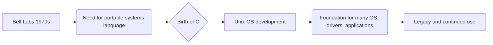

---
title: "Basics Of C"
description: "🚀 Delve into the fundamentals of C programming! This post will guide you through the core concepts, essential features, and language standards, setting a solid foundation for your coding journey. 👨‍💻"
author: infoyouth
date: 2024-12-15 02:00:00 +0000
categories:
  - Programming
  - C Language
  - Introduction
  - Features
  - Standards
tags:
  - "C Programming"
  - "Programming Basics"
  - "C Language Features"
  - "ANSI C"
  - "Core Concepts"
pin: true
math: false
mermaid: true

# <span style="color:#e67e22;">What we will learn in this post?</span>
<ul style='list-style-type: none; padding-left: 0;'>
<li><span style='color: #2980b9; font-size: 20px; font-weight: bold;'>👉</span> <span style='color: #2ecc71; font-size: 18px; font-weight: bold;'>Introduction to the C Language</span></li>
<li><span style='color: #2980b9; font-size: 20px; font-weight: bold;'>👉</span> <span style='color: #2ecc71; font-size: 18px; font-weight: bold;'>Features of the C Programming Language</span></li>
<li><span style='color: #2980b9; font-size: 20px; font-weight: bold;'>👉</span> <span style='color: #2ecc71; font-size: 18px; font-weight: bold;'>Understanding the C Language Standards</span></li>
</ul>

# <span style="color:#e67e22">The Mighty C: A Journey Through Time 🚀</span>

## <span style="color:#2980b9">A Language Born from Necessity</span>

*   C emerged in the early 1970s at Bell Labs.  Its goal? To create a language more portable than assembly, while still offering low-level access to hardware.  It's like having a *super-powered wrench* for your computer's inner workings!
*   This led to C becoming the *foundation* for many operating systems, like Unix, and critical software. Think of it as the *backbone* of the tech world back then.

## <span style="color:#2980b9">Why C Still Matters Today 🤔</span>

*   **Speed and Efficiency:** C code compiles directly to machine code, making it incredibly fast.  That’s why you'll find it in places where performance is key (think games, embedded systems, OS). It's like having a **sports car** for your programs! 🏎️
*   **Low-Level Access:**  C allows you to directly manipulate memory and hardware. This gives programmers *unparalleled control*. It’s like being able to directly fine-tune your car's engine ⚙️.
*   **Foundation for Others:** Many popular languages (like C++, Java, and Python) are influenced by C. It's the *grandparent* of modern programming! 👴

### <span style="color:#8e44ad">Resources for Exploration 📚</span>
*   [**C Language History**](https://www.bell-labs.com/usr/dmr/www/chist.html) -  A historical perspective from Bell Labs.
*    [**C Programming Tutorial**](https://www.tutorialspoint.com/cprogramming/index.htm) - Get started with programming in C
*   [**Evolution of C**](https://en.wikipedia.org/wiki/C_(programming_language)) -  Wikipedia entry detailing its history.


 C, even today remains the workhorse for many crucial computer systems. Its power, speed, and control makes it an *evergreen* choice in the tech world.


# <span style="color:#e67e22">C Programming: Key Features and Benefits 🚀</span>

## <span style="color:#2980b9">Core Strengths of C</span>
C is known for its powerful features that make it a flexible and performant language:

*   **Portability:** 🧳 C code can run on different operating systems (Windows, macOS, Linux) with minimal changes. This makes it highly adaptable. _"Write once, run anywhere"_ (almost!).

*   **Efficiency:** ⚡ C offers direct access to hardware and memory. This leads to fast execution and makes it ideal for system programming.
    `int x = 10; // Direct memory access example`
*   **Modularity:** 🧩 C supports breaking down programs into smaller, reusable functions. This promotes code organization and easier maintenance.

These features allow C to be used in diverse applications, from operating systems to game development. It gives programmers granular control, leading to high performance and wide compatibility.
  
<br>

### <span style="color:#8e44ad">Further Resources</span>
 
*   [Learn C Programming](https://www.learn-c.org/): A great interactive platform for learning C.
*   [C Programming Tutorial](https://www.tutorialspoint.com/cprogramming/): Comprehensive tutorials for beginners and advanced users.

<br>


# <span style="color:#e67e22">📜 C Standards Evolution 🚀</span>

Let's explore how the C language has grown over time!  Essentially, *C standards* are like upgrades to the language, adding new features and fixing old issues.

## <span style="color:#2980b9">Major C Standard Revisions</span>

*   **C89/ANSI C (1989):** The foundation! This standardized the language and included basic features like function prototypes and `stdio.h`.
*   **C99 (1999):** Introduced a bunch of useful additions:
    *   `//` style comments.
    *   `inline` functions for performance.
    *   Variable length arrays (VLAs).
    *   Complex number support.

*   **C11 (2011):**  Focused on improvements for multi-threading and memory access:
    *   `_Generic` keyword for type-generic programming.
    *   Thread support (`<threads.h>`).
    *   Memory alignment controls.

<br>

### <span style="color:#8e44ad">Why These Changes Matter? 🧐</span>

Each standard made C more powerful, easier to use, and better suited to modern computing. From clearer comments to complex number support, these changes really improved the developer's experience and the performance of C programs.

<br>

For more detailed information, you can check these resources:

*   [Wikipedia - C Standard](https://en.wikipedia.org/wiki/C_standards)
*   [ISO - Programming Language C](https://www.iso.org/standard/74528.html)

<br>

 ```mermaid
   flowchart LR
    A[C89] --> B(C99)
    B --> C(C11)
    C--> D[Ongoing Evolutions];
    style A fill:#f9f,stroke:#333,stroke-width:2px
    style B fill:#ccf,stroke:#333,stroke-width:2px
    style C fill:#99f,stroke:#333,stroke-width:2px
    style D fill:#66f,stroke:#333,stroke-width:2px
 ```
<br>

Hope this gives a good overview of C standards!


