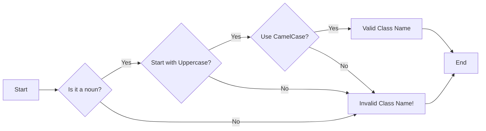
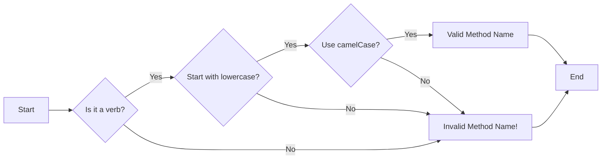
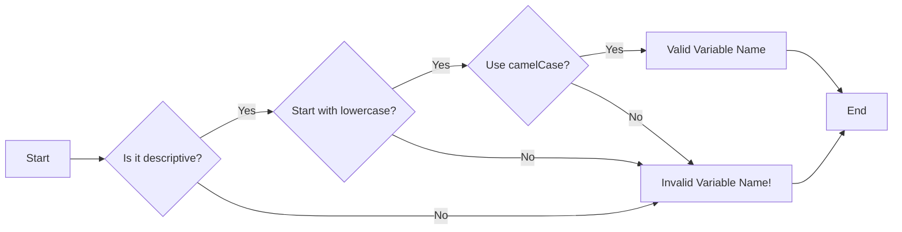
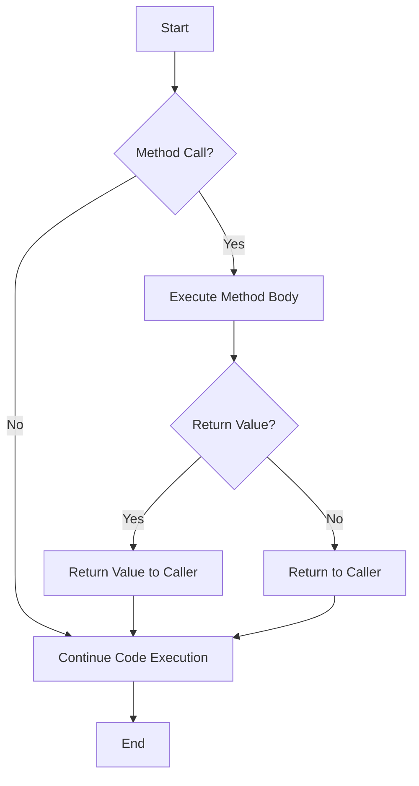
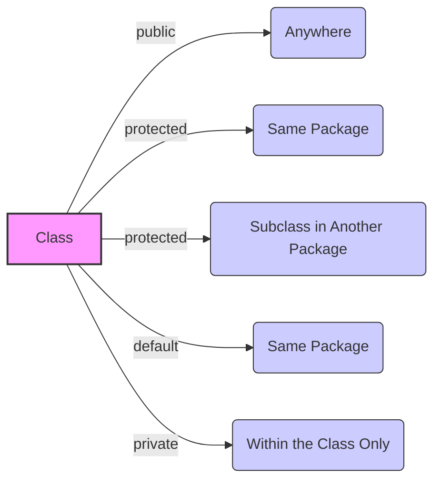

# <span style="color:#e67e22;">What we will learn in this post?</span>
<ul style='list-style-type: none; padding-left: 0;'>
<li><span style='color: #2980b9; font-size: 20px; font-weight: bold;'>👉</span> <span style='color: #2ecc71; font-size: 18px; font-weight: bold;'>OOPS Concept in Java</span></li>
<li><span style='color: #2980b9; font-size: 20px; font-weight: bold;'>👉</span> <span style='color: #2ecc71; font-size: 18px; font-weight: bold;'>Why Java is not a purely Object-Oriented Language?</span></li>
<li><span style='color: #2980b9; font-size: 20px; font-weight: bold;'>👉</span> <span style='color: #2ecc71; font-size: 18px; font-weight: bold;'>Classes and Objects in Java</span></li>
<li><span style='color: #2980b9; font-size: 20px; font-weight: bold;'>👉</span> <span style='color: #2ecc71; font-size: 18px; font-weight: bold;'>Naming Conventions in Java</span></li>
<li><span style='color: #2980b9; font-size: 20px; font-weight: bold;'>👉</span> <span style='color: #2ecc71; font-size: 18px; font-weight: bold;'>Methods in Java</span></li>
<li><span style='color: #2980b9; font-size: 20px; font-weight: bold;'>👉</span> <span style='color: #2ecc71; font-size: 18px; font-weight: bold;'>Access Modifiers in Java</span></li>
<li><span style='color: #2980b9; font-size: 20px; font-weight: bold;'>👉</span> <span style='color: #2ecc71; font-size: 18px; font-weight: bold;'>Constructors in Java</span></li>
<li><span style='color: #2980b9; font-size: 20px; font-weight: bold;'>👉</span> <span style='color: #2ecc71; font-size: 18px; font-weight: bold;'>Four Pillars of OOP in Java</span></li>
<li><span style='color: #2980b9; font-size: 20px; font-weight: bold;'>👉</span> <span style='color: #2ecc71; font-size: 18px; font-weight: bold;'>StringJoiner in Java</span></li>
<li><span style='color: #2980b9; font-size: 20px; font-weight: bold;'>👉</span> <span style='color: #2ecc71; font-size: 18px; font-weight: bold;'>Conclusion!</span></li>
</ul>

# <span style="color:#e67e22">Exploring OOP in Java 🚀</span>

Let's dive into the core concepts of **Object-Oriented Programming (OOP) in Java**. OOP is a programming paradigm that revolves around creating 'objects' which bundle data and methods together. It’s designed to make code more organized, reusable, and easier to manage. Here are three fundamental **Object-Oriented Programming concepts**:

## <span style="color:#2980b9">Encapsulation 📦</span>

*   Encapsulation is about bundling data (attributes) and the methods that operate on that data within a single unit (a class). It also involves hiding the internal details of an object and exposing only what's necessary (data hiding). This enhances data security and simplifies usage.

*   **Example:** Imagine a `BankAccount` class with attributes like `balance` and methods like `deposit()` and `withdraw()`. You don't directly access the `balance`; you use the methods, which are like interfaces for the data.

    ```java
    class BankAccount {
        private double balance; // Encapsulated data
        public void deposit(double amount) { /*...*/ }
        public void withdraw(double amount) { /*...*/ }
    }
    ```
    *For more information on Encapsulation in Java [Click Here](https://www.geeksforgeeks.org/encapsulation-in-java/)*

## <span style="color:#2980b9">Inheritance 👪</span>

*   **Java inheritance and polymorphism**  are closely related. Inheritance allows a class (subclass) to inherit properties and methods from another class (superclass). It promotes code reusability and creates a hierarchy of classes.

*   **Example:**  A `Dog` class could inherit from an `Animal` class.  `Dog` automatically gets `Animal`'s general properties but can also have its own specific traits.

    ```mermaid
    classDiagram
    class Animal{
        +String name
        +void eat()
    }
    class Dog{
        +void bark()
    }
    class Cat{
         +void meow()
    }
    Animal <|-- Dog
    Animal <|-- Cat
    ```

     *For more information on Inheritance in Java [Click Here](https://www.geeksforgeeks.org/inheritance-in-java/)*

## <span style="color:#2980b9">Polymorphism 🎭</span>

*   Polymorphism means "many forms". In OOP, it allows objects of different classes to be treated as objects of a common superclass. This enables you to write generic code that works with different types of objects.
*   There are two primary types of polymorphism in java: **Method overloading** (Compile Time Polymorphism) and **Method overriding** (Run Time Polymorphism).

*   **Example:** Both `Dog` and `Cat` classes (which extend `Animal`) have an `eat()` method, but they might implement it differently. When you call the `eat()` method on an `Animal` object, the correct version (either the `Dog`'s or `Cat`'s) is called based on the object's actual type.

    ```java
    class Animal {
       void eat() {
        System.out.println("Animal eating");
       }
    }

    class Dog extends Animal {
       @Override
       void eat() {
           System.out.println("Dog eating");
       }
    }

    class Cat extends Animal {
      @Override
      void eat() {
          System.out.println("Cat eating");
      }
    }

    public class Main {
        public static void main(String[] args) {
            Animal animal1 = new Dog();
            Animal animal2 = new Cat();
             animal1.eat(); // Output: Dog eating
             animal2.eat(); // Output: Cat eating

        }
    }
    ```
    *For more information on Polymorphism in Java [Click Here](https://www.geeksforgeeks.org/polymorphism-in-java/)*

In summary, understanding these **OOP in Java** principles—encapsulation, inheritance, and polymorphism—is crucial for building robust, scalable, and maintainable Java applications. They are the cornerstones of efficient and well-structured **Object-Oriented Programming**.


# <span style="color:#e67e22">Java's Object-Oriented Puzzles 🧩</span>

Java is often called an object-oriented language, but it isn't *purely* so. Why? Let's explore this intriguing topic!

## <span style="color:#2980b9">The Role of Java Primitive Types 🤔</span>

One of the main reasons for Java's **Java object-oriented limitations** is the existence of **Java primitive types**. Unlike *objects*, primitive types like `int`, `char`, `boolean`, `float`, etc., are not objects. They don't have methods, nor are they part of Java's class hierarchy. This contradicts the core concept of pure object-oriented programming where everything is treated as an object.

### <span style="color:#8e44ad">Examples of Primitive Types 🔢</span>

Here are some simple examples of how primitive types are used:

*   **Integer:**
    ```java
    int age = 30;
    ```
*   **Character:**
    ```java
    char initial = 'A';
    ```
*   **Boolean:**
    ```java
    boolean isAdult = true;
    ```
*   **Float:**
     ```java
    float price = 99.99f;
     ```

These `int`, `char`, `boolean`, and `float` are not objects, and don't behave like objects.  They are fundamental data types and are handled differently by the Java Virtual Machine (JVM), often for better performance.

*   **Object-oriented Concept:** In pure object-oriented languages,  every piece of data and operation should be treated as objects with properties (attributes) and actions (methods). This idea is not fully applied in Java due to these primitive types.

*   **Impact:** Because of primitive types, Java mixes both object-oriented and procedural/primitive programming, therefore it cannot be called a purely object-oriented language.

## <span style="color:#2980b9">Why Primitive Types Exist? ⚙️</span>

*  **Performance:** Primitive types often give better performance because they are more lightweight and directly handled by the hardware.
*  **Simplicity:**  They are simpler to use for basic computations and data storage.
*   **Historical Reasons:** Java's designers likely included primitive types for better performance and seamless transition for developers familiar with other non-purely object-oriented languages, like C.

## <span style="color:#2980b9">The "Wrapper" Solution 🎁</span>

To deal with the **Java object-oriented limitations** that primitive types impose, Java provides _wrapper classes_ (like `Integer`, `Character`, `Boolean`, `Float`, etc.). These allow you to treat primitive data as objects, which is very useful in Collections, Generics, etc.

*   **Example of wrapper class**

```java
    Integer ageObject = Integer.valueOf(30);
```

## <span style="color:#2980b9">Is it a bad thing? 🤔</span>

While Java might not be purely object-oriented, this choice is not necessarily a weakness. The mix of primitive and object types allows for both fast performance (primitive) and object-oriented design (classes and objects).

*   **Resource:** If you want to learn more about java primitive types: [Java Primitive Types](https://docs.oracle.com/javase/tutorial/java/nutsandbolts/datatypes.html)

In conclusion, the existence of **Java primitive types** is one of the biggest reasons why Java is not considered a *purely* object-oriented language. Though, it is considered a powerful, versatile, and widely-used programming language.


# <span style="color:#e67e22"> 🎭 Classes and Objects in Java: A Gentle Introduction </span>
 
Hey there, let's explore the fundamental building blocks of **Java OOP** : *classes* and *objects*. Think of a class as a blueprint for creating something, like a cookie cutter. It defines what characteristics (data) and actions (methods) an object of that type will have. An object, then, is the actual cookie created using that cutter—a tangible instance of the class. This core concept is central to object-oriented programming.

## <span style="color:#2980b9"> 🧱 What are Classes in Java? </span>
 
*   A **class in Java** is like a template or a custom data type.
*   It defines the structure of an object.
*   It includes fields (variables to store data) and methods (functions to perform actions).
*  Think of it as the recipe for creating objects.

```java
// Example of a Class
class Dog {
    String breed;
    String name;

    void bark() {
        System.out.println("Woof!");
    }
}
```

## <span style="color:#2980b9"> 🎯 What are Objects in Java? </span>

*   An **object in Java** is an instance of a class.
*   It's a real-world entity created using a class blueprint.
*   Each object has its own set of data stored in the class's fields.
*   Multiple objects can be created from the same class, each unique.

```java
// Example of creating objects
public class Main {
    public static void main(String[] args) {
        Dog myDog = new Dog(); // Creating an object of the Dog class
        myDog.name = "Buddy";
        myDog.breed = "Golden Retriever";
        myDog.bark(); // Calling the bark method

        Dog anotherDog = new Dog();
        anotherDog.name = "Lucy";
        anotherDog.breed = "Labrador";
        anotherDog.bark();
    }
}
```

### <span style="color:#8e44ad"> 🔄 Interaction Between Classes and Objects </span>

*   Objects are created using classes.
*   Objects utilize the methods and properties defined within their respective classes.
*   Multiple objects can exist from a single class, each with its own unique state (data).
*   Classes are abstract representations, while objects are concrete instances.

Here's a simple diagram illustrating the relationship:
```mermaid
graph LR
    A[Class (Blueprint)] --> B(Object 1);
    A --> C(Object 2);
    A --> D(Object 3);
    B --> E[State (Data)];
    B --> F[Methods (Actions)];
    C --> G[State (Data)];
    C --> H[Methods (Actions)];
```

The interplay between *classes in Java* and *objects in Java* is fundamental to how **Java OOP** works. They help you organize and structure your code in a modular and reusable way, making it easier to build complex applications.

*For more detailed explanations, check out these resources:*

* [Oracle's Java Tutorials on Classes](https://docs.oracle.com/javase/tutorial/java/javaOO/classes.html)
* [GeeksforGeeks on Classes and Objects](https://www.geeksforgeeks.org/classes-objects-java/)

Hope this explanation makes things clear! Let me know if you have more questions. 😊


# <span style="color:#e67e22">Java Naming Conventions 🧐</span>

Let's dive into **Java naming conventions**, which are crucial for maintaining **Java code readability** and making your projects easier to understand. Following these **Java best practices** ensures everyone can read and collaborate on your code effectively. Good naming helps prevent confusion and errors!

## <span style="color:#2980b9">Class Naming 📚</span>

*   Class names should be **nouns** and start with an **uppercase** letter. Use _CamelCase_ for multiple words. 
    *   ✅ `MyClass` , `ShoppingCart`
    *   ❌ `myclass`, `shoppingcart`, `My_Class`
  



## <span style="color:#2980b9">Method Naming ⚙️</span>

*   Method names should be **verbs** or verb phrases. They begin with a **lowercase** letter, and use _camelCase_ for multiple words.
    *   ✅ `calculateTotal()`, `getUserName()`
    *   ❌ `CalculateTotal()`, `getusername`, `get_user_name()`
  

## <span style="color:#2980b9">Variable Naming 🧮</span>

*   Variable names should be descriptive and start with a **lowercase** letter. Use _camelCase_ for multiple words.
    *   ✅ `userName`, `itemCount`, `finalPrice`
    *   ❌ `UserName`, `itemcount`, `final_price`, `i` (unless loop counter)




### <span style="color:#8e44ad">Constants</span>

*   Constants (final variables) should be in **UPPERCASE** with words separated by underscores.
    *   ✅ `MAX_VALUE`, `DEFAULT_SIZE`
    *   ❌ `maxValue`, `defaultSize`

## <span style="color:#2980b9">Additional Tips 💡</span>

*   Avoid using abbreviations unless they are very common (`num` instead of `number` is generally acceptable).
*   Be consistent throughout your codebase.
*   Choose names that clearly convey the purpose of the element.

By adhering to these *Java naming conventions*, you create more maintainable and understandable code. This enhances collaboration and reduces errors, truly improving your **Java code readability**.

For more detailed information, you can explore:
*   [Oracle Java Naming Conventions](https://www.oracle.com/java/technologies/javase/codeconventions-namingconventions.html)
*   [GeeksforGeeks Java Naming Conventions](https://www.geeksforgeeks.org/java-naming-conventions/)


# <span style="color:#e67e22">Understanding Methods in Java ⚙️</span>

Let's dive into *methods in Java*, which are essentially blocks of code that perform a specific task. Think of them as mini-programs within your larger Java application. They're vital for organizing code and making it reusable. Methods encapsulate behavior, meaning they bundle together actions or operations related to a particular task. This contributes significantly to making your code cleaner and easier to manage.

## <span style="color:#2980b9">Defining and Invoking Methods</span>

### <span style="color:#8e44ad">Java Function Definition</span>

A method is defined with the following structure:
```java
   accessModifier returnType methodName(parameter1, parameter2, ...) {
    // Method body: Code to execute
    return someValue; // Optional: If returnType is not void
   }
```

*   `accessModifier`: Determines the visibility (e.g., `public`, `private`).
*   `returnType`: The data type the method returns or `void` if it doesn't return anything.
*   `methodName`: The name you'll use to call it.
*   `parameters`: Input values (optional).

**Example:**
```java
   public int add(int a, int b) {
    return a + b;
   }
```
This *Java method example* named `add` takes two integers and returns their sum.

### <span style="color:#8e44ad">Invoking Methods</span>

To use a method, you need to "call" or invoke it using its name:

```java
   int sum = add(5, 3); // Invoking the 'add' method
   System.out.println(sum); // Output: 8
```
Here, `add(5,3)`  invokes the add method.  The returned value is stored in `sum`.

*   **Significance**: Methods make your code modular, promoting reusability and easier debugging. Instead of writing the same code multiple times, you define a method once and use it wherever needed.

## <span style="color:#2980b9">Method Flowchart</span>

Here's a simple visualization using Mermaid:



## <span style="color:#2980b9">Key takeaways</span>

*   Methods in Java encapsulate code blocks.
*   They are defined with a `accessModifier`, `returnType`, `methodName`, and `parameters`.
*   Methods are invoked by their name with any necessary arguments.
*   They promote reusability and modularity, making code easier to manage.

For more details, check out these resources:
* [Oracle's Java Tutorial on Methods](https://docs.oracle.com/javase/tutorial/java/javaOO/methods.html)
* [W3Schools Java Methods](https://www.w3schools.com/java/java_methods.asp)


# <span style="color:#e67e22">🔒 Understanding Java Access Modifiers</span>

Hey there! Let's dive into the world of **Java access modifiers**, crucial for controlling visibility and implementing **Java encapsulation**. These modifiers help you protect your code, and we'll make it super easy to understand! 😎

## <span style="color:#2980b9">What are Java Access Modifiers?</span>

Access modifiers in Java dictate which parts of your code can access certain variables, methods, and classes. They play a huge role in **Java encapsulation**, which is all about hiding internal data and controlling how it’s accessed, to avoid accidental changes or misuses. There are four main types: `public`, `private`, `protected`, and default (no keyword).

### <span style="color:#8e44ad">The Four Musketeers: Modifiers Explained</span>

Here's a breakdown of each modifier:

*   **`public`**: 🌐 The most open modifier.  Anything declared as `public` can be accessed from anywhere, inside or outside the class, or the package.

    ```java
     public class PublicExample {
         public String message = "Hello, World!";

         public void sayHello() {
             System.out.println(message);
         }
     }

     // Accessing from another class
     PublicExample obj = new PublicExample();
     System.out.println(obj.message); // Accessible
     obj.sayHello(); // Accessible
    ```
*   **`private`**: 🔒 The most restrictive modifier.  `private` members can *only* be accessed within the class where they are declared. It's all about keeping the class's internal details safe and sound!

    ```java
      public class PrivateExample {
        private int secretCode = 1234;

        public void revealSecret() {
           System.out.println("The secret code is: " + secretCode); // Accessible within the class
        }
       }
     // Trying to access from outside
     PrivateExample obj = new PrivateExample();
     // System.out.println(obj.secretCode); // Error: not accessible
     obj.revealSecret(); // Accessible since the method is public
    ```
*   **`protected`**: 🛡️  `protected` members can be accessed within the same package and by subclasses in different packages. It provides a bit more flexibility for inheritance scenarios.

    ```java
      //In the same package
     package com.example;

     public class ProtectedExample {
        protected String name = "Protected Name";
        protected void printName(){
         System.out.println("Name:" +name);
        }

     }

      // In the same package access
     ProtectedExample obj = new ProtectedExample();
     System.out.println(obj.name); // Accessible
     obj.printName(); // Accessible


     // Subclass in different package
     package com.demo;
     import com.example.ProtectedExample;
     class SubclassProtected extends ProtectedExample{

          public void display(){
               System.out.println(name); //Accessible
               printName(); //Accessible
             }
     }

     ```
*   **Default (no modifier)**: 📦 When you don't specify any modifier, it's default or package-private access. Members with default access can be accessed within the same package, and they are not available outside the package.

    ```java
     // Default access
     package com.example;
      class DefaultExample {
           String color = "blue";

        void showColor() {
            System.out.println("The color is " + color);
        }
      }
    //Accesing from another class in same package
     DefaultExample obj = new DefaultExample();
      System.out.println(obj.color); // Accessible
     obj.showColor(); // Accessible
     ```
### <span style="color:#8e44ad">Encapsulation and Access Modifiers: A Match Made in Code</span>

*  **Encapsulation**: Achieved using these modifiers. Hide implementation details of classes from outside.
*  **Data Hiding**: `private` modifier helps hide sensitive information that should not be modified directly.
*   **Controlled Access**: Public methods act as controlled access points to manipulate data.

<br>

## <span style="color:#2980b9">Visualizing Access Modifiers</span>



<br>

**Here are some helpful resources for you:**

*   [Oracle's Java Documentation on Access Modifiers](https://docs.oracle.com/javase/tutorial/java/javaOO/accesscontrol.html)
*   [GeeksforGeeks Explanation on Access Modifiers](https://www.geeksforgeeks.org/access-modifiers-java/)

Understanding **Java access modifiers** is key to writing robust, well-structured code. By mastering `public`, `private`, `protected`, and default, you’ll become a coding pro in no time! Happy coding! 🎉


# <span style="color:#e67e22">Java Constructors: 🛠️ Getting Objects Ready</span>

Constructors in Java are special methods that get called automatically when you create a new object. Think of them as the 'setup crew' for your objects, making sure they're in a good state to start their journey! Their main role is to initialize the object's attributes or variables.

## <span style="color:#2980b9">Default vs. Parameterized Constructors</span>

Java offers two main types of constructors:

*   **Default Constructor:** This is a constructor that Java provides automatically if you don't define one in your class. It has no parameters (inputs) and initializes object fields with default values (e.g., 0 for numbers, `null` for objects).

*   **Parameterized Constructor:** This is a constructor you explicitly write, accepting one or more parameters. These parameters allow you to provide values for the object's fields when you create it. This is essential for more controlled and personalized object creation.

### <span style="color:#8e44ad">Examples</span>

Let's look at some code examples!

**1. Default Constructor in Java**

```java
class Dog {
    String breed; // Notice we don't assign anything to breed

    // Default constructor is provided by Java if we don't define any constructor

    public void displayBreed(){
    System.out.println("Breed : "+ breed);
    }
}

public class Main {
    public static void main(String[] args) {
        Dog myDog = new Dog(); // Default constructor is called here
        myDog.displayBreed();  // Breed is initialized to null by default
    }
}
```
    * In the code above, Since we haven't defined any constructor ourselves, *Java provides a default constructor*, which initializes `breed` to *null*.
* The output of the above code would be : Breed : null

**2. Parameterized Constructor Java**

```java
class Book {
    String title;
    String author;

    // Parameterized constructor
    public Book(String title, String author) {
        this.title = title; // `this` refers to the current object
        this.author = author;
    }
     public void displayBookInfo(){
         System.out.println("Title : "+ title + " and Author : " + author);
     }
}

public class Main {
    public static void main(String[] args) {
        Book myBook = new Book("The Hitchhiker's Guide to the Galaxy", "Douglas Adams"); // Parameterized constructor is called
        myBook.displayBookInfo(); // We are able to set our desired values during object initialization
    }
}
```

*   Here, the `Book` class has a *parameterized constructor* that takes the title and author as arguments, which we provide while creating the object.
* The output of the above code would be : Title : The Hitchhiker's Guide to the Galaxy and Author : Douglas Adams

**Key Differences Summarized**

*   The *default constructor in Java* has no parameters and gives initial, default values to fields. *Parameterized constructor Java* lets you set field values at the time of object creation.
* You have to *explicitly define* parameterized constructor whereas the default constructor is implicitly provided by Java.
* Parameterized constructors offer *greater flexibility* when creating objects.

**When to Use Which?**

* Use default constructors when you want objects to start with default values.
* Use parameterized constructors when you need to provide specific values to initialize objects.

**Resource Links:**

*   [Oracle's Java Documentation on Constructors](https://docs.oracle.com/javase/tutorial/java/javaOO/constructors.html)
*   [GeeksforGeeks Explanation](https://www.geeksforgeeks.org/constructors-in-java/)

In essence, **Java constructors** are the architects of your objects, guaranteeing they are well-prepared for their role in your programs. Understanding the difference between **default constructor in Java** and **parameterized constructor Java** is fundamental in object-oriented programming.


# <span style="color:#e67e22">✨ Understanding the Four Pillars of OOP in Java </span>

Let's explore the core principles of Object-Oriented Programming (OOP) using Java.  The **four pillars of OOP** – encapsulation, inheritance, polymorphism, and abstraction – are fundamental to building robust and maintainable software. We'll examine how these are implemented in Java, looking at clear examples. These concepts significantly improve code organization and reusability and are essential for effective **Java OOP implementation**.

## <span style="color:#2980b9"> 📦 Encapsulation: Keeping it Contained </span>

Encapsulation bundles data (attributes) and methods that operate on that data within a class, hiding internal implementation details. This control prevents unauthorized access and modification, leading to more secure code.

*   **Example:** A `BankAccount` class could have a private `balance` attribute and methods like `deposit()` and `withdraw()` to interact with it. You cannot directly change the `balance`, using methods provides controlled access.

    ```java
    class BankAccount {
      private double balance;
      public void deposit(double amount) { /*...*/ }
      public void withdraw(double amount) { /*...*/ }
    }
    ```
    > For more info check: [Encapsulation in Java](https://www.geeksforgeeks.org/encapsulation-in-java/)

## <span style="color:#2980b9"> 👪 Inheritance: Passing Down Traits </span>

Inheritance allows a class (subclass) to inherit properties and methods from another class (superclass), fostering code reuse and creating hierarchical relationships.

*   **Example:** A `Dog` class can inherit from an `Animal` class, inheriting properties like `name` and methods like `eat()`, while adding its own specific behavior like `bark()`.
    ```java
    class Animal {
      String name;
      void eat() { /*...*/ }
    }

    class Dog extends Animal {
      void bark() { /*...*/ }
    }
    ```

    > Learn more: [Inheritance in Java](https://www.geeksforgeeks.org/inheritance-in-java/)

## <span style="color:#2980b9"> 🎭 Polymorphism: Many Forms </span>

Polymorphism, meaning "many forms," enables objects of different classes to respond to the same method call in their own specific ways. It can be achieved through method overriding (run-time polymorphism) or method overloading (compile-time polymorphism).

*   **Example**:
    *   **Overriding:** Both `Dog` and `Cat` classes might override a `makeSound()` method inherited from `Animal`, but each will have its own implementation.

        ```java
            class Animal {
                void makeSound() {System.out.println("Generic sound");}
            }
            class Dog extends Animal{
                @Override
                void makeSound(){System.out.println("Woof");}
            }
           class Cat extends Animal {
                 @Override
                 void makeSound(){System.out.println("Meow");}
           }
        ```
    *   **Overloading**:  We can have multiple methods with the same name but different signatures. For instance a `Calculator` class could have multiple `add` methods that take integer or float params.

    > Check out: [Polymorphism in Java](https://www.geeksforgeeks.org/polymorphism-in-java/)

## <span style="color:#2980b9"> 🎛️ Abstraction: Simplifying Complexity </span>

Abstraction focuses on providing essential information to the outside world while hiding unnecessary details. This can be achieved through abstract classes and interfaces.

*   **Example:** An `Shape` interface can define methods like `calculateArea()` and `calculatePerimeter()`. Concrete classes like `Circle` and `Rectangle` would then implement these methods based on their specific geometry.

   ```java
    interface Shape {
         double calculateArea();
         double calculatePerimeter();
     }
    class Circle implements Shape{
          public double calculateArea() {
          //Implementation
          return 10.0;
         }
         public double calculatePerimeter(){
           //Implementation
           return 20.0;
          }
     }
     class Rectangle implements Shape {
            public double calculateArea() {
            //Implementation
            return 30.0;
           }
            public double calculatePerimeter(){
                //Implementation
                return 40.0;
           }
     }
   ```

 > Find more on:[Abstraction in Java](https://www.geeksforgeeks.org/abstraction-in-java/)

In short, the **four pillars of OOP** — *encapsulation, inheritance, polymorphism, and abstraction*— are crucial for well structured and maintainable code. Mastering these concepts is key to successful **Java OOP implementation**.


# <span style="color:#e67e22">StringJoiner Class in Java: Making String Concatenation Easier 🧵</span>

The `StringJoiner` class in Java, introduced in Java 8, is a powerful tool designed to simplify the process of **joining strings in Java** with custom delimiters, prefixes, and suffixes. Instead of manually adding delimiters and dealing with potential issues like trailing delimiters, `StringJoiner` handles these complexities efficiently. It’s especially useful when you need to concatenate a series of strings with specific formatting requirements.

## <span style="color:#2980b9">Purpose of StringJoiner 🎯</span>

The primary goal of the `StringJoiner` is to provide a fluent and straightforward API for **joining strings in Java**. Here’s a breakdown of its key purposes:

*   **Adding Delimiters**: Automatically inserts delimiters between added strings.
*   **Custom Prefix and Suffix**: Allows you to add custom prefixes and suffixes to the final joined string.
*   **Avoiding Trailing Delimiters**: Ensures no extra delimiter is added at the end of the string.
*   **Clear Code**:  Makes your code more readable and less error-prone compared to manual string concatenation.

## <span style="color:#2980b9">Usage of StringJoiner 🛠️</span>

### <span style="color:#8e44ad">Basic Usage with Delimiter</span>

Here's a simple example of using `StringJoiner` to combine strings with a comma and space delimiter:

```java
import java.util.StringJoiner;

public class StringJoinerExample {
    public static void main(String[] args) {
        StringJoiner joiner = new StringJoiner(", ");
        joiner.add("Apple").add("Banana").add("Cherry");
        System.out.println(joiner.toString()); // Output: Apple, Banana, Cherry
    }
}
```

*   We create a `StringJoiner` object with the delimiter `", "`.
*   We add strings using the `add()` method.
*   The `toString()` method gives us the final joined string.

### <span style="color:#8e44ad">Using Prefix, Suffix, and Empty String</span>
You can also specify a prefix and a suffix:

```java
import java.util.StringJoiner;

public class StringJoinerExample {
    public static void main(String[] args) {
         StringJoiner joiner = new StringJoiner(", ", "[", "]");
         joiner.add("Red").add("Green").add("Blue");
         System.out.println(joiner.toString()); // Output: [Red, Green, Blue]

         StringJoiner emptyJoiner = new StringJoiner(", ", "[", "]");
         System.out.println(emptyJoiner.toString()); // Output: []
    }
}
```

*  This time, we use the constructor `StringJoiner(delimiter, prefix, suffix)`.
*  If you don’t add any strings, it outputs the prefix and suffix.

### <span style="color:#8e44ad">Flowchart of StringJoiner Usage</span>

```mermaid
graph LR
    A[Start] --> B(Create StringJoiner Object);
    B --> C{Add Strings using add()};
    C --> D{More Strings?};
    D -- Yes --> C;
    D -- No --> E(Get Joined String using toString());
    E --> F[End];
```

## <span style="color:#2980b9">Advantages of Using StringJoiner ✅</span>

*   **Readability**: Code becomes cleaner and easier to understand.
*   **Efficiency**: Manages delimiters and string concatenation internally, leading to better performance compared to manual concatenation with `+` operator in loops.
*   **Less Error-Prone**: Avoids common errors, such as trailing delimiters, which are easy to make during manual concatenation.
*   **Flexibility**:  Provides customization with delimiters, prefixes, and suffixes.

## <span style="color:#2980b9">Summary 📝</span>

The `StringJoiner` class simplifies **joining strings in Java** by handling delimiters, prefixes, and suffixes efficiently. It's a go-to option for readable, maintainable, and error-free string concatenation. By using `StringJoiner`, you can greatly improve the clarity of your code and avoid potential pitfalls when working with strings.

*   **Resource Link**: [Java StringJoiner Documentation](https://docs.oracle.com/javase/8/docs/api/java/util/StringJoiner.html)


<h1><span style='color:#e67e22'>Conclusion</span></h1>

Well, that's a wrap for today's post! 🎉 I hope you found this helpful and maybe even a little fun! 😄  I'm super curious to hear your thoughts. Do you have any tips or experiences to share? 🤔  Or maybe some ideas for future topics?  Please, don't be shy! Drop your comments, feedback, and suggestions in the section below. Let's chat! 💬 Looking forward to reading what you have to say! 😊


