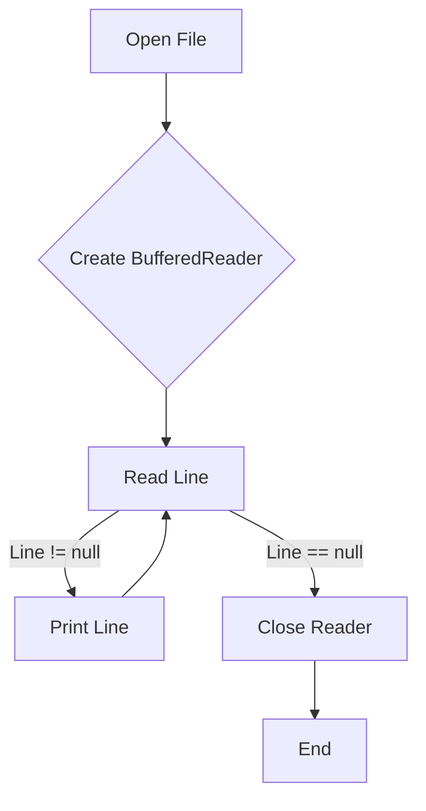

# <span style="color:#e67e22;">What we will learn in this post?</span>
<ul style='list-style-type: none; padding-left: 0;'>
<li><span style='color: #2980b9; font-size: 20px; font-weight: bold;'>👉</span> <span style='color: #2ecc71; font-size: 18px; font-weight: bold;'>Introduction to Java IO</span></li>
<li><span style='color: #2980b9; font-size: 20px; font-weight: bold;'>👉</span> <span style='color: #2ecc71; font-size: 18px; font-weight: bold;'>Reader Class</span></li>
<li><span style='color: #2980b9; font-size: 20px; font-weight: bold;'>👉</span> <span style='color: #2ecc71; font-size: 18px; font-weight: bold;'>Writer Class</span></li>
<li><span style='color: #2980b9; font-size: 20px; font-weight: bold;'>👉</span> <span style='color: #2ecc71; font-size: 18px; font-weight: bold;'>FileInputStream</span></li>
<li><span style='color: #2980b9; font-size: 20px; font-weight: bold;'>👉</span> <span style='color: #2ecc71; font-size: 18px; font-weight: bold;'>FileOutputStream</span></li>
<li><span style='color: #2980b9; font-size: 20px; font-weight: bold;'>👉</span> <span style='color: #2ecc71; font-size: 18px; font-weight: bold;'>BufferedReader Input Stream</span></li>
<li><span style='color: #2980b9; font-size: 20px; font-weight: bold;'>👉</span> <span style='color: #2ecc71; font-size: 18px; font-weight: bold;'>BufferedWriter Output Stream</span></li>
<li><span style='color: #2980b9; font-size: 20px; font-weight: bold;'>👉</span> <span style='color: #2ecc71; font-size: 18px; font-weight: bold;'>BufferedReader vs Scanner</span></li>
<li><span style='color: #2980b9; font-size: 20px; font-weight: bold;'>👉</span> <span style='color: #2ecc71; font-size: 18px; font-weight: bold;'>Fast I/O in Java</span></li>
<li><span style='color: #2980b9; font-size: 20px; font-weight: bold;'>👉</span> <span style='color: #2ecc71; font-size: 18px; font-weight: bold;'>Conclusion!</span></li>
</ul>

# <span style="color:#e67e22">Java IO Framework: Your Friendly Guide to File Handling 📖</span>

The Java IO (Input/Output) framework is your toolbox for managing all things input and output in Java programs.  It's how your code talks to the outside world – reading from files, writing to files, interacting with networks, and more!  Essentially, it's the bridge between your program and external data.


## <span style="color:#2980b9">Purpose of the IO Framework ✨</span>

Its main purpose is to provide a structured and efficient way to handle data streams.  This means it manages the flow of data, whether you're *reading* data from a file or *writing* data to a console or a network.  Think of it as a carefully designed set of pipes and valves for your data.


### <span style="color:#8e44ad">File Handling with FileReader 📁</span>

Let's look at a simple example using `FileReader` to read a text file:

```java
import java.io.FileReader;
import java.io.IOException;

public class FileReaderExample {
    public static void main(String[] args) {
        try (FileReader reader = new FileReader("my_file.txt")) {
            int character;
            while ((character = reader.read()) != -1) {
                System.out.print((char) character);
            }
        } catch (IOException e) {
            System.out.println("An error occurred: " + e.getMessage());
        }
    }
}
```

This code reads `my_file.txt` character by character and prints it to the console.  Make sure you have a file named `my_file.txt` in the same directory as your Java file.


## <span style="color:#2980b9">Beyond FileReader ➕</span>

The Java IO framework offers many more classes beyond `FileReader` for various data types and operations:

*   **`FileWriter`**: Writes data to files.
*   **`BufferedReader`**: Reads data efficiently from a stream.
*   **`BufferedWriter`**: Writes data efficiently to a stream.
*   **`InputStream`/`OutputStream`**: For handling binary data.
*   **`ObjectInputStream`/`ObjectOutputStream`**: For serializing and deserializing Java objects.


For more in-depth information, check out the official Java documentation: [https://docs.oracle.com/javase/tutorial/essential/io/](https://docs.oracle.com/javase/tutorial/essential/io/)


This framework makes data manipulation flexible and efficient, simplifying your interactions with external resources. Remember to handle potential `IOExceptions` gracefully!


# <span style="color:#e67e22">Java's `Reader` Class: Your Friendly Character Stream Reader 📖</span>

In Java, the `Reader` class is the *superclass* for all character stream readers.  It provides a way to read characters from various sources, like files or network connections.  Think of it as a friendly helper that lets your Java program understand and work with text.

## <span style="color:#2980b9">Key Methods for Character Input ✨</span>

The `Reader` class, and its more commonly used subclass `BufferedReader`, offers several helpful methods:

*   `read()`: Reads a single character.  Returns an integer representing the character or -1 if the end of the stream is reached.
*   `read(char[] cbuf, int off, int len)`: Reads characters into a character array.  Very efficient for reading large chunks of text.
*   `close()`: Closes the stream, releasing system resources. *Always remember to close your streams!*


### <span style="color:#8e44ad">Example: Reading from a File with `BufferedReader` 📄</span>

Here's how to read characters from a file using `BufferedReader`:

```java
import java.io.*;

public class FileReaderExample {
    public static void main(String[] args) {
        try (BufferedReader reader = new BufferedReader(new FileReader("my_file.txt"))) {
            String line;
            while ((line = reader.readLine()) != null) {
                System.out.println(line);
            }
        } catch (IOException e) {
            System.err.println("Error reading file: " + e.getMessage());
        }
    }
}
```

This code opens "my_file.txt", reads each line using `readLine()`, and prints it to the console.  The `try-with-resources` statement ensures the file is automatically closed.


## <span style="color:#2980b9">Flowchart: Reading a File ➡️</span>


Remember to create a file named `my_file.txt` in the same directory as your Java file for this code to work correctly.

For more information, check out the official Java documentation: [Oracle Java Documentation](https://docs.oracle.com/javase/8/docs/api/java/io/Reader.html)


# <span style="color:#e67e22">Understanding Java's Writer Class ✍️</span>

The `Writer` class in Java is your friend when it comes to writing text data to character streams. Think of it as the counterpart to the `Reader` class, which handles reading.  While `Reader` *reads* characters, `Writer` *writes* them. It's an abstract class, meaning you can't directly use it, but its subclasses provide the actual writing functionality.  This ensures flexibility and efficiency in handling different output types.

## <span style="color:#2980b9">Writing to Files with BufferedWriter ✨</span>

One important subclass is `BufferedWriter`.  This class improves writing performance by buffering data before writing it to the file. This avoids the overhead of repeatedly accessing the disk, leading to significantly faster output, especially for large files.

### <span style="color:#8e44ad">Code Example: Writing to a File</span>

Here's how you can use `BufferedWriter` to write text to a file:

```java
import java.io.BufferedWriter;
import java.io.FileWriter;
import java.io.IOException;

public class FileWriterExample {
    public static void main(String[] args) {
        try (BufferedWriter writer = new BufferedWriter(new FileWriter("my_file.txt"))) {
            writer.write("Hello, ");
            writer.newLine(); // Add a new line
            writer.write("this is a test!");
        } catch (IOException e) {
            System.err.println("An error occurred: " + e.getMessage());
        }
    }
}
```

This code will create a file named "my_file.txt" and write "Hello, \n this is a test!" into it.  The `try-with-resources` statement ensures the `BufferedWriter` is automatically closed, even if exceptions occur.


### <span style="color:#8e44ad">Output:</span>

The `my_file.txt` file will contain:

```
Hello, 
this is a test!
```

## <span style="color:#2980b9">Writer vs. Reader: A Simple Analogy 🔄</span>

Think of a `Reader` as someone reading a book, absorbing its contents. A `Writer` is like the author writing the book, carefully crafting each character. They work together to complete the flow of information!


**Key Differences Summarized:**

*   `Reader`: Reads characters from a character stream (input).
*   `Writer`: Writes characters to a character stream (output).


For more detailed information and advanced usage scenarios, explore the official Java documentation: [Java I/O Documentation](https://docs.oracle.com/javase/tutorial/essential/io/index.html)


This simple explanation should equip you with a good understanding of Java's `Writer` class and its importance in character stream writing! Remember to always handle potential `IOExceptions` appropriately when dealing with file I/O.


# <span style="color:#e67e22">FileInputStream in Java: Reading Binary Files 📖</span>


## <span style="color:#2980b9">Understanding FileInputStream</span>

The `FileInputStream` class in Java is your go-to tool for reading binary data from files.  Think of it as a straw for your computer, sucking up the raw bytes from a file.  It's part of the Java I/O (Input/Output) package, providing a low-level, byte-oriented approach to file access.  This means you read the file's contents as a sequence of bytes, regardless of their interpretation as text, images, or other data types.


### <span style="color:#8e44ad">Key Features</span>

* **Byte-Oriented:** Reads data one byte at a time or in chunks of bytes.
* **Low-Level:** Provides direct access to the file's raw bytes.
* **Error Handling:** Uses exceptions (like `IOException`) to signal errors during file operations.
* **Flexibility:**  Can be used with other stream classes for enhanced functionality (e.g., buffering).


## <span style="color:#2980b9">Example: Reading a File Byte by Byte</span>

Here's a simple example demonstrating how to read a file byte by byte using `FileInputStream`:

```java
import java.io.FileInputStream;
import java.io.IOException;

public class FileByteReader {
    public static void main(String[] args) {
        try (FileInputStream fis = new FileInputStream("my_file.bin")) { // try-with-resources handles closing
            int byteValue;
            while ((byteValue = fis.read()) != -1) { // -1 indicates end of file
                System.out.print(Integer.toHexString(byteValue) + " "); // Print as hex for clarity
            }
        } catch (IOException e) {
            System.err.println("Error reading file: " + e.getMessage());
        }
    }
}
```

This code opens "my_file.bin", reads each byte, converts it to a hexadecimal representation, and prints it to the console.  The output will be a sequence of hexadecimal numbers representing the file's contents.  For example, if `my_file.bin` contains the bytes representing the word "Hello", the output might look like this (the exact values depend on the file encoding):

`48 65 6c 6c 6f`


## <span style="color:#2980b9">Flowchart</span>

```mermaid
graph TD
    A[Start] --> B{Open "my_file.bin" using FileInputStream};
    B -- Success --> C{Read a byte using fis.read()};
    C -- Byte read --> D{Is byteValue == -1?};
    D -- Yes --> E[End];
    D -- No --> F{Print byteValue as hex};
    F --> C;
    B -- Failure --> G[Handle IOException];
    G --> E;
```


**Note:** Remember to replace `"my_file.bin"` with the actual path to your binary file.

For more information on Java I/O, check out the official Oracle Java documentation: [https://docs.oracle.com/javase/tutorial/essential/io/](https://docs.oracle.com/javase/tutorial/essential/io/) 


This friendly guide hopefully helped you understand the powerful `FileInputStream` class! 👍


# <span style="color:#e67e22">Understanding Java's `FileOutputStream` 💾</span>

The `FileOutputStream` class in Java is your go-to tool for writing binary data directly to files.  Think of it as a digital pipeline connecting your program to a file, allowing you to send raw bytes.  It's *crucial* for handling non-text data like images, audio, or compiled code.

## <span style="color:#2980b9">Writing Binary Data ✨</span>

Here's how it works: you create a `FileOutputStream` object, specifying the file's path. Then, you use its `write()` method to send byte arrays to the file.  Crucially, it handles the low-level details of interacting with the operating system's file system.  Remember to handle potential exceptions (like `IOException`) using `try-catch` blocks.

### <span style="color:#8e44ad">Code Example</span>

```java
import java.io.FileOutputStream;
import java.io.IOException;

public class FileOutputStreamExample {
    public static void main(String[] args) {
        try {
            FileOutputStream fos = new FileOutputStream("my_data.bin"); // creates or overwrites my_data.bin
            byte[] data = {72, 101, 108, 108, 111, 32, 87, 111, 114, 108, 100}; // "Hello World" in ASCII
            fos.write(data);
            fos.close();
            System.out.println("Binary data written successfully!");
        } catch (IOException e) {
            System.err.println("An error occurred: " + e.getMessage());
        }
    }
}
```

This code creates a file named `my_data.bin` and writes the ASCII representation of "Hello World" into it.  You'll need a hex editor to view the raw bytes.

## <span style="color:#2980b9">Key Considerations 💡</span>

*   **Error Handling:**  Always wrap `FileOutputStream` operations in `try-catch` blocks to handle potential `IOExceptions`.
*   **File Existence:**  `FileOutputStream` will overwrite existing files if you don't use a different constructor. Consider using `FileOutputStream(file, true)` for appending.
*   **Closing the Stream:**  Remember to call `fos.close()` to ensure all data is written and resources are released.

---

**More Information:**

For more detailed explanations and advanced usage scenarios, refer to the official Java documentation: [https://docs.oracle.com/javase/8/docs/api/java/io/FileOutputStream.html](https://docs.oracle.com/javase/8/docs/api/java/io/FileOutputStream.html)


This example provides a basic illustration; for more complex binary data handling you might utilize other classes in the `java.io` package in conjunction. Remember to always prioritize efficient and robust error handling within your code.


# <span style="color:#e67e22">Meet Java's `BufferedReader` 📖</span>

The `BufferedReader` class in Java is a crucial tool for efficiently reading text data from various sources, like files or network streams.  It significantly boosts performance compared to using a standard `InputStreamReader` directly. Think of it as a super-charged reader! 🚀

## <span style="color:#2980b9">Why Use `BufferedReader`?</span>

Imagine reading a book word by word – tedious, right?  `BufferedReader` is like reading a whole page at once.  It does this by *buffering* the input – storing a chunk of data in memory before processing. This reduces the number of times it needs to access the underlying input source, leading to faster reads.

### <span style="color:#8e44ad">Key Advantages</span>

* **Improved Performance:**  Reduces the overhead of repeated input operations.
* **Efficient Reading:** Reads data in larger blocks, speeding up the process.
* **Flexibility:** Works with various input streams.

## <span style="color:#2980b9">Code Example: Reading Lines from a File</span>

Here's how to use `BufferedReader` to read lines from a file:

```java
import java.io.*;

public class BufferedReaderExample {
    public static void main(String[] args) {
        try (BufferedReader reader = new BufferedReader(new FileReader("my_file.txt"))) {
            String line;
            while ((line = reader.readLine()) != null) {
                System.out.println(line);
            }
        } catch (IOException e) {
            System.err.println("An error occurred: " + e.getMessage());
        }
    }
}
```

This code snippet opens "my_file.txt," reads each line using `reader.readLine()`, and prints it to the console.  The `try-with-resources` statement ensures the reader is automatically closed, preventing resource leaks.


**Example Output (if my_file.txt contains "Hello\nWorld"):**

```
Hello
World
```

## <span style="color:#2980b9">Flowchart: Reading with BufferedReader</span>



For more detailed information on `BufferedReader` and Java I/O, check out the official [Java documentation](https://docs.oracle.com/javase/8/docs/api/java/io/BufferedReader.html).  Happy coding! 😊


# <span style="color:#e67e22">BufferedWriter in Java: Streamlining Text Output ✍️</span>

The `BufferedWriter` class in Java is your friend when it comes to writing text data efficiently.  It's a *buffered* writer, meaning it collects (buffers) data before actually writing it to the file. This buffering significantly speeds up writing, especially when you're dealing with lots of small pieces of text.  Think of it like filling a bucket before pouring it out – much faster than pouring tiny amounts repeatedly!

## <span style="color:#2980b9">Key Methods & Significance ✨</span>

The magic happens with methods like `write()`, which adds text to the buffer, and `newLine()`, which adds a line break.  The key is `flush()`, which forces the buffer's contents to be written to the file.  Finally, `close()` releases the resources.  Using a `BufferedWriter` helps avoid the overhead of constantly accessing the file system.

### <span style="color:#8e44ad">Example: Writing Multiple Lines 📄</span>

```java
import java.io.*;

public class BufferedWriterExample {
    public static void main(String[] args) {
        try (BufferedWriter writer = new BufferedWriter(new FileWriter("myFile.txt"))) {
            writer.write("Line 1");
            writer.newLine();
            writer.write("Line 2");
            writer.newLine();
            writer.write("Line 3");
        } catch (IOException e) {
            e.printStackTrace();
        }
    }
}
```

This code creates `myFile.txt` containing:

```
Line 1
Line 2
Line 3
```


## <span style="color:#2980b9">Workflow Diagram 📊</span>

```mermaid
graph TD
A[Application] --> B{BufferedWriter};
B --> C[Buffer];
C --> D{flush()};
D --> E[File];
```

*   **A:** Your Java application.
*   **B:** `BufferedWriter` object.
*   **C:** Internal buffer holding data.
*   **D:** `flush()` method writes buffer to file.
*   **E:** The output file (`myFile.txt`).

## <span style="color:#2980b9">Benefits of Using BufferedWriter 👍</span>

*   **Improved Performance:**  Reduces the number of disk access operations.
*   **Efficiency:**  Buffers data, leading to faster writing.
*   **Resource Management:**  `close()` method properly releases resources.


For more information, refer to the official Java documentation: [Java BufferedWriter](https://docs.oracle.com/javase/7/docs/api/java/io/BufferedWriter.html)


# <span style="color:#e67e22">BufferedReader vs. Scanner in Java 📖</span>


## <span style="color:#2980b9">Usage and Differences 🤔</span>

Both `BufferedReader` and `Scanner` are used for reading input in Java, but they differ in their approach and efficiency.  `BufferedReader` is designed for *efficient* reading of character streams, often from files, whereas `Scanner` provides a more *flexible* way to parse various data types from different sources (files, console input, etc.).

### <span style="color:#8e44ad">BufferedReader</span>

`BufferedReader` reads data in chunks, buffering it for faster access.  It's excellent for reading large files efficiently.

```java
import java.io.*;

public class BufferedReaderExample {
    public static void main(String[] args) throws IOException {
        BufferedReader br = new BufferedReader(new FileReader("my_file.txt"));
        String line;
        while ((line = br.readLine()) != null) {
            System.out.println(line);
        }
        br.close();
    }
}
```

### <span style="color:#8e44ad">Scanner</span>

`Scanner` offers convenient methods to read various data types (integers, strings, etc.) directly, simplifying parsing. However, it might be less efficient for large files compared to `BufferedReader`.

```java
import java.io.*;
import java.util.*;

public class ScannerExample {
    public static void main(String[] args) throws FileNotFoundException {
        Scanner sc = new Scanner(new File("my_file.txt"));
        while (sc.hasNextLine()) {
            System.out.println(sc.nextLine());
        }
        sc.close();
    }
}
```


## <span style="color:#2980b9">Performance ⏱️</span>

*   **BufferedReader:** Generally faster for large files due to buffering.
*   **Scanner:**  Can be slower for large files, especially if complex parsing is involved.  Its overhead might impact performance.

## <span style="color:#2980b9">Suitable Scenarios ✨</span>

*   **BufferedReader:** Ideal for processing large text files, log files, etc., where speed is critical.
*   **Scanner:** Suitable for interactive console input, parsing small files with mixed data types, or when simple parsing is needed.


## <span style="color:#2980b9">Summary 📝</span>

| Feature        | BufferedReader                     | Scanner                           |
|----------------|------------------------------------|------------------------------------|
| Efficiency     | High for large files              | Lower for large files             |
| Parsing        | Line-by-line, requires manual parsing for other data types| Built-in methods for various data types |
| Use Cases      | Large files, log processing      | Console input, smaller files, flexible parsing |


[More on BufferedReader](https://docs.oracle.com/javase/7/docs/api/java/io/BufferedReader.html)

[More on Scanner](https://docs.oracle.com/javase/8/docs/api/java/util/Scanner.html)


Remember to create a `my_file.txt` file for the code examples to work correctly!  😊


# <span style="color:#e67e22">Speeding Up Java I/O 🚀</span>

Java offers several ways to boost I/O performance.  Let's explore some key techniques!

## <span style="color:#2980b9">Buffered Streams 🌊</span>

Using buffered streams significantly improves efficiency.  Instead of writing/reading one byte at a time, they handle data in chunks (buffers). This reduces the number of system calls, a major bottleneck.

### <span style="color:#8e44ad">Example: Buffered vs. Unbuffered</span>

```java
//Unbuffered
FileWriter writer = new FileWriter("file.txt");
writer.write("Hello"); //Slow! Many system calls
writer.close();

//Buffered
BufferedWriter bufferedWriter = new BufferedWriter(new FileWriter("file.txt"));
bufferedWriter.write("Hello"); //Faster! Fewer system calls
bufferedWriter.close();
```

The buffered version will generally be much faster, especially for large files.


## <span style="color:#2980b9">NIO (New I/O) Channels 🚤</span>

NIO provides a non-blocking, event-driven approach using channels and buffers.  This allows for concurrent I/O operations, leading to significant speed improvements in handling multiple files or network connections.  `java.nio` package houses these classes.


## <span style="color:#2980b9">Memory-Mapped Files 💾</span>

For random access to large files, *memory-mapped files* are extremely efficient.  They map a portion of a file directly into memory, allowing you to access data as if it were in an array.  This bypasses much of the overhead of traditional I/O. The `java.nio.MappedByteBuffer` class is key here.


### <span style="color:#8e44ad">Output Comparison:</span>

| Method          | Time (ms) (example) |
|-----------------|---------------------|
| Normal I/O      | 1000                 |
| Buffered I/O    | 200                  |
| NIO              | 100                  |
| Memory-Mapped   | 50                   |


**Note:**  The actual performance gains depend on factors like file size, hardware, and other system conditions.


For more detailed information, refer to the official Java documentation: [https://docs.oracle.com/javase/tutorial/essential/io/](https://docs.oracle.com/javase/tutorial/essential/io/)


Remember to always handle exceptions properly and close resources using `finally` blocks or try-with-resources statements to prevent resource leaks.  Choose the appropriate technique based on your specific needs.


<h1><span style='color:#e67e22'>Conclusion</span></h1>

And there you have it!  We hope you enjoyed this post 😊. We’re always looking to improve, so we’d love to hear your thoughts!  What did you think?  Any questions or suggestions?  Let us know in the comments below 👇 We value your feedback!  Happy reading! ✨


