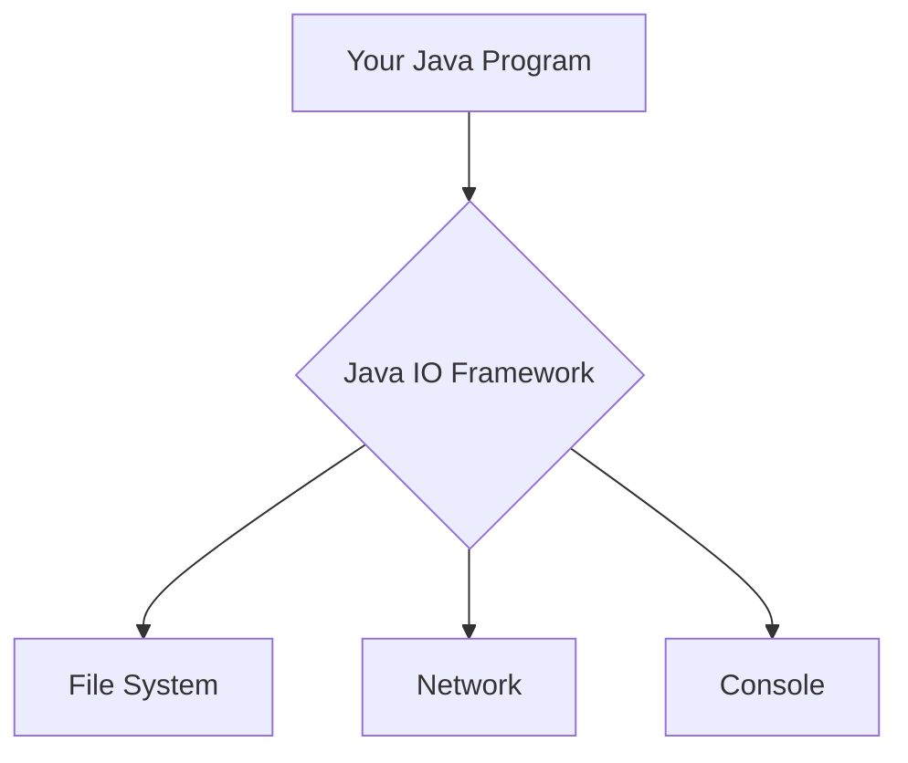
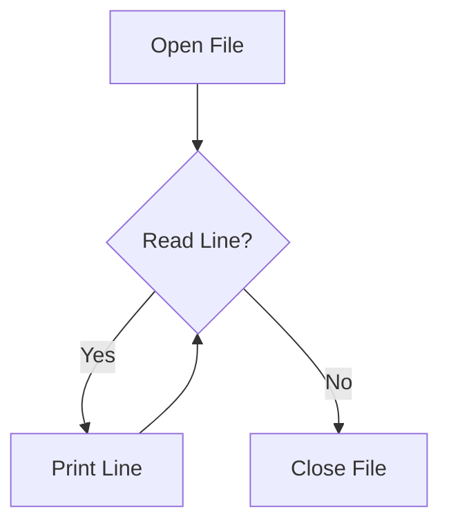
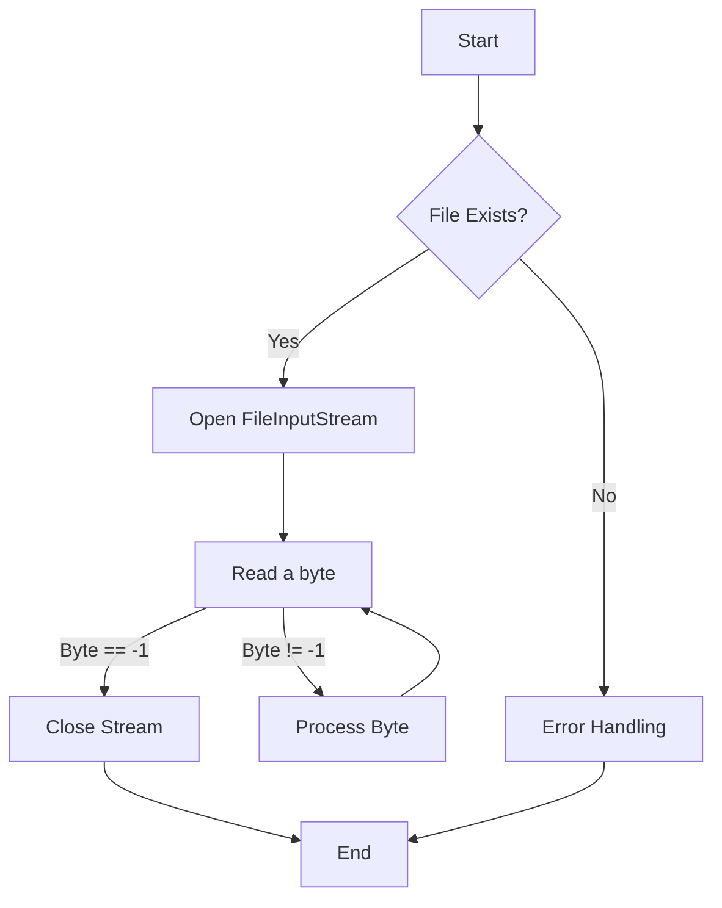

# <span style="color:#e67e22;">What we will learn in this post?</span>
<ul style='list-style-type: none; padding-left: 0;'>
<li><span style='color: #2980b9; font-size: 20px; font-weight: bold;'>👉</span> <span style='color: #2ecc71; font-size: 18px; font-weight: bold;'>Introduction to Java IO</span></li>
<li><span style='color: #2980b9; font-size: 20px; font-weight: bold;'>👉</span> <span style='color: #2ecc71; font-size: 18px; font-weight: bold;'>Reader Class</span></li>
<li><span style='color: #2980b9; font-size: 20px; font-weight: bold;'>👉</span> <span style='color: #2ecc71; font-size: 18px; font-weight: bold;'>Writer Class</span></li>
<li><span style='color: #2980b9; font-size: 20px; font-weight: bold;'>👉</span> <span style='color: #2ecc71; font-size: 18px; font-weight: bold;'>FileInputStream</span></li>
<li><span style='color: #2980b9; font-size: 20px; font-weight: bold;'>👉</span> <span style='color: #2ecc71; font-size: 18px; font-weight: bold;'>FileOutputStream</span></li>
<li><span style='color: #2980b9; font-size: 20px; font-weight: bold;'>👉</span> <span style='color: #2ecc71; font-size: 18px; font-weight: bold;'>BufferedReader Input Stream</span></li>
<li><span style='color: #2980b9; font-size: 20px; font-weight: bold;'>👉</span> <span style='color: #2ecc71; font-size: 18px; font-weight: bold;'>BufferedWriter Output Stream</span></li>
<li><span style='color: #2980b9; font-size: 20px; font-weight: bold;'>👉</span> <span style='color: #2ecc71; font-size: 18px; font-weight: bold;'>BufferedReader vs Scanner</span></li>
<li><span style='color: #2980b9; font-size: 20px; font-weight: bold;'>👉</span> <span style='color: #2ecc71; font-size: 18px; font-weight: bold;'>Fast I/O in Java</span></li>
<li><span style='color: #2980b9; font-size: 20px; font-weight: bold;'>👉</span> <span style='color: #2ecc71; font-size: 18px; font-weight: bold;'>Conclusion!</span></li>
</ul>

# <span style="color:#e67e22">Java IO Framework: Your Guide to File Handling 📖</span>

The Java IO framework is a crucial part of Java, handling all input and output operations.  Its purpose is to let your Java programs interact with external data sources, like files, networks, and even the console. Think of it as the bridge between your program and the outside world!  It manages the flow of data, allowing you to read and write information efficiently.

## <span style="color:#2980b9">File Handling Made Easy 📁</span>

The framework simplifies file handling with various classes for different data types and operations. For example, `FileReader` is specifically designed for reading character data from files.

### <span style="color:#8e44ad">Reading a File with `FileReader` 📄</span>

Here's how to read a file using `FileReader`:

```java
import java.io.FileReader;
import java.io.IOException;

public class ReadFileExample {
    public static void main(String[] args) {
        try (FileReader reader = new FileReader("my_file.txt")) {
            int character;
            while ((character = reader.read()) != -1) {
                System.out.print((char) character);
            }
        } catch (IOException e) {
            System.out.println("An error occurred: " + e.getMessage());
        }
    }
}
```

This code reads `my_file.txt` character by character and prints its content to the console.  Make sure you create a `my_file.txt` in the same directory before running.  Remember to handle potential `IOExceptions`!

## <span style="color:#2980b9">Beyond `FileReader` 💡</span>

The Java IO framework provides much more than `FileReader`.  It includes classes for:

*   **Byte streams:** For reading and writing raw bytes (e.g., `FileInputStream`, `FileOutputStream`).
*   **Character streams:** For reading and writing characters (e.g., `FileReader`, `FileWriter`).
*   **Buffered streams:**  For improved performance by buffering data (e.g., `BufferedReader`, `BufferedWriter`).
*   **Object streams:** For reading and writing serialized objects (e.g., `ObjectInputStream`, `ObjectOutputStream`).


This powerful framework is essential for any Java programmer dealing with files or other external data sources.  Learning to use it effectively unlocks a world of possibilities.

[More information on Java IO](https://docs.oracle.com/javase/tutorial/essential/io/index.html)





# <span style="color:#e67e22">Meet the Java `Reader` Class 📖</span>

The `Reader` class in Java is your friendly helper for reading character streams.  Think of it as a way to access text data from various sources, like files or networks.  It's an *abstract class*, meaning you can't directly create `Reader` objects, but you use its subclasses to perform actual reading.  The most common subclass is `BufferedReader`, which provides efficient buffered reading.

## <span style="color:#2980b9">Key Methods for Reading Characters</span>

The `Reader` class offers several crucial methods:

* **`read()`:** Reads a single character.  Returns an integer representing the character or -1 if the end of the stream is reached.
* **`read(char[] cbuf, int off, int len)`:** Reads multiple characters into a character array.
* **`close()`:** Closes the stream, releasing system resources.  *Always remember to close your streams!*


### <span style="color:#8e44ad">Example: Reading from a File with `BufferedReader`</span>

Here's how to read characters from a file using `BufferedReader`:

```java
import java.io.*;

public class FileReaderExample {
    public static void main(String[] args) {
        try (BufferedReader reader = new BufferedReader(new FileReader("my_file.txt"))) {
            String line;
            while ((line = reader.readLine()) != null) {
                System.out.println(line);
            }
        } catch (IOException e) {
            System.err.println("Error reading file: " + e.getMessage());
        }
    }
}
```

This code assumes you have a file named "my_file.txt" in the same directory.  The `try-with-resources` statement ensures the file is automatically closed even if errors occur.  The code reads the file line by line and prints each line to the console.


## <span style="color:#2980b9">Flowchart: Reading a File</span>




For more information, check out the official Java documentation: [Java `Reader` Class](https://docs.oracle.com/javase/8/docs/api/java/io/Reader.html)


Remember to handle potential `IOExceptions` appropriately in your code!  Happy reading! 🎉


# <span style="color:#e67e22">Java's Writer Class: Your Friendly File Writer ✍️</span>

The `Writer` class in Java is your go-to tool for writing character data to various destinations, like files or network connections.  Think of it as the opposite of the `Reader` class, which handles reading.  While `Reader` brings data *in*, `Writer` sends data *out*.  It's an abstract class, meaning you won't use it directly; instead, you'll use its subclasses like `FileWriter`, `BufferedWriter`, etc.

## <span style="color:#2980b9">Understanding the Writer Family 👨‍👩‍👧‍👦</span>

*   **`Writer` (Abstract Class):** The parent class; provides the basic framework for writing.
*   **`FileWriter`:** Writes to a file.
*   **`BufferedWriter`:** Improves performance by buffering writes, making it faster.  (This is usually what you'll use!)
*   **`PrintWriter`:**  Offers convenient methods for writing formatted data.


### <span style="color:#8e44ad">BufferedWriter: The Performance Booster 🚀</span>

`BufferedWriter` significantly speeds up file writing.  It gathers data before writing it to the file in chunks, minimizing disk access.


## <span style="color:#2980b9">Code Example: Writing to a File 📄</span>

Here's how to write to a file using `BufferedWriter`:

```java
import java.io.*;

public class FileWriterExample {
    public static void main(String[] args) {
        try (BufferedWriter writer = new BufferedWriter(new FileWriter("my_file.txt"))) {
            writer.write("Hello, ");
            writer.newLine(); // adds a new line
            writer.write("this is written using BufferedWriter!");
        } catch (IOException e) {
            e.printStackTrace();
        }
    }
}
```

This code will create (or overwrite) a file named "my_file.txt" with the text "Hello, \nthis is written using BufferedWriter!".

**Output (my_file.txt):**

```
Hello, 
this is written using BufferedWriter!
```

## <span style="color:#2980b9">Writer and Reader: A Perfect Pair ✨</span>

The `Writer` and `Reader` classes are complementary.  `Reader` reads data from a source (like a file), and `Writer` writes data to a destination. They work together to handle input/output operations efficiently.


[More on Java I/O](https://docs.oracle.com/javase/tutorial/essential/io/index.html)  (Oracle's official tutorial)


**Note:** Always handle potential `IOExceptions` using `try-catch` blocks for robust error handling! Remember to close your `Writer` to ensure data is flushed to the destination.  The `try-with-resources` statement (as shown in the example) automatically handles this.


# <span style="color:#e67e22">FileInputStream in Java: Reading Binary Files 📖</span>

The `FileInputStream` class in Java is your go-to tool for reading raw binary data from files. Think of it as a digital straw, sucking up the file's contents byte by byte.  It's crucial for handling various file types, not just text files.

## <span style="color:#2980b9">Key Features ✨</span>

*   **Byte-by-byte reading:**  Provides methods to read data one byte at a time, giving you precise control.
*   **Binary data handling:**  Unlike `FileReader`, it doesn't perform character encoding, making it perfect for images, audio, or other non-text files.
*   **Error handling:**  You'll need to handle potential `IOExceptions`, which can occur if the file isn't found or if there are read errors.
*   **Efficiency:** While byte-by-byte is great for control, consider buffered streams (`BufferedInputStream`) for faster large-file reading.


### <span style="color:#8e44ad">Example: Reading a File Byte by Byte 💻</span>

```java
import java.io.*;

public class FileReading {
    public static void main(String[] args) {
        try (FileInputStream fis = new FileInputStream("my_file.bin")) { //Auto-closeable resource
            int data;
            while ((data = fis.read()) != -1) { //Reads a byte, -1 signals EOF
                System.out.print(Integer.toHexString(data) + " "); //Print as hex
            }
        } catch (IOException e) {
            System.err.println("Error: " + e.getMessage());
        }
    }
}
```

This code opens "my_file.bin", reads each byte, and displays its hexadecimal representation.  If `my_file.bin` contains `Hello`, the output will be a series of hexadecimal numbers representing the ASCII values of each character.  Replace `"my_file.bin"` with your file's path.

Remember to create a file named `my_file.bin` in the same directory as your Java code for testing.  You can use any binary editor to create this file.


## <span style="color:#2980b9">Flowchart 📊</span>




**For more information:**  Check out the official Java documentation on [FileInputStream](https://docs.oracle.com/javase/8/docs/api/java/io/FileInputStream.html).  Remember to handle exceptions properly for robust code! 😉


# <span style="color:#e67e22">Understanding Java's `FileOutputStream` 💾</span>

The `FileOutputStream` class in Java is your trusty sidekick for writing binary data directly to files.  Think of it as a pipeline connecting your program to a file, allowing you to send raw bytes. Unlike text-based streams, it doesn't handle character encoding – you're working with the pure, unadulterated bits and bytes.

## <span style="color:#2980b9">Writing Binary Data ✨</span>

### <span style="color:#8e44ad">A Simple Example</span>

Let's write some binary data (a byte array) to a file:

```java
import java.io.FileOutputStream;
import java.io.IOException;

public class BinaryWriter {
    public static void main(String[] args) {
        byte[] data = {72, 101, 108, 108, 111, 32, 87, 111, 114, 108, 100}; // "Hello World" in ASCII
        try (FileOutputStream fos = new FileOutputStream("output.bin")) {
            fos.write(data);
            System.out.println("Data written successfully!");
        } catch (IOException e) {
            System.err.println("Error writing data: " + e.getMessage());
        }
    }
}
```

This code creates a file named `output.bin` containing the ASCII representation of "Hello World".  The `try-with-resources` statement ensures the file is closed automatically, preventing resource leaks.  *Always handle potential `IOExceptions`!*

## <span style="color:#2980b9">Effective File Handling 🗂️</span>

*   **Error Handling:**  Always wrap `FileOutputStream` operations in `try-catch` blocks to gracefully handle potential `IOExceptions`.
*   **Resource Management:** Use `try-with-resources` to automatically close the stream, preventing resource leaks.
*   **Buffering:** For large files, consider using a `BufferedOutputStream` to improve performance.


## <span style="color:#2980b9">Further Reading 📚</span>

For a deeper dive into Java's I/O capabilities, check out the official Java documentation: [Java I/O API](https://docs.oracle.com/javase/tutorial/essential/io/index.html)


***Note:** The output file (`output.bin`) will contain raw binary data; you'll need a hex editor to view its contents directly.  The console output will simply confirm the successful write operation.***


# <span style="color:#e67e22">Meet Java's BufferedReader: Your Friend for Speedy File Reading! 🤗</span>

Imagine reading a book, one letter at a time.  Tedious, right?  `BufferedReader` in Java is like having a super-powered reading assistant.  It reads text data from a source (like a file) much faster than using a standard `InputStreamReader`.


## <span style="color:#2980b9">Why is BufferedReader So Awesome? 🚀</span>

* **Buffered Reading:** Instead of reading one character or byte at a time, `BufferedReader` reads chunks of data into an internal buffer.  This significantly reduces the number of I/O operations. Think of it as carrying many books at once instead of single pages!
* **Improved Performance:** Fewer I/O operations mean faster reading, especially when dealing with large files. It reduces overhead and boosts your program's efficiency.
* **Efficient Line Reading:**  It provides convenient methods like `readLine()` to effortlessly read the file line by line.


### <span style="color:#8e44ad">Code Example: Reading Lines from a File 📄</span>

```java
import java.io.*;

public class BufferedReaderExample {
    public static void main(String[] args) {
        try (BufferedReader br = new BufferedReader(new FileReader("my_file.txt"))) {
            String line;
            while ((line = br.readLine()) != null) {
                System.out.println(line);
            }
        } catch (IOException e) {
            System.out.println("An error occurred: " + e.getMessage());
        }
    }
}
```

This code reads `my_file.txt` line by line and prints each line to the console.  Make sure to create a `my_file.txt` file in the same directory.  The `try-with-resources` statement ensures the file is closed automatically.

### <span style="color:#8e44ad">Output (Example):</span>

```
This is the first line.
This is the second line!
And this is the third.
```


## <span style="color:#2980b9">Flowchart: BufferedReader in Action ➡️</span>

```mermaid
graph TD
    A[Request Data] --> B{BufferedReader};
    B --> C[Read Data in Chunks];
    C --> D[Buffer Filled];
    D --> E[Request Data (if needed)];
    E --> F[Return Data];
    F --> G[Process Data];
```

This simple flowchart illustrates how `BufferedReader` reads data in efficient chunks.

**For more information:** Check out the official [Java documentation on BufferedReader](https://docs.oracle.com/javase/7/docs/api/java/io/BufferedReader.html).  It's a great resource! 👍


# <span style="color:#e67e22">BufferedWriter in Java: Writing Text Efficiently ✍️</span>

Java's `BufferedWriter` class is your friend when it comes to writing text data to files efficiently.  It acts as a buffer, accumulating data in memory before writing it to the underlying output stream (like a file). This significantly reduces the number of physical write operations, boosting performance, especially when writing large amounts of text. Think of it as a staging area before a big move – more efficient than carrying individual boxes one by one!


## <span style="color:#2980b9">Key Methods & Functionality ✨</span>

The `BufferedWriter` offers several handy methods:

*   `write(String s)`: Writes a string to the buffer.
*   `newLine()`: Adds a platform-independent newline character.
*   `flush()`: Forces the buffered data to be written to the output stream.  Important to ensure all data is saved!
*   `close()`: Closes the writer, releasing system resources.  Always close your streams!


### <span style="color:#8e44ad">Example: Writing Multiple Lines to a File 📄</span>

```java
import java.io.*;

public class BufferedWriterExample {
    public static void main(String[] args) {
        try (BufferedWriter writer = new BufferedWriter(new FileWriter("myFile.txt"))) {
            writer.write("This is the first line.");
            writer.newLine();
            writer.write("This is the second line.");
            writer.newLine();
            writer.write("And this is the third!");
        } catch (IOException e) {
            e.printStackTrace();
        }
    }
}
```

This code creates a file named "myFile.txt" and writes three lines to it. The `try-with-resources` statement ensures the `BufferedWriter` is automatically closed, even if exceptions occur.

**Output (myFile.txt):**

```
This is the first line.
This is the second line.
And this is the third!
```

## <span style="color:#2980b9">Why Use BufferedWriter? 🚀</span>

*   **Speed:**  Writes data in batches, faster than writing line by line directly.
*   **Efficiency:** Reduces I/O operations, saving system resources.


For more detailed information, refer to the official [Java documentation](https://docs.oracle.com/javase/7/docs/api/java/io/BufferedWriter.html).  Happy coding! 😊


# <span style="color:#e67e22">BufferedReader vs. Scanner in Java 📖</span>

Both `BufferedReader` and `Scanner` are used for reading input in Java, but they differ in their approach and efficiency. Let's explore!


## <span style="color:#2980b9">Usage & Performance 🚀</span>

* **BufferedReader:**  Designed for *efficient* reading of character streams, especially from files. It reads data in chunks (buffers), minimizing I/O operations.  This makes it significantly faster for large files.  It's primarily used for text processing.

* **Scanner:** More *flexible* but generally slower.  It parses input based on delimiters (like whitespace, newline, etc.), making it convenient for reading various data types (integers, strings, etc.).  It's good for interactive input and smaller files.


### <span style="color:#8e44ad">Reading a File 📄</span>

**BufferedReader Example:**

```java
import java.io.*;

public class BufferedReaderExample {
    public static void main(String[] args) throws IOException {
        BufferedReader br = new BufferedReader(new FileReader("my_file.txt"));
        String line;
        while ((line = br.readLine()) != null) {
            System.out.println(line);
        }
        br.close();
    }
}
```

**Scanner Example:**

```java
import java.io.*;
import java.util.*;

public class ScannerExample {
    public static void main(String[] args) throws FileNotFoundException {
        Scanner scanner = new Scanner(new File("my_file.txt"));
        while (scanner.hasNextLine()) {
            System.out.println(scanner.nextLine());
        }
        scanner.close();
    }
}
```


## <span style="color:#2980b9">Suitable Scenarios 🤔</span>

* **BufferedReader:** Ideal for processing large text files, log files, or any scenario where speed and efficiency are paramount.  Think *log analysis* or *data preprocessing*.

* **Scanner:**  Better suited for interactive console applications, reading configuration files with mixed data types, or situations needing simple, flexible parsing.  Consider *user input* or *simple configuration file reading*.


## <span style="color:#2980b9">Performance Comparison 📊</span>

Generally, `BufferedReader` significantly outperforms `Scanner`, especially with larger files.  `Scanner's` overhead from parsing makes it slower.


### <span style="color:#8e44ad">Output (assuming "my_file.txt" contains "Hello\nWorld"):</span>

Both examples will produce the output:

```
Hello
World
```

<br>

[More on BufferedReader](https://docs.oracle.com/javase/7/docs/api/java/io/BufferedReader.html)

[More on Scanner](https://docs.oracle.com/javase/7/docs/api/java/util/Scanner.html)


Remember to create a `my_file.txt` in the same directory as your Java file for the code examples to work! 😉


# <span style="color:#e67e22">⚡️ Speeding Up Java I/O: Techniques & Tricks ⚡️</span>

Java offers several ways to boost I/O performance.  Let's explore some key techniques!

## <span style="color:#2980b9">Buffered Streams: The Efficiency Boosters 🚀</span>

Using buffered streams significantly improves I/O speed.  Instead of accessing the disk repeatedly for each byte, they store data in memory buffers, reducing disk access.

### <span style="color:#8e44ad">Example: Buffered vs. Unbuffered</span>

```java
// Unbuffered
long startTime = System.nanoTime();
FileReader reader = new FileReader("largefile.txt");
// ...process data...
reader.close();
long endTime = System.nanoTime();
System.out.println("Unbuffered time: " + (endTime - startTime));

// Buffered
startTime = System.nanoTime();
BufferedReader bufferedReader = new BufferedReader(new FileReader("largefile.txt"));
// ...process data...
bufferedReader.close();
endTime = System.nanoTime();
System.out.println("Buffered time: " + (endTime - startTime));
```

*Expect significantly faster times with *`BufferedReader`*.*


## <span style="color:#2980b9">NIO.2 (New I/O): Asynchronous Operations 🌊</span>

NIO.2 introduces asynchronous channels and selectors, allowing your program to perform other tasks while I/O operations complete in the background.  This is *especially* useful for high-throughput scenarios.  Classes like `AsynchronousFileChannel` are key players here.


## <span style="color:#2980b9">Memory-Mapped Files: Direct Memory Access mmap 📁</span>


Memory-mapped files map a portion of a file directly into your program's address space. This eliminates the overhead of reading and writing data explicitly, offering significant performance gains for large files. The `MappedByteBuffer` class facilitates this.

### <span style="color:#8e44ad">Key Considerations 🤔</span>
* **Buffer Size:** Experiment to find the optimal buffer size for your system.
* **Error Handling:** Always close streams and handle exceptions properly.


For more in-depth information:

* [Oracle Java Tutorials on NIO](https://docs.oracle.com/javase/tutorial/nio/)
* [Baeldung's Guide to Java I/O](https://www.baeldung.com/java-io)


Remember to choose the technique best suited to your specific I/O needs.  Careful planning and testing are crucial for optimal performance!


<h1><span style='color:#e67e22'>Conclusion</span></h1>

And there you have it!  We hope you enjoyed this post. 😊 We're always looking to improve, so we'd love to hear your thoughts!  What did you think?  Any questions or suggestions? 🤔 Let us know in the comments below! 👇 We can't wait to chat with you!  💬


