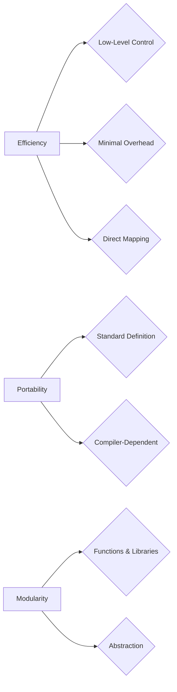

# <span style="color:#e67e22; font-size: 24px;">What we will learn in this post?</span>
<ul style='list-style-type: none; padding-left: 0;'>
<li style='margin: 6px 0;'><span style='color: #2980b9; font-size: 20px; font-weight: bold;'>👉</span> <span style='color: #2ecc71; font-size: 18px; font-weight: bold;'>Introduction to the C Language</span></li>
<li style='margin: 6px 0;'><span style='color: #2980b9; font-size: 20px; font-weight: bold;'>👉</span> <span style='color: #2ecc71; font-size: 18px; font-weight: bold;'>Features of the C Programming Language</span></li>
<li style='margin: 6px 0;'><span style='color: #2980b9; font-size: 20px; font-weight: bold;'>👉</span> <span style='color: #2ecc71; font-size: 18px; font-weight: bold;'>Understanding the C Language Standards</span></li>
<li style='margin: 6px 0;'><span style='color: #2980b9; font-size: 20px; font-weight: bold;'>👉</span> <span style='color: #2ecc71; font-size: 18px; font-weight: bold;'>Setting Up a C Development Environment</span></li>
<li style='margin: 6px 0;'><span style='color: #2980b9; font-size: 20px; font-weight: bold;'>👉</span> <span style='color: #2ecc71; font-size: 18px; font-weight: bold;'>Writing and Running a Basic C Program</span></li>
<li style='margin: 6px 0;'><span style='color: #2980b9; font-size: 20px; font-weight: bold;'>👉</span> <span style='color: #2ecc71; font-size: 18px; font-weight: bold;'>Understanding C Comments</span></li>
<li style='margin: 6px 0;'><span style='color: #2980b9; font-size: 20px; font-weight: bold;'>👉</span> <span style='color: #2ecc71; font-size: 18px; font-weight: bold;'>Conclusion!</span></li>
</ul>

# <span style="color:#e67e22">The Story of C: A Powerful Programming Language</span> 💻

## <span style="color:#2980b9">From Unix to Modern Code</span> 

C's origins lie in the 1970s at Bell Labs, where **Dennis Ritchie** and **Ken Thompson** created it while working on the **Unix operating system**. 

### <span style="color:#8e44ad">Early Days: 1972 - 1978</span> 
*  C emerged as a successor to **B**, a simpler language also developed by Thompson. 
*  It was designed to be efficient, portable, and close to the hardware.

### <span style="color:#8e44ad">Rise to Prominence: 1978 - 1980s</span> 
* The publication of **"The C Programming Language"** by Kernighan and Ritchie cemented its popularity.
*  C's portability enabled its use across different systems, leading to its widespread adoption.

## <span style="color:#2980b9">C's Enduring Legacy</span> 

### <span style="color:#8e44ad">Why C Still Matters</span> 
* **Performance:** C is known for its **speed and efficiency**. It allows developers to write code that interacts directly with hardware.
* **Foundation of Other Languages:** C influenced many modern languages like **C++, Java, and Python**. 
* **Universality:** C is used in a wide range of applications, from embedded systems to operating systems and high-performance computing.

## <span style="color:#2980b9">The Evolution Continues</span>

C has evolved over the years with new features and standards.  For more information on its history and key milestones, explore these resources:

* **[C history on Wikipedia](https://en.wikipedia.org/wiki/C_(programming_language))**: A comprehensive overview of C's development.
* **[C history on the Bell Labs website](https://www.bell-labs.com/usr/dmr/www/chist.html)**: Insights from Dennis Ritchie himself.

C continues to play a significant role in software development, providing a solid foundation for both beginners and experienced programmers. 💪


# <span style="color:#e67e22">C: The Mighty Programming Language</span> 

## <span style="color:#2980b9">Key Features of C</span>

C is known for its **efficiency**, **portability**, and **modularity**. Here's how these contribute to its flexibility and performance:

### <span style="color:#8e44ad">Efficiency 🚀</span>

* **Low-Level Control:** C gives you direct access to system memory and hardware, making it super fast for resource-intensive tasks.
* **Minimal Overhead:** It's designed to be lean and mean, with minimal runtime support.
* **Direct Mapping:**  C code translates closely to machine instructions, leading to efficient execution.

### <span style="color:#8e44ad">Portability 🌎</span>

* **Standard Definition:** The C standard ensures your code can run on different platforms with minimal changes. 
* **Compiler-Dependent:** Compilers handle the translation between your C code and the specific target machine. 

### <span style="color:#8e44ad">Modularity 🧩</span>

* **Functions and Libraries:** You can break your code into reusable components, promoting code organization and reusability.
* **Abstraction:**  C allows you to define custom data types and functions, hiding complex details for simpler usage.

## <span style="color:#2980b9">Flexibilty & Performance 👍</span>

These features combine to make C a powerful language:

* **Low-level access** and **efficiency** are essential for building operating systems, embedded systems, and performance-critical applications.
* **Portability** ensures your code can reach a wider audience across different platforms.
* **Modularity** makes code easier to maintain, extend, and reuse, improving developer productivity.

**Learn More:**
* [C Programming Language](https://en.wikipedia.org/wiki/C_(programming_language)) 
* [C Standard](https://en.wikipedia.org/wiki/C_Standard)

**Diagram:**



# <span style="color:#e67e22">The Evolution of C Standards: A Journey Through Time</span> 

## <span style="color:#2980b9">From C89 to C11: A Timeline of Features</span>

The C programming language has evolved over the years, with new standards adding features and improving the language. Here's a quick look at some key milestones:

**C89 (ANSI C) - The Foundation**
- Released in 1989, it standardized the language, leading to greater portability and consistency.
- Introduced features like:
    - `const` keyword for read-only variables
    - Function prototypes for better type checking
    - Header files for organized code

**C99 - Expanding Horizons**
- Released in 1999, it added new features to enhance code readability, efficiency, and safety.
- Key additions:
    - `inline` functions for optimization
    - `bool` type for representing Boolean values
    - Support for complex numbers 

**C11 - Modernization and Refinement**
- Released in 2011, it modernized the language and included new features for improved safety, concurrency, and integration with modern systems. 
- Notable features:
    - `_Bool` type for representing Boolean values
    - `_Generic` keyword for generic programming
    - Support for multithreading

### <span style="color:#8e44ad">Resources to Dive Deeper:</span>

* [C89 Standard](https://www.open-std.org/jtc1/sc22/wg14/docs/n1256.pdf)
* [C99 Standard](https://www.open-std.org/jtc1/sc22/wg14/docs/n1256.pdf)
* [C11 Standard](https://www.open-std.org/jtc1/sc22/wg14/docs/n1570.pdf)


## <span style="color:#2980b9">Visualizing the Evolution</span>

```mermaid
graph LR
    A[C89 (1989)] --> B[C99 (1999)]
    B --> C[C11 (2011)]
```

This simple flowchart shows the progression of C standards, emphasizing the continual development of the language. Each new standard builds upon the previous one, adding features and improving upon existing ones. 


# <span style="color:#e67e22">C Development Environment Setup Guide</span> 💻

This guide helps you set up a C development environment across Windows, macOS, and Linux. 

## <span style="color:#2980b9">Common Tools & Compilers</span> 🛠️

*   **Compilers:**  These translate your C code into machine-readable instructions.
    *   **GCC (GNU Compiler Collection):** 
        *   **Windows:** [https://www.mingw-w64.org/](https://www.mingw-w64.org/)
        *   **macOS:** [https://gcc.gnu.org/](https://gcc.gnu.org/) 
        *   **Linux:** Usually pre-installed.
    *   **Clang:**  A popular alternative to GCC.
        *   **Windows:** Install through a package manager like Chocolatey or Scoop.
        *   **macOS:**  Install through Homebrew.
        *   **Linux:** Usually pre-installed or available through package managers.

## <span style="color:#2980b9">Recommended IDEs</span> 🖥️

*   **Visual Studio Code (VS Code):** Free, powerful, and popular. ([https://code.visualstudio.com/](https://code.visualstudio.com/))
*   **Code::Blocks:**  Free, open-source IDE with a user-friendly interface. ([https://www.codeblocks.org/](https://www.codeblocks.org/))
*   **CLion:**  A paid, feature-rich IDE by JetBrains. ([https://www.jetbrains.com/clion/](https://www.jetbrains.com/clion/))

## <span style="color:#2980b9">Setting Up Your Environment</span> 🧰

**1. Install a Compiler:** 
    *   Download the appropriate compiler for your operating system.
    *   Follow the installation instructions provided. 
**2. Install an IDE (optional):**
    *   Download and install your preferred IDE.
    *   Configure the IDE to use your installed compiler.
**3. Write Your First C Code:**
    *   Create a new file named `hello.c`.
    *   Type the following code: 

```c
#include <stdio.h>

int main() {
  printf("Hello, world!\n");
  return 0;
}
```

**4. Compile and Run Your Code:**
    *   **Command Line:** Use `gcc hello.c -o hello` (compiles) and `./hello` (runs).
    *   **IDE:**  Typically, there are buttons or menus to compile and run your code. 

**5. Enjoy!** 🎉

**Remember:**  This is a basic setup. You can explore other tools and features as you progress.


# <span style="color:#e67e22">Your First C Program: A Step-by-Step Guide</span> 
 
## <span style="color:#2980b9">Code Structure</span>
 
### <span style="color:#8e44ad">The Essentials</span> 

*   Every C program needs a starting point: the `main()` function. 
*   Inside `main()`, use `printf()` to display text on the screen.  
*   Don't forget the `#include <stdio.h>` directive to use input/output functions.

```c
#include <stdio.h>

int main() {
  printf("Hello, world!\n"); 
  return 0; 
}
```

## <span style="color:#2980b9">Compilation</span> 

*   **Save your code:** Create a file with a `.c` extension (e.g., `hello.c`).
*   **Compile:** Use a C compiler (like GCC) to turn your code into an executable file: `gcc hello.c -o hello`.

## <span style="color:#2980b9">Execution</span>

*   **Run:** Execute your compiled program: `./hello`.  You should see "Hello, world!" printed.

## <span style="color:#2980b9">Across Platforms</span>

*   **Windows:** Use a compiler like MinGW or Visual Studio.
*   **macOS:**  Use Xcode or a command-line compiler like GCC.
*   **Linux:**  GCC is usually pre-installed. 

**Remember:**  C programming involves many concepts!  This guide is a starting point; explore further for more advanced features. 


# <span style="color:#e67e22">Comments in C: Your Code's Best Friend 🤝</span>

## <span style="color:#2980b9">Why Comments? 🤔</span>

Comments are like notes you leave yourself (or others!) within your C code. They explain **what** your code does, making it easier to understand and maintain.

### <span style="color:#8e44ad">Benefits of Comments:</span>

* **Clarity:** Help others (or yourself later) understand complex code.
* **Documentation:** Create a living record of your code's purpose.
* **Debugging:**  Pinpoint problems by understanding your intentions.

## <span style="color:#2980b9">Types of Comments:</span>

### <span style="color:#8e44ad">Single-line Comments 📝</span>

```c
// This is a single-line comment.
int x = 5; // This comment explains what the code does.
```

### <span style="color:#8e44ad">Multi-line Comments 📚</span>

```c
/* 
This is a multi-line comment.
It can span multiple lines!
*/
int y = 10;
```

## <span style="color:#2980b9">Tips for Effective Comments:</span>

* **Be concise and specific.** Avoid unnecessary details.
* **Explain *why* not just *what* the code does.**
* **Keep comments up-to-date.**  Update them when you modify code.
* **Use clear and consistent language.** 
* **Don't over-comment!** If the code is self-explanatory, a comment might be redundant. 


<h1><span style='color:#e67e22'>Conclusion</span></h1>

And there you have it! We've covered a lot of ground today, and hopefully, you've learned something new and exciting. But this isn't the end of the conversation!  We'd love to hear your thoughts, questions, or even just your own experiences related to this topic.  💬  So, what are you waiting for?  Head down to the comments section and let's keep the conversation going! 👇


